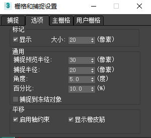

#
3DMax

## 常用快捷键

|作用|快捷键|
|:-|:-|
|专家模式|ctrl+x|
|视口放大|alt+w|
|打开捕捉|S|
|切换到底视图|b|
|切换到顶视图|t|
|切换到前视图|f|
|切换到左视图|l|
|切换到透视图|p|
|激活选择移动工具|w|
|激活旋转|e|
|激活缩放|r|
|切换选择工具|q|
|按名称选择|h|
|打开材质编辑器|m|
|渲染|shift+q|
|变换虚拟体显示切换|ctrl+shift+x|
|切换外边框显示|j|
|隐藏所有几何物体|shift+g|
|隐藏二维图形|shift+s|
|隐藏摄像机|shift+c|
|隐藏灯光|shift+l|
|隐藏辅助对象|shift+h|
|独立显示选中的物体|alt+q|
|在可编辑多边形面中两点连线，用于切割|alt+c+点选|
|在可编辑多边形两条选定边中连线|ctrl+shift+e|
|切换线框显示|F3|
|切换边面显示|F4|
|切换多边形、顶点、边数量显示|7|
|打开资源追踪，可以重新选择贴图文件路径等|shift+t|
|取消选中的点|alt+鼠标点选|
**需要注意的是3dmax的不少操作和win10的微软中文输入法不兼容，如果发现操作没有效果，请记住关闭输入法，或切换到其他输入法。**

## 常用操作

### 启用轴约束

- 首先在捕捉图标上点击右键，打开捕捉对话框，打开第二个选项卡，勾选上启用轴约束。
- 然后根据需要，启用对应的轴约束，F5-》X轴，F6-》Y轴，F7-》Z轴。

### 可编辑多边形常用操作

### 人物、动物建模

- 创建一个几何体；
- 涡轮平滑；
- 点、线和面调整；
- 挤出；
- 增加网格线：首先需要增加线的边，右键然后再选择连接。**如果需要选择一圈线，可以框选或者使用线子菜单下的环形按钮**；
- 需要的时候可以切角，在环形边上分出两条线，中间围着一个新增的环面。这样可以平滑结构。
