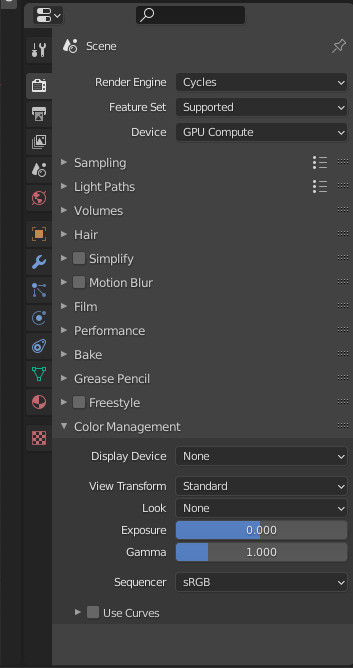

<!-- @import "my-style.less" -->
<!-- @import "[TOC]" {cmd="toc" depthFrom=1 depthTo=6 orderedList=false} -->

<!-- code_chunk_output -->

- [Blender学习手册](#centerblender学习手册center)
  - [快捷按键](#快捷按键)
    - [界面操作](#界面操作)
    - [全局操作](#全局操作)
    - [物体模式](#物体模式)
    - [编辑模式](#编辑模式)
    - [笔刷](#笔刷)
  - [常用操作](#常用操作)
  - [控制器](#控制器)
    - [变换定向坐标](#变换定向坐标)
    - [轴心点](#轴心点)
    - [吸附](#吸附)
  - [雕刻](#雕刻)
    - [雕刻工具栏常用笔刷](#雕刻工具栏常用笔刷)
    - [增加细节](#增加细节)
    - [Texure paint模式](#texure-paint模式)
  - [模型制作流程](#模型制作流程)
  - [修改器](#修改器)
  - [纹理绘制](#纹理绘制)
  - [绘制高度图流程(heightmap)](#绘制高度图流程heightmap)

<!-- /code_chunk_output -->

-----------------------------------------------------------------------

# 
Blender学习手册

## 快捷按键

### 界面操作

|快捷键|作用|
|-|-|
|Ctrl Space-Button|缩放视图|
|Ctrl Alt Space-Button|视图全屏切换|
|Alt middle-Mouse 拖拽|拖拽到坐标轴方向的视图|
|middle-Mouse 拖拽|透视下旋转视图|
|Numpad7|顶视图（z轴正向）|
|Numpad1|前视图（y轴反向）|
|Numpad3|右视图（x轴正向）|
|Ctrl Numpad7|底视图（z轴反向）|
|Ctrl Numpad1|后视图（y轴正向）|
|Ctrl Numpad3|左视图（x轴反向）|
|Numpad0|摄像机视图|
|Numpad9|翻转视图|
|Numpad5|正交视图/透视图|
|Ctrl Alt Q|四视图/透视图|
|Shift middle-Mouse 拖拽|平移视角|
|`|打开视图切换饼菜单|
|Shift Space-Button|弹出工具栏菜单窗口|
|Shift `|视图漫游（通过鼠标拖拽或者键盘操作等）|
|Ctrl `|Gizmo切换|
|**,**|打开转换坐标系饼菜单|
|**.**|打开转换轴心点饼菜单|
|Alt W|打开选择工具饼菜单
|Shift S|打开吸附到指定目标的饼菜单|
|Ctrl Tab|打开交互模式饼菜单|
|Z|打开显示模式饼菜单|
|Shift Z|线框、实体模式切换|
|Alt Z|透显模式切换|
|F2|重命名选中对象|
|F3|打开查询菜单|
|F4|打开文件上下文菜单|
|T|切换工具栏（默认位于编辑区左上角）|
|N|切换属性栏|
|Ctrl Shift Tab|打开吸附对象的选项菜单|
### 全局操作

|快捷键|作用|
|-|-|
|Shift Right-Mouse|设置游标|
|Shift C|重置游标|
|Shift Tab|切换吸附开关|
|Ctrl|临时开启关闭吸附|
|O|切换比例编辑开关|
|Ctrl Alt Numpad0|将当前视角设置为摄像机视角|
|Ctrl Numpad0|将选中物体为摄像机|
|Shift A|添加对象|
|W|切换选择模式|
|B|进行矩形区块选择|
|Ctrl (Shift) Right-Mouse|套索选择|
|Ctrl  +/-|加/减选|
|Ctrl I|反选|
|A|全选|
|X/Del|删除选中对象|
|Ctrl Z|撤销上一步操作|
|Ctrl Shift Z|恢复后一步操作|
|Ctrl S|保存|
|G|移动；按X/Y/Z可进去对应坐标系轴,移动是以当前的坐标系轴向相对移动,重复一次可以进入全局坐标系轴|
|R|旋转；旋转是围绕着轴心点进行的,按X/Y/Z当前坐标系轴向旋转，重复一次可以进入全局坐标系轴|
|S|缩放；缩放也是以轴心点进行的，继续按X/Y/Z可对应坐标系轴向缩放，重复一次可以进入全局坐标系轴|
|Shift D|独立复制|
|Alt D|关联复制（在编辑模式下可以对关联复制的对象进行同步操作）|
|Ctrl C|正常复制|
|Shift R|重复上一次的操作|
|Alt B + Left-Mouse|框选 clip region|

### 物体模式

|快捷键|作用|
|-|-|
|H|隐藏选中项|
|Shift H|隐藏未选中项|
|Alt H|显示所有项|
|Home|将所有项显示于当前视口|
|/|单独显示|
|小键盘 **.** |重新聚焦选中项|
|Ctrl M|镜像翻转|
|Ctrl A|打开应用菜单，可对选中项的变换(移动、缩放、旋转等)进行应用|
|Alt G|将选中项的原点移动回到坐标原点，网格同步移动|
|Alt R|将选中项网格相对轴心点旋转，最终使轴心点局部坐标系和全局坐标系重合,即为清除旋转角度|
|Ctrl J|将选中多项合并为一个网格，坐标为最后选中的网格的|
|Ctrl P|打开设置父级菜单，最后选中的对象为父级|
|Alt P|打开清除父级菜单|
|Ctrl 0~5|对目标添加表面细分修改器（0~5级细分）|
|Ctrl B|设置渲染区域|
|Ctrl Alt B|取消渲染区域|
|Shift 1|切换集合显隐|

### 编辑模式

|快捷键|作用|
|-|-|
|(Shift) 1，2，3|切换(加选)点、线、面|
|Ctrl V，Ctrl E，Ctrl F|打开点、线、面菜单|
|Shift Left-Mouse|鼠标加选|
|Ctrl (Shift) Left-Mouse|先选取点、线、面，再按ctrl加点、线、面，可以实现两点、线、面之间最近连接的连(加)选|
|Alt (Shift) Left-Mouse|环(加)选|
|Ctrl Alt (Shift) Left-Mouse|并排边(加)选择|
|F|填充所选中的对象|
|J|连接顶点路径，可以分割到面|
|V|断离顶点|
|Alt V|断离顶点，并填充，按下G键可以沿边线滑动|
|G+G/Shift V|点线面滑动|
|Alt D|断离顶点，并延长|
|I|内插(按住Ctrl可以改变内插面深度，默认为0)；对于相邻的面，内插默认为一个面，再按一次I键进行分别内插；按O键可以切换内外插，按B键可以切换边界是否内插(需要注意的是这里必须保证分别内插关闭--I键切换)|
|K|切刀: 1.按住Ctrl可以捕捉中点; 2. 按住Shift可以取消吸附；3.按E键可以断开当前连续切割，重新加入切点；4.按Z键切换隐藏线段；5.按C键进行平行、垂直或45度切割;6.通过双击鼠标左键实现首尾连接|
|M|打开合并菜单，选择合并到中心、光标、塌陷或按距离合并|
|P|打开分离菜单，可以从当前网格中选中的网格分离为新物体，分离后的坐标为原合并整体的坐标|
|Shift E|添加边线折痕，用于控制表面细分的边缘的锐度(0~1),将这个值为设为-1可以清除折痕|
|Ctrl (Shift) B|边(点)倒角;通过滚轮可以调节分段数|
|E|顶点挤出|
|Ctrl 右键|点线面挤出到光标；点模式下未选中点时，增加孤立的顶点|
|Ctrl T|将面三角化|
|Alt J|将三角面转成四角面|
|Alt F|对四角面填充三角化，不同于将面三角化|
|Y|面拆分|
|Alt M|打开split菜单|
|Alt E|打开挤出菜单|
|Alt N|打开法向菜单|
|Shift N|向外重新计算法线|
|Ctrl Shift N|向内重新计算法线|
|R N|旋转split normals|
|Alt L|Point Normals to target|
|L/Shift L|select linked|
|Ctrl L|select linked all|
|Ctrl R|环切|
|Ctrl Shift R|边偏移滑动|
|Shift W|弯曲（bend）|
|Shift Alt S|球形化|
|Ctrl Shift Alt S|切变|
|Ctrl H|挂钩，首先选中的作为Hook父对象|
|Ctrl P|设置父级节点，注意同设置父级的区别，设置父级时子级跟随父级的原点变化，而设置父级点时，子级跟随父级点变化|
|Alt S|法向缩放:该工具作用于"标准法向网格"，沿其自身法线方向(垂直于所在面)移动顶点/边/面，实现缩小/膨胀。|
|Ctrl X|融并选中项|
|**曲线**|以下只有选中曲线进入编辑模式才有|
|Alt C|切换曲线为循环|
|Ctrl T|倾斜，用于改变曲线法向|
|Alt T|清除倾斜|
|Alt S|改变曲线半径|
|Shift N|重计算句柄，句柄是贝塞尔曲线上面的曲线的控制器|
|V|设置控制柄类型|

### 笔刷
|快捷键|作用|
|-|-|
|F|改变笔刷大小|
|Shift F|改变笔刷强度|
|Ctrl F|旋转笔刷纹理|
|Ctrl|切换笔画描边 Invert Stroke Toggle|

## 常用操作
|操作步骤|效果|
|-|-|
|在一个网格上面选中两条不相邻的边loop，loop里面有相同的边段数,打开边菜单，选择桥接边loop|两loop中每条边一一对应生成面，相当于每次分别选中两loop中对应的边使用快捷键F一一填充|
|在一个网格上面选中相邻的边，顺序按下s (x/y/z) 0|让选中的边调整到一条直线垂直于x/y/z轴向|
|首先开启吸附到点，接着轴向移动目标点，然后点选需要对齐的点，完成对齐。也可以使用快捷键临时开启吸附，保证当前使用的是吸附到点。|点沿轴向对齐|

## 控制器
### 变换定向坐标
变换定向坐标会影响变换的行为

定向坐标分为以下几类：
|定向坐标|作用|
|-|-|
|全局坐标|变换轴对齐于世界空间，方向唯一，不可变|
|局部坐标|变换轴对齐于选中物体空间。当该对象发生旋转的时候，该坐标匹配对象相对全局坐标旋转的角度。如果在当前坐标系设置为其他坐标系的情况下，想要使用局部坐标需要使用按两次坐标方向，如 XX，YY，ZZ。通过在物体模式下应用旋转后，局部坐标系会和全局坐标一致|
|法线坐标|变换轴Z方向对齐于选中元素平均法向。在物体模式下，法线坐标和局部坐标一致|
|万向坐标|变换轴对齐于欧拉旋转轴轴向，用于输入|
|屏幕坐标|变换轴对齐于屏幕的3D视口，x为屏幕左右方向，y为屏幕上下方向，z为屏幕垂直方向|
|光标坐标|变换轴对齐于光标坐标系|
|自定义坐标|自定义坐标轴向可以使用物体或者网格元素轴向，该轴向以物体作为参考系时使用物体的局部坐标，以网格元素作为参考系时使用元素的平均法向坐标|

### 轴心点
轴心点作用于物体或者顶点、边、面的组合的旋转和缩放，轴心点有以下几类。
|轴心|作用|
|-|-|
|边界框中心|边界框是将所选对象包裹的最紧的矩形框，一般情况下矩形框的中心即为边界框中心。物体模式下，当选中多个对象，边界框中心是多个物体边界框中心的包裹矩形框中心；而在编辑模式下，边界框中心是所有点包裹矩形框中心|
|3D游标|以当前3D游标坐标作为轴心|
|独立原点|物体模式下，选择独立原点为轴心点时，所选的对象都围绕各自的原点旋转和缩放，该点位置不会发生变动；编辑模式下时，边和面都被看做独立的元素，每个元素都围绕着自己的质心点旋转或者缩放|
|质心|质心可以广义上看作为重心。物体模式下，确定质心点位置只考虑所选对象的原点，这可能会导致某些违反直觉的结果；编辑模式下，质心点取决于所选取项中元素最多的，质心点位置会偏向于元素较多的坐标位置|
|活动元素|活动元素是最后被选中的对象。物体模式下，轴心点最后激活的对象的原点；编辑模式下，轴心点则是激活对象的质心|

### 吸附
blender中可以将对象和网格吸附到不同的场景元素。

吸附元素：
|元素|作用|
|-|-|
|增量|吸附到视口中的栅格点。在正交模式下，吸附增量根据视口的缩放而变化。移动对象时，坐标变化是增减增量的倍数|
|顶点|吸附到网格的顶点|
|边|吸附到网格的边|
|面|吸附到网格的面。在重拓扑时很有用|
|体积|吸附到网格内|
|边中点|吸附到边中点|
|边对角点|吸附到角点|

吸附目标：
- 活动项：
将活动元素(编辑模式中的顶点，物体模式中的物体)移动到目标。
- 质心：
将选中项的质心移至目标位置。
- 中心：
将当前变换中心移动到目标。可与3D光标一起使用以吸附偏移。
- 最近：
将选中项的最近点移动到目标。

## 雕刻

### 雕刻工具栏常用笔刷

|笔刷|作用|快捷键|
|:-:|:-:|:-:|
|Draw|基于平均法线将Vertices向里或向外移动|X|，
|Draw Sharp|类似于Draw，但其使用Sharper Falloff将网格从原始坐标变形，常用于衣服折皱、多样的头发和硬表面边缘||，
|Inflatten|类似于Draw，但是该模式下顶点移动是基于自己的法线方向|I|，
|Blob|将mesh移动到球形的外面或内面(对屏幕而言)|
|Flatten|通过笔刷内顶点的平均高度的区域平面，将vertices拉动到那个平面|Shift T|
|Fill|类似于Flatten，但只将低于笔刷平面的顶点向上移动||
|Scrape（刮擦）|类似于Flatten，将平面之上的点下移，可以实现平面化，并在边缘形成痕迹|
|Multiple Scrape（多平面刮擦）|同时用两个角平面刮削网格，在它们之间产生锋利的边缘。这对于在雕刻硬表面物体时创建边非常有用。|
|Clay|类似于Draw，但还可以通过笔刷调整平面方向，相当于Draw和Flatten的结合|C|
|Clay Strips（泥条）|类似于Clay，但是笔刷作用的区域是一个立方形，而非球形|
|Clay Thumb（手指轻推）|模拟用手指涂抹让粘土变形，在笔触的过程中积累粘土到一起|
|Layer|类似于Draw，但是给层的高度设置了一个上限，同一次笔触不会叠加高度。很适用于刻字|
|Crease（折皱）|通过推拉mesh形成尖锐形状，同时将vertices聚到一起|Shift C|
|Smooth|通过计算平均vertices的位置消除不规则的mesh|Shift S|
|Grab|将笔刷作用域的vertices拉到鼠标指定的位置|G|
|Elastic Deform|用于模拟逼真的变形，如弹性物体的抓起或扭曲|G|
|Pose|让模型做pose模拟类似于动画的形变|
|Thumb|和Clay Thumb相似，此笔刷在沿笔刷笔划方向移动网格的同时，使网格在笔刷区域中变平|
|Rotate|在笔刷区域旋转顶点|
|Slide Relax（滑动松弛）|该笔刷将网格的拓扑滑移到细节更多的区域，同时尽可能少地改变网格的集合形状|
|Simplify|该笔刷塌陷短边，需要开启动态拓扑|
|Shift|按住Shift键移动笔刷有平滑的效果|

|快捷键|作用|
|-|-|
|Ctrl|笔刷反向生效|
|Alt M|去除Masks|
|Ctrl I|反选|
|Ctrl R|Voxel Remesh|
|Ctrl Alt R|Quadriflow Remesh|
|Ctrl D|Dyntopo|

### 增加细节
有两种增加细节的方式：
- Dyntopo（动态拓扑）：
- Remesh（重建网格）：通过一个更均匀的拓扑自动重建几何网格，重建网格是根据设定增加或者减少拓扑网格数量；有两种重建方式：
- - Voxel Remesh(立体元素网格重拓扑)，使用OpenVDB来产生更多样的网格，这会让网格产生非常均匀的拓扑分布；
- - quadriFlow Remesh(基于四方网格的重拓扑)，这种拓扑相对较慢，但是可以产生更好的输出质量用于拓扑，这种方式产生的网格与原始的网格没有任何关联；

### Texure paint模式

|key|作用|
|:-:|:-:|
|s|从图像上的该点获取样本颜色并用于笔刷|
|Ctrl|临时用第二颜色绘制|
|x|切换第一、第二颜色|

## 模型制作流程

-   首先雕刻模型：创建一个多边形，以轴对称的形式删除半边网格，然后使用`Mirror`镜像修改器对称添加这一边，然后在使用雕刻工具。
- 完成雕刻后需要对高面数的模型进行重拓扑。这里需要先创建网格在通过面吸附到雕刻模型上，同时使用`shrinkwarp`修改器将拓扑网格缩到雕刻模型表面。重拓扑完成后需要使用`Shade Smooth`方法平滑网格模型。

## 修改器

- `Mirror`（镜像）：以轴对称的形式增加网格。应用该修改器之后，可以使用轴向Symmetry实现对称的调整。
- `Decimate`（消减网格）：通过比例消减目标的网格数量，比例在0~1之间；

轴向点：用于控制物体的移动，旋转和缩放的点。可以设置为原点，质心点，游标等。

## 纹理绘制

## 绘制高度图流程(heightmap)
- 首先创建地形图，可以使用A.N.T.LandScape插件，雕刻，或者建模实现。地形图如下：

- 地形图建立好后，用摄像机从顶视角拍摄地形图片，调整focal length将拍摄的范围限定在地形图上。

- Render Properties中，设置渲染方式为cycle，color Management中设置如下：

- Output Properties中，设置需要的分辨率，需要对应到UE4地图中的去，一般为127\*127，253\*253，505\*505,1009\*1009,2017\*2017,4033\*4033,8129\*8129。Output设置如下：

- 给地形赋予材质，并将着色器设置如下:

- 渲染并输出图片另存，之后就可以在UE4编辑器中使用该高度图建立地形了。

