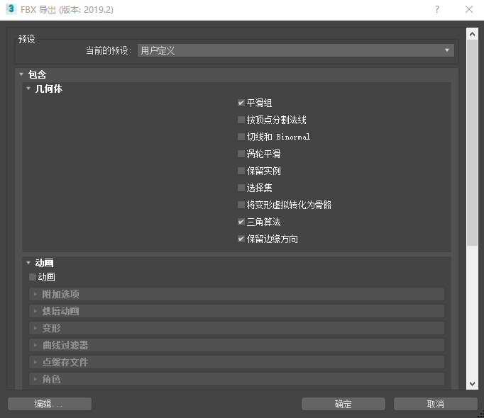

#<center>UE4 笔记</center>
## Unreal快捷键
|查看世界大纲中的对象的引用网格对象|ctrl+b|
|对选定对象聚焦|f|
|切换到透视口|alt+g|
|切换到顶视口|Alt+Shift+t|
|切换到底视口|Alt+Shift+j|
|切换到前视口|Alt+Shift+f|
|切换到后视口|Alt+Shift+b|
|切换到左视口|Alt+Shift+l|
|切换到右视口|Alt+Shift+r|
|对选定对象进行环绕旋转|Alt+鼠标左键拖动|
|对视口环绕旋转|鼠标右键+拖动|
|对视口前后左右移动|w、s、a、d+鼠标左键|
|对视口上下移动|e、q+鼠标左键|
|在编辑器中启动关卡|Alt+p|
|在编辑器中退出关卡|Esc|

## 纹理材质
一个基本材质，包含五种纹理：

基本颜色---表面颜色；

法线--------材质表面法线信息，光影信息，表现材质凹凸感；

AO---------环境光遮蔽，记录表面遮蔽效果；

粗糙度------越白，粗糙度越高；

金属度------越白，金属质感越强。

二）五种材质复合起来，就是完整材质

三）通用命名规则

UE纹理，使用T_作为纹理前缀（Texture）

颜色纹理：T_BaseColor or T_Color

法线纹理：T_Normal or T_N

环境光遮蔽：T_AmbientOcclusion or T_AO

粗糙度纹理：T_Roughness or T_R

金属度纹理：T_Metallic or T_M
## UE模型导入导出

### 3dmax模型导出
将3dmax模型导出到Unreal中，步骤如下：
- 如果模型需要以整体导出，先选中一个模型组件，将其转换为可编辑多边形，然后在编辑几何体下方选择附加按钮，点其右侧的框图标将需要作为整体的其他组件附加其上。这样模型就会作为一个整体。如果需要以组件的形式导出，选中模型，将其转换为可编辑多边形，再选中元素子菜单(5快捷键)，然后点选要分离的组件，并点击下方的分离按钮，就可以分离成单独的组件。
- 从3dmax中导出模型为FBX文件，通常需要勾选如果是骨骼网格或者动画网格，需要同时勾选动画。点击确定导出。
- Unreal导入网格时，如果是骨骼网格，需要勾选上相应的选项，通常不选择自动生成碰撞和光照图UV，再导入。


## UE框架
### Actor
可放入关卡中的对象都是 **Actor**。Actor是一种支持三维变换（如平移、旋转和缩放）的泛型类。你可以通过游戏逻辑代码（C++或蓝图）创建（生成）及销毁Actor。在C++中，AActor是所有Actor的基类。

Actor有很多种类型，比如：StaticMeshActor、CameraActor和PlayerStartActor。
### Components(组件)
**组件**是一种特殊的对象，可以被附加到Actors上作为一个子对象，本身无法独立存在。组件在共享通用行为上很有用，如展示一个视觉效果，播放声音。他们还可以表示工程特有的概念，如车辆解读输入信息，以及改变自身速度和方向的方式。比如，一个工程中用户可控的汽车，飞行器和船可以实现载具不同的控制和运动方式通过变更载具Actor使用哪种组件。

Actor Components
----------------
**UActorComponent**是所有组件的基类。因为组件时渲染网格和图像，实现碰撞，播放音频，所有玩家看到和接触到的世界中的最终都是某种组件。

下面有一些主要的类时你在创建自己的组件时需要理解的：
*   **Actor Components** (class `UActorComponent`)最常用于抽象行为如移动，目录清单或属性管理，和其他非物理的概念。Actor Components没有三维变换，这表示他们没有物理坐标或者旋转的需要。
*   **Scene Components** (class `USceneComponent`, a child of `UActorComponent`)支持基于位置（坐标）的行为但不需要几何上的表示（尺寸）这包含了spring arms，相机，物理上的力和约束（但不是物理上的对象），甚至音频。
*   **Primitive Components** (class `UPrimitiveComponent`, a child of `USceneComponent`)拥有几何表示，通常用于渲染可视元素或和物理对象碰撞或重叠。这包含了静态或骨骼网格，sprites（精灵）或公告牌，粒子系统，以及box，capsule以及sphere形状的碰撞体积。
    

### Registering Components
为了让Actor Componenets能按帧更新并影响场景，引擎需要注册他们。当Components被创建为Actor的子组件注册过程会在Actors生成的时候自动发生。同时在游戏过程中组件创建时手动注册也是可以的，`RegisterComponent `这个函数提供了这个实现，但是需要保证组件是关联到Actor上的。
游戏过程中创建组件会影响性能，所以尽量在必需的时候才这样使用。

### Register Events
在注册组件的过程中，引擎将组件关联到场景，使按帧更新成为可能，运行`UActorComponent`下列的函数实现注册事件：
| Function| Description |
| --- | --- |
| `OnRegister` | This function can be overridden to add code when registering a Component. |
| `CreateRenderState` | Initializes the [render state](https://docs.unrealengine.com/en-US/ProgrammingAndScripting/ProgrammingWithCPP/UnrealArchitecture/Actors/Components/index.html#sceneproxy) for the Component.|
| `OnCreatePhysicsState` | Initializes the [physics state](https://docs.unrealengine.com/en-US/ProgrammingAndScripting/ProgrammingWithCPP/UnrealArchitecture/Actors/Components/index.html#physicsstate) for the Component. |

### Unregistering Components
为了让`Actor components`停止更新，模拟或渲染过程，可以使用`UnregisterComponent`函数来反注册。

### Unregister Events
`UActorComponent`对象反注册时运行以下函数：
|Function|Description|
|:-:|:-:|
|`OnUnregister`|This function can be overridden to add code when unregistering a Component.|
|`DestroyRenderState`|Uninitializes the render state for the Component.|
|`OnDestroyPhysicsState`|Uninitializes the physics state of the Component.|

### Updating

Actor Components有能力按帧更新，用一种类似于Actors的方式。`TickComponent`让组件每帧都运行指定的代码。比如**USkeletalMeshComponent**使用自身的`TickComponent`函数更新动画和骨骼控制器，而**UParticleSystemComponent**可以更新自身的发射器和处理粒子事件。
默认情况下，Actor Components不会更新。为了让你的Actor Components可以按帧更新，你需要在组件构造时设置`PrimaryComponentTick.bCanEverTick`为true，然后可以在任何可行的地方调用`PrimaryComponentTick.SetTickFunctionEnable(true)`打开更新。以后可以调用`PrimaryComponentTick.SetTickFunctionEnable(false)`来关闭更新。如果你的组件不需要更新，或你打算自己实现更新函数，你可以让`PrimaryComponentTick.bCanEverTick`保持默认的false，这样可以获得微弱的性能提升。

### Render State

为了渲染组件需要创建一个渲染状态。当组件发生某些改变需要更新渲染数据，这个渲染状态可以通知引擎。当这种改变发生时，渲染状态标记为dirty。如果你创建了自己的组件，你可以通过`MarkRenderStateDirty`函数表示渲染数据已经dirty。在每帧的最后，所有的dirty组件会让自己的渲染数据在引擎中更新。`Scene Components (including Primitive Components)`默认会创建渲染状态。

### Physics State
为了和引擎的物理模拟系统进行交互，一个Actor Components需要一个物理状态。物理状态会在变化发生时立马更新，防止类似“帧滞后”的问题，因此不需要dirty标记。`Primitive Components`默认情况下就会创建物理状态。通过覆盖`ShouldCreatePhysicsState`函数可以设置你的组件类实例是否需要物理状态。
如果你的类需要使用物理，简单的返回true并不合适。建议查看`UPrimitiveComponent`的该函数来获取一些灵感来决定那些情况下不需要创建物理状态，如在组件析构的时候。你也可以直接返回父类的该函数，以避免简单的返回true。

### Visualization Components
某些Actors和Components没有可视表示，这让他们在编辑器追踪难以选中，或者有些重要的属性不可见。开发者可以添加额外的组件用来在编辑器中展示相关信息，但这些额外的组件在编辑器游戏过程中或者运行打包过程中并不需要。为了解决这个问题，编辑器支持 **Visualization Components**概念，这个是只存在于编辑器工作状态是的常规组件。
创建一个常规组件并调用`SetIsVisualizationComponent`就可以让组件变成可视组件。

To make a Visualization Component, create any regular Component and call `SetIsVisualizationComponent` on it. Since the Component does not need to exist outside of the Editor, all references to it should be inside of preprocessor checks against `WITH_EDITORONLY_DATA` or `WITH_EDITOR`. This will ensure that packaged builds are unaffected by these Components and are guaranteed not to reference them anywhere in code. As an example, the **Camera Component** uses several other Components to display helpful information in the Editor, including a **Draw Frustum Component** to show its view frustum. In the header file, the Draw Frustum Component is defined within the class as follows:

```
#if WITH_EDITORONLY_DATA
    // The frustum component used to show visually where the camera field of view is
    class UDrawFrustumComponent* DrawFrustum;
    // ...
#endif
```

Similarly, all references to this this Component will be inside of preprocessor checks against `WITH_EDITORONLY_DATA` in the source file. This code, inside of a `WITH_EDITORONLY_DATA` check within `OnRegister`, checks to see if the Camera Component is attached to a valid Actor, and then adds the Draw Frustum Component code:

```
void UCameraComponent::OnRegister()
{
#if WITH_EDITORONLY_DATA
    if (AActor* MyOwner = GetOwner())
    {
        // ...
        if (DrawFrustum == nullptr)
        {
            DrawFrustum = NewObject<UDrawFrustumComponent>(MyOwner, NAME_None, RF_Transactional | RF_TextExportTransient);
            DrawFrustum->SetupAttachment(this);
            DrawFrustum->SetIsVisualizationComponent(true);
            // ...
        }
    }
    // ...
#endif
    Super::OnRegister();
    // ... Additional code (to run in all builds) goes here ...
}
```

`DrawFrustum` now exists only in the Editor and is considered a Visualization Component, meaning that it won't appear during in-Editor playtesting.

### Scene Components
`Scene Component`是一个Actor Components，并拥有一个指定的物理坐标。这个位置由一个变换定义（类[`FTransform`](https://api.unrealengine.com/INT/API/Runtime/Core/Math/FTransform/index.htm)）,包含了定位，旋转和尺寸。场景组件可以通过相互连接形成树，Actors可以指定一个场景组件为“根”，表示Actors的世界坐标，旋转和尺寸是从该组件引出。

#### Attachment
只有场景组件和其子组件可以相互关联，基于变换的需要描述父子组件的空间关系。一个场景组件可以拥有任意数量的子组件，但只能有一个父组件，也可以直接放置到世界中去。场景组件系统不支持循环关联。两个最主要的函数是`SetupAttachment`，常用于构造函数和组件未被注册时，`AttachToComponent`，可以立即关联两个组件，常用于游戏运行时。这个还可以关联两个Actors，通过关联一个Actor的根组件和另一个Actor的组件。

### Primitive Components
**Primitive Components** (class `UPrimitiveComponent`)是一个场景组件场景组件并有一些几何信息，这些信息常用于渲染或碰撞目的。对应不同的几何有几种子类，但是最常见的是**Box Component**, **Capsule Component**, **Static Mesh Component**, 和 **Skeletal Mesh Component**。

### Scene Proxy
**Scene Proxy** (class `FPrimitiveSceneProxy`) 是原始组件用于封装场景数据，并被引擎通过游戏线程并行渲染组件。每一种原始组件拥有属于自己的场景代理子类用于存放特定需要的渲染数据。

See [Rendering System Overview](https://docs.unrealengine.com/en-US/ProgrammingAndScripting/Rendering/index.html) for more details on primitives and rendering geometry.
### Gameplay框架关系

从这张图中表明了核心GamePlay类的相互关系。一个Game是由GameMode和GameState构成。玩家通过PlayerController参与游戏，这些Player Controller通过操控pawn来表示物理存在。PlayerController还给与玩家输入控制，HUD(头部显示)和一个PlayerCameraManager来操作摄像机方位。


|class|describe|
|:-|:-|
|Pawn|A Pawn is an Actor that can be an "agent" within the world. Pawns can be possessed by a Controller, they are set up to easily accept input, and they can do various and sundry other player-like things. Note that a Pawn is not assumed to be humanoid.|
|Character|A Character is a humanoid-style Pawn. It comes with a CapsuleComponent for collision and a CharacterMovementComponent by default. It can do basic human-like movement, it can replicate movement smoothly across the network, and it has some animation-related functionality.|
|Controller|Controller is an Actor that is responsible for directing a Pawn. They typically come in 2 flavors, AIController and PlayerController. A controller can "possess" a Pawn to take control of it.|
|HUD|A HUD is a "heads-up display", or the 2D on-screen display that is common in many games. Think health, ammo, gun reticle, etc. Each PlayerController typically has one of these.|
|Camera|he PlayerCameraManager is the "eyeball" for a player and manages how it behaves. Each PlayerController typically has one of these as well. For more, see the camera workflow page.|

#### Setting and Tracking the Rules of the Game
|class|describe|
|:-|:-|
|GameMode|The concept of a "game" is split into 2 classes. The Game Mode and Game State is the definition of the game, including things like the game rules and win conditions. It only exists on the server. It typically should not have much data that changes during play, and it definitely should not have transient data that clients need to know about.|
|GameState|The GameState contains the state of the game, which could include things like the list of connected players, the score, where the pieces are in a chess game, or the list of what missions you have completed in an open world game. The GameState exists on the server and all clients and can replicate freely to keep all machines up to date.|
|PlayerState|A PlayerState is the state of a participant in the game, such as a human player or a bot that is simulating a player. Non-player AI that exists as part of the game would not have a PlayerState. Example data that would be appropriate in a PlayerState include player name, score, in-match level for something like a MOBA, or whether the player is currently carrying the flag in a CTF game. PlayerStates for all players exist on all machines (unlike PlayerControllers) and can replicate freely to keep things in sync.|
## c++编程

### UPROPERTY

> 为了让c++类中成员变量对UE4引擎中可见，需要添加`UPROPERTY`宏，这样启动游戏时变量不会被重置。

> 添加`EditAnywhere`，表示该变量可以在unreal引擎中设置值。
```c++
UPROPERTY(EditAnywhere)
AActor* cameraOne;
```
>添加`BlueprintReadOnly`,则可以在蓝图中调用，但蓝图只读。
```c++
UPROPERTY(EditAnywhere,BlueprintReadOnly)
AActor* cameraOne;
```
>添加`BlueprintReadWrite`，则可以在蓝图中调用和设置值。
```c++
UPROPERTY(EditAnywhere，BlueprintReadWrite)
AActor* cameraOne;
```
>`EditDefaultsOnly`表示该属性只能通过类属性窗口（类默认值）编辑,添加到关卡的实例窗口不能编辑。
>`EditInstanceOnly`表示该属性只能在添加到关卡的实例窗口编辑，但不能编辑类属性默认值。


### 测定着色器性能

- 着色器复杂度视图模式（不准确）
- 指令总数（不准确）
- 在目标平台测试（准确，但操作最复杂）

### 优化着色器性能

- 去除一切不需要的；
- 重构数学公式；
- “管线”——结合组件到float4，从而减少数学运算。
- 纹理通道打包——减少纹理样本，可以将金属度，高光等放到一个样本的不同颜色通道。