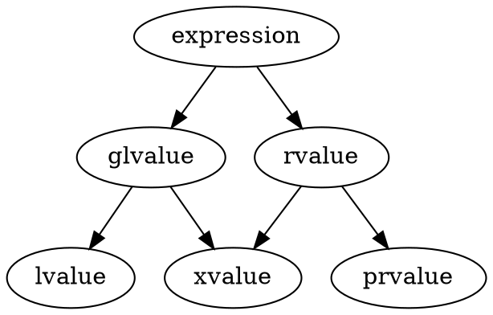

@import "../my-style.less"

# <center>Learning CXX</center>

<!-- @import "[TOC]" {cmd="toc" depthFrom=1 depthTo=6 orderedList=false} -->

<!-- code_chunk_output -->

- [Learning CXX](#centerlearning-cxxcenter)
  - [C++特性](#c特性)
    - [类](#类)
      - [类的性质](#类的性质)
      - [注入类名](#注入类名)
    - [默认和删除函数](#默认和删除函数)
      - [规则3/5/0](#规则350)
        - [规则3](#规则3)
        - [规则5](#规则5)
        - [规则0](#规则0)
      - [默认构造函数](#默认构造函数)
        - [平凡默认构造函数](#平凡默认构造函数)
        - [合格的默认构造函数](#合格的默认构造函数)
      - [复制构造函数](#复制构造函数)
        - [隐式声明的复制构造函数](#隐式声明的复制构造函数)
        - [弃置的隐式声明的复制构造函数](#弃置的隐式声明的复制构造函数)
      - [访问说明符](#访问说明符)
        - [公开成员访问](#公开成员访问)
        - [受保护成员访问](#受保护成员访问)
        - [私有成员访问](#私有成员访问)
    - [Pimpl Idiom](#pimpl-idiom)
    - [运行时多态-虚函数的虚指针和虚函数表](#运行时多态-虚函数的虚指针和虚函数表)
    - [智能指针](#智能指针)
      - [std::unique_ptr](#stdunique_ptr)
      - [std::shared_ptr](#stdshared_ptr)
    - [auto占位符](#auto占位符)
    - [元编程(meta programming)](#元编程meta-programming)
      - [type traits（类型特性）](#type-traits类型特性)
      - [异相容器](#异相容器)
      - [std::variant](#stdvariant)
      - [元编程应用](#元编程应用)
        - [c++ 反射实现](#c-反射实现)
        - [类型转换](#类型转换)
        - [通用类型安全转换函数](#通用类型安全转换函数)
    - [模板](#模板)
      - [模板实例化和特化](#模板实例化和特化)
      - [隐式实例化](#隐式实例化)
        - [函数模板隐式实例化](#函数模板隐式实例化)
        - [类模板隐式实例化](#类模板隐式实例化)
      - [显式实例化](#显式实例化)
      - [函数模板调用方式](#函数模板调用方式)
      - [模板特化](#模板特化)
        - [函数模板特化](#函数模板特化)
        - [类模板特化](#类模板特化)
      - [使用类模板实参推断简化代码](#使用类模板实参推断简化代码)
      - [可变参数模板](#可变参数模板)
        - [使用折叠表达式(fold expression)简化可变参数函数模板](#使用折叠表达式fold-expression简化可变参数函数模板)
      - [SFINAE（替换失败不是一个错误）](#sfinae替换失败不是一个错误)
        - [解释](#解释)
        - [类型SFINAE](#类型sfinae)
        - [表达式SFINAE](#表达式sfinae)
        - [部分特化的SFINAE](#部分特化的sfinae)
        - [库支持](#库支持)
        - [SFINAE的替换方案](#sfinae的替换方案)
        - [实例](#实例)
        - [static_assert和std::enable_if区别](#static_assert和stdenable_if区别)
    - [约束和概念（constraint and concept）](#约束和概念constraint-and-concept)
      - [Concepts](#concepts)
      - [constraints](#constraints)
        - [合取Conjunctions](#合取conjunctions)
        - [析取Disjunctions](#析取disjunctions)
        - [Atomic constraints](#atomic-constraints)
      - [constraints 规范化](#constraints-规范化)
      - [需求从句（requires clauses）](#需求从句requires-clauses)
      - [需求表达式(requires expressions)](#需求表达式requires-expressions)
        - [简单需求](#简单需求)
        - [类型需求](#类型需求)
        - [复合需求](#复合需求)
        - [嵌套需求](#嵌套需求)
      - [约束的偏移Partial ordering of constraint](#约束的偏移partial-ordering-of-constraint)
    - [Windows平台dllimport和dllexport](#windows平台dllimport和dllexport)
    - [容器类](#容器类)
      - [顺序容器](#顺序容器)
      - [关联容器](#关联容器)
      - [无序关联容器(c++11起)](#无序关联容器c11起)
      - [容器适配器](#容器适配器)
      - [迭代器失效](#迭代器失效)
    - [c++ 关键词](#c-关键词)
      - [cv(const 和 volatile)类型限定符](#cvconst-和-volatile类型限定符)
    - [std::function和std::bind](#stdfunction和stdbind)
      - [std::function](#stdfunction)
        - [介绍](#介绍)
        - [原型](#原型)
        - [用法](#用法)
      - [std::bind](#stdbind)
    - [lambda函数](#lambda函数)
      - [泛化和模板lambda](#泛化和模板lambda)
      - [递归lambda](#递归lambda)
    - [std::optional (C++17)](#stdoptional-c17)
    - [转发引用和完美转发](#转发引用和完美转发)
      - [值类别和变量类型](#值类别和变量类型)
        - [值类别](#值类别)
        - [变量类型](#变量类型)
        - [右值引用对纯右值的生命周期延长](#右值引用对纯右值的生命周期延长)
        - [表达式的左右值性与类型无关](#表达式的左右值性与类型无关)
      - [引用折叠](#引用折叠)
      - [转发引用](#转发引用)
      - [完美转发](#完美转发)
      - [std::forward](#stdforward)
      - [移动语义](#移动语义)
      - [std::move](#stdmove)
    - [constexpr说明符](#constexpr说明符)
      - [if constexpr用于编译器选择分支](#if-constexpr用于编译器选择分支)
      - [constinit说明符(c++20起)](#constinit说明符c20起)
    - [consteval](#consteval)
    - [std::declval](#stddeclval)
    - [decltype 说明符](#decltype-说明符)
    - [结构化绑定声明(c++17)](#结构化绑定声明c17)
    - [多线程](#多线程)
      - [线程](#线程)
      - [互斥Mutex](#互斥mutex)
      - [互斥对象管理类模板--锁Lock](#互斥对象管理类模板-锁lock)
      - [互斥对象管理类模板的加锁策略](#互斥对象管理类模板的加锁策略)
      - [条件变量](#条件变量)
      - [原子操作atomic](#原子操作atomic)
      - [其他线程同步机制](#其他线程同步机制)
        - [std::latch](#stdlatch)
        - [std::barrier](#stdbarrier)
        - [信号量](#信号量)
      - [Future](#future)
        - [std::promise](#stdpromise)
        - [std::future](#stdfuture)
        - [std::shared_future](#stdshared_future)
        - [std::packaged_task](#stdpackaged_task)
        - [std::async](#stdasync)
    - [协程(c++20)](#协程c20)
      - [限制](#限制)
      - [执行](#执行)
      - [堆分配](#堆分配)
      - [承诺类型（Promise）](#承诺类型promise)
      - [co_await](#co_await)
      - [co_yield](#co_yield)
  - [现代c++编程手册](#现代c编程手册)
    - [控制和查询对象对齐](#控制和查询对象对齐)
    - [作用域枚举](#作用域枚举)
    - [对虚函数使用`override`和`final`](#对虚函数使用override和final)
    - [范围for循环](#范围for循环)
      - [使用范围for循环在范围上迭代](#使用范围for循环在范围上迭代)
      - [在自定义类型上使用范围for循环](#在自定义类型上使用范围for循环)
    - [高序函数(higher-order functions)](#高序函数higher-order-functions)
      - [实现高序函数(higher-order functions)的映射(map)和折叠(fold)](#实现高序函数higher-order-functions的映射map和折叠fold)
      - [组合函数到高序函数](#组合函数到高序函数)
    - [对任意可调用对象统一触发方式](#对任意可调用对象统一触发方式)
    - [向编译器的属性提供元数据](#向编译器的属性提供元数据)
    - [实现并行映射map和折叠fold函数](#实现并行映射map和折叠fold函数)
    - [复制消除(copy elision)](#复制消除copy-elision)
      - [强制的复制/移动操作消除](#强制的复制移动操作消除)
      - [非强制的复制/移动 (C++11 起)操作消除](#非强制的复制移动-c11-起操作消除)
    - [奇特的递归模板模式(CRTP)实现静态多态](#奇特的递归模板模式crtp实现静态多态)

<!-- /code_chunk_output -->
## C++特性

### 类
 
类是一种用户定义类型。
类可以拥有下列种类的成员：
- 数据成员：
- - 非静态数据成员，包括位域。
- - 静态数据成员
- 成员函数：
- - 非静态成员函数
- - 静态成员函数
- 嵌套类型：
- - 在类定义之中定义的嵌套类及枚举
- - 既存类型的别名，以`typedef`或类型别名声明定义
- - 就查找而言（除非在用作构造函数名时），类的名字在该类自身的定义中，表现为一个作为其自身的类型别名的公开成员：这被称作注入类名
- 来自定义于类中的所有无作用域枚举，或由 using 声明或 using enum 声明引入 (C++20 起)的枚举项
- 成员模板（变量模板、 (C++14 起)类模板或函数模板）可以在任何非局部 `class/struct/union` 定义体内出现

声明或继承了至少一个虚成员函数的类是多态的。此类型的对象是多态对象，并拥有作为其对象表示一部分存储的运行时类型信息，它可以通过 `dynamic_cast` 和 `typeid` 查询到。虚成员函数参与动态绑定。

拥有 `constexpr` 构造函数的类是字面类型 (`LiteralType`) ：此类型的对象能用 `constexpr` 函数在编译时进行操作。(C++11 起)

#### 类的性质

**可平凡复制类**需要满足以下所有条件：
- 至少有一个合格的复制构造函数，移动构造函数，复制赋值运算符或移动赋值运算符。
- 每个合格的复制构造函数都是平凡的，
- 每个合格的移动构造函数都是平凡的，
- 每个合格的复制赋值运算符都是平凡的，
- 每个合格的移动赋值运算符都是平凡的，并且
- 有一个未被弃置的平凡析构函数。
**平凡类**需要满足以下所有条件：
- 它是可平凡复制类，并且
- 有一个或多个合格的默认构造函数，它们全部都是平凡的。

**标准布局类**是满足以下所有条件的类：
- 没有具有非标准布局类类型(或这种类型的数组)或到它们的引用的非静态数据成员，
- 没有虚函数和虚基类
- 所有非静态数据成员都具有相同的可访问性，
- 没有非标准布局的基类
- 该类和它的所有基类中的非静态数据成员和位域都在相同的类中首次声明，并且
- 给定该类为 S，且作为基类时集合 M(S) 没有元素，其中 M(X) 对于类型 X 定义如下：
- - 如果 X 是没有（可能继承来的）非静态数据成员的非联合体类类型，那么集合 M(X) 为空。
- - 如果 X 是首个非静态数据成员（可能是匿名联合体）具有 X0 类型的非联合体类类型，那么集合 M(X) 包含 X0 和 M(X0) 中的元素。
- - 如果 X 是联合体类型，集合 M(X) 是包含所有 Ui 的集合与每个 M(Ui) 集合的并集，其中每个 Ui 是 X 的第 i 个非静态数据成员的类型。
- - 如果 X 是元素类型是 Xe 的数组类型，集合 M(X) 包含 Xe 和 M(Xe) 中的元素。
- - 如果 X 不是类类型或数组类型，那么集合 M(X) 为空。

标准布局结构体 是以类关键词 `struct` 或类关键词 `class` 定义的标准布局类。标准布局联合体 是以类关键词 `union` 定义的标准布局类。

**隐式生存期类**

隐式生存期类 是满足以下条件之一的类：

- 它是析构函数不由用户声明 (C++11 前)用户提供 (C++11 起)的聚合体，或
- 至少有一个平凡且合格的构造函数和一个平凡且未被弃置的析构函数。

**POD类**

POD 类 是满足以下所有条件的类：
- 它是平凡类，
- 它是标准布局类，并且
- 没有具有非 POD 类类型（或这种类型的数组）的非静态数据成员。

POD 结构体 是非联合体的 POD 类。POD 联合体 是满足 POD 类条件的联合体。

POD 属性的使用被弃用。用户代码应该期待或要求平凡或标准布局属性，或者它们两者。(c++20起)

#### 注入类名

注入类名是在类的作用域内该类自身的名字。
类模板中，注入类名能用作指代当前模板的模板名，或指代当前实例化的类名。

在类作用域中，当前类的名字会被视为一个公开成员名：这被称为注入类名（`injected-class-name`）。该名字的声明点紧跟类定义的开花括号之后。
```c++
int X;

struct X
{
  void f()
  {
    X* p;   // OK：X 指代注入类名
    ::X* q; // 错误：名称查找找到变量名，它隐藏结构体名
  }
};
```

与其他成员类似，注入类名会被继承。在私有或受保护继承的场合，某个间接基类的注入类名在派生类中最后可能会无法访问。

```c++
struct A {};
struct B : private A {};
struct C : public B
{
    A* p;   // 错误：无法访问注入类名 A
    ::A* q; // OK：不使用注入类名
};
```

在类模板中也拥有注入类名。它的注入类名可以被用作模板名或类型名。
下列情况下，注入类名被当做类模板自身的模板名：
- 它后面跟着 <
- 它被用作模板模板实参
- 它是某个友元类模板声明的详述类型说明符中的最后标识符。

```c++
template<template<class, class> class>
struct A;
 
template<class T1, class T2>
struct X
{
    X<T1, T2>* p;   // OK：X 被当做模板名
 
    using a = A<X>; // OK：X 被当做模板名
 
    template<class U1, class U2>
    friend class X; // OK：X 被当做模板名
 
    X* q;           // OK：X 被当做类型名，等价于 X<T1, T2>
};
```

在类模板特化或部分特化的作用域内，当将注入类名用作类型名时，它等价于模板名后随环绕于 <> 中的该类模板特化或部分特化的各个模板实参。
```c++
template<>
struct X<void, void>
{
    X* p; // OK：X 被当做类型名，等价于 X<void, void>
 
    template<class, class>
    friend class X; // OK：X 被当做模板名（与在模板中相同）
 
    X<void, void>* q; // OK：X 被当做模板名
};
 
template<class T>
struct X<char, T>
{
    X* p, q; // OK：X 被当做类型名，等价于 X<char, T>
 
    using r = X<int, int>; // OK：可以用它指名另一特化
};
```

### 默认和删除函数
c++类有些特别的成员(构造函数，析构函数和赋值运算符)可以编译器默认实现或者开发者提供实现。
特殊成员函数：
- 构造函数
- 析构函数
- 复制构造函数
- 移动构造函数
- 复制赋值运算符
- 移动赋值运算符

声明函数为默认的需要使用`=default`代替函数体。只有类特殊成员函数可以声明为默认的：
```c++
struct foo
{
    foo() = default;
};
```
删除一个函数需要使用`=delete`代替函数体。所有的函数都可以delete:
```c++
struct foo
{
    foo(const foo& )= = delete;
};

void func(int) = delete;
```

使用默认和删除函数是为了实现一些设计目的，如：
- 为了实现类不可拷贝，需要声明拷贝构造和拷贝赋值运算符为delete:
```c++
class foo_not_copyable
{
    public:
    foo_not_copyable()=default;

    foo_not_copyable(const foo_not_copyable&)=delete;
    foo_not_copyable& operator=(const foo_not_copyable&) = delete;
};
```
- 为了实现类不可拷贝，但可移动，需要声明拷贝操作为delete，并显示实现移动操作：
```c++
class data_wrapper
{
    Data* data;
    public:
    data_wrapper(Data* d=nullptr):data(d){}
    ~data_wrapper(){delete data;}

    data_wrapper(const data_wrapper&) = delete;
    data_wrapper& operator=(const data_wrapper&) = delete;

    data_wrapper(data_wrapper&& other):data(std::move(other.data))
    {
        other.data=nullptr;
    }

    data_wrapper& operator=(data_wrapper&& other)
    {
        if(this!=std::addressof(other))
        {
            delete data;
            data = std::move(other.data);
            other.data=nullptr;
        }

        return *this;
    }
}
```

- 为了函数只能被指定的某类型调用，并阻止类型提升，为函数提供被删除的重载
```c++
template<typename T>
void run(T val)= delete;

void run(long val){} /* 只能被long类型调用 */
```

编译器隐式实现类特殊成员函数是根据以下的规则：
- 如果自定义的构造函数(虚析构函数)存在，不会隐式生成构造(析构)函数。
- 如果自定义的移动构造或移动赋值运算符存在，则不会隐式生成复制构造和复制赋值运算符。
- 如果自定义复制构造，移动构造，复制赋值运算符，移动赋值运算符或析构函数存在，则不会隐式生成移动构造或移动赋值运算符。
<!-- - 如果自定义复制构造或析构存在，则会生成默认复制赋值运算符。
- 如果自定义复制赋值运算符或析构存在，则会生成默认复制构造函数。
**Note that the last two rules in the preceding list are deprecated 
rules and may no longer be supported by your compiler.** -->

#### 规则3/5/0

##### 规则3

如果一个类需要一个自定义的析构，一个自定义复制构造，或一个自定义复制赋值运算符，则可以确定需要所有三者。
如果使用隐式定义的特殊成员函数在类管理非类类型对象资源(原始指针，POSIX文件描述符等)通常都会出错，其析构基本不做任何事，且复制构造，赋值运算符执行浅拷贝(拷贝句柄的值而没有复制底层的资源)。

##### 规则5

因为自定义(或`=default`或`=delete`声明)的析构、复制构造或复制赋值运算符会阻止隐式定义的移动构造和移动赋值运算符的生成，所以对于需要移动语义的需要声明所有五个特殊成员函数：
不同于规则3，没有提供移动构造和移动赋值运算符通常不是错误，只是失去了优化的机会。

##### 规则0

类在需要自定义析构、复制或移动构造、复制或移动赋值运算符应当仅仅处理自身的事务，其他的类不应该自定义这些特殊成员函数。

```c++
class rule_of_zero
{
    std::string cppstring;
public:
    rule_of_zero(const std::string& arg) : cppstring(arg) {}
};

// 对于作为基类的类需要自定义析构为公有且为虚，则需要显式声明所有其他特殊成员函数为default:
class base_of_five_defaults
{
public:
    base_of_five_defaults(const base_of_five_defaults&) = default;
    base_of_five_defaults(base_of_five_defaults&&) = default;
    base_of_five_defaults& operator=(const base_of_five_defaults&) = default;
    base_of_five_defaults& operator=(base_of_five_defaults&&) = default;
    virtual ~base_of_five_defaults() = default;
};
```
#### 默认构造函数

默认构造函数是不需要实参就能调用的构造函数。拥有公开默认构造函数的类型是可默认构造 (`DefaultConstructible`) 的。

```shell
类名 ();	(1)	
类名 :: 类名 () 函数体	(2)	
类名 () = delete;	(3)	(C++11 起)
类名 () = default;	(4)	(C++11 起)
类名 :: 类名 () = default;	(5)	(C++11 起)
```

(1) 类定义中的默认构造函数的声明。
(2) 类定义之外的默认构造函数的定义（该类必须包含一条声明 (1)）。有关构造函数的 函数体 的细节，参见构造函数与成员初始化器列表。
(3) 弃置的默认构造函数：如果它被重载决议选择，那么程序编译失败。
(4) 预置的默认构造函数：即便其他构造函数存在，编译器也会定义隐式默认构造函数。
(5) 类定义之外的预置的默认构造函数（该类必须包含一条声明 (1)）。这种构造函数被当做是用户提供的（user-provided）（见下文以及值初始化）。

如果没有提供任何用户声明的构造函数，那么编译器将始终声明一个作为它的类的`inline public`成员的默认构造函数。

当存在用户声明的构造函数时，用户仍可以通过关键词 default 强制编译器自动生成原本隐式声明的默认构造函数。(C++11 起)

##### 平凡默认构造函数

如果满足下列所有条件，那么类 T 的默认构造函数是平凡的（即没有任何动作）：
- 构造函数并非用户提供的（即它被隐式定义或在它的首个声明中预置的）
- T 没有虚成员函数
- T 没有虚基类
- T 没有拥有默认初始化器的非静态数据成员。(C++11 起)
- 每个 T 的直接基类都拥有平凡默认构造函数。
- 每个类类型（或它的数组类型）的非静态成员都拥有平凡默认构造函数
平凡默认构造函数是没有任何动作的构造函数。所有与 C 语言兼容的数据类型（POD 类型）都是可以平凡默认构造的。

##### 合格的默认构造函数

满足下列所有条件的默认构造函数是合格的：
- 它没有被弃置，且
- 满足它的所有关联约束（如果存在），且
- 没有比它更受约束的默认构造函数。

```c++
struct A
{
    int x;
    A(int x = 1): x(x) {} // user-defined default constructor
};
 
struct B: A
{
    // B::B() is implicitly-defined, calls A::A()
};
 
struct C
{
    A a;
    // C::C() is implicitly-defined, calls A::A()
};
 
struct D: A
{
    D(int y): A(y) {}
    // D::D() is not declared because another constructor exists
};
 
struct E: A
{
    E(int y): A(y) {}
    E() = default; // explicitly defaulted, calls A::A()
};
 
struct F
{
    int& ref; // reference member
    const int c; // const member
    // F::F() is implicitly defined as deleted
};
 
// user declared copy constructor (either user-provided, deleted or defaulted)
// prevents the implicit generation of a default constructor
 
struct G
{
    G(const G&) {}
    // G::G() is implicitly defined as deleted
};
 
struct H
{
    H(const H&) = delete;
    // H::H() is implicitly defined as deleted
};
 
struct I
{
    I(const I&) = default;
    // I::I() is implicitly defined as deleted
};
 
int main()
{
    A a;
    B b;
    C c;
//  D d; // compile error
    E e;
//  F f; // compile error
//  G g; // compile error
//  H h; // compile error
//  I i; // compile error
}
```

#### 复制构造函数

类 `T` 的复制构造函数是首个形参是 `T&`、`const T&`、`volatile T&` 或 `const volatile T&`，而且要么没有其他形参，要么剩余形参均有默认值的非模板构造函数。

```shell
类名 ( const 类名 & )	(1)	
类名 ( const 类名 & ) = default;	(2)	(C++11 起)
类名 ( const 类名 & ) = delete;	(3)	(C++11 起)
```

(1) 复制构造函数的典型声明。
(2) 强制编译器生成复制构造函数。
(3) 阻止隐式生成复制构造函数。

##### 隐式声明的复制构造函数

如果没有为类类型（`struct`、`class` 或 `union`）提供任何用户定义的复制构造函数，那么编译器总是会声明一个复制构造函数作为这个类的非 `explicit` 的 inline public 成员。如果满足下列所有条件，那么这个隐式声明的复制构造函数拥有形式 `T::T(const T&)`：
- T 的每个直接基类和虚基类 B 均拥有形参为 const B& 或 const volatile B& 的复制构造函数；
- T 的每个类类型或类类型数组的非静态数据成员 M 均拥有形参为 const M& 或 const volatile M& 的复制构造函数。

否则，隐式声明的复制构造函数是 T::T(T&)。
类可以拥有多个复制构造函数，如 T::T(const T&) 和 T::T(T&)。
当存在用户定义的复制构造函数时，用户仍可以使用关键词 default 强制编译器生成隐式声明的复制构造函数。(C++11 起)

##### 弃置的隐式声明的复制构造函数

如果满足下列任一条件，那么类 T 的隐式声明的复制构造函数被定义为弃置的：(C++11 起)
- T 拥有无法复制的非静态数据成员（拥有被弃置、不可访问或有歧义的复制构造函数）；
- T 拥有无法复制的直接或虚基类（拥有被弃置、不可访问或有歧义的复制构造函数）；
- T 拥有带被弃置或不可访问的析构函数的直接基类，虚基类或非静态数据成员；
- T 是联合体式的类，且拥有带非平凡复制构造函数的变体成员；
- T 拥有右值引用类型的数据成员；
- T 拥有用户定义的移动构造函数或移动赋值运算符（此条件只会导致隐式声明的，而非预置的(使用了default)复制构造函数被弃置）。

- 平凡的复制构造函数

如果满足下列所有条件，那么类 T 的复制构造函数是平凡的：
- 它不是用户提供的（即它是隐式定义或预置的）；
- T 没有虚成员函数；
- T 没有虚基类；
- 为 T 的每个直接基类选择的复制构造函数都是平凡的；
- 为 T 的每个类类型（或类类型数组）的非静态成员选择的复制构造函数都是平凡的；

```c++
struct A
{
    int n;
    A(int n = 1) : n(n) {}
    A(const A& a) : n(a.n) {} // 用户定义的复制构造函数
};
 
struct B : A
{
    // 隐式默认构造函数 B::B()
    // 隐式复制构造函数 B::B(const B&)
};
 
struct C : B
{
    C() : B() {}
private:
    C(const C&); // 不可复制，C++98 风格
};
 
int main()
{
    A a1(7);
    A a2(a1); // 调用复制构造函数
 
    B b;
    B b2 = b;
    A a3 = b; // 转换到 A& 并调用复制构造函数
 
    volatile A va(10);
    // A a4 = va; // 编译错误
 
    C c;
    // C c2 = c; // 编译错误
}
```

#### 访问说明符

在派生类声明的 基类说明符 中定义继承它后面的基类的成员的可访问性。
```c++
public : 成员说明	(1)	
protected : 成员说明	(2)	
private : 成员说明	(3)	
public 基类	(4)	
protected 基类	(5)	
private 基类	(6)	
```
1) 该访问说明符之后的各个成员具有公开成员访问
2) 该访问说明符之后的各个成员具有受保护成员访问
3) 该访问说明符之后的各个成员具有私有成员访问
4) 公开继承：该访问说明符之后列出的基类的公开和受保护成员在派生类中保持它的成员访问，而基类的私有成员对派生类不可访问
5) 受保护继承：该访问说明符之后列出的基类的公开和受保护成员在派生类中是受保护成员，而基类的私有成员对派生类不可访问
6) 私有继承：该访问说明符之后列出的基类的公开和受保护成员在派生类中是私有成员，而基类的私有成员对派生类不可访问

- 公有继承
派生类和基类属于`is-a`的关系，属于扩张类型
- 受保护继承
- 私有继承：类似于派生类的私有数据成员 `componenet`关系，私有继承用于：
- - 派生类通过声明可访问基类公有成员函数， 这个`componenet`也可以做到：
```c++
class Base{
    public:
    void func(){}
};

class Derived : private Base{
    using Base::func;
    void get(){func();}
};

class Component {
  Base base_;
  public:
  void get(){base_.size();}
}
```
- - 派生类成员函数内派生类对象的指针或引用可以转换为基类对象的指针或引用，这个`componenet`也可以实现。
```c++
class Base{
};

class Derived : private Base{
    public:
    void get(){
        Base* b=this;
    }
};

class Component{
  Base base_;
  public:
  void get(){
    Base* b=&base_;
  }
}
```
- - 对于基类只有方法没有数据，私有继承可以不占用派生类对象的尺寸，使用`componenet`会增大尺寸。
```c++
#include <iostream>
class Base {
    void fun(){};
};
class Derived : private Base {
    int num{0};
};
class Component {
    Base base_;
    int num{0};
};

int main() {
    Derived d;
    Component c;
    std::cout << "derived class size: " << sizeof(d) << "\n"
              << "component class size: " << sizeof(c) << std::endl;
}
```
可能输出：
```shell
derived class size: 4
component class size: 8
```
类对象最小占有1字节，由于成员的对齐要求，占用了4字节。
- - 虚函数调用的时候，这种`componenet`无法实现：
```c++
#include <iostream>
class Base{
    public:
    virtual void func(){std::cout<<"Base:func"<<std::endl;}
    void get(){func();}
};

class Derived : private Base{
    public:
    void func(){std::cout<<"Derived:func"<<std::endl;}
    void h(){get();}
};

int main() {
    Derived d;
    d.h();
}
```
输出：
```shell
Derived:func
```
##### 公开成员访问

类的公开成员可以在任意位置访问。
```c++
class S
{
public:
    // n、E、A、B、C、U、f 都是公开成员
    int n;
    enum E {A, B, C};
    struct U {};
    static void f() {}
};
 
int main()
{
    S::f();     // S::f 可以在 main 访问
 
    S s;
    s.n = S::B; // S::n 与 S::B 可以在 main 访问
 
    S::U x;     // S::U 可以在 main 访问
}
```

##### 受保护成员访问

类的受保护成员只能为下列者所访问

1) 该类的成员和友元
2) 派生自该类的任何类的成员，但仅在访问受保护成员所通过的对象的类是该派生类或该派生类的派生类时允许：
```c++
struct Base
{
protected:
    int i;
private:
    void g(Base& b, struct Derived& d);
};
 
struct Derived : Base
{
    void f(Base& b, Derived& d) // 派生类的成员函数
    {
        ++d.i;                  // OK：d 的类型是 Derived
        ++i;                    // OK：隐含的 '*this' 的类型是 Derived
//      ++b.i;                  // 错误：不能通过 Base 访问受保护成员
                                // （否则可能更改另一派生类，假设为 Derived2 的基实现）
    }
};
 
void Base::g(Base& b, Derived& d) // Base 的成员函数
{
    ++i;                          // OK
    ++b.i;                        // OK
    ++d.i;                        // OK
}
 
void x(Base& b, Derived& d) // 非成员非友元
{
//    ++b.i;                // 错误：非成员不能访问
//    ++d.i;                // 错误：非成员不能访问
}
```
组成指向受保护成员的指针时，必须在它的声明中使用派生类：
```c++
struct Base
{
 protected:
    int i;
};
 
struct Derived : Base
{
    void f()
    {
//      int Base::* ptr = &Base::i;    // 错误：必须使用 Derived 来指名
        int Base::* ptr = &Derived::i; // OK
    }
};
```

##### 私有成员访问

类的私有成员仅对类的成员和友元可访问，无关乎成员在相同还是不同实例：
```c++
class S
{
private:
    int n; // S::n 私有
public:
    S() : n(10) {}                    // this->n 可以在 S::S 访问
    S(const S& other) : n(other.n) {} // other.n 可以在 S::S 访问
};
```

### Pimpl Idiom
 
`Pimpl`是`point to implementation`，c++通过将私有的部分包装成一个单独的类来限制外界的访问.一个'pimpl'就是一个用于隐藏类的私有指针成员。

```c++
// file x.h
class XIpml; //forward declaration
class X {
// public and protected members
private:
    class XImpl* pimpl_;
    // a pointer to a forward-declared class
};

// file x.cpp
struct XImpl {
// private members; fully hidden, can be
// changed at will without recompiling clients
};
```

使用`std::unique_ptr`代替原始指针，由于在头文件中`control_pimpl`未被定义，需要自定义删除函数，或者实现控制类的析构函数：

```c++
// in control.h
class control_pimpl;

class control
{
  std::unique_ptr<
    control_pimpl, void(*)(control_pimpl*)> pimpl;
  public:
    control();
    void set_text(std::string_view text);
    void resize(int const w, int const h);
    void show();
    void hide();
};

// in control.cpp
class control_pimpl
{
  std::string text;
  int width = 0;
  int height = 0;
  bool visible = true;
  void draw()
  {
    std::cout
      << "control " << '\n'
      << " visible: " << std::boolalpha << visible 
      << std::noboolalpha << '\n'
      << " size: " << width << ", " << height << '\n'
      << " text: " << text << '\n';
  }
public:
  void set_text(std::string_view t)
  {
    text = t.data();
    draw();
  }
  void resize(int const w, int const h)
  {
    width = w;
    height = h;
    draw();
  }
  void show()
  {
    visible = true;
    draw();
  }
  void hide()
  {
    visible = false;
    draw();
  }
};

control::control() :
  pimpl(new control_pimpl(),
        [](control_pimpl* pimpl) {delete pimpl; })
{}

void control::set_text(std::string_view text)
{
  pimpl->set_text(text);
}
void control::resize(int const w, int const h)
{
  pimpl->resize(w, h);
}
void control::show()
{
  pimpl->show();
}
void control::hide()
{
  pimpl->hide();
}
```

这种方式的主要好处是打破了编译时依赖:

- 类成员定义在cpp文件中,不再被客户代码访问,这减少了额外的`#include`并加快了编译速度;
- 类的实现可能改变,这样私有的隐藏成员类可以自由的增减,不需要重新编译客户代码.
- 改变内部实现不会影响公共接口。

使用这个模式的代价是:

- 每次构造和析构需要分配和释放内存;
- 每次访问隐藏成员需要至少一次额外的重定向；
- 不能用于protected成员和私有虚函数。


### 运行时多态-虚函数的虚指针和虚函数表

c++为了实现对象在运行时的动态调用函数使用了一种虚函数(vftable)的技术。
虚函数表是编译器在编译阶段为类分配的静态数组，每一个使用了虚函数的类都有自己的虚函数表，表中的存放的都是函数指针，指向该类访问的虚函数。
同时，编译器还添加一个指向vftable的指针，称之为vptr，vptr在创建实例时自动设置。vptr的设定和重置都由每个类的构造、析构和拷贝赋值运算符自动完成。

```c++
#include <iostream>
using namespace std;

typedef void (*Fun)();
class Base {
public:
  Base() {}
  virtual void fun1() { cout << "Base : fun1()" << endl; }
  virtual void fun2() { cout << "Base : fun2()" << endl; }
  virtual void fun3() { cout << "Base : fun3()" << endl; }
  ~Base() {}
};

/**
 * @brief
 * 获取vptr地址与func地址,vptr指向的是一块内存，这块内存存放的是虚函数地址，这块内存就是我们所说的虚表
 *
 */
class Derived : public Base {
public:
  Derived() {}
  void fun1() { cout << "Derived : fun1()" << endl; }
  void fun2() { cout << "Derived : fun2()" << endl; }
  void fun3() { cout << "Derived : fun3()" << endl; }
  void fun4() { cout << "Derived : fnu4()" << endl; }
  ~Derived() {}
};

Fun getAddr(void *obj, unsigned int offset) {
  cout << "====================" << endl;
  void *vptr_addr =
      (void *)*(unsigned long *)obj; // 64位操作系统，占8字节，通过*(unsigned
                                     // long *)obj取出前8字节，即vptr指针
  printf("vptr_addr:%p\n", vptr_addr);
  /**
   * @brief 通过vptr指针访问virtual table，
   * 因为虚表中每个元素(虚函数指针)在64位编译器下是8个字节，因此通过*(unsigned
   * long*)vptr_addr取出前8个字节，后面加上偏移量就是每个函数的地址！
   *
   */
  void *func_addr = (void *)*((unsigned long *)vptr_addr + offset);
  printf("func_addr:%p\n", func_addr);
  return (Fun)func_addr;
}

int main(void) {
  Base ptr;
  Derived d;
  Base *pt = new Derived();
  Base &pp = ptr;
  Base &p = d;
  cout << "基类对象直接调用" << endl;
  ptr.fun1();
  cout << "基类引用指向基类实例" << endl;
  pp.fun1();
  cout << "基类指针指向派生类实例并调用虚函数" << endl;
  pt->fun1();
  cout << "基类引用指向派生类实例并调用虚函数" << endl;
  p.fun1();

  /* 手动查找vptr和vtable */
  Fun f1 = getAddr(pt, 0);
  (*f1)();
  Fun f2 = getAddr(pt, 1);
  (*f2)();
  delete pt;
  Base *pt1 = new Derived(); // 基类指针指向派生类实例
  cout << "基类指针指向派生类实例并调用虚函数" << endl;
  pt1->fun1();
  return 0;
}
```

在getAddr函数中断点调试可以看到：

```c++
(gdb) p obj
$8 = (void *) 0x55555556aeb0
(gdb) x 0x55555556aeb0
0x55555556aeb0: 0x0000555555557cf0
(gdb) x 0x0000555555557cf0
0x555555557cf0 <_ZTV7Derived+16>:       0x00005555555556ac
(gdb) x 0x00005555555556ac
0x5555555556ac <Derived::fun1()>:       0xe5894855fa1e0ff3
(gdb) x 0x0000555555557cf8
0x555555557cf8 <_ZTV7Derived+24>:       0x00005555555556e8
(gdb) x 0x00005555555556e8
0x5555555556e8 <Derived::fun2()>:       0xe5894855fa1e0ff3
(gdb) x 0x0000555555557d00
0x555555557d00 <_ZTV7Derived+32>:       0x0000555555555724
(gdb) x 0x0000555555555724
0x555555555724 <Derived::fun3()>:       0xe5894855fa1e0ff3
(gdb) 
```

可以看到实例对象起始就存放着vptr指针，值为 0x0000555555557cf0，该值是虚函数表的起始地址.取出该地址存放的值，也是一个地址 0x00005555555556ac 。该地址就是 `Derived::fun1()`函数的地址。同理取虚函数表中的下一个地址，可以发现指向的就是`Derived::fun2()`。

### 智能指针

智能指针是管理heap内存的指针，在指针析构时会自动释放所管理的内存。 c++提供了`std::unique_ptr`和`std::shared_ptr`两种智能指针。

#### std::unique_ptr

`std::unique_ptr`拥有并管理在堆(heap)上的另一个对象或对象数组。使用`std::unique_ptr`需要注意：

- 使用可用的重载构造来创建一个`std::unique_ptr`管理对象或对象数组的指针。默认构造创建一个不管理任何对象的指针：

```c++
std::unique_ptr<int> pnull;
std::unique_ptr<int> pi (new int(42));
std::unique_ptr<int[]> pa(new int[3]{1,2,3});
std::unique_ptr<foo> pf(new foo(42,42.0,"42"));
```

- 使用`std::make_unique()`函数模板创建指针对象(c++14起)：

```c++
std::unique_ptr<int> pi=std::make_unique<int>(42);
std::unique_ptr<int[]> pa=std::make_unique<int[]>(3);
std::unique_ptr<foo> pf = std::make_unique<foo>(42,42.0,"42");
```

- 使用`std::make_unique_for_overwrite()`函数模板(c++20)创建指针对象并默认初始化，这些指针的对象可以后来重写新的值：

```c++
std::unique_ptr<int> pi =std::make_unique_for_overwrite<int>();
std::unique_ptr<foo[]> pa=std::make_unique_for_overwrite<foo[]>();
```

- 使用重载构造，并使用自定义删除器如果delete运算符不能准备的销毁所管理的对象或数组：

```c++
struct foo_deleter
{
  void operator()(foo* pf) const
  {
    std::cout<<"deleting foo..."<<std::endl;
    delete pf;
  }
};

std::unique_ptr<foo,foo_deleter> pf(new foo(42,42.0,"42"), foo_deleter());
```

- 使用`std::move()`转移对象所有权到另一个指针对象：

```c++
auto pi=std::make_unique<int>(42);
auto qi = std::move(pi);
assert(pi.get() == nullptr);
assert(qi.get() != nullptr);
```

- 使用`get()`获取所管理的对象的原始指针，并保持智能指针的管理权。或使用`release()`释放管理权：

```c++
void fun(int* ptr)
{
  if(ptr != nullptr)
    std::cout<<*ptr<<std::endl;
  else
    std::cout<<"null"<<std::endl;
}

std::unique_ptr<int> pi;
func(pi.get()); /* print null */

pi = std::make_unique<int>(42);
func(pi.get());  /* print 42 */
```

- 使用`operator*`和`operator->`解除管理的对象指针:

```c++
auto pi=std::make_unique<int>(42);
*pi=21;

auto pf=std::make_unique<foo>();
pf->print();
```

- 如果指针管理的对象是数组，`operator[]`可以用于访问数组的元素：

```c++
std::unique_ptr<int[]> pa=std::make_unique<int[]>(3);
for(int i =0;i<3;++i)
  pa[i]=i+1;
```
  
- 检查指针是否有管理对象，使用`operator bool`或检查`get()!=nullptr`：

```c++
std::unique_ptr<int> pi(new int(42));
if (pi) std::cout<<"not null"<<std::endl;
``` 

```c++
std::vector<std::unique_ptr<foo>> data;
for(int i=0;i<5;++i>)
{
  data.push_back(std::make_unique<foo>(i,i,std::to_string(i)));
}

auto pf=std::make_unique<foo>(42,42.0,"42");
data.push_back(std::move(pf));
```

make_unique()在下面的场景可以防止内存泄漏：

```c++
void some_other_function(std::unique_ptr<foo> p, const int v)
{
}

int function_that_throws()
{
  throw std::runtime_error("not implemente");
}

// 可能内存泄漏
some_other_function(std::unique_ptr<foo>(new foo),
                    function_that_throws());

// 不可能内存泄漏
some_other_function(std::make_unique<foo>(),
                    function_that_throws());
```

`some_other_function()`有另一个参数整形值，该值另一个函数的返回值。如果这个函数抛出异常，使用std::unique_ptr构造器创建智能指针会造成内存泄漏。这是因为编译器可能先调用`new foo`，然后调用`function_that_throws()``，接着调用std::unique_ptr`构造函数，如果`function_that_throws()`抛出错误，这样分配的foo将泄漏。

#### std::shared_ptr

`std::shared_ptr`用于管理可共享的动态分配的对象或数组。

使用方式：
- 使用`shared_ptr`构造函数：
```c++
std::shared_ptr<int> pnull1;
std::shared_ptr<int> pnull2(nullptr);
std::shared_ptr<int> pi1(new int(42));
std::shared_ptr<int> pi2=pi1;
std::shared_ptr<foo> pf1(new foo());
std::shared_ptr<foo> pf2(new foo(42,42.0,"42"));
```

- 使用`std::make_shared()`函数模板：
```c++
std::shared_ptr<int> pi = std::make_shared<int>(42);
std::shared_ptr<foo> pf1= std::make_shared<foo>();
std::shared_ptr<foo> pf2 = std::make_shared<foo>(42,42.0,"42");
```

- 使用`std::make_shared_for_overwrite()`函数模板(c++20起)创建共享指针到对象或数组并默认初始化。
```c++
std::shared_ptr<int> pi=std::make_shared_for_overwrite<int>();
std::shared_ptr<foo[]> pa = std::make_shared_for_overwrite<foo[]>(3);
```

- 使用重载构造函数并采用自定义删除器，如果默认删除操作不能准确的销毁管理的对象。
```c++
std::shared_ptr<foo> pf1(new foo(42,42.0,"42"), foo_deleter());
std::shared_ptr<foo> pf2(new foo(42,42.0,"42"), [](foo* p ){
  std::cout<<"deleting foo from lambda..."<<std::endl;
  delete p;
});
```

- 管理对象数组总是需要自定义删除器。删除器可以是偏特化的std::default_delete或一个接受指针的函数：
```c++
std::shared_ptr<int> pa1(new int[3]{1,2,3}, std::default_delete<int[]>());

std::shared_ptr<int> pa2(new int[3]{1,2,3}, [](auto p){delete [] p;});
```

- 使用`get()`函数访问原始指针：
```c++
void func(int* ptr)
{
  if(ptr != nullptr)
    std::cout<<*ptr<<std::endl;
  else
    std::cout<<"null"<<std::endl;
}

std::shared_ptr<int> pi;
func(pi.get());

pi=std::make_shared<int>(42);
func(pi.get());
```

- 使用`operator*`和`operator->`管理对象：
```c++
std::shared_ptr<int> pi = std::make_shared<int>(42);
*pi = 21;
std::shared_ptr<foo> pf = std::make_shared<foo>(42, 42.0, "42");
pf->print();
```

- 如果`shared_ptr`管理对象数组，`operator[]`可以被用于访问数组中的独立元素(c++17起)：
```c++
std::shared_ptr<int[]> pa1(new int[3]{1,2,3}, std::default_delete<int[]>());

for(int i=0;i<3;++i>)
  pa1[i]*=2;
```

- 检查指针是否管理对象可以使用`operator bool`或`get() != nullptr`：
```c++
std::shared_ptr<int> pnull;
if(pnull) std::cout<<"not null"<<std::endl;

std::shared_ptr<int> pi(new int(42));
if(pi) std::cout<<"not null"<<std::endl;
```

- 使用`weak_ptr`维持一个共享对象的非拥有引用，后续可以使用`weak_ptr`获取`shared_ptr`对象：
```c++
auto sp1=std::make_shared<int>(42);
assert(sp1.use_count() == 1);

std::weak_ptr<int> wpi=sp1;
assert(sp1.use_count() == 1);

auto sp2=wpi.lock();
assert(sp1.use_count() == 2);
assert(sp2.use_count() == 2);

sp1.reset();

assert(sp1.use_count()==0);
asssert(sp2.use_count() == 1);
```

- 使用`std::enable_shared_from_this`类模板作为基类，当需要创建`shared_ptr`对象用于已经被另一个`shared_ptr`对象管理的实例。

`std::enable_shared_from_this` 能让其一个对象（假设其名为 `t` ，且已被一个 `std::shared_ptr` 对象 `pt` 管理）安全地生成其他额外的 `std::shared_ptr` 实例（假设名为 `pt1, pt2, ...` ） ，它们与 `pt` 共享对象 `t` 的所有权。

若一个类 `T` 公有继承 `std::enable_shared_from_this<T>` ，则会为该类 `T` 提供成员函数： `shared_from_this` 。 当 `T` 类型对象 `t` 被一个为名为 `pt` 的 `std::shared_ptr<T>` 类对象管理时，调用 `T::shared_from_this` 成员函数，将会返回一个新的 `std::shared_ptr<T>` 对象，它与 `pt` 共享 `t` 的所有权。`weak_from_this`(c++17)返回一个`weak_ptr<T>`对象，它共享没有所有权的 `this` 对象的引用。

`enable_shared_from_this` 的常见实现为：其内部保存着一个对 `this` 的弱引用（例如 `std::weak_ptr` )。 `std::shared_ptr` 的构造函数检测无歧义且可访问的 (C++17 起) `enable_shared_from_this` 基类，并且若内部存储的弱引用未为生存的 `std::shared_ptr` 占有，则 (C++17 起)赋值新建的 `std::shared_ptr` 为内部存储的弱引用。为已为另一 `std::shared_ptr` 所管理的对象构造一个 `std::shared_ptr` ，将不会考虑内部存储的弱引用，从而将导致未定义行为。
只允许在先前已被`std::shared_ptr` 管理的对象上调用 `shared_from_this`和 `weak_from_this`。否则调用行为未定义 (C++17 前)或抛出 `std::bad_weak_ptr` 异常（通过 `shared_ptr` 从默认构造的 `weak_this` 的构造函数） (C++17 起)。

```c++
struct Apprentice;
struct Master : std::enable_shared_from_this<Master>
{
  ~Master() { std::cout << "~Master" << '\n'; }
  void take_apprentice(std::shared_ptr<Apprentice> a);
private:
  std::shared_ptr<Apprentice> apprentice;
};
struct Apprentice
{
  ~Apprentice() { std::cout << "~Apprentice" << '\n'; }
  void take_master(std::weak_ptr<Master> m);
private:
  std::weak_ptr<Master> master;
};
void Master::take_apprentice(std::shared_ptr<Apprentice> a)
{
  apprentice = a;
  apprentice->take_master(shared_from_this());
}
void Apprentice::take_master(std::weak_ptr<Master> m)
{
  master = m;
}
auto m = std::make_shared<Master>();
auto a = std::make_shared<Apprentice>();
m->take_apprentice(a);
```

```c++
#include <memory>
#include <iostream>
 
struct Good : std::enable_shared_from_this<Good> // 注：公开继承
{
    std::shared_ptr<Good> getptr() {
        return shared_from_this();
    }
};
 
struct Best : std::enable_shared_from_this<Best> // 注：公开继承
{
    std::shared_ptr<Best> getptr() {
        return shared_from_this();
    }
    // 无公开构造函数，仅工厂函数，故无法令 getptr 返回 nullptr 。
    [[nodiscard]] static std::shared_ptr<Best> create() {
        // 不使用 std::make_shared<Best> ，因为构造函数为私有。
        return std::shared_ptr<Best>(new Best());
    }
private:
    Best() = default;
};
 
 
struct Bad
{
    std::shared_ptr<Bad> getptr() {
        return std::shared_ptr<Bad>(this);
    }
    ~Bad() { std::cout << "Bad::~Bad() called\n"; }
};
 
void testGood()
{
    // 好：二个 shared_ptr 共享同一对象
    std::shared_ptr<Good> good0 = std::make_shared<Good>();
    std::shared_ptr<Good> good1 = good0->getptr();
    std::cout << "good1.use_count() = " << good1.use_count() << '\n';
}
 
 
void misuseGood()
{
    // 坏：调用 shared_from_this 但没有 std::shared_ptr 占有调用者
    try {
        Good not_so_good;
        std::shared_ptr<Good> gp1 = not_so_good.getptr();
    } catch(std::bad_weak_ptr& e) {
        // 未定义行为（C++17 前）/抛出 std::bad_weak_ptr （C++17 起）
        std::cout << e.what() << '\n';    
    }
}
 
 
void testBest()
{
    // 最好：同上但无法栈分配它：
    std::shared_ptr<Best> best0 = Best::create();
    std::shared_ptr<Best> best1 = best0->getptr();
    std::cout << "best1.use_count() = " << best1.use_count() << '\n';
 
    // Best stackBest; // <- 不会通过编译，因为 Best::Best() 为私有。
}
 
 
void testBad()
{
    // Bad, each shared_ptr thinks it's the only owner of the object
    std::shared_ptr<Bad> bad0 = std::make_shared<Bad>();
    std::shared_ptr<Bad> bad1 = bad0->getptr();
    std::cout << "bad1.use_count() = " << bad1.use_count() << '\n';
} // UB： Bad 的二次删除
 
 
int main()
{
    testGood();
    misuseGood();
 
    testBest();
 
    testBad();
}
```

```c++
std::shared_ptr<Derived> pd = std::make_shared<Derived>();
std::shared_ptr<Base> pb = pd;
std::static_pointer_cast<Derived>(pb)->print()
```

### auto占位符

`auto`说明符是某种实际类型的占位符。当使用`auto`时，编译器从下面的情形中推断实际类型：

- 用于初始化变量的表达式类型，当`auto`用于变量声明。
- 函数的尾随返回类型或者返回表达式，当`auto`用于函数返回类型的占位符。
- 非类型模板形参从实参中推断类型。

**语法**

```
type-constraint(optional) auto (c++11起)
type-constraint(optional) decltype(auto) (c++14起)
```

`type-constraint` - 一个概念名，可以限定或后随被 `<>` 包围的模板实参列表。

1) 用模板实参推导的规则推导类型。
2) 类型是 `decltype(expr)`，其中 `expr` 是初始化器。
占位符 `auto` 可伴随如 `const` 或 `&` 这样的修饰符，它们参与类型推导。占位符 `decltype(auto)` 必须是被声明类型的唯一组分。 (C++14 起)

使用`auto`注意事项:

- `auto`说明符只是类型的占位符，不能推断cv和引用说明符。所以在需要cv和引用的时候必须显示指定。
- `auto`不能用于不可移动的类型。

```c++
auto ai = std::atomic<int>(42); //错误
```

`auto`在函数的返回值推断为类型，如果需要推断为类型的引用，则需要使用`decltype(auto)`(c++14起)来推断。

```c++
class foo
{
 int x_;
public:
 foo(int const x = 0) :x_{ x } {}
 int& get() { return x_; }
}

decltype(auto) proxy_get(foo& f) { return f.get(); }
auto f = foo{ 42 };
decltype(auto) x = proxy_get(f);
```

### 元编程(meta programming)

通常的c++代码是用于直接生成字节码，而元编程的代码先生成通用的c++代码，再由c++代码生成字节码。元编程最大的用处就在于实现通用的库。
元编程最常见的用法就是使用template生成可以接受不同的参数的类和函数。

#### type traits（类型特性）

类型特性类别有两种：

- 返回一个bool值或者int值来表明type的信息，这种特性接后缀 `_v`或`::value`；
- 返回一个新的type，这种接后缀`_t`或`::type`。

```c++
#include<type_traits>
#include<algorithm>
#include<vector>
auto main()->int {
    // auto i =sizeof(std::string);
    auto same_type = std::is_same_v<uint8_t, unsigned char>;
    auto flt = 0.3f;
    auto is_float_or_double = std::is_floating_point_v<decltype(flt)>;
    class Parent {};
    class Child : public Parent {};
    class Infant {};
    static_assert(std::is_base_of_v<Parent, Child>, "Child is a child of Parent");
    static_assert(!std::is_base_of_v<Parent, Infant>, "Infant is not a child of Parent");

    using remove_ptr = std::remove_pointer_t<int*>;
    using ptr_type = std::add_pointer_t<int>;
    auto vec = std::vector<int>{1,2,3};
    namespace ranges = std::ranges;
    std::find(vec.begin(), vec.end(), 1);
    return 0;
}
```

前面用到的`std::remove_reference_t`也是一种特性。
变量可以通过decltype获取到其类型。

```c++
template <typename Range>
auto to_vector(const Range & r) {
    using IteratorType = decltype(r.begin());
    using ReferenceType = decltype(*IteratorType());
    using ValueType = std::decay_t<ReferenceType>;
    return std::vector<ValueType>(r.begin(), r.end());
}
```

这里的`std::decay_t`定义如下：

```c++
template <class _Tp>
struct  decay
{
private:
    typedef  typename remove_reference<_Tp>::type _Up;
public:
    typedef  typename __decay<_Up, __is_referenceable<_Up>::value>::type type;
};

template <class _Tp> using decay_t = typename decay<_Tp>::type;
```

Applies lvalue-to-rvalue, array-to-pointer, and function-to-pointer implicit conversions to the type T, removes cv-qualifiers, and defines the resulting type as the member typedef type. Formally:

- If T names the type "array of U" or "reference to array of U", the member typedef type is U*.
- Otherwise, if T is a function type F or a reference thereto, the member typedef type is std::add_pointer<F>::type.
- Otherwise, the member typedef type is std::remove_cv<std::remove_reference<T>::type>::type.

**std::integral_constant**

```c++
#include<type_traits>
template< class T, T v >
struct integral_constant;
```

std::integral_constant wraps a static constant of specified type. It is the base class for the C++ type traits.

The behavior of a program that adds specializations for integral_constant is undefined.

```c++
#include <type_traits>
 
int main() 
{
    typedef std::integral_constant<int, 2> two_t;
    typedef std::integral_constant<int, 4> four_t;
 
//  static_assert(std::is_same<two_t, four_t>::value,
//                "two_t and four_t are not equal!"); 
//  error: static assertion failed: "two_t and four_t are not equal!"
 
    static_assert(two_t::value*2 == four_t::value,
       "2*2 != 4"
    );
 
    enum class my_e { e1, e2 };
 
    typedef std::integral_constant<my_e, my_e::e1> my_e_e1;
    typedef std::integral_constant<my_e, my_e::e2> my_e_e2;
 
    static_assert(my_e_e1() == my_e::e1);
 
//  static_assert(my_e_e1::value == my_e::e2,
//               "my_e_e1::value != my_e::e2");
//  error: static assertion failed: "my_e_e1::value != my_e::e2"
 
    static_assert(std::is_same<my_e_e2, my_e_e2>::value,
                  "my_e_e2 != my_e_e2");
}
```

**std::is_float_point_v**

```c++
tempalte<typename T>
std::is_float_point_v<T>
```

判断是不是浮点类型，是返回true，否则返回false。
**std::is_detected**

```c++
#include<experimental/type_traits>
template< template<class...> class Op, class... Args >
using is_detected = /* see below */;
```

检测类中是否有指定的成员，有返回true，无返回false。

```c++
struct Octopus {
    auto mess_with_arms() {}
};
struct Whale {
    auto blow_a_fountain() {}
};

#include <experimental/type_traits>
template <typename T>
using can_mess_with_arms = decltype(&T::mess_with_arms);
template <typename T>
using can_blow_a_fountain = decltype(&T::blow_a_fountain);
auto fish_tester() {
    namespace exp = std::experimental;
    // Octopus
    static_assert(exp::is_detected<can_mess_with_arms, Octopus>::value, "");
    static_assert(!exp::is_detected<can_blow_a_fountain, Octopus>::value, "");
    // Whale
    static_assert(!exp::is_detected<can_mess_with_arms, Whale>::value, "");
    static_assert(exp::is_detected<can_blow_a_fountain, Whale>::value, "");
}

int main(int argc, char const *argv[])
{
    fish_tester();
    return 0;
}
```

#### 异相容器

`std::pair`和`std::tuple`时运行时固定尺寸的异相容器；
`std::any`是运行时动态存储的异相容器。

```c++
auto containter = std::vector<std::any>{ 42,'hi',true }
for (const auto& a : container) {
    if (a.type() == typeid(int)) {
        const auto& value = std::any_cast<int>(a);
        std::cout << value;
    }
    else if (a.type() == typeid(const char*)) {
        const auto& value = std::any_cast<const char*>(a);
        std::cout << value;
    }
    else if (a.type() == typeid(bool)) {
        const auto& value = std::any_cast<bool>(a);
        std::cout << value;
    }
}
```

#### std::variant

std::variant可以指定的存放的类型。

```c++
using VariantType = std::variant<int, std::string, bool>;
auto my_variant = VariantType{}; // The variant is empty
my_variant = 7; // v holds an int
my_variant = std::string{ "Bjarne" }; // v holds a std::string, the integer is overwritten
my_variant = false; // v holds a bool, the std::string is overwritte
std::visit(
    [](const auto& v) { std::cout << v; },
    my_variant
);
```

variant一次只存放一个对象，加入一个新的对象会覆盖上次添加的对象。

#### 元编程应用

##### c++ 反射实现

```c++
 // 首先创建一个引用reflect函数typedef别名
#include <experimental/type_traits>
template <typename T>
using has_reflect_member = decltype(&T::reflect);
// 创建一个模板bool调用is_reflectable_v，当true的时候表示类含有reflect成员函数
namespace exp = std::experimental;
template <typename T>
constexpr bool is_reflectable_v =
exp::is_detected<has_reflect_member, T>::value;

// Global equal operator for reflectable types
template <typename T, bool IsReflectable = is_reflectable_v<T>>
auto operator==(const T& a, const T& b)
-> std::enable_if_t<IsReflectable, bool> {
    return a.reflect() == b.reflect();
}
// Global not-equal operator for reflectable types
template <typename T, bool IsReflectable = is_reflectable_v<T>>
auto operator!=(const T& a, const T& b)
-> std::enable_if_t<IsReflectable, bool> {
    return a.reflect() != b.reflect();
}
// Global less-than operator for reflectable types
template <typename T, bool IsReflectable = is_reflectable_v<T>>
auto operator<(const T& a, const T& b)
    -> std::enable_if_t<IsReflectable, bool> {
    return a.reflect() < b.reflect();
}
// Global std::ostream output for reflectable types
template <typename T, bool IsReflectable = is_reflectable_v<T>>
auto operator<<(std::ostream& ostr, const T& v)
-> std::enable_if_t<IsReflectable, std::ostream&> {
    tuple_for_each(v.reflect(), [&ostr](const auto& m) {
        ostr << m << " ";
        });
    return ostr;
}

// 创建一个类有反射member函数
class Town {
public:
    Town(size_t houses, size_t settlers, const std::string& name)
        : houses_{ houses }, settlers_{ settlers }, name_{ name } {}
    auto reflect() const { return std::tie(houses_, settlers_, name_); }
private:
    size_t houses_{};
    size_t settlers_{};
    std::string name_{};
};

// 应用反射
auto town_tester() {
    auto shire = Town{ 100, 200, "Shire" };
    auto mordor = Town{ 1000, 2000, "Mordor" };
    // Prints "100 200 Shire" using reflection
    std::cout << shire;
    // Prints "1000 2000 Mordor" using reflection
    std::cout << mordor;
    // Compares mordor and shire using reflection
    auto is_same = shire == morder;
    assert(!is_same);
}
```

##### 类型转换

c++提供了几种类型安全的类型转化：`static_cast`，`dynamic_cast`，`const_cast`和`reinterpret_cast`。
- 对非多态类型使用 `static_cast`执行类型转化；
```c++
enum class options { one = 1, two, three };

int value = 1;
options op = static_cast<options>(value);

int x = 42, y = 13;
double d = static_cast<double>(x) / y;

int n = static_cast<int>(d);
```
- 对多态类型的指针或引用使用`dynamic_cast`执行类型从基类到派生类或从派生类到基类的转化。运行时检查可以需要运行时类型信息(RTTI)。如果转换目标类型是指针且转换失败，转换的结果是一个目标类型的空指针。如果转换目标类型是引用且转换失败，将抛出`std::bad_cast`异常，所以对于目标是引用的转换需要使用`try...catch`块。
```c++
struct base
{
  virtual void run() {}
  virtual ~base() {}
};
struct derived : public base
{
};
derived d;
base b;
base* pb = dynamic_cast<base*>(&d);         // OK
derived* pd = dynamic_cast<derived*>(&b);   // fail
try
{
  base& rb = dynamic_cast<base&>(d);       // OK
  derived& rd = dynamic_cast<derived&>(b); // fail
}
catch (std::bad_cast const & e)
{
  std::cout << e.what() << '\n';
}
```

- 对不同`cv`限定符的类型使用`const_cast`执行转换，这是编译器指令而不会生成CPU指令：

```c++
void old_api(char* str, unsigned int size)
{
  // do something without changing the string
}

std::string str{"sample"};
old_api(const_cast<char*>(str.c_str()),
        static_cast<unsigned int>(str.size()));
```

- `reinterpret_cast`按位进行转换，这更像是编译器指令，不会生成CPU指令，只会指示编译器将要转换的表达式的二进制表达解释为另外的类型，且不进行运行时类型检查，这是非安全类型转换需要谨慎使用：

```c++
class widget
{
public:
  typedef size_t data_type;
  void set_data(data_type d) { data = d; }
  data_type get_data() const { return data; }
private:
  data_type data;
};
widget w;
user_data* ud = new user_data();
// write
w.set_data(reinterpret_cast<widget::data_type>(ud));
// read
user_data* ud2 = reinterpret_cast<user_data*>(w.get_data()
```

##### 通用类型安全转换函数

```c++
#include<type_traits>
#include<assert.h>
#include<memory>
template <typename T> constexpr auto make_false() { return false; }
template <typename Dst, typename Src>
auto safe_cast(const Src& v) -> Dst {
    using namespace std;
    constexpr auto is_same_type = is_same_v<Src, Dst>;
    constexpr auto is_pointer_to_pointer =
        is_pointer_v<Src> && is_pointer_v<Dst>;
    constexpr auto is_float_to_float =
        is_floating_point_v<Src> && is_floating_point_v<Dst>;
    constexpr auto is_number_to_number =
        is_arithmetic_v<Src> && is_arithmetic_v<Dst>;
    constexpr auto is_intptr_to_ptr =
        (is_same_v<uintptr_t, Src> || is_same_v<intptr_t, Src>)
        && is_pointer_v<Dst>;
    constexpr auto is_ptr_to_intptr =
        is_pointer_v<Src> &&
        (is_same_v<uintptr_t, Dst> || is_same_v<intptr_t, Dst>);

    if constexpr (is_same_type) {
        return v;
    }
    else if constexpr (is_intptr_to_ptr || is_ptr_to_intptr) {
        return reinterpret_cast<Dst>(v);
    }
    else if constexpr (is_pointer_to_pointer) {
        assert(dynamic_cast<Dst>(v) != nullptr);
        return static_cast<Dst>(v);
    }
    else if constexpr (is_float_to_float) {
        auto casted = static_cast<Dst>(v);
        auto casted_back = static_cast<Src>(v);
        assert(!isnan(casted_back) && !isinf(casted_back));
        return casted;
    }
    else if constexpr (is_number_to_number) {
        auto casted = static_cast<Dst>(v);
        auto casted_back = static_cast<Src>(casted);
        assert(casted == casted_back);
        return casted;
    }
    else {
        static_assert(make_false<Src>(), "CastError");
        return Dst{}; // This can never happen,
        // the static_assert should have failed
    }
}
```

### 模板

模板是c++实体，定义为以下之一：

- 类族（类模板），也可以是嵌套类；
- 函数族（函数模板），也可以是成员函数；
- 类型别名族（别名模板）（c++11起）；
- 变量族（变量模板）（c++14起）；
- 一个概念(concept)（约束和概念）（c++20起）。
模板参数至少有一个，参数分为三种类型：类型模板参数，非类型模板参数和模板模板参数。
当提供了模板实参时，或当函数和类(c++17起)模板的模板实参被推导出时，它们替换模板形参以获取模板的特化（specialization），即一个特定类型或一个特定函数左值。特化也可以显示提供：对类、变量和函数模板允许全特化，只允许对类模板和变量模板部分特化（偏特化）。
在要求完整对象类型的语境中引用某个类模板特化时，或在要求函数定义存在的语境中引用某个函数模板特化时，除非模板已经被显示特化或显示实例化，否则模板即被实例化（instantiate）(它的代码被实际编译)。类模板实例化不会实例化成员函数，除非这些成员函数被用到。链接时，不同编译单元生成的同一个实例化会融合起来。
**模板的定义必须在隐式实例化点可见，这就是为什么模板库通常将所有模板定义在头文件中（大多数boost库只有头文件）。**

```c++
template<parameter-list> requires-clause(optional) declaration
template<parameter-list> concept-name = constraint-expression (c++20起)
```

`parameter-list`: 用逗号分隔的模板形参列表，这些形参是非类型参数，类型参数，模板参数或者参数包的一种。
`requires-clause`: 一个需求从句指定模板参数的限制。
`declaration`:  类、成员类或枚举、函数或成员函数、命名空间的一个静态数据成员、类作用域的一个变量或静态数据成员(c++14起)、别名模板，也可能定义一个模板特化。

#### 模板实例化和特化

模板的实例化指函数模板(类模板)生成模板函数(模板类)的过程.对于函数模板而言,模板实例化之后,会生成一个真正的函数.而类模板经过实例化之后,只是完成了类的定义,模板类的成员函数需要到调用时才会被初始化.

#### 隐式实例化

在使用函数模板(类模板)时,没有相对应指定类型的模板函数(模板类)的实体时,由编译器根据调用的类型参数隐式生成模板函数(模板类)的实体即为模板的隐式实例化.

##### 函数模板隐式实例化

调用函数时,发现没有匹配的函数存在,编译器就会寻找同名函数模板,找到就对函数目标进行实例化.

还有一种简介调用函数的情况，也可以完成函数模板的实例化。所谓的简介调用是指将函数入口地址传给一个函数指针，通过函数指针完成函数调用。如果传递给函数指针不是一个真正的函数，那么编译器就会寻找同名的函数模板进行参数推演，进而完成函数模板的实例化。参考如下示例。

```c++
#include <iostream>
using namespace std;
template <typename T> void func(T t){
    cout<<t<<endl;
}

void invoke(void (*p)(int)){
    int num=10;
    p(num);
}
int main(){
    invoke(func);
}
```

##### 类模板隐式实例化

在使用模板类的地方才将模板实例化.

```c++
#include <iostream>
using namespace std;
template<typename T>class A{
    T num;
public:
    A(){
        num=T(6.6);
    }
    void print(){
        cout<<"A'num:"<<num<<endl;
    }
};

int main(){
    A<int> a; //显示模板实参的隐式实例化
    a.print();
}
```

#### 显式实例化

显式实例化又叫做外部实例化。在没有发生调用的情况下将函数模板(类模板)实例化。
对于函数模板而言,不管是否发生函数调用,都可以通过显示实例化将函数模板实例化,格式如下:

```c++
template return_type func<T>(argument_list)
//i.e
template void func<int>(const int&);
```

对于类模板而言，就算不使用实例化类模板，也可以显示实例化模板如下:

```c++
template class class_name<T>;
//i.e
template class class_name<int>;
```

**类模板的显示实例化通常用于动态库类模板，因为类模板在库中默认不被展开，如果不在库中显示实例化，库中将不存在该类的导出函数，依赖该库的下游在使用到类模板实例化对象时会出现链接错误**。

#### 函数模板调用方式

在发生函数模板调用时，不指定参数类型而经过参数推演，称之为函数模板的隐式模板实参调用(隐式调用):

```c++
template<typename T> void func(T t)
{
    cout<<t<<endl;
}

func(5);
```

在发生函数模板调用时,显式给出模板参数而不需要经过参数推演,称之为函数模板的显式模板实参调用(显式调用):

```c++
#include <iostream>
using namespace std;
template <typename T> T Max(const T& t1,const T& t2){
    return (t1>t2)?t1:t2;
}

int main(){
    int i=5;
    //cout<<Max(i,'a')<<endl; //无法通过编译
    cout<<Max<int>(i,'a')<<endl; //显示调用，通过编译
}
```

使用模板实参的方式调用函数模板,可以提高代码的可读性,便于代码的理解和维护.

#### 模板特化

模板参数在某种特定类型下的具体实现称为模板的特化.模板的特化有时也被称为模板的具体化.

##### 函数模板特化

函数模板特化是在一个统一的函数模板不能在所有类型实例下正常工作时，需要定义的对应类型的函数模板的特定实现版本。如下:

```c++
#include <iostream>
using namespace std;

template<typename T> T Max(T t1,T t2){
    return (t1>t2)?t1:t2;
}

typedef const char* CCP;
template<> CCP Max<CCP>(CCP s1,CCP s2){
    return (strcmp(s1,s2)>0)?s1:s2;
}

int main(){
//调用实例：int Max<int>(int,int)
    int i=Max(10,5);
    //调用显示特化：const char* Max<const char*>(const char*,const char*)
    const char* p=Max<const char*>("very","good");
    cout<<"i:"<<i<<endl;
    cout<<"p:"<<p<<endl;
}
```

在函数模板特化定义(explicit specialization defintion)中,显示关键字 `template` 和一对`<>`.

除了函数模板特化外,还可以使用函数重载代替:

```c++
typedef const char* CCP;
CCP Max(CCP s1,CCP s2){
    return (strcmp(s1,s2)>0)?s1:s2;
}
```

二者的不同如下:

1. 如果使用普通重载函数,不论是否发生实际调用,都会在目标文件中生成该函数的二进制代码.而如果使用函数模板的特化,除非发生调用,否则不会在目标文件中包含特化模板函数的二进制代码.这也符合函数模板的"惰性实例化"准则.
2. 如果使用普通重载函数,那么在分离编译模式下,应该在各个源文件中包含重载函数的声明,否则在某些源文件中就会使用模板函数,而不是重载函数.

##### 类模板特化

类模板的特化可以细分为全特化和偏特化:

- 全特化就是模板中的模板参数全被指定为确定的类型.
- 偏特化就是模板中的模板参数没有全部确定,需要编译器在编译时进行确定.

类全特化类似于函数模板特化.代码如下:

```c++
#include <iostream>
using namespace std;

template<typename T>class A{
    T num;
public:
    A(){
        num=T(6.6);
    }
    void print(){
        cout<<"A'num:"<<num<<endl;
    }
};

template<>class A<char*>{
    char* str;
public:
    A(){
        str="A' special definition ";
    }
    void print(){
        cout<<str<<endl;
    }
};

int main(){
    A<int> a1;      //显示模板实参的隐式实例化
    a1.print();
    A<char*> a2;    //使用特化的类模板
    A2.print();
}
```

类偏特化类似如下:

```c++
template <class T1,class T2>
class Date
{
public:
    Date()
    {
        cout<<"Date(T1,T2)"<<endl;
    }
private:
    T1 t1;
    T2 t2;
};
template <class T1>
class Date<T1,int>//偏特化
{
public:
    Date()
    {
        cout<<"Date(T1,int)"<<endl;
    }
private:
    T1 t1;
    int t2;
};
```

该模板有两个类型，特化其中一个类型为 int，那么在实例化的时候，只要第二个参数是 int 类型的，都会去调用这个特化后的模板。
特化除了可以特化指定模板参数的基本类型,还可以特化指定模板参数为引用,指针类型.也可以特化为另一个类模板.

```c++
template <class _Iterator>
struct iterator_traits {
  typedef typename _Iterator::iterator_category iterator_category;
  typedef typename _Iterator::value_type        value_type;
  typedef typename _Iterator::difference_type   difference_type;
  typedef typename _Iterator::pointer           pointer;
  typedef typename _Iterator::reference         reference;
};

// specialize for _Tp*
template <class _Tp>
struct iterator_traits<_Tp*> {
  typedef random_access_iterator_tag iterator_category;
  typedef _Tp                         value_type;
  typedef ptrdiff_t                   difference_type;
  typedef _Tp*                        pointer;
  typedef _Tp&                        reference;
};

// specialize for const _Tp*
template <class _Tp>
struct iterator_traits<const _Tp*> {
  typedef random_access_iterator_tag iterator_category;
  typedef _Tp                         value_type;
  typedef ptrdiff_t                   difference_type;
  typedef const _Tp*                  pointer;
  typedef const _Tp&                  reference;
};
```

至于引用特化可以参考上面的[remove_reference](#stdremove_reference).

特化为我们自定义的模板类类型:

```c++
// specialize for any template class type
template <class T1>
struct SpecializedType
{
    T1 x1;
    T1 x2;
};
template <class T>
class Compare<SpecializedType<T> >
{
public:
    static bool IsEqual(const SpecializedType<T>& lh, const SpecializedType<T>& rh)
    {
        return Compare<T>::IsEqual(lh.x1 + lh.x2, rh.x1 + rh.x2);
    }
};
```

#### 使用类模板实参推断简化代码

在以下情况c++17实例化一个类模板，可以省略指定模板实参，并让编译器从初始化器的类型推导缺失的模板实参：
- 声明变量或变量模板初始化，其中声明的类型是要推导实参的模板(可有cv限定):
```c++
std::pair p{42,"demo"};  // deduces as std::pair<int, char const*> p{42,"demo"};
std::vector v{1,2}; // deduces as std::vector<int> v{1,2};
std::less l; // deduces std::less<void> l;
std::tuple t(4,3,2.5); // 同 auto t = std::make_tuple(4,3,2.5);
```

- 使用`new`表达式创建对象：

```c++
template<class T>
struct foo
{
    foo(T v):data(v) {}
private:
    T data;
};

auto f = new foo(42); //分配的类型是 A<int>
```

- 执行类函数转化表达式：
```c++
std::mutex mx;

//deduces std::lock_guard<std::mutex>
auto lock = std::lock_guard(mx);

std::vector<int> v;
//deduces std::back_insert_iterator<std::vector<int>>
std::fill_n(std::back_insert_iterator(v),5,42);

std::for_each(v.begin(), v.end(), Foo([&](int i){...})) //推导出 Foo<T>，其中 T 是独有的 lambda 类型
```

- 非类型模板参数类型(c++20)：
```c++
template<class T>
struct X
{
  constexpr X(T) {}

  auto operator<=>(const X&) const=default;
};

template<X x>
struct Y {};

Y<0> y;  //推断为 Y<X<int>(0)>
```


#### 可变参数模板

可变参数模板是一个接受可变参数的模板函数或模板类,在模板参数列表中,typename...指出接下来的参数可以表示 0 或者多个类型,一个类型名后面跟省略号表示 0 个或多个给定类型的非类型参数的列表.

可变数目的参数被称为参数包(parameter package).存在两种参数包:模板参数包(template parameter package);函数参数包(function parameter package).

通过 sizeof...运算符.我们可以知道保存有多少个元素,且不会对其实参求值.

```c++
class A
{
    template<typename ...Args>
    A(Args&&...args);
}
template <typename ... Args>
void g(Args ... args)
{
    // 类型参数的数目
    cout << sizeof...(Args) << endl;
    // 函数参数的数目
    cout << sizeof...(args) << endl;
    //参数
    A(std::forward<Args>(args)...);
}
```

```c++
template <typename T> // [1] overload with fixed
T add(T value) // number of arguments
{
 return value;
}
template <typename T, typename... Ts> // [2] typename... Ts
T add(T head, Ts... rest) // [3] Ts... rest
{
 return head + add(rest...); // [4] rest...
}

auto s1 = add(1, 2, 3, 4, 5);
// s1 = 15
auto s2 = add("hello"s, " "s, "world"s, "!"s);
```

```c++
template<typename... T>
auto make_even_tuple(T... a)
{
 static_assert(sizeof...(a) % 2 == 0,
 "expected an even number of arguments");
 std::tuple<T...> t { a... };
 return t;
}
auto t1 = make_even_tuple(1, 2, 3, 4); // OK
// error: expected an even number of arguments
auto t2 = make_even_tuple(1, 2, 3);
```

##### 使用折叠表达式(fold expression)简化可变参数函数模板

折叠表达式是以二元运算符对形参包进行规约(折叠)。
```c++
( pack op ... )	/* 一元右折叠 */
( ... op pack )	/* 一元左折叠 */
( pack op ... op init )	/* 二元右折叠 */
( init op ... op pack )	/* 二元左折叠 */
```

`op`:二元运算符：`+ - * / % ^ & | = < > << >> += -= *= /= %= ^= &= |= <<= >>= == != <= >= && || , .* ->*`
`pack`:含有未展开的形参包且在顶层不含优先级低于转型（正式而言，是 转型表达式）的运算符的表达式
`init`:不含未展开的形参包且在顶层不含优先级低于转型（正式而言，是 转型表达式）的运算符的表达式

```c++
/* 一元左折叠 */
template<typename ...Ts>
auto add(Ts...args)
{
return (...+args);
}

/* 二元左折叠 */
template<typename ...Ts>
auto add_to_one(Ts...args)
{
return (1+...+args);
}

/* 一元右折叠 */
template<typename...Ts>
auto add(Ts...args)
{
    return (args+...);
}

/* 二元右折叠 */
template<typename...Ts>
auto add_to_one(Ts...args)
{
    return (args+...+1);
}
```

编译器在遇到折叠表达式时，会扩展成如下的表达式：
|Expression|Expansion|
|:--|:--|
|`(... op pack)`|`((pack$1 op pack$2) op ...) op pack$n`|
|`(init op ... op pack)`|`(((init op pack$1) op pack$2) op ...) op pack$n`|
|`(pack op ...)`|`pack$1 op (... op (pack$n-1 op pack$n))`|
|`(pack op ... op init)`|`pack$1 op (... op (pack$n-1 op (pack$n op  init)))`|

使用二元折叠要保证两侧的运算符`op`相同。

示例：
```c++
template <typename T>
struct wrapper
{
 T const & value;
};
template <typename T>
constexpr auto operator<(wrapper<T> const & lhs,
 wrapper<T> const & rhs)
{
 return wrapper<T> {
 lhs.value < rhs.value ? lhs.value : rhs.value};
}

template <typename... Ts>
constexpr auto min(Ts&&... args)
{
 return (wrapper<Ts>{args} < ...).value;
}
auto m = min(3, 1, 2); // m = 1
```
上面的示例中`min()`函数被编译器展开类似如下：
```c++
template<>
inline constexpr int min<int, int, int>(int && __args0,
 int && __args1,
 int && __args2)
{
 return
 operator<(wrapper_min<int>{__args0},
 operator<(wrapper_min<int>{__args1},
 wrapper_min<int>{__args2})).value;
}
```

#### SFINAE（替换失败不是一个错误）

在函数模板的重载解析中应用这个规则：编译时，当模板形参在替换成显示指定的类型或推断类型失败时，从重载集合中丢弃特化参数以避免造成编译错误。
这个特性用于模板元编程。

##### 解释

函数模板形参有两次替换过程（被模板实参替换）：

- 在模板实参推断前显式指定的模板实参替换
- 在模板实参推断后，推断的实参和默认的实参替换。
替换发生在：
- 所有用于函数类型的类型（包含返回类型和所有参数类型）
- 所有用于模板形参声明的类型
- 所有用于函数类型的表达式（c++11起）
- 所有用于模板参数声明的表达式（c++11起）
- 所有显示特化的表达式（c++20起）
替换失败就是在替换实参时，上述类型或表达式出现写入谬构(ill-formed)。
只有在函数类型或模板形参类型或explicit说明符（c++20起）的即时语境中的类型和表达式出现失败时才是SFINAE错误。如果替换后类型、表达式的求值时出现副作用，比如实例化一些模板的特化，生成隐式定义的成员函数等，这些副作用的错误会被视为硬错误。lambda表达式不会被视为即时语境的一部分（c++20起）。
替换过程按照词汇顺序进行，在遇到错误时停止。
如果多个声明使用不同的词汇顺序（如一个函数模板声明伴随一个后缀返回类型，它将在形参之后替换，然后被重声明为具有常规返回类型，它则在该形参之前替换），这可能会导致模板实例化出现不同的顺序或完全不出现，然后程序谬构(ill-formed)（c++11起）。

```c++
template<typename A>
struct B { using type = typename A::type; };
 
template<
    class T,
    class U = typename T::type,    // SFINAE failure if T has no member type
    class V = typename B<T>::type> // hard error if T has no member type
                                   // (guaranteed to not occur via CWG 1227 because
                                   // substitution into the default template argument
                                   // of U would fail first)
void foo (int);
 
template<class T>
typename T::type h(typename B<T>::type);
 
template<class T>
auto h(typename B<T>::type) -> typename T::type; // redeclaration
 
template<class T>
void h(...) {}
 
using R = decltype(h<int>(0));     // ill-formed, no diagnostic required
```

##### 类型SFINAE

以下类型错误被视为SFINAE错误：

- 尝试实例化包含多个不同长度的包的包展开（c++11起）；
- 尝试创建一个void的数组，引用的数组，函数的数组，尺寸为负的数组，非整型大小数组，或零尺寸的数组：

```c++
template<int I>
void div(char(*)[I%2==0]==0)
{
    // 当 I 是偶数时选择这个重载
}

template<int I>
void div(char(*)[I%2==1]==0)
{
    // 当 I 是奇数时选择这个重载
}
```

- 试图在作用域解析运算符 :: 左侧使用类和枚举以外的类型：

```c++
template<class T>
int f(typename T::B*);

template<class T>
int f(T);

int i=f<int>(0); //使用第二个overload
```

- 尝试使用类型的成员，其中
    - - 类型不包含指定的成员；
    - - 指定的成员不是当前需要的类型；
    - - 指定的成员不是当前需要的模板；
    - - 指定的成员不是当前需要的non-type；

```c++
template<int I>
struct X {};
 
template<template<class T> class>
struct Z {};
 
template<class T>
void f(typename T::Y*) {}
 
template<class T>
void g(X<T::N>*) {}
 
template<class T>
void h(Z<T::template TT>*) {}
 
struct A {};
struct B { int Y; };
struct C { typedef int N; };
struct D { typedef int TT; };
struct B1 { typedef int Y; };
struct C1 { static const int N = 0; };
struct D1
{ 
    template<typename T>
    struct TT {}; 
};
 
int main()
{
    // Deduction fails in each of these cases:
    f<A>(0); // A does not contain a member Y
    f<B>(0); // The Y member of B is not a type
    g<C>(0); // The N member of C is not a non-type
    h<D>(0); // The TT member of D is not a template
 
    // Deduction succeeds in each of these cases:
    f<B1>(0); 
    g<C1>(0); 
    h<D1>(0);
}
// todo: needs to demonstrate overload resolution, not just failure
```

- 尝试创建一个指向引用的指针；
- 尝试创建一个void引用；
- 尝试创建T成员的指针，这里T不是类类型：

```c++
template<typename T>
class is_class
{
    typedef char yes[1];
    typedef char no[2];
 
    template<typename C>
    static yes& test(int C::*); // selected if C is a class type
 
    template<typename C>
    static no& test(...);       // selected otherwise
public:
    static bool const value = sizeof(test<T>(0)) == sizeof(yes);
};
```

- 尝试将无效类型赋值给非类型模板形参：

```c++
template<class T, T>
struct S {};
 
template<class T>
int f(S<T, T()>*);
 
struct X {};
int i0 = f<X>(0);
// todo: needs to demonstrate overload resolution, not just failure
```

- 尝试执行无效转换于：
- - 模板实参表达式
- - 用于函数声明的表达式。

```c++
template<class T, T*>int f(int);
int i2 = f<int,1>(0); //不能将conv 1 转换成int*
// todo: needs to demonstrate overload resolution, not just failure
```

- 尝试创建一个函数类型包含void类型的实参；
- 尝试创建一个函数类型返回一个数组类型或者函数类型。

##### 表达式SFINAE

以下几种表达式错误是SFINAE错误：

- ill-formed表达式用于模板形参类型；
- ill-formed表达式用于函数类型：

```c++
struct X {};
struct Y { Y(X){} }; // X is convertible to Y
 
template<class T>
auto f(T t1, T t2) -> decltype(t1 + t2); // overload #1
 
X f(Y, Y);                               // overload #2
 
X x1, x2;
X x3 = f(x1, x2); // deduction fails on #1 (expression x1 + x2 is ill-formed)
                  // only #2 is in the overload set, and is called
```

##### 部分特化的SFINAE

在确定类或变量（C++14 起）模板的特化是由某些部分特化还是原始模板生成时，也会发生推导和替换。 在这种确定过程中，编译器不会将替换失败视为硬错误，而是忽略相应的部分特化声明，就像在涉及函数模板的重载决议中一样。

```c++
// primary template handles non-referenceable types:
template<class T, class = void>
struct reference_traits
{
    using add_lref = T;
    using add_rref = T;
};
 
// specialization recognizes referenceable types:
template<class T>
struct reference_traits<T, std::void_t<T&>>
{
    using add_lref = T&;
    using add_rref = T&&;
};
 
template<class T>
using add_lvalue_reference_t = typename reference_traits<T>::add_lref;
 
template<class T>
using add_rvalue_reference_t = typename reference_traits<T>::add_rref;
```

Notes: currently partial specialization SFINAE is not formally supported by the standard (see also CWG issue 2054), however, LFTS requires it works since version 2 (see also detection idiom).

##### 库支持

标准库组件`std::enable_if`允许创建替换失败，以基于某个在编译时求值的条件来启用或禁用特定的重载。
另外，在合适的编译器扩展不可用的情况下，许多类型特性必须使用 SFINAE 实现。
（c++11起）
标准库组件`std::void_t`是另一个简化部分特化 SFINAE 的应用的工具元函数。(c++17起)。

##### SFINAE的替换方案

在可用的情况下，更倾向于使用tag dispatch, if constexpr (since C++17), 和 concepts (since C++20)，而不是SFINAE。
如果只需要在编译期间的错误，更倾向于使用`static_assert`(c++11起)。

##### 实例

```c++
#include <iostream>
 
// this overload is always in the set of overloads
// ellipsis parameter has the lowest ranking for overload resolution
void test(...)
{
    std::cout << "Catch-all overload called\n";
}
 
// this overload is added to the set of overloads if
// C is a reference-to-class type and F is a pointer to member function of C
template<class C, class F>
auto test(C c, F f) -> decltype((void)(c.*f)(), void())
{
    std::cout << "Reference overload called\n";
}
 
// this overload is added to the set of overloads if
// C is a pointer-to-class type and F is a pointer to member function of C
template<class C, class F>
auto test(C c, F f) -> decltype((void)((c->*f)()), void())
{
    std::cout << "Pointer overload called\n";
}
 
struct X { void f() {} };
 
int main()
{
    X x;
    test(x, &X::f);
    test(&x, &X::f);
    test(42, 1337);
}
```

输出：

```
Reference overload called
Pointer overload called
Catch-all overload called
```

##### static_assert和std::enable_if区别
`static_assert`和`std::enable_if`都可以限制函数参数的类型，但是两者也有着不同：
```c++
template <typename T>
auto compute(T const a, T const b)
{
  static_assert(std::is_integral_v<T>,
                "An integral type expected");
  return a + b;
}
template <typename T, typename = void>
auto compute(T const a, T const b)
{
  static_assert(!std::is_integral_v<T>,
                "A non-integral type expected");
  return a * b;
}
auto v1 = compute(1, 2);
// error: ambiguous call to overloaded function
auto v2 = compute(1.0, 2.0);
// error: ambiguous call to overloaded function
```
上面的示例出现错误是因为编译器首先发现两个重载似乎都有可能调用，这是因为`static_assert`是在重载解析完成后才生效。导致重载集出现两个候选，且无法进一步选择。
```c++
template <typename Test, typename T = void>
using EnableIf = typename std::enable_if_t<Test::value, T>;
template <typename Test, typename T = void>
using DisableIf = typename std::enable_if_t<!Test::value, T>;

template <typename T, typename = EnableIf<std::is_integral<T>>>
auto compute(T const a, T const b)
{
  return a * b;
}
template <typename T, typename = DisableIf<std::is_integral<T>>,
          typename = void>
auto compute(T const a, T const b)
{
  return a + b;
}
auto v1 = compute(1, 2);     // OK; v1 = 2
auto v2 = compute(1.0, 2.0); // OK; v2 = 3.0
```

### 约束和概念（constraint and concept）

类模板，函数模板和无模板函数（通常是类模板成员函数）可以关联到约束(constraint)，它指定对模板实参的需求，这些需求可以被用于选择最合适的函数重载和模板特化。
这种命名的需求集合称之为概念(concept)。每个概念都是一个谓词，在编译时求值，并成为模板接口的一部分，并在自己被用作约束时成为模板接口的一部分：

```c++
#include <string>
#include <cstddef>
#include <concepts>
 
// Declaration of the concept "Hashable", which is satisfied by any type 'T'
// such that for values 'a' of type 'T', the expression std::hash<T>{}(a)
// compiles and its result is convertible to std::size_t
template<typename T>
concept Hashable = requires(T a)
{
    { std::hash<T>{}(a) } -> std::convertible_to<std::size_t>;
};
 
struct meow {};
 
// Constrained C++20 function template:
template<Hashable T>
void f(T) {}
//
// Alternative ways to apply the same constraint:
// template<typename T>
//     requires Hashable<T>
// void f(T) {}
//
// template<typename T>
// void f(T) requires Hashable<T> {}
 
int main()
{
    using std::operator""s;
 
    f("abc"s);    // OK, std::string satisfies Hashable
    // f(meow{}); // Error: meow does not satisfy Hashable
}
```

在编译时，在模板实例化过程的早期检测到违反约束，这将触发易于理解的错误消息：

```c++
std::list<int> l = {3, -1, 10};
std::sort(l.begin(), l.end()); 
// Typical compiler diagnostic without concepts:
// invalid operands to binary expression ('std::_List_iterator<int>' and
// 'std::_List_iterator<int>')
//                           std::__lg(__last - __first) * 2);
//                                     ~~~~~~ ^ ~~~~~~~
// ... 50 lines of output ...
//
// Typical compiler diagnostic with concepts:
// error: cannot call std::sort with std::_List_iterator<int>
// note:  concept RandomAccessIterator<std::_List_iterator<int>> was not satisfied
```

概念的目的是对语义类别（Number、Range、RegularFunction）而不是句法限制（HasPlus、Array）进行建模，指定有意义的语义的能力是真正概念的定义特征，而不是句法约束。

#### Concepts

概念是一组命名的需求集合。 概念的定义必须在命名空间作用域内。
概念的定义具有以下形式：

```shell
template < template-parameter-list > 
concept concept-name attr(optional) = constraint-expression;
```

`attr`:任意数量的属性

```c++
// concept
template<class T, class U>
concept Derived = std::is_base_of<U, T>::value;
```

概念不能递归地引用自己，也不能被约束：

```c++
template<typename T>
concept V = V<T*>; // error: recursive concept
 
template<class T>
concept C1 = true;
template<C1 T>
concept Error1 = true; // Error: C1 T attempts to constrain a concept definition
template<class T> requires C1<T>
concept Error2 = true; // Error: the requires-clause attempts to constrain a concept
```

概念是不允许显示实例化、显式特例化、偏特化的（这意味着约束的原始定义不能被改变）。
概念可以在标识表达式中命名，该表达式的值如果满足约束表达式为`true`，否则为`false`。
概念作为以下内容的一部分，也可以在类型约束中命名：

- 类型模板形参声明；
- 占位符类型说明符；
- 复合需求。

概念在类型约束中接受的实参要比它的形参列表要求的要少一个，因为按语境推导出的类型会隐式地用作第一个实参。

```c++
template<class T, class U>
concept Derived = std::is_base_of<U, T>::value;
 
template<Derived<Base> T>
void f(T); // T is constrained by Derived<T, Base>
```

#### constraints

约束是逻辑操作和操作数的序列，用于指定对模板实参的要求。 它们可以出现在需求(requires)表达式中（见下文），也可以直接作为概念主体。
约束有三种类型：

- 合取(conjunctions)
- 析取(disjunctions)
- 原子约束(atomic constraints)

对包含遵循以下顺序的操作数的逻辑与表达式进行规范化，确定与一个声明关联的约束：

- 每个声明中受约束的类型模板形参或带占位类型声明的非类型模板形参所引入的约束表达式，按出现顺序；
- 模板形参列表之后的 requires 子句中的约束表达式；
- 为一个简短函数模板声明中每个约束占位符类型的形参引入约束表达式；
- 后缀需求从句的约束表达式。

此顺序决定了在检查是否满足时实例化约束的顺序。
受约束的声明只能使用相同的语法形式重新声明。 无需诊断:

```c++
template<Incrementable T>
void f(T) requires Decrementable<T>;
 
template<Incrementable T>
void f(T) requires Decrementable<T>; // OK, redeclaration
 
template<typename T>
    requires Incrementable<T> && Decrementable<T>
void f(T); // ill-formed, no diagnostic required
 
// the following two declarations have different constraints:
// the first declaration has Incrementable<T> && Decrementable<T>
// the second declaration has Decrementable<T> && Incrementable<T>
// Even though they are logically equivalent.
 
template<Incrementable T> 
void g(T) requires Decrementable<T>;
 
template<Decrementable T> 
void g(T) requires Incrementable<T>; // ill-formed, no diagnostic required
```

##### 合取Conjunctions

两个约束表达式使用&&运算符连接形成一个约束：

```c++
template<class T>
concept Integral = std::is_integral<T>::value;
template<class T>
concept SignedIntegral = Integral<T> && std::is_signed<T>::value;
template<class T>
concept UnsignedIntegral = Integral<T> && !SignedIntegral<T>;
```

两个约束的连接只有在都满足的情况下才满足约束。连接的约束从左到右进行评估，不满足立即停止：这可以防止由于即时语境之外的替换而导致的失败。

```C++
template<typename T>
constexpr bool get_value() { return T::value; }
 
template<typename T>
    requires (sizeof(T) > 1 && get_value<T>())
void f(T);   // #1
 
void f(int); // #2
 
void g()
{
    f('A'); // OK, calls #2. When checking the constraints of #1,
            // 'sizeof(char) > 1' is not satisfied, so get_value<T>() is not checked
}
```

##### 析取Disjunctions

通过使用 || 形成两个约束的分离。 约束表达式中的运算符。
如果满足任一约束，则满足两个约束的分离。 析取从左到右评估并短路（如果满足左约束，则不尝试将模板参数替换为右约束）

```c++
template<class T = void>
    requires EqualityComparable<T> || Same<T, void>
struct equal_to;
```

##### Atomic constraints

原子约束由表达式 E 和从 E 中出现的模板形参到(涉及受约束实体的模板形参的)模板实参的映射组成，称为其形参映射。
原子约束是在约束规范化期间形成的。E 绝不是逻辑 AND 或逻辑 OR 表达式（它们分别形成合取和析取）。
通过将形参映射和模板实参替换到表达式 E 来检查原子约束的满足情况。如果替换导致无效的类型或表达式，则不满足约束。 否则，在任何左值到右值的转换之后，E 应该是一个 bool 类型的纯右值常量表达式，并且当且仅当它的计算结果为真时才满足约束。
替换后的 E 类型必须完全是 bool。 不允许转换：

```c++
template<typename T>
struct S
{
    constexpr operator bool() const { return true; }
};
 
template<typename T>
    requires (S<T>{})
void f(T);   // #1
 
void f(int); // #2
 
void g()
{
    f(0); // error: S<int>{} does not have type bool when checking #1,
          // even though #2 is a better match
}
```

如果两个原子约束由源级别的相同表达式组成并且它们的形参映射是等价的，则它们被认为是相同的。

```c++
template<class T>
constexpr bool is_meowable = true;
 
template<class T>
constexpr bool is_cat = true;
 
template<class T>
concept Meowable = is_meowable<T>;
 
template<class T>
concept BadMeowableCat = is_meowable<T> && is_cat<T>;
 
template<class T>
concept GoodMeowableCat = Meowable<T> && is_cat<T>;
 
template<Meowable T>
void f1(T); // #1
 
template<BadMeowableCat T>
void f1(T); // #2
 
template<Meowable T>
void f2(T); // #3
 
template<GoodMeowableCat T>
void f2(T); // #4
 
void g()
{
    f1(0); // error, ambiguous:
           // the is_meowable<T> in Meowable and BadMeowableCat forms distinct atomic
           // constraints that are not identical (and so do not subsume each other)
 
    f2(0); // OK, calls #4, more constrained than #3
           // GoodMeowableCat got its is_meowable<T> from Meowable
}
```

#### constraints 规范化

约束规范化是将约束表达式转换为一系列原子约束合取和析取的过程。 表达式的范式定义如下：

- 表达式(E)的规范形式是E的规范形式；
- 表达式E1&&E2的规范形式是E1和E2规范形式的合取；
- 表达式E1||E2的规范形式是E1和E2规范形式的析取；
- 表达式 C<A1, A2, ... , AN> 的范式，其中 C 命名一个概念，是 C 的约束表达式的范式，在将 A1, A2, ... , AN 替换为 C 各自的 C 的每个原子约束的形参映射中的模板参数。如果对形参映射的任何此类替换导致无效的类型或表达式，则程序格式错误，不需要诊断。

```c++
template<typename T>
concept A = T::value || true;
 
template<typename U>
concept B = A<U*>; // OK: normalized to the disjunction of 
                   // - T::value (with mapping T -> U*) and
                   // - true (with an empty mapping).
                   // No invalid type in mapping even though
                   // T::value is ill-formed for all pointer types
 
template<typename V>
concept C = B<V&>; // Normalizes to the disjunction of
                   // - T::value (with mapping T-> V&*) and
                   // - true (with an empty mapping).
                   // Invalid type V&* formed in mapping => ill-formed NDR
```

- 任何其他表达式 E 的范式是原子约束，其表达式为 E，其形参映射为恒等映射。 这包括所有折叠表达式，甚至那些折叠在 && 或 || 运算符上的表达式。

用户重载的&&和||不会对约束规范化产生影响。

#### 需求从句（requires clauses）

关键词`requires`是用于导入需求从句，用于指定模板参数或函数声明的约束。

```c++
template<typename T>
void f(T&&) requires Eq<T>; // can appear as the last element of a function declarator
 
template<typename T> requires Addable<T> // or right after a template parameter list
T add(T a, T b) { return a + b; }
```

在这种情况下，关键字 requires 必须后跟一些常量表达式（因此可以写为 requires true ），但其意图是使用命名概念（如上例所示）或命名概念的合取/析取或 requires 需求表达式。
表达式必须是以下的形式之一：

- 主要表达式，例如 Swappable<T>、std::is_integral<T>::value、(std::is_object_v<Args> && ...) 或任何带括号的表达式；
- 使用&&连接主要表达式序列；
- 使用||分离主要表达式序列。

```c++
template<class T>
constexpr bool is_meowable = true;
 
template<class T>
constexpr bool is_purrable() { return true; }
 
template<class T>
void f(T) requires is_meowable<T>; // OK
 
template<class T>
void g(T) requires is_purrable<T>(); // error, is_purrable<T>() is not a primary expression
 
template<class T>
void h(T) requires (is_purrable<T>()); // OK
```

#### 需求表达式(requires expressions)

关键词`requires`也用于开始需求表达式，这是一个纯右值bool表达式用于描述对模板参数的限制。如果满足约束，表达式为正，否则为假：

```c++
template<typename T>
concept Addable = requires (T x) { x + x; }; // requires-expression
 
template<typename T> requires Addable<T> // requires-clause, not requires-expression
T add(T a, T b) { return a + b; }
 
template<typename T>
    requires requires (T x) { x + x; } // ad-hoc constraint, note keyword used twice
T add(T a, T b) { return a + b; }
```

需求表达式的语法如下：

```shell
requires {requirements-seq}    
requires (parameter-list(optional)){requirements-seq}
```

requirements-seq必须是以下之一：

- 简单需求；
- 类型需求；
- 复合需求；
- 嵌套需求。

需求可以引用范围内的模板参数，参数列表中引入的局部参数，以及从上下文可见的任何其他声明。
将模板参数替换为模板实体声明中使用的 requires 表达式可能会导致在其需求中形成无效类型或表达式，或违反这些需求的语义约束。 在这种情况下， requires 表达式的计算结果为 false 并且不会导致程序谬构。 替换和语义约束检查按词汇顺序进行，并在遇到确定 requires 表达式结果的条件时停止。 如果替换（如果有）和语义约束检查成功，则 requires-expression 的计算结果为 true。
如果在每个可能的模板参数的 requires 表达式中都发生替换失败，则程序谬构，不需要诊断：

```c++
template<class T>
concept C = requires
{
    new int[-(int)sizeof(T)]; // invalid for every T: ill-formed, no diagnostic required
};
```

如果 requires-expression 在其需求中包含无效的类型或表达式，并且它没有出现在模板化实体的声明中，则该程序是谬构的。

##### 简单需求

一个简单的需求是一个不以关键字 `requires` 开头的任意表达式语句。 它断言表达式是有效的。 表达式是未计算的操作数； 仅检查语言正确性:

```c++
template<typename T>
concept Addable = requires (T a, T b)
{
    a + b; // "the expression a+b is a valid expression that will compile"
};
 
template<class T, class U = T>
concept Swappable = requires(T&& t, U&& u)
{
    swap(std::forward<T>(t), std::forward<U>(u));
    swap(std::forward<U>(u), std::forward<T>(t));
};
```

以关键字 requires 开头的需求总是被解释为嵌套需求。 因此，一个简单的需求不能以一个没有括号的需求表达式开始。

##### 类型需求

类型需求是关键字 typename 后跟类型名称，可选限定。 需求是命名类型是有效的：这可以用来验证某个命名嵌套类型是否存在，或者类模板特化命名了一个类型，或者别名模板特化命名了一个类型。 命名类模板特化的类型需求不要求类型是完整的。

```c++
template<typename T>
using Ref = T&;
 
template<typename T>
concept C = requires
{
    typename T::inner; // required nested member name
    typename S<T>;     // required class template specialization
    typename Ref<T>;   // required alias template substitution
};
 
template<class T, class U>
using CommonType = std::common_type_t<T, U>;
 
template<class T, class U>
concept Common = requires (T&& t, U&& u)
{
    typename CommonType<T, U>; // CommonType<T, U> is valid and names a type
    { CommonType<T, U>{std::forward<T>(t)} }; 
    { CommonType<T, U>{std::forward<U>(u)} }; 
};
```

##### 复合需求

复合需求的形式如下：

```c++
{expression} noexcept(optional) return-type-requirement(optional)
```

`return-type-requirement ->type-constraint`
并断言命名表达式的属性。 替换和语义约束检查按以下顺序进行:

- 1) 模板实参替换到表达式；
- 2) 如果使用了`noexcept`，需要保证表达式不抛出异常；
- 3) 如果出现返回类型需求，则：
    - - a) 模板实参替换到返回类型；
    - - b) decltype((expression))必须满足类型约束的约束。否则封闭的需求表达式是false。

```c++
template<typename T>
concept C2 = requires(T x)
{
    // the expression *x must be valid
    // AND the type T::inner must be valid
    // AND the result of *x must be convertible to T::inner
    {*x} -> std::convertible_to<typename T::inner>;
 
    // the expression x + 1 must be valid
    // AND std::same_as<decltype((x + 1)), int> must be satisfied
    // i.e., (x + 1) must be a prvalue of type int
    {x + 1} -> std::same_as<int>;
 
    // the expression x * 1 must be valid
    // AND its result must be convertible to T
    {x * 1} -> std::convertible_to<T>;
};
```

##### 嵌套需求

一个嵌套需求有如下形式：

```c++
requires constraint-expression;
```

它可用于根据局部参数指定附加约束。 替换的模板参数（如果有）必须满足约束表达式。 将模板参数替换为嵌套需求会导致替换为约束表达式，仅限于确定是否满足约束表达式所需的范围内。

```c++
template<class T>
concept Semiregular = DefaultConstructible<T> &&
    CopyConstructible<T> && Destructible<T> && CopyAssignable<T> &&
requires(T a, size_t n)
{  
    requires Same<T*, decltype(&a)>; // nested: "Same<...> evaluates to true"
    { a.~T() } noexcept; // compound: "a.~T()" is a valid expression that doesn't throw
    requires Same<T*, decltype(new T)>; // nested: "Same<...> evaluates to true"
    requires Same<T*, decltype(new T[n])>; // nested
    { delete new T }; // compound
    { delete new T[n] }; // compound
};
```

#### 约束的偏移Partial ordering of constraint

在任何进一步的分析之前都会对各个约束进行规范化，对每个具名概念的主体和每个 requires 表达式进行替换，直到剩下不可分割约束的合取与析取的序列为止。
如果根据约束 P 和约束 Q 中的各不可分割约束的同一性可以证明 P 蕴含 Q，那么称 P 归入（subsume） Q。（并进行类型和表达式的等价性分析：N > 0 并不归入 N >= 0）。
具体来说，首先转换 P 为析取范式并转换 Q 为合取范式。当且仅当以下情况下 P 归入 Q：

- P 的析取范式中的每个析取子句都能归入 Q 的合取范式中的每个合取子句，其中
- 当且仅当析取子句中存在不可分割约束 U 而合取子句中存在不可分割约束 V，使得 U 归入 V 时，析取子句能归入合取子句；
- 当且仅当使用上文所述的规则判定为等同时，称不可分割约束 A 能归入不可分割约束 B。

归入关系定义了约束的偏序，用于确定：

- 重载决议中非模板函数的最佳可行候选
- 重载集中的非模板函数的地址
- 模板模板参数的最佳匹配
- 类模板特化的偏序
- 函数模板的偏序

如果声明 D1 和 D2 均受约束，且 D1 关联的约束能归入 D2 关联的约束，（或 D2 没有约束），那么称 D1 与 D2 相比至少一样受约束。如果 D1 至少与 D2 一样受约束，而 D2 并非至少与 D1 一样受约束，那么 D1 比 D2 更受约束。

```c++
template<typename T>
concept Decrementable = requires(T t) { --t; };
template<typename T>
concept RevIterator = Decrementable<T> && requires(T t) { *t; };
 
// RevIterator subsumes Decrementable, but not the other way around
 
template<Decrementable T>
void f(T); // #1
 
template<RevIterator T>
void f(T); // #2, more constrained than #1
 
f(0);       // int only satisfies Decrementable, selects #1
f((int*)0); // int* satisfies both constraints, selects #2 as more constrained
 
template<class T>
void g(T); // #3 (unconstrained)
 
template<Decrementable T>
void g(T); // #4
 
g(true); // bool does not satisfy Decrementable, selects #3
g(0);    // int satisfies Decrementable, selects #4 because it is more constrained
 
template<typename T>
concept RevIterator2 = requires(T t) { --t; *t; };
 
template<Decrementable T>
void h(T); // #5
 
template<RevIterator2 T>
void h(T); // #6
 
h((int*)0); //ambiguous
```

### Windows平台dllimport和dllexport

在Windows平台下，编译动态库时：
您可以使用`dllimport`或`dllexport`属性声明C++类。这些形式意味着导入或导出整个类。以这种方式导出的类称为可导出类。
以下示例定义可导出的类。导出其所有成员函数和静态数据：

```c++
#ifdef DLLEXPORT
#define _DLL_DECLARE_ __declspec(dllexport)
#else
#define _DLL_DECLARE_ __declspec(dllimport)

class _DLL_DECLARE_ Math
{
public:
      double Add(double a, double b);
      double Sub(double a, double b);
};
```

请注意，禁止在可导出类的成员上显式使用 dllimport 和 dllexport 属性。
**dllexport类**
声明类dllexport时，将导出其所有成员函数和静态数据成员。您必须在同一程序中提供所有此类成员的定义。否则，将生成链接器错误。此规则的一个例外适用于纯虚函数，您无需为其提供显式定义。但是，因为抽象类的析构函数总是由基类的析构函数调用，所以纯虚析构函数必须始终提供定义。请注意，这些规则对于不可导出的类是相同的。

如果导出类类型的数据或返回类的函数，请确保导出该类。

**dllimport类**
声明类dllimport时，将导入其所有成员函数和静态数据成员。与dllimport和dllexport在非类类型上的行为不同，静态数据成员不能在定义dllimport类的同一程序中指定定义。

**继承和可导出的类**
可导出类的所有基类都必须是可导出的。如果不是，则生成编译器警告。此外，所有可访问的成员也必须是可导出的。该规则允许DLLEXPORT类从继承dllimport的类和dllimport的类从继承DLLEXPORT类（但不建议后者）。通常，DLL调用者可访问的所有内容（根据C ++访问规则）应该是可导出接口的一部分。这包括内联函数中引用的私有数据成员。

**选择成员导入/导出**
由于类中的成员函数和静态数据隐式具有外部链接，因此可以使用`dllimport`或`dllexport`属性声明它们，除非导出整个类。如果导入或导出整个类，则禁止将成员函数和数据显式声明为`dllimport`或`dllexport`。如果将类定义中的静态数据成员声明为`dllexport`，则定义必须出现在同一程序中的某个位置（与非类外部链接一样）。

同样，您可以使用`dllimport`或`dllexport`属性声明成员函数。在这种情况下，您必须在同一程序中的某处提供`dllexport`定义。

值得注意的是有关选择性成员导入和导出的几个要点：

- 选择性成员导入/导出最适用于提供限制性更强的导出类接口的版本; 也就是说，您可以设计一个DLL，该DLL暴露的公共和私有功能比该语言允许的更少。它对于微调可导出接口也很有用：当您知道调用者（根据定义）无法访问某些私有数据时，您无需导出整个类。

- 如果在类中导出一个虚函数，则必须导出所有虚函数，或者至少提供调用者可以直接使用的版本。

- 如果您有一个使用虚拟函数选择性成员导入/导出的类，则这些函数必须位于可导出接口中或内联定义（对客户端可见）。

- 如果将成员定义为`dllexport`但未将其包含在类定义中，则会生成编译器错误。您必须在类标头中定义该成员。

- 虽然允许将类成员定义为`dllimport`或`dllexport`，但是不能覆盖类定义中指定的接口。

- 如果在声明它的类定义主体之外的位置定义成员函数，则在函数定义为`dllexport`或`dllimport`时生成警告（如果此定义与类声明中指定的定义不同）。

### 容器类

容器库是类模板与算法的汇集，允许程序员简单地访问常见数据结构，例如队列、链表和栈。有三类容器——顺序容器、关联容器和无序关联容器——每种都被设计为支持不同组的操作。
容器管理为其元素分配的存储空间，并提供直接或间接地通过迭代器（拥有类似指针属性的对象）访问它们的函数。
大多数容器拥有至少几个常见的成员函数，并共享功能。特定应用的最佳容器不仅依赖于提供的功能，还依赖于对于不同工作量的效率。

#### 顺序容器

顺序容器实现能按顺序访问的数据结构

|容器类|描述|
|:-|:-|
|array (C++11)|静态的连续数组(类模板)|
|vector|动态的连续数组(类模板)|
|deque|双端队列(类模板)
|forward_list(C++11)|单链表(类模板)|
|list|双链表(类模板)|
<!-- |basic_string|string是typedef std::basic_string<char>(类模板)| -->

- **array**是封装固定大小数组的容器，支持下标访问元素。
- **vector**的存储时自动管理的，按需扩张收缩。vector通常占用多于静态数组的空间，以便将来增长的数组。vector 所用的方式不在每次插入元素时，而只在额外内存耗尽时重分配。分配的内存总量可用 capacity() 函数查询。重分配通常是性能上有开销的操作。若元素数量已知，则 reserve() 函数可用于消除重分配。vector操作复杂度：
    - - 随机访问——常数O(1);
    - - 在末尾插入或删除元素——均摊常数O(1)；
    - - 插入或移除元素——与末尾的距离成线性O(n)，因为是连续的内存，删除元素，需要将后面的元素统一向前移位。
- **deque**是有下标的顺序容器，可以在首尾快速删除或插入。。另外，在 deque 任一端插入或删除不会使指向其余元素的指针或引用失效。
与 std::vector 相反，deque的元素不是相接存储的：典型实现用单独分配的固定尺寸数组的序列，外加额外的登记，这表示下标访问必须进行二次指针解引用，与之相比 vector 的下标访问只进行一次。
deque存储时自动扩展和收缩。扩展deque比扩展vector更优，因为它不涉及复制既存元素到新的内存位置。另一方面，deque拥有较大的最小内存开销；只保有一个元素的 deque 必须分配其整个内部数组（例如 64 位 libstdc++ 上为对象大小 8 倍； 64 位 libc++ 上为对象大小 16 倍或 4096 字节的较大者）。
    - - 随机访问——常数 O(1)
    - - 在结尾或起始插入或移除元素——常数 O(1)
    - - 插入或移除元素——线性 O(n)
- **forward_list** 是支持从容器中的任何位置快速插入和移除元素的容器。不支持快速随机访问。它实现为单链表，且实质上与其在 C 中实现相比无任何开销。与 std::list 相比，此容器在不需要双向迭代时提供更有效地利用空间的存储。
- **list** 是支持常数时间从容器任何位置插入和移除元素的容器。不支持快速随机访问。它通常实现为双向链表。与 std::forward_list 相比，此容器提供双向迭代但在空间上效率稍低。在 list 内或在数个 list 间添加、移除和移动元素不会非法化迭代器或引用。迭代器仅在对应元素被删除时非法化。
<!-- - **basic_string** 在c++17以后是连续空间存储的，以前并没有保证。 -->

#### 关联容器

关联容器实现能快速查找（ O(log n) 复杂度）的数据结构。
|容器类|描述|
|:-|:-|
|set|唯一键的集合，按照键排序(类模板)|
|map|键值对的集合，按照键排序，键是唯一的(类模板)|
|multiset|键的集合，按照键排序(类模板)|
|multimap|键值对的集合，按照键排序(类模板)|

- std::set 是关联容器，含有 Key 类型对象的已排序集。用比较函数 比较 (Compare) 进行排序。搜索、移除和插入拥有对数复杂度。 set 通常以红黑树实现。
- std::map 是有序键值对容器，它的元素的键是唯一的。用比较函数 Compare 排序键。搜索、移除和插入操作拥有对数复杂度。 map 通常实现为红黑树。
- std::multiset 是含有 Key 类型对象有序集的容器。不同于 set ，它允许多个key拥有等价的值。用关键比较函数 Compare 进行排序。搜索、插入和移除操作拥有对数复杂度。
- multimap 是关联容器，含有键值对的已排序列表，同时容许多个元素拥有同一键。按照应用到键的比较函数 Compare 排序。搜索、插入和移除操作拥有对数复杂度。拥有等价键的键值对的顺序就是插入顺序，且不会更改。(C++11 起)

#### 无序关联容器(c++11起)

无序关联容器提供能快速查找（均摊 O(1) ，最坏情况 O(n) 的复杂度）的无序（哈希）数据结构。

|容器类|描述|
|:-|:-|
|unordered_set(C++11 起)|唯一键的集合，按照键生成散列(类模板)|
|unordered_map(C++11 起)|键值对的集合，按照键生成散列，键是唯一的(类模板)|
|unordered_multiset(C++11 起)|键的集合，按照键生成散列(类模板)|
|unordered_multimap(C++11 起)|键值对的集合，按照键生成散列(类模板)|

- unordered_set 是含有 Key 类型唯一对象集合的关联容器。搜索、插入和移除拥有平均常数时间复杂度。在内部，元素并不以任何特别顺序排序，而是组织进桶中。元素被放进哪个桶完全依赖其值的哈希。这允许对单独元素的快速访问，因为哈希一旦确定，就准确指代元素被放入的桶。不可修改容器元素（即使通过非 const 迭代器），因为修改可能更改元素的哈希，并破坏容器。
- unordered_map 是关联容器，含有带唯一键的键-值 pair 。搜索、插入和元素移除拥有平均常数时间复杂度。元素在内部不以任何特定顺序排序，而是组织进桶中。元素放进哪个桶完全依赖于其键的哈希。这允许对单独元素的快速访问，因为一旦计算哈希，则它准确指代元素所放进的桶。
- unordered_multiset 是关联容器，含有可能非唯一 Key 类型对象的集合。搜索、插入和移除拥有平均常数时间复杂度。元素在内部并不以任何顺序排序，只是被组织到桶中。元素被放入哪个桶完全依赖其键的哈希。这允许快速访问单独的元素，因为一旦计算哈希，它就指代放置该元素的准确的桶。
- unordered_multimap 是无序关联容器，支持等价的关键（一个 unordered_multimap 可含有每个关键值的多个副本）和将关键与另一类型的值关联。 unordered_multimap 类支持向前迭代器。搜索、插入和移除拥有平均常数时间复杂度。元素在内部不以任何特定顺序排序，而是组织到桶中。元素被放进哪个桶完全依赖于其关键的哈希。这允许到单独元素的快速访问，因为哈希一旦计算，则它指代元素被放进的准确的桶。

#### 容器适配器

容器适配器不是完整的容器类，而是提供特定接口的类模板，并依赖于其中一个容器类（例如双端队列或列表）的对象来处理元素。底层容器以这样一种方式封装，即容器适配器的成员独立于所使用的底层容器类来访问其元素。
|适配器|描述|
|:--|:--|
|stack|适配一个容器以提供栈(LIFO数据结构)|
|queue|适配一个容器以提供队列(FIFO数据结构)|
|priority_queue|适配一个容器以提供优先级队列|
|flat_set(c++23)|适配一个容器以提供一个唯一键的集合，并按键排序|
|flat_map(c++23)|适配一个容器以提供键值对的集合，并按唯一键排序|
|flat_multiset(C++23)|适配一个容器以提供一个键的集合，并按键排序|
|flat_multimap(C++23)|适配一个容器以提供一个键值对集合，并按键排序|

```c++
#include <functional>
#include <queue>
#include <vector>
#include <iostream>
 
template<typename T>
void print_queue(T q) { // NB: pass by value so the print uses a copy
    while(!q.empty()) {
        std::cout << q.top() << ' ';
        q.pop();
    }
    std::cout << '\n';
}
 
int main() {
    std::priority_queue<int> q;
 
    const auto data = {1,8,5,6,3,4,0,9,7,2};
 
    for(int n : data)
        q.push(n);
 
    print_queue(q);
 
    std::priority_queue<int, std::vector<int>, std::greater<int>>
        q2(data.begin(), data.end());
 
    print_queue(q2);
 
    // Using lambda to compare elements.
    auto cmp = [](int left, int right) { return (left ^ 1) < (right ^ 1); };
    std::priority_queue<int, std::vector<int>, decltype(cmp)> q3(cmp);
 
    for(int n : data)
        q3.push(n);
 
    print_queue(q3);
}
```

输出：

```shell
9 8 7 6 5 4 3 2 1 0 
0 1 2 3 4 5 6 7 8 9 
8 9 6 7 4 5 2 3 0 1
```

#### 迭代器失效

只读方法决不失效迭代器或引用。修改容器内容的方法可能失效迭代器和/或引用，总结于此表格。

<table class="wikitable" style="font-size:0.8em; line-height:1em; text-align: center;">
<tr>
<th rowspan="2"> 类别
</th>
<th rowspan="2"> 容器
</th>
<td colspan="2"> <b>插入</b>后……
</td>
<td colspan="2"> <b>擦除</b>后……
</td>
<th rowspan="2"> 条件
</th></tr>
<tr>
<td> <b>迭代器</b>合法？
</td>
<td> <b>引用</b>合法？
</td>
<td> <b>迭代器</b>合法？
</td>
<td> <b>引用</b>合法？
</td></tr>
<tr>
<th rowspan="8"> 顺序容器
</th>
<th> <a href="container/array.html" title="cpp/container/array"><tt>array</tt></a>
</th>
<td colspan="2" style="background: #ececec; color: grey; vertical-align: middle; text-align: center;" class="table-na"> <small>N/A</small>
</td>
<td colspan="2" style="background: #ececec; color: grey; vertical-align: middle; text-align: center;" class="table-na"> <small>N/A</small>
</td>
<td>
</td></tr>
<tr>
<th rowspan="3"> <a href="container/vector.html" title="cpp/container/vector"><tt>vector</tt></a>
</th>
<td colspan="2" style="background:#ff9090; color:black; vertical-align: middle; text-align: center;" class="table-no"> 否
</td>
<td colspan="2" style="background: #ececec; color: grey; vertical-align: middle; text-align: center;" class="table-na"> <small>N/A</small>
</td>
<td> 插入更改容量
</td></tr>
<tr>
<td colspan="2" style="background: #90ff90; color: black; vertical-align: middle; text-align: center;" class="table-yes">是
</td>
<td colspan="2" style="background: #90ff90; color: black; vertical-align: middle; text-align: center;" class="table-yes">是
</td>
<td> 被修改元素前
</td></tr>
<tr>
<td colspan="2" style="background:#ff9090; color:black; vertical-align: middle; text-align: center;" class="table-no"> 否
</td>
<td colspan="2" style="background:#ff9090; color:black; vertical-align: middle; text-align: center;" class="table-no"> 否
</td>
<td> 于被修改元素或其后
</td></tr>
<tr>
<th rowspan="2"> <a href="container/deque.html" title="cpp/container/deque"><tt>deque</tt></a>
</th>
<td rowspan="2" style="background:#ff9090; color:black; vertical-align: middle; text-align: center;" class="table-no"> 否
</td>
<td style="background: #90ff90; color: black; vertical-align: middle; text-align: center;" class="table-yes">是
</td>
<td colspan="2" style="background: #ffff90; color: black; vertical-align: middle; text-align: center;" class="table-maybe">是，除了被擦除元素
</td>
<td> 修改首或尾元素
</td></tr>
<tr>
<td style="background:#ff9090; color:black; vertical-align: middle; text-align: center;" class="table-no"> 否
</td>
<td colspan="2" style="background:#ff9090; color:black; vertical-align: middle; text-align: center;" class="table-no"> 否
</td>
<td> 仅修改中部
</td></tr>
<tr>
<th> <a href="container/list.html" title="cpp/container/list"><tt>list</tt></a>
</th>
<td colspan="2" style="background: #90ff90; color: black; vertical-align: middle; text-align: center;" class="table-yes">是
</td>
<td colspan="2" style="background: #ffff90; color: black; vertical-align: middle; text-align: center;" class="table-maybe">是，除了被擦除元素
</td>
<td>
</td></tr>
<tr>
<th> <a href="container/forward_list.html" title="cpp/container/forward list"><tt>forward_list</tt></a>
</th>
<td colspan="2" style="background: #90ff90; color: black; vertical-align: middle; text-align: center;" class="table-yes">是
</td>
<td colspan="2" style="background: #ffff90; color: black; vertical-align: middle; text-align: center;" class="table-maybe">是，除了被擦除元素
</td>
<td>
</td></tr>
<tr>
<th> 关联容器
</th>
<th> <a href="container/set.html" title="cpp/container/set"><tt>set</tt></a>
<p><a href="container/multiset.html" title="cpp/container/multiset"><tt>multiset</tt></a>
</p><p><a href="container/map.html" title="cpp/container/map"><tt>map</tt></a>
</p><p><a href="container/multimap.html" title="cpp/container/multimap"><tt>multimap</tt></a>
</p>
</th>
<td colspan="2" style="background: #90ff90; color: black; vertical-align: middle; text-align: center;" class="table-yes">是
</td>
<td colspan="2" style="background: #ffff90; color: black; vertical-align: middle; text-align: center;" class="table-maybe">是，除了被擦除元素
</td>
<td rowspan="1">
</td></tr>
<tr>
<th rowspan="2"> 无序关联容器
</th>
<th rowspan="2"> <a href="container/unordered_set.html" title="cpp/container/unordered set"><tt>unordered_set</tt></a>
<p><a href="container/unordered_multiset.html" title="cpp/container/unordered multiset"><tt>unordered_multiset</tt></a>
</p><p><a href="container/unordered_map.html" title="cpp/container/unordered map"><tt>unordered_map</tt></a>
</p><p><a href="container/unordered_multimap.html" title="cpp/container/unordered multimap"><tt>unordered_multimap</tt></a>
</p>
</th>
<td style="background:#ff9090; color:black; vertical-align: middle; text-align: center;" class="table-no"> 否
</td>
<td rowspan="2" style="background: #90ff90; color: black; vertical-align: middle; text-align: center;" class="table-yes">是
</td>
<td colspan="2" style="background: #ececec; color: grey; vertical-align: middle; text-align: center;" class="table-na"> <small>N/A</small>
</td>
<td> 插入导致重哈希
</td></tr>
<tr>
<td style="background: #90ff90; color: black; vertical-align: middle; text-align: center;" class="table-yes">是
</td>
<td colspan="2" style="background: #ffff90; color: black; vertical-align: middle; text-align: center;" class="table-maybe">是，除了被擦除元素
</td>
<td> 无重哈希
</td></tr></table>

此处插入指代任何添加一或多个元素到容器的方法，而擦除指代任何从容器移除一或多个元素的方法。

- 插入方法的例子是 std::set::insert、std::map::emplace、std::vector::push_back和std::deque::push_front。
    - - 注意 std::unordered_map::operator[]也算，因此它可能插入元素到映射中。(c++11起)
- 擦除方法的例子是 std::set::erase、std::vector::pop_back、 std::deque::pop_front 和 std::map::clear 。
    - - clear 会使所有迭代器和引用失效。因为它会擦除所有元素，这在技术上遵照上述规则。

尾后迭代器需要特别留意。通常像指向未被擦除元素的正常迭代器一般使此迭代器失效。所以 std::set::end 永远不会失效，std::unordered_set::end 只有在重哈希时会失效 (C++11 起)， std::vector::end 始终会失效（因为它始终在被修改元素后出现），以此类推。

有一个例外：删除 std::deque 末尾元素的擦除操作会使尾后迭代器失效，尽管它不是容器的被擦除元素（或者说根本不是元素）。与 std::deque 迭代器的通用规则结合后，最终结果是修改操作中只有“删除首元素”（而不是“删除末元素”） 不会使std::deque::end 失效。

**线程安全**

- 能同时在不同容器上由不同线程调用所有容器函数。更广泛而言， C++ 标准库函数不读取能通过其他线程访问的对象，除非这些对象能直接或间接地经由函数参数，包含 this 指针访问。
- 能同时在同一容器上由不同线程调用 const 成员函数。而且，成员函数 begin() 、 end(), rbegin() 、 rend() 、 front() 、 back() 、 data() 、 find() 、 lower_bound() 、 upper_bound() 、 equal_range() 、 at() 和除了关联容器中的 operator[] 对于线程安全的目标表现如同 const （即它们亦能同时在同一容器上由不同线程调用）。更广泛而言， C++ 标准库函数不修改对象，除非这些对象能直接或间接地经由函数参数，包含 this 指针访问。
- 同一容器中不同元素能由不同线程同时修改，除了 std::vector<bool> 的元素（例如， std::future 对象的 vector 能从多个线程接收值）。
- 迭代器操作（例如自增迭代器）读但不修改底层容器，而且能与同一容器上的其他迭代器操作同时由 const 成员函数执行。失效任何迭代器的容器操作修改容器，且不能与任何在既存迭代器上的操作同时执行，即使这些迭代器未失效。
- 同一容器上的元素可以同时由不指定为访问这些元素的函数修改。更广泛而言， C++ 标准库函数不间接读取能从其参数访问的对象（包含容器的其他对象），除非其规定要求如此。
- 任何情况下，容器操作（还有算法，或其他 C++ 标准库函数）可于内部并行化，只要不更改用户可见的结果（例如 std::transform 可并行化，但指定了按顺序观览序列的每个元素的 std::for_each 不行）

### c++ 关键词

#### cv(const 和 volatile)类型限定符

- const对象：一个const限定的对象，或const对象的non-mutable子对象。这样的对象不能被修改：直接修改会出现编译错误，间接修改会导致未定义行为（通过对非从const类型的引用或指针修改const对象）。
- volatile对象：一个volatile限定的对象，或volatile对象的子对象，亦或const-volatile对象的mutable子对象。对volatile限定类型的左值表达式的访问（read or write operation, member function call, etc）都显式的不会被编译器优化（也就是说，在单个执行线程中，volatile 访问不能被优化或重新排序，而另一个可见的副作用是在 volatile 访问之前排序或在 volatile 访问之后排序。 这使得 volatile 对象适合与信号处理程序通信，但不适用于另一个执行线程，请参阅 std::memory_order）。任何通过非volatile类型对volatile对象的左值引用或指针都会导致未定义行为。
- const-volatile对象：一个const-volatile限定的对象，一个const-volatile对象的non-mutable子对象，一个volatile对象的const子对象，或一个const对象的non-mutable volatile子对象。行为兼具const和volatile对象。

**mutable说明符**：允许修改声明为 mutable 的类成员，即使包含对象声明为 const。
可能出现在非引用非 const 类型的非静态类成员的声明中：

```c++
class X {
  mutable const int* p;         // OK
  mutable int* const q;         // ill-formed
  mutable int&       r;         // ill-formed
};
```

Mutable 用于指定成员不影响类的外部可见状态（通常用于互斥锁、备忘录缓存、惰性求值和访问检测）。

```c++
class ThreadsafeCounter {
  mutable std::mutex m; // The "M&M rule": mutable and mutex go together
  int data = 0;
 public:
  int get() const {
    std::lock_guard<std::mutex> lk(m);
    return data;
  }
  void inc() {
    std::lock_guard<std::mutex> lk(m);
    ++data;
  }
};
```

```c++
int main()
{
    int n1 = 0;           // non-const object
    const int n2 = 0;     // const object
    int const n3 = 0;     // const object (same as n2)
    volatile int n4 = 0;  // volatile object
    const struct
    {
        int n1;
        mutable int n2;
    } x = {0, 0};      // const object with mutable member
 
    n1 = 1; // ok, modifiable object
//  n2 = 2; // error: non-modifiable object
    n4 = 3; // ok, treated as a side-effect
//  x.n1 = 4; // error: member of a const object is const
    x.n2 = 4; // ok, mutable member of a const object isn't const
 
    const int& r1 = n1; // reference to const bound to non-const object
//  r1 = 2; // error: attempt to modify through reference to const
    const_cast<int&>(r1) = 2; // ok, modifies non-const object n1
 
    const int& r2 = n2; // reference to const bound to const object
//  r2 = 2; // error: attempt to modify through reference to const
//  const_cast<int&>(r2) = 2; // undefined behavior: attempt to modify const object n2
}
```

### std::function和std::bind

C++11提供了std::function和std::bind两个工具，用于引用可调用对象。这些可调用对象包括 普通函数，Lambda表达式，类的静态成员函数，非静态成员函数以及仿函数等。引用可调用对象，可以用于回调，抽象，以及延迟调用等多种场景。

#### std::function

##### 介绍

类模版std::function是一种通用、多态的函数封装。std::function的实例可以对任何可以调用的目标实体进行存储、复制、和调用操作，这些目标实体包括普通函数、Lambda表达式、函数指针、以及其它函数对象等。std::function对象是对C++中现有的可调用实体的一种类型安全的包裹（我们知道像函数指针这类可调用实体，是类型不安全的）。

通常std::function是一个函数对象类，它包装其它任意的函数对象，被包装的函数对象具有类型为T1, …,TN的N个参数，并且返回一个可转换到R类型的值。std::function使用 模板转换构造函数接收被包装的函数对象；特别是，闭包类型可以隐式地转换为std::function。std::function统一和简化了相同类型可调用实体的使用方式，使得编码变得更简单。

**最简单的理解就是：**
通过std::function对C++中各种可调用实体（普通函数、Lambda表达式、函数指针、以及其它函数对象等）的封装，形成一个新的可调用的std::function对象；让我们不再纠结那么多的可调用实体。一切变的简单粗暴。

##### 原型

```c++
template< class R, class... Args >
class function<R(Args...)>
```

R是返回值类型，Args是函数的参数类型，实例一个std::function对象很简单，就是将可调用对象的返回值类型和参数类型作为模板参数传递给std::function模板类。实例化比如：

```c++
std::function<void()> f1;
std::function<int (int , int)> f2;
```

##### 用法

std::function包含于头文件 functional 中，可将各种可调用实体进行封装统一，包括

- 普通函数
- lambda表达式
- 函数指针
- 仿函数(functor 重载括号运算符实现)
- 类成员函数
- 静态成员函数

```c++
#include <iostream>
#include <functional>
 
using namespace std;
 
std::function<bool(int, int)> fun;
//普通函数
bool compare_com(int a, int b)
{
    return a > b;
}
//lambda表达式
auto compare_lambda = [](int a, int b){ return a > b;};
//函数对象类
class compare_class
{
public:
    bool operator()(int a, int b)
    {
        return a > b;
    }   
};
//类成员函数
class compare
{
public:
    bool compare_member(int a, int b)
    {
        return a > b;
    }
    static bool compare_static_member(int a, int b)
    {
        return a > b;
    }
};
int main()
{
    bool result;
    fun = compare_com;
    result = fun(10, 1);
    cout << "普通函数输出, result is " << result << endl;
 
    fun = compare_lambda;
    result = fun(10, 1);
    cout << "lambda表达式输出, result is " << result << endl;
 
    fun = compare_class();
    result = fun(10, 1);
    cout << "函数对象类输出, result is " << result << endl;
 
    fun = compare::compare_static_member;
    result = fun(10, 1);
    cout << "类静态成员函数输出, result is " << result << endl;
 
    // 类普通成员函数比较特殊，需要使用bind函数，并且需要实例化对象，成员函数要加取地址符
    compare temp;
    fun = std::bind(&compare::compare_member, temp, std::placeholders::_1, std::placeholders::_2);
    result = fun(10, 1);
    cout << "类普通成员函数输出, result is " << result << endl;
}
```

#### std::bind

`std::bind`函数将可调用对象(用法中所述6类)和可调用对象的参数进行绑定，返回新的可调用对象(`std::function`类型，参数列表可能改变)，返回的新的`std::function`可调用对象的参数列表根据bind函数实参中`std::placeholders::_x`从小到大对应的参数确定。
实例如下：

```c++
#include <iostream>
using namespace std;
class A
{
public:
    void fun_3(int k,int m)
    {
        cout<<k<<" "<<m<<endl;
    }
};
 
void fun(int x,int y,int z)
{
    cout<<x<<"  "<<y<<"  "<<z<<endl;
}
 
void fun_2(int &a,int &b)
{
    a++;
    b++;
    cout<<a<<"  "<<b<<endl;
}
 
int main(int argc, const char * argv[])
{
    auto f1 = std::bind(fun,1,2,3); //表示绑定函数 fun 的第一，二，三个参数值为： 1 2 3
    f1(); //print:1  2  3
 
    auto f2 = std::bind(fun, placeholders::_1,placeholders::_2,3);
    //表示绑定函数 fun 的第三个参数为 3，而fun 的第一，二个参数分别有调用 f2 的第一，二个参数指定
    f2(1,2);//print:1  2  3
 
    auto f3 = std::bind(fun,placeholders::_2,placeholders::_1,3);
    //表示绑定函数 fun 的第三个参数为 3，而fun 的第一，二个参数分别有调用 f3 的第二，一个参数指定
    //注意： f2  和  f3 的区别。
    f3(1,2);//print:2  1  3
 
 
    int n = 2;
    int m = 3;
 
    auto f4 = std::bind(fun_2, n,placeholders::_1);
    f4(m); //print:3  4
 
    cout<<m<<endl;//print:4  说明：bind对于不事先绑定的参数，通过std::placeholders传递的参数是通过引用传递的
    cout<<n<<endl;//print:2  说明：bind对于预先绑定的函数参数是通过值传递的
 
 
    A a;
    auto f5 = std::bind(&A::fun_3, a,placeholders::_1,placeholders::_2);
    f5(10,20);//print:10 20
 
    std::function<void(int,int)> fc = std::bind(&A::fun_3, a,std::placeholders::_1,std::placeholders::_2);
    fc(10,20);//print:10 20
 
    return 0;
}
```

### lambda函数

```c++
auto func=[](){}
auto func=[=](){} //捕获所有外部变量，copy
auto func=[&](){} //绑定外部变量，引用
auto a=1;
auto b="guijiyang"
auto func=[&,b](){} //绑定外部变量，a引用，b复制绑定
//lambda函数默认是const,对于复制绑定变量更改，需要再lambda函数后显示添加mutable
auto func=[a]() mutable{
    a++;
} 
auto ptr=std::make_unique<int>(42);
auto l = [lptr=std::move(ptr)](){return ++*lptr;}; /* lptr为lambda中新定义的任意对象 */
```

捕获类成员方式：

- 捕获单个成员使用`[x=expr]`:
```c++
struct foo
{
    int id;
    std::string name;

    auto run()
    {
        return [i=id,n=name]{std::cout<<i<<' ' <<n<<std::endl;};
    }
};
```
- 按值捕获整个对象使用`[=]`(注意隐式捕获`*this`在c++20被弃用)，引用捕获整个对象使用`[&]`，且能隐式捕获当前对象(`*this`)：
```c++
struct foo
{
 int id;
 std::string name;
 auto run()
 {
 return [=] { std::cout << id << ' ' << name << '\n'; };
 }
};
```
- 捕获整个对象使用`[this]`和`[*this]`。这在需要调用类的方法是必要的。`[this]`是指针按值捕获，且是对当前对象的引用捕获，`[*this]`是对象自身按值捕获。在捕获发生后对象超出作用域且在lambda调用前这两者有明显区别。

**悬垂引用**
如果以引用隐式或显式捕获非引用实体，而在该实体的生存期结束之后调用闭包对象的函数调用运算符或运算符模板特化，那么会发生未定义行为。C++ 的闭包并不延长以引用捕获的对象的生存期。这同样适用于由 `this` 捕获对当前 `*this` 对象。


所有的lambda函数都有自己的类型，就算内容完全一致，所有不能将一个lambda函数赋于另一个lambda函数，需要使用std::function绑定

```c++
auto func = std::function<void(int)>{};
// Assign a lambda without capture to the std::function object
func = [](int v) { std::cout << v; };
// or
auto func=std::function<void(int)>{[](int v){std::cout<<v;}}
```

需要注意`std::function`绑定的lambda函数有捕获变量或引用时，`std::function`在大多数情况下会在堆上面分配所需的空间存储这些捕获对象。分配堆空间和堆空间分配导致缓存未命中，将使性能略有下降，并且`std::function`的执行速度会下降。
`std::function`比lambda的执行时的代码多，所以会略慢一些。

#### 泛化和模板lambda
泛化lambda可以写成：
- lambda表达式中形参使用`auto`标识符代替实际类型；
- 使用时用不同的实参填入。
```c++
auto v=3;
auto lambda = [&](auto v1,auto v2){return v+v1*v2;}
```

多态lambda和普通的lambda类似，只是`operator()`被定义为成员函数模板。转换成类，类似如下的代码：

```c++
class Lambda{
    Lambda(int& v):v_{v}{}
    template<typename T0,typename T1>
    auto operator()(T0 v1,T1 v2){return this.v_+v1*v2;}

    private:
    int& v_{};
}

auto v=3;
auto lambda = Lambda{v};
```

需要注意，捕获值是不能作为模板变量的，只有函数参数可以。调用也比较简单：

```c++
auto va=lambda(1,2);
auto vf=lambda(1.0f,2.0f);
```

编译器将会生成类似如下的代码：

```c++
auto lambda_int = [v](int v0, const int v1) { return v + v0*v1; };
auto lambda_float = [v](float v0, float v1) { return v + v0*v1; };
auto res_int = lambda_int(1, 2);
auto res_float = lambda_float(1.0f, 2.0f)
```

c++20起，可以实现模板lambda：
- 在捕获区域后使用模板形参列表(如`<typename T>`);
- 将泛化lambda限制为指定的类型；
- 在泛化lambda执行完美转发。

```c++
std::vector<int> vi{1,2,3,4,5};

auto tl=[]<typename T>(const std::vector<T>& vec)
{
    std::cout<<std::size(vec)<<std::endl;
};

tl(vi); //打印5
tl(42); //错误
```
模板lambda转化为类如下：
```c++
struct __lambda_name__
{
 template<typename T1, typename T2>
 auto operator()(T1 const s, T2 const n) const { return s + n; }
 __lambda_name__(const __lambda_name__&) = default;
 __lambda_name__(__lambda_name__&&) = default;
 __lambda_name__& operator=(const __lambda_name__&) = delete;
 ~__lambda_name__() = default;
};
```

在泛化lambda中实现完美转发，需要使用`decltype`来决定参数的类型：
```c++
template<typename T>
void foo(T&& ...args)
{
    /* ... */
}

auto tl=[](auto&& ...args)
{
    return foo(std::forward<decltype(args)>(args)...);
};

tl(1,42.9,"lambda");
```
在模板lambda中，可以使用更简单的方式：
```c++
auto tl=[]<typename T>(T&&...args)
{
    return foo(std::forward<T>(args)...);
};
```

#### 递归lambda

递归lambda函数需要：
- 在函数域内定义lambda，因为lambda只能捕获函数域内的变量，不能捕获任何静态存储的变量；
- 将lambda赋于`std::function`包装器，而不是auto标识符，因为变量类型在初始化处理的过程中未知，所以必须指定lambda闭包的类型；
- 在lambda表达式中按引用捕获`std::function`对象，用于递归调用。如果使用按值捕获，将产生一个函数包装器拷贝，但是捕获的时候包装器并没有初始化，将导致拷贝的函数包装器无法调用，在触发调用时，会抛出`std::bad_function_call`。

```c++
// 一个递归斐波拉契lambda表达式定义:
void sample()
{
    std::function<int(const int)> lfib = [&lfib](const int n)
    {
        return n<=2?1:lfib(n-1)+lfib(n-2);
    };

    auto f10 = lfib(10);
}
```

### std::optional (C++17)

```c++
// Defined in header <optional>
template< class T >
class optional;     // (since C++17)
```

该函数模板用于存放不确定存在的值，如下所示：

```c++
#include <string>
#include <functional>
#include <iostream>
#include <optional>
 
// optional can be used as the return type of a factory that may fail
std::optional<std::string> create(bool b) {
    if (b)
        return "Godzilla";
    return {};
}
 
// std::nullopt can be used to create any (empty) std::optional
auto create2(bool b) {
    return b ? std::optional<std::string>{"Godzilla"} : std::nullopt;
}
 
// std::reference_wrapper may be used to return a reference
auto create_ref(bool b) {
    static std::string value = "Godzilla";
    return b ? std::optional<std::reference_wrapper<std::string>>{value}
             : std::nullopt;
}
 
int main()
{
    std::cout << "create(false) returned "
              << create(false).value_or("empty") << '\n';
 
    // optional-returning factory functions are usable as conditions of while and if
    if (auto str = create2(true)) {
        std::cout << "create2(true) returned " << *str << '\n';
    }
 
    if (auto str = create_ref(true)) {
        // using get() to access the reference_wrapper's value
        std::cout << "create_ref(true) returned " << str->get() << '\n';
        str->get() = "Mothra";
        std::cout << "modifying it changed it to " << str->get() << '\n';
    }
}
```

### 转发引用和完美转发

在说转发引用(forwarding reference)和完美转发(perfect forwarding)之前,首先需要了解值类别(value categories)和变量类型(variable types)

#### 值类别和变量类型

##### 值类别



上图展示了 c++的值类别

- 一个 `lvalue`是通常可以放在等号左边的表达式(左值);

- `glvalue` 是其求值确定一个对象,位域或函数的个体的表达式(范左值);
- `prvalue` 是求值符合下列之一的表达式(纯右值):
    - - 某个运算符计算的结果值.
    - - 初始化某个对象或位域.
- `xvalue` 是代表其资源能够被重新使用的对象或位域的范左值(将亡值).
- `rvalue` 是纯右值或者将亡值(右值).

左值是有标识符,可以取地址的表达式,最常见的情况有:

- 变量,函数或数据成员;
- 返回左值引用的表达式;
  如++x,x=1,cout<<''

- 字符串字面值是左值,而且是不可被更改的左值。字符串字面值并不具名，但是可以用&取地址所以也是左值。
- 如果一个表达式的类型是一个 lvalue reference (例如, `T&` 或 `const T&`, 等.)，那这个表达式就是一个 lvalue。

纯右值是没有标识符、不可以取地址的表达式。最常见的情况有：

- 返回非引用类型的表达式或者函数.
  如 x++,x+1
- 除字符串字面量之外的字面量如 42、true

将亡值(xvalue),一般也称之为“临时对象”:

- 返回类型为对象的右值引用的函数调用或重载运算符表达式，例如 std::move(x)。

```c++
int && f(){ return 3;}
int main()
{
    f();
    std::move(7); 
    return 0;
}
```

- 对对象类型右值引用的类型转换

```c++
int main()
{
    static_cast<int&&>(7); // The expression static_cast<int&&>(7) belongs to the xvalue category, because it is a cast to an rvalue reference to object type.
    return0;
}
```

- 类成员访问表达式,指定非引用类型的非静态数据成员,其中对象表达式是 xvalue.

```c++
struct As
{
    int i;
};

As&& f(){
    return As();
}

int main()
{
    f().i; // The expression f().i belongs to the xvalue category, because As::i is a non-static data member of non-reference type, and the subexpression f() belongs to the xvlaue category.

    return 0;
}
```

C++11 中：

- 拥有标识符且不可被移动的表达式被称作左值 (lvalue)表达式；
- 拥有标识符且可被移动的表达式被称作亡值 (xvalue)表达式；
- 不拥标识符份且可被移动的表达式被称作纯右值 (prvalue)表达式；
- 不拥标识符份且不可被移动的表达式无法使用。
- 拥有标识符的表达式被称作“泛左值 (glvalue) 表达式”。左值和将亡值都是泛左值表达式。
- 可被移动的表达式被称作“右值 (rvalue) 表达式”。纯右值和将亡值都是右值表达式。

C++17 中，某些场合强制要求进行复制消除优化，而这要求将纯右值表达式从被它们所初始化的临时对象中分离出来，这就是我们现有的系统。要注意，**与 C++11 的方案相比，纯右值已不再是可被移动**。

##### 变量类型

变量类型主要有普通变量和引用变量，这里不介绍普通变量，引用变量可以分为左值引用和右值引用：

```c++
// 左值引用
T & ref = target ;
T & ref = { arg1, arg2, ... };
T & ref ( target );
T & ref { arg1, arg2, ... };
// 右值引用
T && ref = target ;
T && ref = { arg1, arg2, ... };
T && ref ( target );
T && ref { arg1, arg2, ... };
```

左值引用变量绑定左值类别
右值引用变量绑定纯右值或将亡值类别

##### 右值引用对纯右值的生命周期延长

为了方便对临时对象的使用，C++ 对临时对象有特殊的生命周期延长规则。这条规则是：如果一个 `prvalue` 被绑定到一个右值引用上，它的生命周期则会延长到跟这个引用变量一样长。**注意，const 左值引用亦能延长临时对象生存期，但无法修改引用对象**

```c++
#include <iostream>
#include <string>
 
int main() {
    std::string s1 = "Test";
//  std::string&& r1 = s1;           // error: can't bind to lvalue
 
    const std::string& r2 = s1 + s1; // okay: lvalue reference to const extends lifetime
//  r2 += "Test";                    // error: can't modify through reference to const
 
    std::string&& r3 = s1 + s1;      // okay: rvalue reference extends lifetime
    r3 += "Test";                    // okay: can modify through reference to non-const
    std::cout << r3 << '\n';
}
```

**生命周期延长规则只对 `prvalue` 有效,而对 `xvalue` 无效**

```c++
result &&r = std::move(process_shape(circle(), triangle()));
```

输出回到无延长的结果。

C++ 会把即将离开作用域的非引用类型的返回值当成纯右值，如函数返回非引用值。C++ 17 要求编译器对纯右值 (prvalue, pure rvalue) 进行复制消除优化。

##### 表达式的左右值性与类型无关

值类别(value category)和变量类型(variable type)是两个不相干的术语.前者指的是上面的左值,右值的概念,后者则是与引用类型相对而言的,表明一个变量是代表实际数值,还是引用另一个数值.在 c++中所有原生类型、枚举、结构、联合、类都代表值,只有引用和指针才是引用.在 Python 中一切类型都是引用类型.

一个表达式的左值性(`lvalueness`)或者右值性(`rvalueness`)和它的值类别无关.
如 `lvalue` 的 `int` 变量和 `rvalue` 的 `int`字面量(字面值 10).或者一个 `Widget` 对象 `lvalue`(`Widget` 变量),`rvalue`(`Widget` 构造函数返回值).

表达式的类型不会告诉你它到底是个`lvalue`还是`rvalue`。因为表达式的 `lvalueness` 或 `rvalueness` 独立于它的类型，我们就可以有一个 `lvalue`，但它的类型确是 `rvalue reference`，也可以有一个 `rvalue reference` 类型的 `rvalue` :

```c++
Widget makeWidget();                       // factory function for Widget
 
Widget&& var1 = makeWidget()               // var1 is an lvalue, but
                                           // its type is rvalue reference (to Widget)
 
Widget var2 = static_cast<Widget&&>(var1); // the cast expression yields an xvalue, but
                                           // its type var1 is rvalue reference  (to Widget)
```

#### 引用折叠

C++11 引入了一个叫做引用折叠(reference collapsing)的规则来处理某些像模板实例化这种情况下带来的"引用的引用"的问题。

```c++
typedef int&  lref;
typedef int&& rref;
int n;
lref&  r1 = n; // type of r1 is int&
lref&& r2 = n; // type of r2 is int&
rref&  r3 = n; // type of r3 is int&
rref&& r4 = 1; // type of r4 is int&&
```

因为有两种类型的引用 (lvalue references 和 rvalue references)，那"引用的引用"就有四种可能的组合: lvalue reference to lvalue reference, lvalue reference to rvalue reference, rvalue reference to lvalue reference, 以及 rvalue reference to rvalue reference。

引用折叠只有两条规则:

- `rvalue reference` 一个 `rvalue reference` 会变成一个 `rvalue reference`。
- 所有其他种类的引用的引用都会折叠为 `lvalue reference`。

引用折叠是转发的基础。

#### 转发引用

转发引用可以绑定到任何变量类型上,如果一个变量或者参数被声明为 `T&&` ,其中 T 是被推导的类型,那这个变量或参数就是一个 `forwarding reference`.

几乎所有的 `forwarding reference` 都是函数模板的参数：

- 函数模板的函数参数声明为对同一函数模板的非 cv 限定类型模板参数的右值引用：

对于 `forwarding reference` 是左值还是右值引用，取决于引用初始化，使用左值初始化就是左值引用,右值亦然。

```c++
template<typename T>
void f(T&& param);

int a;
f(a);  //这时候是左值引用
f(1); //这时候是右值引用
```

注意<font color=red>只有在发生类型推导时 `&&` 才代表 forwarding reference</font>

```c++
template<typename T>
void f(T&& t);  //deduce T type ,forwarding reference

template<typename T>
class Widget {
    Widget(Widget&& rhs); // fully specified parameter type-> no type deduce, rvalue reference
};

template<typename T1>
class Gadget {
    template<typename T2>
    Gadget(T2&&rhs); //deduced parameter type->type dedcue, forwarding reference
};

void f(Widget&& param);  //fully specified parameter type -> no type deduce, rvalue reference
```

```c++
template<typename T>
class Widget {
    ...
    Widget(Widget&& rhs);        // rhs’s type is rvalue reference,
    ...                          // but rhs itself is an lvalue
};

template<typename T1>
class Gadget {
    ...
    template <typename T2>
    Gadget(T2&& rhs);            // rhs is a forwarding reference whose type will
    ...                          // eventually become an rvalue reference or
};                               // an lvalue reference, but rhs itself is an lvalue
```

在 `Widget` 的构造函数当中, `rhs` 是一个 `rvalue reference`,右值引用只能绑定右值,所以我们需要调用该构造函数时需要传递一个右值给它，这里我们需要用 `std::move` 将它转换回一个 `rvalue` 。

类似地，`Gadget` 构造函数当中的 rhs 是一个 `forwarding reference`，所以它可能绑定到一个 lvalue 或者 `rvalue` 上，但是无论它被绑定到什么东西上，rhs 本身还是一个 `lvalue` 。

实现转发引用的原理就在于变量初始化时候可能出现的引用折叠。
在对一个 `forwarding reference` 的模板参数进行类型推导时候，同一个类型的 lvalues 和 rvalues 被推导为稍微有些不同的类型。具体来说，类型 T 的 lvalues 被推导为 T&(i.e., lvalue reference to T)，而类型 T 的 rvalues 被推导为 T。(注意，虽然 lvalue 会被推导为 `lvalue reference`，但 rvalues 却不会被推导为 rvalue references!) 我们来看下分别用 rvalue 和 lvalue 来调用一个接受 `forwarding reference` 的模板函数时会发生什么:

```c++
template<typename T>
void f(T&& param);
int x;
f(10);                           // invoke f on rvalue
f(x);                            // invoke f on lvalue
```

当用 `rvalue` 10 调用 f 的时候, T 被推导为 `int`，实例化的 f 看起来像这样:

```c++
void f(int&& param);             // f instantiated from rvalue
```

这里一切都没问题。但是当我们用 `lvalue` x 来调用 f 的时候，T 被推导为 `int&`，而实例化的 f 就包含了一个引用的引用:

```c++
void f(int& && param);           // initial instantiation of f with lvalue
```

这块应用了引用折叠。在用 lvalue 实例化 f 时，应用这两条规则，会生成下面的合法代码，编译器就是这样处理这个函数调用的:

```c++
void f(int& param);              // instantiation of f with lvalue after reference collapsing
```

所以对于 `template <typename T> foo(T&&)`这样的代码。

- 如果传递过去的参数是左值，T 的推导结果是左值引用，那 T&& 的结果仍然是左值引用——即 T& && 坍缩成了 T&
- 如果传递过去的参数是右值，T 的推导结果是参数类型本身。那 T&& 的结果自然就是一个右值引用。

还有一种转发引用的方式，使用auto&&推导，如下所示。

```c++
template<class T>
int f(T&& x) {                    // x is a forwarding reference
    return g(std::forward<T>(x)); // and so can be forwarded
}
 
int main() {
    int i;
    f(i); // argument is lvalue, calls f<int&>(int&), std::forward<int&>(x) is lvalue
    f(0); // argument is rvalue, calls f<int>(int&&), std::forward<int>(x) is rvalue
}
 
template<class T>
int g(const T&& x); // x is not a forwarding reference: const T is not cv-unqualified
 
template<class T> struct A {
    template<class U>
    A(T&& x, U&& y, int* p); // x is not a forwarding reference: T is not a
                             // type template parameter of the constructor,
                             // but y is a forwarding reference
};

auto&& vec = foo();       // foo() may be lvalue or rvalue, vec is a forwarding reference
auto i = std::begin(vec); // works either way
(*i)++;                   // works either way
g(std::forward<decltype(vec)>(vec)); // forwards, preserving value category
```

#### 完美转发

什么是 完美转发 (perfect forwarding)：

- 如果参数是 左值引用，直接以 左值引用 的形式，转发给下一个函数
- 如果参数是 右值引用，要先 “还原” 为 右值引用 的形式，再转发给下一个函数

在转发引用的调用std::forward，可以实现对函数参数的完美转发。

#### std::forward

在分析`std::forward()`之前，先看看`remove_reference`，下面是`remove_reference`的实现：

```c++
//Defined in header <type_traits>
template<typename T>
struct remove_reference
{
    typedef T type;
}
template<typename T>
struct remove_reference<T&>
{
    typedef T type;
}
template<typename T>
struct remove_reference<T&&>
{
    typedef T type;
}
```

`remove_reference`的作用是去除T中的引用部分，只获取其中的类型部分。无论T是左值还是右值，最后只获取它的类型部分。

用来实现完美转发:

1. 转发左值

```c++
//Defined in header <utility>
template<typename T>
constexpr T&& forward(typename std::remove_reference<T>::type& t) noexcept
{
    return static_cast<T&&>(t);
}
```

先获得类型 type，定义 t 为左值引用的左值变量，通过 static_cast 进行强制转换。T&&会发生引用折叠，当 T 推导为左值引用，即为 T& &&，则折叠为 T&. 当 T 推导为右值引用，则为本身 T&&,所以 froward 返回值与 static_cast 处都为 T&&。

2. 转发右值

```c++
template<typename T>
constexpr T&& forward(typename std::remove_reference<T>::type&& t) noexcept
{
    static_assert(!std::is_lvalue_reference<T>::value,"template argument substituting _Tp is an lvalue reference type");
    return static_cast<T&&>(t);
}
```

不同与转发左值，t 为右值引用的左值变量，除此之外中间加了一个断言，表示当不是左值引用的时候，才进行 static_cast 转换。

```c++
#include <iostream>
#include <memory>
#include <utility>

struct A {
    A(int&& n) { std::cout << "rvalue overload, n=" << n << "\n"; }
    A(int& n)  { std::cout << "lvalue overload, n=" << n << "\n"; }
};

class B {
    public:
        template<class T1, class T2, class T3>
        B(T1&& t1, T2&& t2, T3&& t3) :
            a1_{std::forward<T1>(t1)},
            a2_{std::forward<T2>(t2)},
            a3_{std::forward<T3>(t3)}
        {
        }

    private:
        A a1_, a2_, a3_;
};

template<class T, class U>
std::unique_ptr<T> make_unique1(U&& u)
{
    return std::unique_ptr<T>(new T(std::forward<U>(u)));
}

template<class T, class... U>
std::unique_ptr<T> make_unique2(U&&... u)
{
    return std::unique_ptr<T>(new T(std::forward<U>(u)...));
}

int main()
{
    auto p1 = make_unique1<A>(2); // 右值
    int i = 1;
    auto p2 = make_unique1<A>(i); // 左值

    std::cout << "B\n";
    auto t = make_unique2<B>(2, i, 3);
}
```

输出：

```shell
rvalue overload, n=2
lvalue overload, n=1
B
rvalue overload, n=2
lvalue overload, n=1
rvalue overload, n=3
```

<font color=rgb(0,0,0)>一个绑定到 `forwarding reference` 上的对象可能具有 `lvalueness` 或者 `rvalueness`</font>，正是因为有这种二义性，所以催生了 `std::forward`: 一个本身是 `lvalue` 的 forwarding reference 如果绑定在了一个 `rvalue` 上面，`std::forward`就把它重新转换为 rvalue。函数的名字 `forward` 的意思就是，我们希望在传递参数的时候，可以保存参数原来的 `lvalueness` 或 `rvalueness`，即是说把参数转发给另一个函数。

#### 移动语义

将一个对象资源移动到另一个对象，通常使用std::move实现资源的转移。转移之后，访问原对象的资源是未定义的。

#### std::move

将输入参数转变为右值(确切的说是将亡值).

```c++
template<typename T>
constexpr typename std::remove_reference_t<T>::type&& move(T&& t)
{
    return static_cast<typename std::remove_reference<T>::type&&>(t);
}
```

最后，std::move()/std::forward() 只是编译时的变量类型转换，不会产生目标代码。

### constexpr说明符

c++中,我们通常使用 const 来表示常量,这种常量指的是运行期间常量.然后我们需要编译期间的常量性,这是 const 关键字无法保证的.如下的例子

```c++
const int GetConst(){return 1;}

int main()
{
    int arr[GetConst()]={0}; //无法通过编译
    enum{e1=GetConst(), e2}; //无法通过编译

    int cond=1;
    switch(cond)
    {
        case GetConst(): //无法通过编译
            break;
        default:
            break;
    }
}
```

当然可以通过定义宏代替 GetConst 函数。但是这个办法是过于原始，有很多缺点。c++11 中对编译期间的常量可以使用 constexpr。
constexpr 说明符声明在编译的阶段可能确定变量或者函数的值.这样的函数(提供了合适的函数参数)或变量然后能用于在编译期间需要常量表达式的地方.

一个 constexpr 说明符用于对象申明或非静态成员函数声明(c++17 前)暗示了这是一个常量或常量函数.一个 constexpr 用于函数或静态成员变量声明(c++17 起)则暗含 inline.如果任何函数或函数模板的声明含有 constexpr 说明符,然后每个声明必须包含那个说明符.

一个 constexpr 变量需要满足:

- 类型必须是字面类型(LiteralType).
- 必须即时初始化(声明的时候完成初始化).
- 其初始化的完整表达式,包含所有的隐式转换,构造函数调用等,必须是常量表达式.

一个 constexpr 函数需要满足:

- 必须非虚(c++20 前);
- 必须不是函数try异常处理块(c++20前)；
- 必须不是协程(since C++20);
- 返回类型必须是字面类型;
- 所有参数必须是字面类型;
- 用于构造函数和析构函数(c++20 起),该类必须没有虚基类.
- 至少存在一组实参值，使得函数的一个调用为核心常量表达式的被求值的子表达式（对于构造函数为足以用于常量初始化器） (C++14 起)。不要求诊断是否违反这点。(c++23前)；
- 函数体必须不含：
    - - goto 语句
    - - 拥有除 case 和 default 之外的带有标签的语句
    - - try 块 (C++20 前)
    - - asm 声明(C++20 前)
    - - 不进行初始化的变量定义(C++20 前)
    - - 非字面类型的变量定义
    - - 静态或线程存储期变量的定义
(C++14 起，C++23 前)

**注解**
因为 `noexcept` 运算符始终对常量表达式返回 `true`，所以它可以用于检查具体特定的 `constexpr` 函数调用是否采用常量表达式分支(c++17前)：

```c++
constexpr int f(); 
constexpr bool b1 = noexcept(f()); // false，constexpr 函数未定义
constexpr int f() { return 0; }
constexpr bool b2 = noexcept(f()); // true，f() 是常量表达式
```

可以写出所有调用都不满足核心常量表达式要求的 constexpr 函数：

```c++
void f(int& i) // 不是 constexpr 函数
{
    i = 0;
}
 
constexpr void g(int& i) // 从 C++23 开始良构
{
    f(i); // 无条件调用 f，不可能是常量表达式
}
```

```c++
#include <iostream>
#include <stdexcept>

// C++11 constexpr 函数使用递归而非迭代
// （C++14 constexpr 函数可使用局部变量和循环）
constexpr int factorial(int n)
{
    return n <= 1? 1 : (n * factorial(n - 1));
}

// 字面类
class conststr {
    const char* p;
    std::size_t sz;
public:
    template<std::size_t N>
    constexpr conststr(const char(&a)[N]): p(a), sz(N - 1) {}

    // constexpr 函数通过抛异常来提示错误
    // C++11 中，它们必须用条件运算符 ?: 这么做
    constexpr char operator[](std::size_t n) const
    {
        return n < sz ? p[n] : throw std::out_of_range("");
    }
    constexpr std::size_t size() const { return sz; }
};

// C++11 constexpr 函数必须把一切放在单条 return 语句中
// （C++14 无此要求）
constexpr std::size_t countlower(conststr s, std::size_t n = 0,
                                             std::size_t c = 0)
{
    return n == s.size() ? c :
           'a' <= s[n] && s[n] <= 'z' ? countlower(s, n + 1, c + 1) :
                                        countlower(s, n + 1, c);
}

// 输出要求编译时常量的函数，用于测试
template<int n>
struct constN
{
    constN() { std::cout << n << '\n'; }
};

int main()
{
    std::cout << "4! = " ;
    constN<factorial(4)> out1; // 在编译时计算

    volatile int k = 8; //  volatile不允许使用缓存优化
    std::cout << k << "! = " << factorial(k) << '\n'; // 运行时计算

    std::cout << "the number of lowercase letters in \"Hello, world!\" is ";
    constN<countlower("Hello, world!")> out2; // 隐式转换到 conststr
}
```

#### if constexpr用于编译器选择分支

**if constexpr**表达式用于编译时多态

```c++
// 使用编译时多态
template <typename Animal>
auto speak(const Animal& a) {
    if constexpr (std::is_same_v<Animal, Bear>) { a.roar(); }
    else if constexpr (std::is_same_v<Animal, Duck>) { a.quack(); }
}
// 使用运行时多态
struct AnimalBase {
virtual ~AnimalBase() {}
virtual auto speak() const -> void {}
};
struct Bear : public AnimalBase {
auto roar() const { std::cout << "roar"; }
auto speak() const override -> void { roar(); }
};
struct Duck : public AnimalBase {
auto quack() const { std::cout << "quack"; }
auto speak() const override -> void { quack(); }
};
auto speak(const AnimalBase* a) {
a->speak();
}
```

#### constinit说明符(c++20起)

`constinit`断言变量拥有**静态初始化，即零初始化与常量初始化**，否则程序非良构。

`constinit`说明符声明拥有静态或线程存储期的变量。若变量以`constinit`声明，则其初始化声明必须应用`constinit`。若`constinit`声明的变量拥有动态初始化，则程序非良构。
`constinit` 不能和 `constexpr` 或 `consteval` 一同使用。声明的变量为引用时， `constinit` 等价于 `constexpr` 。声明的变量为对象时， `constexpr` 强制对象必须拥有静态初始化和常量析构，并使对象有 `const` 限定，然而 `constinit` 不强制常量析构和 `const` 限定。结果是拥有 `constexpr` 构造函数且无 `constexpr` 析构函数的类型（例如 `std::shared_ptr<T>` ）的对象可能可以用 `constinit` ，但不能用 `constexpr` 声明。

```c++
onst char *g() { return "dynamic initialization"; }
constexpr const char *f(bool p) { return p ? "constant initializer" : g(); }
 
constinit const char *c = f(true); // OK
// constinit const char *d = f(false); // 错误，没有使用静态初始化
```

`constinit`也可以用于非初始化声明，以告知编译器 `thread_local` 变量已被初始化，以减少隐藏的防卫变量所致的开销。

```c++
extern thread_local constinit int data;
int get_data() {return data;}
```

### consteval

用于表明函数或函数模板是一个立即函数，每次调用都是在编译期间，会产生编译期间常量。
对立即函数的潜在求值的调用必须产生常量表达式；这种调用称为立即调用（immediate invocation）。
立即函数是 `constexpr` 函数，并且在符合立即函数的情况时必须满足相应要求。

```c++
consteval int sqr(int n) {
  return n*n;
}
constexpr int r = sqr(100); // OK
 
int x = 100;
int r2 = sqr(x);            // Error: Call does not produce a constant
 
consteval int sqrsqr(int n) {
  return sqr(sqr(n));       // Not a constant expression at this point, but OK
}
 
constexpr int dblsqr(int n) {
  return 2*sqr(n);          // Error: Enclosing function is not consteval
                            // and sqr(n) is not a constant
}
```

指代某个立即函数的标识表达式，仅可出现在立即调用的子表达式内，或某个立即函数语境（即前述的语境，在其中对立即函数的调用不需要是常量表达式）内。可以取得立即函数的指针或引用，但它们不可逃出常量表达式求值：

```c++
consteval int f() { return 42; }
consteval auto g() { return &f; }
consteval int h(int (*p)() = g()) { return p(); }
constexpr int r = h();  // OK
// constexpr auto e = g(); // ill-formed: a pointer to an immediate function is
                        // not a permitted result of a constant expression
constexpr auto len=  (*g())(); // OK

int main(int argc, char const *argv[])
{
    /* code */
    int s[len];
    return 0;
}
```

```c++
#include <iostream>
 
// This function might be evaluated at compile-time, if the input
// is known at compile-time. Otherwise, it is executed at run-time.
constexpr unsigned factorial(unsigned n) {
    return n < 2 ? 1 : n * factorial(n - 1);
}
 
// With consteval we have a guarantee that the function will be evaluated at compile-time.
consteval unsigned combination(unsigned m, unsigned n) {
    return factorial(n) / factorial(m) / factorial(n - m);
}
 
static_assert(factorial(6) == 720);
static_assert(combination(4,8) == 70);
 
int main(int argc, const char*[]) {
 
    constexpr unsigned x{factorial(4)};
    std::cout << x << '\n';
 
    [[maybe_unused]]
    unsigned y = factorial(argc); // OK
//  unsigned z = combination(argc, 7); // error: 'argc' is not a constant expression
}
```

输出：`24`

### std::declval

获取非求值语境中的某个引用.

```c++
#include<utility>
template<class T>
inline typename std::add_rvalue_reference<T>::type declval() noexcept
{
    static_assert(__declval_protector<T>::__stop, "declval() must not be used!");
    return __declval_protector<T>::__delegate();
}
```

将任意类型 T 转换成引用类型,使得在 decltype 表达式中不必经过构造函数就能使用其成员函数.通常在模板中使用 declval,这些模板接受的参数可能没有通常的构造函数,但是有成员函数,需要获取函数的返回值类型.
<font color=red>注意 declval 只能用于非求值语境,且不要求有定义;求值包含此函数的表达式将是错误.</font>

### decltype 说明符

检查实体的声明类型,或表达式的类型和值类别.

```c++
decltype (entity)   (1)
decltype (expression)   (2)
```

1) 如果实参是某个无括号的标识表达式(id-expression)或某个无括号类成员访问表达式,则 decltype 产生以此表达式命名的实体的类型.若无这种实体,或该实参指名某个重载函数,则程序非良构.
  如果实参是指名(naming)某个[结构化绑定](#结构化绑定)的无括号的id表达式,则 decltype 生成被引用的类型(结构化绑定声明的规范中描述).(c++17 起);
  如果实参是指名某个非类型模板形参的无括号id表达式,则 decltype 生成模板形参类型（当该模板形参以占位符类型声明时，类型会先进行任何所需的类型推导）。就算实体是模板形参对象(这是const对象)，类型也是non-const.(c++20 起).
2) 若参数是其他类型为`T`的任何表达式,且:
   a) 若值类型为将亡值,则 decltype 产生`T&&`;
   b) 若值类型为左值,则 decltpye 产生`T&`;
   c) 若值类型是纯右值,则 decltype 产生`T`.
   如果表达式是(带括号的)立即调用以外的纯右值，那么不会从该纯右值实质化临时对象：即这种纯右值没有结果对象。

请注意，如果对象的名称带有括号，则其视为普通的左值表达式，因此 decltype(x) 和 decltype((x)) 通常是不同的类型。

decltype 在声明难以或不可能使用标准表示法声明的类型时很有用，例如与 lambda 相关的类型或依赖于模板参数的类型。

```c++
#include <utility>
#include <iostream>

struct Default { int foo() const { return 1; } };

struct NonDefault
{
    NonDefault() = delete;
    int foo() const { return 1; }
};

int main()
{
    decltype(Default().foo()) n1 = 1;                   // n1 的类型是 int
//  decltype(NonDefault().foo()) n2 = n1;               // 错误：无默认构造函数
    decltype(std::declval<NonDefault>().foo()) n2 = n1; // n2 的类型是 int
    std::cout << "n1 = " << n1 << '\n'
              << "n2 = " << n2 << '\n';
}
```

```c++
#include <iostream>
#include <type_traits>
 
struct A { double x; };
const A* a;
 
decltype(a->x) y;       // type of y is double (declared type)
decltype((a->x)) z = y; // type of z is const double& (lvalue expression)
 
template<typename T, typename U>
auto add(T t, U u) -> decltype(t + u) // return type depends on template parameters
                                      // return type can be deduced since C++14
{
    return t + u;
}
 
const int& getRef(const int* p) { return *p; }
static_assert(std::is_same_v<decltype(getRef), const int&(const int*)>);
auto getRefFwdBad(const int* p) { return getRef(p); }
static_assert(std::is_same_v<decltype(getRefFwdBad), int(const int*)>,
    "Just returning auto isn't perfect forwarding.");
decltype(auto) getRefFwdGood(const int* p) { return getRef(p); }
static_assert(std::is_same_v<decltype(getRefFwdGood), const int&(const int*)>,
    "Returning decltype(auto) perfectly forwards the return type.");
 
// Alternatively:
auto getRefFwdGood1(const int* p) -> decltype(getRef(p)) { return getRef(p); }
static_assert(std::is_same_v<decltype(getRefFwdGood1), const int&(const int*)>,
    "Returning decltype(return expression) also perfectly forwards the return type.");
 
int main()
{
    int i = 33;
    decltype(i) j = i * 2;
 
    std::cout << "i and j are the same type? " << std::boolalpha
              << std::is_same_v<decltype(i), decltype(j)> << '\n';
 
    std::cout << "i = " << i << ", "
              << "j = " << j << '\n';
 
    auto f = [](int a, int b) -> int
    {
        return a * b;
    };
 
    decltype(f) g = f; // the type of a lambda function is unique and unnamed
    i = f(2, 2);
    j = g(3, 3);
 
    std::cout << "i = " << i << ", "
              << "j = " << j << '\n';
}
```

输出：

```shell
i and j are the same type? true
i = 33, j = 66
i = 4, j = 9
```

### 结构化绑定声明(c++17)

绑定指定名称到初始化器的子对象或元素。
类似引用，结构化绑定是既存对象的别名。不同于引用的是，结构化绑定的类型不必为引用类型。
```
attr(optional) cv-auto ref-qualifier(optional) [ identifier-list ] = expression ;	(1)	
attr(optional) cv-auto ref-qualifier(optional) [ identifier-list ]{ expression };	(2)	
attr(optional) cv-auto ref-qualifier(optional) [ identifier-list ]( expression );	(3)	
```
`attr` - 任意数量的属性的序列
`cv-auto` - 可有 `cv` 限定的 `auto` 类型说明符，也可以包含存储类说明符 `static` 或 `thread_local`；在 `cv` 限定符中包含 `volatile` 是被弃用的 (C++20 起)
`ref-qualifier` - & 或 && 之一
`identifier-list` - 此声明所引入的各标识符的逗号分隔的列表
`expression` - 顶层没有逗号运算符的表达式（文法上为赋值表达式），且具有数组或非联合类之一的类型。如果 表达式 涉及任何来自 标识符列表 的名字，那么声明非良构。

结构化绑定声明首先引入一个唯一命名的变量（此处以 e 指代）来保有其初始化器的值，方式如下：
- 如果 表达式 具有数组类型 A 且不存在 引用运算符，那么 e 具有类型 cv A，其中 cv 是 cv-auto 序列中的 cv 限定符，且 e 中的各个元素从 表达式 的对应元素进行复制（对于 (1)）或直接（对于 (2,3)）初始化。
- 否则 e 如同于声明中以其名取代 [ 标识符列表 ] 一般定义。

我们用 E 代表表达式 e 的类型。（换言之，E 等价于 `std::remove_reference_t<decltype((e))>`）。
然后，结构化绑定可以以下三种方式之一进行绑定，取决于 E：
- 如果 E 是数组类型，那么绑定各个名字到各个数组元素。
- 果 E 是非联合类类型且 `std::tuple_size<E>` 是完整类型并拥有名为 `value` 的成员（无关乎这种成员的类型或可访问性），那么使用“元组式”绑定协议。
- 如果 E 是非联合类类型但 `std::tuple_size<E>` 不是完整类型，那么绑定各个名字到 E 的各个可访问数据成员。

```c++
// 绑定数组
int a[2]={1,2};
auto [x,y] = a; // 创建 e[2]，复制 a 到 e，然后 x 指代 e[0]，y 指代 e[1]
auto& [xr, yr] = a; // xr 指代 a[0]，yr 指代 a[1]

// 绑定元组式类型
float   x{};
char    y{};
int     z{};

std::tuple<float&, char&&, int> tpl(x, std::move(y), z);
const auto& [a,b,c]=tpl;
// a 指名指代 x 的结构化绑定；decltype(a) 是 float&
// b 指名指代 y 的结构化绑定；decltype(b) 是 char&&
// c 指名指代 tpl 的第 3 元素的结构化绑定；decltype(c) 是 const int

// 绑定到数据成员
struct S
{
    mutable int x1 : 2 = 0x01;
    volatile double y1= 2.3;
};

S f();
 
int main()
{
    const auto [x, y] = f(); // x 是标识 2 位位域的 int 左值
                             // y 是 const volatile double 左值
    std::cout << x << ' ' << y << '\n';  // 1 2.3
    x = -2;   // OK
//  y = -2.;  // 错误：y 具有 const 限定
    std::cout << x << ' ' << y << '\n';  // -2 2.3
}

// 结构化绑定不能受约束
template<class T>
concept C = true;
C auto [x,y]=std::pair{1,2}; // 错误：受约束
```

如果存在 引用运算符 且 表达式 为纯右值，那么应用将引用绑定到临时量的通常规则（包括生存期延续）。这些情况下，隐藏变量 e 是绑定到从纯右值表达式实质化的临时变量，并延长其生存期的一个引用。与之前一样，如果 e 是非 const 左值引用，那么绑定失败：
```c++
int a = 1;
const auto& [x] = std::make_tuple(a); // OK，非悬垂引用
auto&       [y] = std::make_tuple(a); // 错误，不能绑定 auto& 到右值 std::tuple
auto&&      [z] = std::make_tuple(a); // 同样 OK
```
decltype(x) 指名结构化绑定的被引用类型，其中 x 代表一个结构化绑定。在元组式的情况下，它是 std::tuple_element 所返回的类型，它可以不是引用，即使在此情况下始终会引入隐藏的引用。这相当于模拟了绑定到其各个非静态数据成员具有 tuple_element 所返回的类型的结构体的行为，而绑定自身的引用性质则只是实现细节。
```c++
std::tuple<int, int&> f();
 
auto [x, y] = f();       // decltype(x) 是 int
                         // decltype(y) 是 int&
 
const auto [z, w] = f(); // decltype(z) 是 const int
                         // decltype(w) 是 int&
```
lambda 表达式不能捕获结构化绑定(c++20前)：
```c++
#include <cassert>
 
int main()
{
    struct S { int p{6}, q{7}; };
    const auto& [b, d] = S{};
    auto l = [b, d] { return b * d; }; // C++20 起合法
    assert(l() == 42);
}
```

示例：
```c++
#include <iomanip>
#include <iostream>
#include <set>
#include <string>

int main() {
  std::set<std::string> myset{"hello"};

  for (int i{2}; i; --i) {
    if (auto [iter, success] = myset.insert("Hello"); success) {
      std::cout << "插入成功。值为 " << std::quoted(*iter) << std::endl;
    } else {
      std::cout << "集合中已存在值 " << std::quoted(*iter) << std::endl;
    }
  }

  struct BitFields {
    int b : 4 {1}, d : 4 {2}, p : 4 {3}, q : 4 {4};
    // C++20 ：位域的默认成员初始化器
  };

  {
    const auto [b, d, p, q] = BitFields{};
    std::cout << b << ' ' << d << ' ' << p << ' ' << q << std::endl;
  }

  {
    const auto [b, d, p, q] = [] { return BitFields{4, 3, 2, 1}; }();
    std::cout << b << ' ' << d << ' ' << p << ' ' << q << std::endl;
  }

  {
    BitFields s;

    auto &[b, d, p, q] = s;
    std::cout << b << ' ' << d << ' ' << p << ' ' << q << std::endl;

    b = 4, d = 3, p = 2, q = 1;
    std::cout << s.b << ' ' << s.d << ' ' << s.p << ' ' << s.q << std::endl;
  }
}
```

### 多线程

#### 线程

- thread
线程类thread表示线程的一次执行。线程允许多个函数并发的运行。线程在对应的thread对象构造后立即开始执行（等待任意系统的调度延迟），执行始于做为thread对象构造参数的顶层函数。顶层函数返回值会在线程抛出异常时被忽略，此时 `std::terminate`被调用。顶层函数通过调用 `std::promise`或者更改共享变量（需要使用`std::mutex`或`std::atomic`同步）可以向调用者传递返回值或异常。
- jthread(c++20起)
线程类jthread表示线程的一次执行。它与 `std::thread` 有类似的行为，除了jthread在析构时如果可以`joinable`将自动的调用`join()`，而且能在具体情况下z主动取消/停止。
不同于 `std::thread` ， `jthread` 逻辑上保有一个内部的 `std::stop_source` 类型私有成员，它维持共享停止状态。 `jthread` 的构造函数接受一个 `std::stop_token` 作为其首参数， `jthread` 将从其内部的 `stop_source` 传递它。这允许函数在其执行中检查是否已请求停止，而若已请求则返回。

管理当前线程的函数：
Defined in namespace this_thread
______________________________________
`yield`
suggests that the implementation reschedule execution of threads
____________________________________________
`get_id`
returns the thread id of the current thread
____________________________________________

`sleep_for`
stops the execution of the current thread for a specified time duration
____________________________________________

`sleep_until`
  
stops the execution of the current thread until a specified time point
____________________________________________

**取消线程的执行**
在标头 <stop_token> 定义
____________________________________________

`stop_token`
查询是否已经做出 std::jthread 取消请求的接口(类)
____________________________________________

`stop_source`
表示请求停止一个或多个 std::jthread 的类(类)
____________________________________________

`stop_callback`
在 std::jthread 取消上注册回调的接口(类模板)
____________________________________________

```c++
#include <iostream>
#include <stop_token>
#include <thread>
void thread_func(std::stop_token st, int& i)
{
  while (!st.stop_requested()&&i<1000) {
  using namespace std::chrono_literals;
  std::this_thread::sleep_for(200ms);
  i++;
  }
}

int main(int argc, char** argv)
{
  int a=0;

  std::jthread t(thread_func, std::ref(a));

  using namespace std::chrono_literals;
  std::this_thread::sleep_for(1s);

  t.request_stop();

  std::cout<<a<<std::endl;   // prints 4
}
```
中止多个线程
```c++
int main(int argc, char** argv)
{
  int a=0;
  int b = 10;

  std::stop_source st;
  std::jthread t1(thread_func, st.get_token(), std::ref(a));
  std::jthread t2(thread_func, st.get_token(), std::ref(b));

  using namespace std::chrono_literals;
  std::this_thread::sleep_for(1s);

  st.request_stop();

  std::cout<<a<<' '<<b<<std::endl;   // prints 4 and 14
}
```
中止时触发回调
```c++
int main() {
  int a = 0;

  std::stop_source src;
  std::stop_token token = src.get_token();
  std::stop_callback cb(token, [] { std::cout << "the end\n"; });

  std::jthread t(thread_func, token, std::ref(a));

  using namespace std::chrono_literals;
  std::this_thread::sleep_for(1s);

  src.request_stop();

  std::cout << a << std::endl; // prints 4 and 14
}
```
#### 互斥Mutex

互斥限制了多线程下对共享资源的同时访问，防止了数据竞速并使线程保证同步。
|类名|作用|
|:-:|:-|
|`std::mutex` (C++11)|最简单的互斥对象|
|`std::timed_mutex` (C++11)|带有超时机制的互斥对象，允许等待一段时间或直到某个时间点仍未能获得互斥对象的所有权时放弃等待。|
|`std::recursive_mutex` (C++11)|允许同一个线程递归lock和unlock|
|`std::recursive_timed_mutex` (C++11)|带有超时机制的递归互斥对象|
|`std::shared_mutex` (C++17)|允许多个线程共享的所有权的互斥对象，如读写锁|
|`std::shared_timed_mutex` (C++14)|带有超时机制的共享所有权的互斥对象|

#### 互斥对象管理类模板--锁Lock

互斥对象提供了`lock`和`unlock`成员函数用于在线程中加减锁。然而如果线程在执行到加减锁之间抛出异常，则会导致其他线程都会被阻塞在加锁操作上。或者当函数开始时对互斥对象进行`lock`，然而这个函数有多个分支，则需要对每个分支返回前都调用互斥对象`unlock`，否则将导致死锁。
为了解决这种死锁的情况，C++使用RAII(Resource Acquisition Is Initialization)来自动管理资源。
|类模板|作用|
|:-:|:-|
|`std::lock_guard` (C++11)|严格基于作用域(scope-based)的锁管理类模板，构造时是否加锁是可选的(不加锁时假定当前线程已经获得锁的所有权)，析构时自动释放锁，所有权不可转移，对象生存期内不允许手动加锁和释放锁。|
|`std::scoped_lock` (C++17)|创建 `scoped_lock` 对象时，它试图取得给定所有的互斥，构造时是否加锁是可选的，离开创建 `scoped_lock` 对象的作用域时，析构 `scoped_lock` 并以逆序释放互斥。若给出数个互斥，则使用免死锁算法，如同使用 `std::lock`， `scoped_lock` 类不可复制。|
|`std::unique_lock` (C++11)|更加灵活的锁管理类模板，构造时是否加锁是可选的，在对象析构时如果持有锁会自动释放锁，所有权可以转移。对象生命期内允许手动加锁和释放锁。|
|`std::shared_lock` (C++14)|用于管理可转移和共享所有权的互斥对象。|

#### 互斥对象管理类模板的加锁策略

前面提到`std::lock_guard`、`std::scoped_lock`、`std::unique_lock`和`std::shared_lock`类模板在构造时是否加锁是可选的，C++11提供了3种加锁策略。
|策略|tag type|效果|
|:-:|:-|:-|
|默认|无|请求lock，阻塞当前线程直到获得lock|
|std::defer_lock|std::defer_lock_t|不请求锁。|
|std::try_to_lock|std::try_to_lock_t|尝试请求锁，但不阻塞线程，锁不可用时也会立即返回。|
|std::adopt_lock|std::adopt_lock_t|假定当前线程已经获得互斥对象的所有权，所以不再请求锁。|

`unique_lock`用例：

```c++
#include <mutex>
#include <thread>
#include <chrono>
 
struct Box {
    explicit Box(int num) : num_things{num} {}
 
    int num_things;
    std::mutex m;
};
 
void transfer(Box &from, Box &to, int num)
{
    // don't actually take the locks yet
    std::unique_lock<std::mutex> lock1(from.m, std::defer_lock);
    std::unique_lock<std::mutex> lock2(to.m, std::defer_lock);
 
    // lock both unique_locks without deadlock
    std::lock(lock1, lock2);
 
    from.num_things -= num;
    to.num_things += num;
 
    // 'from.m' and 'to.m' mutexes unlocked in 'unique_lock' dtors
}
 
int main()
{
    Box acc1(100);
    Box acc2(50);
 
    std::thread t1(transfer, std::ref(acc1), std::ref(acc2), 10);
    std::thread t2(transfer, std::ref(acc2), std::ref(acc1), 5);
 
    t1.join();
    t2.join();
}
```

`scoped_lock`用例：

```c++
std::scoped_lock lock(e1.m, e2.m);
 
// Equivalent code 1 (using std::lock and std::lock_guard)
// std::lock(e1.m, e2.m);
// std::lock_guard<std::mutex> lk1(e1.m, std::adopt_lock);
// std::lock_guard<std::mutex> lk2(e2.m, std::adopt_lock);

// Equivalent code 2 (if unique_locks are needed, e.g. for condition variables)
// std::unique_lock<std::mutex> lk1(e1.m, std::defer_lock);
// std::unique_lock<std::mutex> lk2(e2.m, std::defer_lock);
// std::lock(lk1, lk2);
```

#### 条件变量

|定义在头文件`<condition_variable>`|
|:-|
|class condition_variable (c++11)|

`condition_variable` 类是同步原语，能用于阻塞一个线程，或同时阻塞多个线程，直至另一线程修改共享变量（条件）并通知 `condition_variable` 。

有意修改线程共享的变量必须:

- 获得 `std::mutex` （常通过 `std::lock_guard` ）
- 在保有锁时进行修改
- 在 `std::condition_variable` 上执行 `notify_one` 或 `notify_all` （不需要为通知保有锁，此时如果没有释放，理论上会导致唤醒的线程获取不到锁，然而实际上大部分实现都预料到这种情况，在通知调用中，直接从条件变量队列转移等待线程到互斥队列，而不唤醒它，以避免此“通知并等待”场景）

即便共享变量是原子操作，也必须在互斥下修改，为了保证正确的向等待线程通知变更。

任何线程等待于`condition_variable`需要：

- 获取`std::unique_lock<std::mutex>`，是保护共享变量的同样的互斥量；
- 执行以下：
    - - 检查条件，防止共享变量已经更新和通知了；
    - - 执行`wait`、`wait_for`或`wait_until`。等待操作自动释放获取的互斥并暂停当前线程的执行；
    - - 当条件变量通知了、超时了，或者虚伪唤醒，等待线程将被唤醒，互斥会自动重新获取。之后线程应检查条件，若唤醒是虚假的，则继续等待。
    - - 或者使用 wait 、 wait_for 及 wait_until 的有谓词重载，它们包揽以上三个步骤。

`std::condition_variable` 只可与 `std::unique_lock<std::mutex>` 一同使用；此限制在一些平台上允许最大效率。 `std::condition_variable_any` 提供可与任何基本可锁定 (BasicLockable) 对象，例如 `std::shared_lock` 一同使用的条件变量。

`condition_variable` 容许 `wait` 、 `wait_for` 、 `wait_until` 、 `notify_one` 及 `notify_all` 成员函数的同时调用。

类 std::condition_variable 是标准布局类型 (StandardLayoutType) 。它不可以使用复制构造 (CopyConstructible) 、可移动构造 (MoveConstructible) 、可复制赋值 (CopyAssignable) 或可移动赋值 (MoveAssignable) 。

#### 原子操作atomic

`std::atomic`模板用来实现原子操作。

```c++
//Defined in header <atomic>
#include <atomic>
template<class T>
struct atomic;  //since c++11

template<class U>
struct atomic<U*>; //since c++11

template<class U>
struct atomic<std::shared_ptr<U>>; //since c++20

template<class U>
struct atomic<std::weak_ptr<U>>; //since c++20
```

对`std::atomic`模板的实例化和全特化都定义一个原子类型。这样当一个线程写，另一个线程读原子对象时不会导致数据冲突。
另外，当访问原子对象时可以建立线程间同步，并按照std::memory_order来排序顺序非原子内存访问。
`std::atomic`不可拷贝和移动。

#### 其他线程同步机制
互斥在某些场景下可能会耗费巨大，因此c++20标准特性新提供了一些简单的同步机制：`latches`，`barries`，`semaphores`。

##### std::latch

- `std::latch`是 std::ptrdiff_t 类型的向下减少计数器，做为单次使用的屏障，能用于同步线程。在创建时初始化计数器的值。线程可能在 latch 上阻塞直至计数器减少到零。
```c++
#include <concepts>
#include <iostream>
#include <latch>
#include <mutex>
#include <thread>
#include <vector>

// sleep sort
template <std::integral T> void sleep_sort(std::vector<T> &v) {
  std::latch l{static_cast<std::ptrdiff_t>(v.size())};
  std::mutex mutex;
  std::vector<T> tmp;
  for (auto &i : v)
    std::thread(
        [](int vv, std::mutex &mtx, std::vector<T> &vec, std::latch &lt) {
          std::this_thread::sleep_for(std::chrono::milliseconds(vv));
          std::lock_guard guard{mtx};
          vec.emplace_back(vv);
          lt.count_down();
        },
        i, std::ref(mutex), std::ref(tmp), std::ref(l))
        .detach();
  l.wait();
  v = tmp;
}

int main() {
  std::vector v{400, 200, 300, 100, 500};
  sleep_sort(v);
  std::cout << "sorted array:" << std::endl;
  for (auto i : v)
    std::cout << i << ' ';
  std::cout << std::endl;

  return 0;
}
```

##### std::barrier

`std::barrier`用于并行任务的循环同步，提供允许至多为期待数量的线程阻塞直至期待数量的线程到达该屏障。不同于 std::latch ，屏障可重用：一旦到达的线程从屏障阶段的同步点除阻，则可重用同一屏障。
屏障对象的生存期由屏障阶段的序列组成。每个阶段定义一个阶段同步点。在阶段中到达屏障的线程能通过调用 wait 在阶段同步点上阻塞，而且将保持阻塞直至运行阶段完成步骤。

屏障阶段由以下步骤组成：
- 每次调用 `arrive` 或 `arrive_and_drop` 减少期待计数。
- 期待计数抵达零时，运行阶段完成步骤。完成步骤调用完成函数对象，并除阻所有在阶段同步点上阻塞的线程。完成步骤的结束**强先发生于**所有从完成步骤所除阻的调用的返回。
- - 对于特化 `std::barrier<>` （使用默认模板实参），完成步骤作为对 `arrive` 或 `arrive_and_drop` 的导致期待计数抵达零的调用的一部分运行。
- - 对于其他特化，完成步骤在该阶段期间到达屏障的线程之一上运行。而若在完成步骤中调用屏障对象的 `wait` 以外的成员函数，则行为未定义。
- - 完成步骤结束时，重置期待计数为构造中指定的值，可能为 arrive_and_drop 调用所调整，并开始下一阶段。
同时调用 barrier 的成员函数，除了析构函数，不引入数据竞争。
```c++
#include <barrier>
#include <iostream>
#include <iterator>
#include <string>
#include <thread>
#include <vector>
int main() {
  const auto workers = {"anil", "busara", "carl"};

  auto on_completion = []() noexcept {
    // 这里不需要锁
    static auto phase = "...done\n"
                        "Cleaning up...\n";
    std::cout << phase;
    phase = "...done\n";
  };

  std::barrier sync_point(std::ssize(workers), on_completion);

  auto work = [&](std::string name) {
    std::string product = " " + name + " worked\n";
    std::cout << product; /* op<<调用是原子操作 */
    sync_point.arrive_and_wait();

    product = " " + name + " cleaned\n";
    std::cout << product;
    sync_point.arrive_and_wait();
  };

  std::cout << "Starting...\n";
  std::vector<std::thread> threads;
  for (auto const &worker : workers) {
    threads.emplace_back(work, worker);
  }

  for (auto &thread : threads) {
    thread.join();
  }
}
```
输出：
```shell
Starting...
  anil worked
  carl worked
  busara worked
... done
Cleaning up...
  busara cleaned
  carl cleaned
  anil cleaned
... done
```

##### 信号量

```c++
template<std::ptrdiff_t LeastMaxValue = /* implementation-defined */>
class counting_semaphore;
// (1)	(C++20 起)
using binary_semaphore = std::counting_semaphore<1>;
// (2)	(C++20 起)
```
(1) `counting_semaphore` 是一个轻量同步元件，能控制对共享资源的访问。不同于 `std::mutex` 、 `counting_semaphore` 允许同一资源有多于一个同时访问，至少允许 `LeastMaxValue` 个同时的访问者若 `LeastMaxValue` 为负则程序为谬构。
(2) `binary_semaphore` 是 `std::counting_semaphore` 的特化的别名，其 `LeastMaxValue` 为 1 。实现可能将 `binary_semaphore` 实现得比 `std::counting_semaphore` 的默认实现更高效。
`counting_semaphore` 含有由构造函数初始化的内部计数器。由调用 `acquire()` 与相关方法减少此计数器，而它通过调用 `release()` 增加。计数器为零时， `acquire()` 阻塞该计数器直至它增加，但 `try_acquire()` 不阻塞； `try_acquire_for()` 与 `try_acquire_until()` 阻塞直至计数器增加或到达时限。
类似 `std::condition_variable` 的 `wait()` ， `counting_semaphore` 的 `try_acquire()` 可能虚假地失败。

信号量亦常用于发信/提醒而非互斥，通过初始化该信号量为 ​0​ 从而阻塞尝试 `acquire()` 的接收者，直至提醒者通过调用 `release(n)` “发信”。在此方面可把信号量当作 `std::condition_variable` 的替用品，通常它有更好的性能。
```c++
#include <iostream>
#include <semaphore>
#include <thread>

using namespace std::literals;

// 全局二元信号量实例
// 设置对象计数为零
// 对象在未被发信状态
std::binary_semaphore smphSignal(0);

void ThreadProc()
{
  // 通过尝试减少信号量的计数等待来自主程序的信号
  smphSignal.acquire();
  // 此调用阻塞直至信号量的计数被从主程序增加
  std::cout<<"[thread] Got the signal"<<std::endl;

  // 等待 3 秒以模仿某种线程正在进行的工作
  std::this_thread::sleep_for(3s);
  std::cout<<"[thread] Send the signal\n"; /* 消息 */

  // 对主程序回复发信
  smphSignal.release();
}

int main()
{
  // 创建某个背景工作线程，它将长期存在
  std::jthread worker(ThreadProc);
  std::cout<<"[main] Send the signal\n"; /* 消息 */

  // 通过增加信号量的计数对工作线程发信以开始工作
  smphSignal.release();

  // release()后紧随acquire()可以阻止工作线程获取信号量，所以添加信号量
  std::this_thread::sleep_for(100ms);

  // 试图通过减少信号量的计数等待直到工作线程完成工作
  smphSignal.acquire();

  std::cout<<"[main] Got the signal\n";
}
```

#### Future

标准库提供了一些工具来获取异步任务(即在单独的线程中启动的函数)的返回值，并捕获其所抛出的异常。这些值在共享状态中传递，其中异步任务可以写入其返回值或存储异常，而且可以由持有该引用该共享态的`std::future`或`std::shared_future`实例的线程检验、等待或是操作这个状态。
std::future提供了异步获取结果的方法：

##### std::promise

在`<future>`头文件中

```c++
template<class R> class promise; (c++11起) //基模板
template<class R> class promise<R&>; (c++11起) //非空特化，用于线程间传递对象
template<class R> class promise<void>; (c++11起) //空实例化，用于传递无状态时间
```

类模板`std::promise`提供了(通过`std::promise`对象创建的`std::future`对象之后异步获取的)值或异常存储的场所。注意`std::promise`对象只应当使用一次。
每个`promise`都关联到一个共享状态，该状态含有一些状态信息和可能仍未求值的结果，它求值为值（void）或求值为异常。`promise`可以对共享状态做三件事：

- 使就绪：`promise`存储结果或异常于共享状态。标记共享状态为就绪，并解除阻塞任何等待于与该共享状态关联的 future 上的线程。
- 释放：`promise`放弃其对共享状态的引用。若这是最后一个这种引用，则销毁共享状态。除非这是 `std::async` 所创建的未就绪的共享状态，否则此操作不阻塞。
- 抛弃：`promise`存储以`std::future_errc::broken_promise`为`error_code`的`std::future_error`类型异常，标记共享状态为就绪，然后释放它。
`promise`是`promise-future`交流通道的“推”端：将值存储于共享状态的操作同步于（定义于 `std::memory_order` ）任何在共享状态上等待的函数（如 `std::future::get` ）的成功返回。其他情况下对共享状态的共时访问可能冲突：例如， `std::shared_future::get` 的多个调用方必须全都是只读，或提供外部同步。

**成员函数**

```c++
//获取结果
get_future  //返回与承诺的结果关联的 future
// 设置结果
set_value  /* 设置结果为指定值 */
set_value_at_thread_exit  /* 设置结果为指定值，同时仅在线程退出时分发提醒 */
set_exception /* 设置结果为指示异常 */
set_exception_at_thread_exit /* 设置结果为指示异常，同时仅在线程退出时分发提醒 */
```

示例

```c++
#include <chrono>
#include <future>
#include <iostream>
#include <numeric>
#include <thread>
#include <vector>
void accumulate(std::vector<int>::iterator first,
                std::vector<int>::iterator last,
                std::promise<int> accumulate_promise) {
  int sum = std::accumulate(first, last, 0);
  accumulate_promise.set_value(sum); // 提醒 future
}

void do_work(std::promise<void> barrier) {
  std::this_thread::sleep_for(std::chrono::seconds(1));
  barrier.set_value();
}

int main() {
  // 演示用 promise<int> 在线程间传递结果。
  std::vector<int> numbers{1, 2, 3, 4, 5, 6};
  std::promise<int> accumulate_promise;
  std::future<int> accumulate_future = accumulate_promise.get_future();
  std::thread work_thread(accumulate, numbers.begin(), numbers.end(),
                          std::move(accumulate_promise));

  // future::get() 将等待直至该 future 拥有合法结果并取得它
  // 无需在 get() 前调用 wait()
  // accumulate_future.wait();  // 等待结果
  std::cout << "result=" << accumulate_future.get() << std::endl;
  work_thread.join(); /* 等待线程执行完 */

  // 演示用 promise<void> 在线程间对状态发信号
  std::promise<void> barrier;
  std::future<void> barrier_future = barrier.get_future();
  std::thread new_work_thread(do_work, std::move(barrier));
  barrier_future.wait();
  new_work_thread.join();
}
```

##### std::future

在头文件`<future>`中：

```c++
template< class T > class future;
template< class T > class future<T&>;
template<>          class future<void>;
```

类模板 std::future 提供访问异步操作结果的机制：

- （通过 `std::async`、`std::packaged_task` 或 `std::promise` 创建）异步操作能提供一个 std::future 对象给该异步操作的创建者。
- 然后，异步操作的创建者可以使用各种方法查询、等待或从 std::future 中提取值。 如果异步操作尚未提供值，这些方法可能会阻塞。
- 当异步操作准备好向创建者发送结果时，它可以通过修改链接到创建者的 std::future 的共享状态（例如 std::promise::set_value）来做到这一点。
注意， `std::future` 所引用的共享状态不与另一异步返回对象共享（与 `std::shared_future` 相反）。

**成员函数**

```c++
get /* 返回结果 */
valid /* 检查future是否拥有共享状态 */
wait /* 等待结果到可用 */
wait_for /* 等待结果，如果在指定的超时间间隔后仍然无法等待结果，则返回 */
wait_until /* 等待结果，如果在已经到达指定的时间点时仍然无法得到结果，则返回。 */
```

示例：

```c++
#include <iostream>
#include <future>
#include <thread>
 
int main()
{
    // future from a packaged_task
    std::packaged_task<int()> task([]{ return 7; }); // wrap the function
    std::future<int> f1 = task.get_future();  // get a future
    std::thread t(std::move(task)); // launch on a thread
 
    // future from an async()
    std::future<int> f2 = std::async(std::launch::async, []{ return 8; });
 
    // future from a promise
    std::promise<int> p;
    std::future<int> f3 = p.get_future();
    std::thread( [&p]{ p.set_value_at_thread_exit(9); }).detach();
 
    std::cout << "Waiting..." << std::flush;
    f1.wait();
    f2.wait();
    f3.wait();
    std::cout << "Done!\nResults are: "
              << f1.get() << ' ' << f2.get() << ' ' << f3.get() << '\n';
    t.join();
}
```

输出：

```shell
Waiting...Done!
Results are: 7 8 9
```

```c++
#include <thread>
#include <iostream>
#include <future>
 
int main()
{
    std::promise<int> p;
    std::future<int> f = p.get_future();
 
    std::thread t([&p]{
        try {
            // code that may throw
            throw std::runtime_error("Example");
        } catch(...) {
            try {
                // store anything thrown in the promise
                p.set_exception(std::current_exception());
            } catch(...) {} // set_exception() may throw too
        }
    });
 
    try {
        std::cout << f.get();
    } catch(const std::exception& e) {
        std::cout << "Exception from the thread: " << e.what() << '\n';
    }
    t.join();
}
```

输出：

```shell
Exception from the thread: Example
```

##### std::shared_future

在头文件`<future>`中：

```c++
template< class T > class shared_future;
template< class T > class shared_future<T&>;
template<>          class shared_future<void>;
```

类模板 `std::shared_future` 提供访问异步操作结果的机制，类似 `std::future` ，除了允许多个线程等候同一共享状态。不同于仅可移动的 `std::future` （故只有一个实例能指代任何特定的异步结果），`std::shared_future` 可复制而且多个 `shared_future` 对象能指代同一共享状态。

**示例**
`shared_future` 可用于同时向多个线程发信，类似 `std::condition_variable::notify_all()`

```c++
#include <chrono>
#include <future>
#include <iostream>
#include <ratio>
int main() {
  std::promise<void> ready_promise, t1_ready_promise, t2_ready_promise;
  std::shared_future<void> ready_future(ready_promise.get_future());

  std::chrono::time_point<std::chrono::high_resolution_clock> start;

  auto fun1 = [&, ready_future]() -> std::chrono::duration<double, std::milli> {
    t1_ready_promise.set_value();
    ready_future.wait(); /* 等待main函数的信号 */
    return std::chrono::high_resolution_clock::now() - start;
  };

  auto fun2 = [&, ready_future]() -> std::chrono::duration<double, std::milli> {
    t2_ready_promise.set_value();
    ready_future.wait(); /* 等待main函数的信号 */
    return std::chrono::high_resolution_clock::now() - start;
  };

  auto result1 = std::async(std::launch::async, fun1);
  auto result2 = std::async(std::launch::async, fun2);

  /* 等待线程变为就绪 */
  t1_ready_promise.get_future().wait();
  t2_ready_promise.get_future().wait();

  /* 线程已就绪，开始时钟 */
  start = std::chrono::high_resolution_clock::now();

  /* 向线程发信使之运行 */
  ready_promise.set_value();

  std::cout << "Thread 1 received the signal " << result1.get().count()
            << " ms after start\n"
            << "Thread 2 received the signal " << result2.get().count()
            << " ms after start\n";
}
```

输出：

```shell
Thread 1 received the signal 0.045009 ms after start
Thread 2 received the signal 0.03207 ms after start
```

##### std::packaged_task

在头文件`<future>`中

```c++
template<class> class packaged_task;
template<class R, class ...ArgTypes> class packaged_task<R(ArgTypes...)>;
```

类模板 `std::packaged_task` 包装任何可调用 (Callable) 目标（函数、 lambda 表达式、 bind 表达式或其他函数对象），使得能异步调用它。其返回值或所抛异常被存储于能通过 `std::future` 对象访问的共享状态中。

正如 `std::function` ， `std::packaged_task` 是多态、具分配器的容器：可在堆上或以提供的分配器分配存储的可调用对象。

**成员函数**

```c++
get_future /* 返回与承诺的结果关联的 std::future */
operator() /* 执行函数 */
make_ready_at_thread_exit /* 执行函数，并确保结果仅在一旦当前线程退出时就绪 */
reset /* 重置状态，抛弃任何先前执行的存储结果 */
```

示例：

```c++
#include <cmath>
#include <future>
#include <iostream>
int f(int x, int y) { return std::pow(x, y); }

void task_lambda() {
  std::packaged_task<int(int, int)> task(
      [](int a, int b) { return std::pow(a, b); });
  std::future<int> result = task.get_future();

  task(2, 9);

  std::cout << "task_lambda:\t" << result.get() << std::endl;
}

void task_bind() {
  std::packaged_task<int()> task(std::bind(f, 2, 11));
  std::future<int> result = task.get_future();

  task();

  std::cout << "task_bind:\t" << result.get() << std::endl;
}

void task_thread() {
  std::packaged_task<int(int, int)> task(f);
  std::future<int> result = task.get_future();

  std::thread task_td(std::move(task), 2, 10);
  task_td.join();

  std::cout << "task_thread:\t" << result.get() << std::endl;
}

int main() {
  task_lambda();
  task_bind();
  task_thread();
}
```

输出：

```shell
task_lambda:    512
task_bind:      2048
task_thread:    1024
```

##### std::async

在头文件`<future>`中：

```c++
template< class Function, class... Args>
[[nodiscard]]
std::future<std::invoke_result_t<std::decay_t<Function>,
                                 std::decay_t<Args>...>>
    async( Function&& f, Args&&... args );   /* (1) */

template< class Function, class... Args >
[[nodiscard]]
std::future<std::invoke_result_t<std::decay_t<Function>,
                                 std::decay_t<Args>...>>
    async( std::launch policy, Function&& f, Args&&... args );  /* (2) */
```

函数模板 `async` 异步地运行函数 f （潜在地在可能是线程池一部分的分离线程中），并返回最终将保有该函数调用结果的 `std::future`。

- 表现如同以 `policy` 为 `std::launch::async | std::launch::deferred` 调用 (2) 。换言之， f 可能执行于另一线程，或者它可能在查询产生的 std::future 的值时同步运行。
- 按照特定的执行策略 `policy` ，以参数 `args` 调用函数 f ：
    - - 若设置 `async` 标志（即 (`policy & std::launch::async) != 0` ），则 `async` 在新的执行线程（初始化所有线程局域对象后）执行可调用对象 f ，如同产出`std::thread(std::forward<F>(f), std::forward<Args>(args)...)` ，除了若 f 返回值或抛出异常，则于可通过 `async` 返回给调用方的 `std::future` 访问的共享状态存储结果。
    - - 若设置 `deferred` 标志（即 (`policy & std::launch::deferred) != 0` ），则 `async` 以同 `std::thread` 构造函数的方式转换 f 与 args... ，但不产出新的执行线程。而是进行惰性求值：在 `async` 所返回的 `std::future` 上首次调用非定时等待函数，将导致在当前线程（不必是最初调用 `std::async` 的线程）中，以 `args...` （作为右值传递）的副本调用 f （亦作为右值）的副本。将结果或异常置于关联到该 `future` 的共享状态，然后才令它就绪。对同一 `std::future` 的所有后续访问都会立即返回结果。
    - - 若 `policy` 中设置了 `std::launch::async` 和 `std::launch::deferred` 两个标志，则进行异步执行还是惰性求值取决于实现。
    - - 若 `policy` 中未设置 `std::launch::async` 或 `std::launch::deferred` 或任何实现定义策略标志，则行为未定义。

任何情况下，对 `std::async` 的调用同步于（定义于 `std::memory_order` ）对 f 的调用，且 f 的完成先序于令共享状态就绪。若选择 `async` 策略，则关联线程的完成同步于首个等待于共享状态上的函数的成功返回，或最后一个释放共享状态的函数的返回，两者的先到来者。若 `std::decay<Function>::type` 或 `std::decay<Args>::type` 中的每个类型不能从其对应的实参构造，则程序为谬构。

示例：

```c++
#include <future>
#include <iostream>
#include <mutex>
#include <numeric>
#include <string>
#include <vector>
std::mutex m;

struct X {
  void foo(int i, const std::string &str) {
    std::lock_guard<std::mutex> lk(m);
    std::cout << str << ' ' << i << std::endl;
  }

  void bar(const std::string &str) {
    std::lock_guard<std::mutex> lk(m);
    std::cout << str << std::endl;
  }

  int operator()(int i) {
    std::lock_guard<std::mutex> lk(m);
    std::cout << i << std::endl;
    return i + 10;
  }
};

template <typename RandomIt> int parallel_sum(RandomIt beg, RandomIt end) {
  auto len = end - beg;
  if (len < 1000) {
    return std::accumulate(beg, end, 0);
  }

  RandomIt mid = beg + len / 2;
  auto handle =
      std::async(std::launch::async, parallel_sum<RandomIt>, mid, end);

  int sum = parallel_sum(beg, mid);
  return sum + handle.get();
}

int main() {
  std::vector<int> v(10000, 1);
  std::cout << "The sum is " << parallel_sum(v.begin(), v.end()) << std::endl;

  X x;

  auto a1 = std::async(&X::foo, &x, 42, "Hello");

  auto a2 = std::async(std::launch::deferred, &X::bar, x, "world");

  auto a3 = std::async(std::launch::async, X(), 43);
  a2.wait();
  std::cout << a3.get() << std::endl;
}
```

可能的输出：

```shell
The sum is 10000
Hello 42
43
world
53
```

### 协程(c++20)

协程是能暂停执行以在以后恢复的函数。协程是无栈的：它们通过返回到调用方暂停执行，并且恢复执行所需的数据与栈分离存储。这样就可以编写异步执行的顺序代码（例如不适用显式的回调来处理非阻塞IO），还支持作用于惰性计算的无限序列上的算法及其他用途。
如果函数的定义进行了下列操作之一，那么它是协程：

- 用 `co_await` 运算符暂停执行，直到恢复：

```c++
task<> tcp_echo_server()
{
    char data[1024];
    while(true)
    {
        std::size_t n=co_await socket.async_read_some(buffer(data));
        co_await async_write(socket, buffer(data,n));
    }
}
```

- 用关键词 `co_yield` 暂停执行并返回一个值：

```c++
generator<int> iota(int n=0)
{
    while(true)
    {
        co_yield n++;
    }
}
```

- 用关键词 `co_return` 完成执行并返回一个值：

```c++
lazy<int> f() {
    co_return 7;
}
```

每个协程必须具有能够满足一组要求的返回类型，标注于下。

#### 限制

协程不能使用变长实参，普通的 return 语句，或占位符返回类型（auto 或 Concept）。
constexpr 函数、构造函数、析构函数及 main 函数 不能是协程。

#### 执行

每个协程均与下列对象关联：

- 承诺(promise)对象，从协程内部操纵。协程通过此对象提交其结果或异常。
- 协程句柄(coroutine handle)，从协程外部操纵。这是用于恢复协程执行或销毁协程帧的非拥有柄。
- 协程状态(coroutine state)，它是一个包含以下各项的分配于堆（除非优化掉其分配）的内部对象：
    - - 承诺对象
    - - 各个形参（全部按值复制）
    - - 当前暂停点的某种表示，使得恢复时程序知晓要从何处继续，销毁时知晓有哪些局部变量在作用域内
    - - 生存期跨过当前暂停点的局部比那辆和临时量

当协程开始执行时，它进行下列操作：

- 用 `operator new` 分配协程状态对象
- 将所有函数形参复制到协程状态中：按值传递的形参被移动或复制，按引用传递的参数保持为引用（因此，如果在被指代对象的生存期结束后恢复协程，它可能编程悬垂引用）

```c++
#include<coroutine>
#include<iostream>

struct promise;
struct coroutine:std::coroutine_handle<promise>
{
    using promise_type=struct promise;
};

struct promise
{
    coroutine get_return_object()
    {
        return {coroutine::from_promise(*this)};
    }
    std::suspend_always initial_suspend() noexcept { return {};}
    std::suspend_never final_suspend() noexcept { return {};}
    void return_void() {}
    void unhandled_exception() {}
}；

struct S {
    int i;
    coroutine f() {
        std::cout<<i;
        co_return;
    }
};

void bad1() {
    coroutine h=S{0}.f();
    //S{0}被销毁
    h.resume(); // 协程恢复并执行了 std::cout << i ，这释放后使用了 S::i
    h.destory();
}

coroutine bad2() {
    S s{0};
    return s.f() // 返回的协程不能被恢复执行，否则会导致释放后使用
}

void bad3() {
    coroutine h=[i=0]() ->coroutine { //一个 lambda ，同时也是个协程
        std::cout<<i;
        co_return;
    }(); // 立即调用
    // lambda被销毁
    h.resume(); // 释放后使用了(anonymous lambda type)::i
    h.destory();
}

void good() {
    coroutine h=[](int i) -> coroutine { // i是一个协程形参
        std::cout<<i;
        co_return;
    }(0);
    // lambda 被销毁
    h.resume(); //没有问题，i已经作为按值传递的参数被复制到协程帧中
    h.destory();
}
```

- 调用承诺对象的构造函数。如果承诺类型拥有接收所有协程形参的构造函数，那么以复制后的协程实参调用该构造函数。否则调用其默认构造函数。
- 调用 `promise.get_return_object()` 并将结果保存在局部变量中。该调用的结果将在协程首次暂停时返回给调用方。至此并包含这个步骤，任何抛出的异常均传播回调用方，而非置于承诺中。
- 调用 `promise.initial_suspend()`并 `co_await`其结果。典型的承诺类型要么（对于惰性启动的协程）返回`std::suspend_always`，要么（对于急切启动的协程）返回`std::suspend_never`。
- 当`co_await promise.inital_suspend()`恢复时，开始协程体的执行。
当协程抵达暂停点时：
- 将先前获得的返回对象返回给调用方/恢复方，如果需要则先隐式转换到协程的返回类型。
当协程抵达 `co_return`语句时，它进行下列操作：
- 对下列情形调用 `promise.return_void()`
    - - `co_return`;
    - - `co_return expr`，其中expr具有void类型；
    - - 控制流抵达返回 `void` 的协程的结尾。此时如果承诺类型 `Promise`没有`Promise::return_void()`成员函数，那么则行为未定义。
- 或对于 `co_return expr`调用 `promise.return_value(expr)`，其中`expr`具有非void类型
- 以创建顺序的逆序销毁所有具有自动存储期的变量。
- 调用 `promise.final_suspend()`并`co_await`其结果。
如果协程因未捕捉的异常结束，那么它进行下列操作：
- 捕捉异常并在`catch`块内调用 `promise.unhandled_exception()`
- 调用 `promise.final_suspend()`并 `co_await`其结果(例如，以恢复某个继续或发布某个结果）。此时开始恢复协程是未定义行为。

当经由 co_return 或未捕捉异常而终止协程导致协程状态被销毁，或经由其句柄而导致其被销毁时，它进行下列操作：

- 调用承诺对象的析构函数。
- 调用各个函数形参副本的析构函数。
- 调用 operator delete 以释放协程状态所用的内存。
- 转移执行回到调用方/恢复方。

#### 堆分配

协程状态由非数组 `operator new`在堆上分配。
如果承诺类型定义了类级别的替代函数，那么会使用它，否则会使用全局的 `operator new`。
如果承诺类型定义了接收额外形参的 `operator new`的布置形式，且他们所匹配的实参列表中的第一实参是要求的大小（std::size_t 类型），而其余则是各个协程函数实参，那么将这些实参传递给 operator new（这使得能对协程使用前导分配器约定）

以下情况下，可以优化掉对 `operator new`的调用（即使使用了自定义分配器）：

- 协程状态的生存期严格内嵌于调用方的生存期，且
- 协程帧的大小在调用点已知
此时协程状态嵌入调用方的栈帧（如果调用方是普通函数）或协程状态（如果调用方是协程）之中。
如果分配失败，那么协程抛出 std::bad_alloc，除非承诺类型 Promise 类型定义了成员函数 Promise::get_return_object_on_allocation_failure()。如果定义了该成员函数，那么使用 operator new 的 nothrow 形式进行分配，而在分配失败时，协程会立即将从 Promise::get_return_object_on_allocation_failure() 获得的对象返回给调用方。

#### 承诺类型（Promise）

编译器用 `std::coroutine_traits` 从协程的返回类型确定承诺类型。
正式而言，令 `R` 与 `Args...`分别代表协程的返回类型与参数类型列表，`ClassT`与cv限定分别代表协程所属的类与其cv限定，如果定义它为非静态成员函数，以如下方式确定它的承诺类型：

- `std::coroutine_traits<R,Args...>::promise_type`，如果不定义协程为非静态成员函数。
- `std::coroutine_traits<R, ClassT /*cv*/&, Args...>::promise_type`，如果定义协程为非右值引用限定的非静态成员函数；
- `std::coroutine_traits<R, ClassT /*cv限定*/&&, Args...>::promise_type`，如果定义协程为右值引用限定的非静态成员函数。

例如：

如果定义协程为 `task<float> foo(std::string x, bool flag)`;，那么它的承诺类型是 `std::coroutine_traits<task<float>, std::string, bool>::promise_type`。
如果定义协程为 `task<void> my_class::method1(int x) const`;，那么它的承诺类型是 `std::coroutine_traits<task<void>, const my_class&, int>::promise_type`。
如果定义协程为 `task<void> my_class::method1(int x) &&`;，那么它的承诺类型是 `std::coroutine_traits<task<void>, my_class&&, int>::promise_type`。

#### co_await

一元运算符 `co_await` 暂停协程并将控制返回给调用方。它的操作数是一个表达式，其类型必须要么定义 `operator co_await`，要么能以当前协程的 `Promise::await_transform` 转换到这种类型。

```
co_await 表达式
```

首先，以下列方式将 表达式 转换成可等待体（awaitable）：

- 如果 表达式 由初始暂停点、最终暂停点或 yield 表达式所产生，那么可等待体是 表达式 本身。
- 否则，如果当前协程的承诺类型拥有成员函数 await_transform，那么可等待体是 promise.await_transform(表达式)。
- 否则，可等待体是 表达式 本身。
然后以下列方式获得等待器（awaiter）对象：
- 如果针对 `operator co_await` 的重载决议给出单个最佳重载，那么等待器是该调用的结果（对于成员重载为 `awaitable.operator co_await()`;，对于非成员重载为 `operator co_await(static_cast<Awaitable&&>(awaitable))`;）
- 否则，如果重载决议找不到 operator co_await，那么等待器是可等待体本身。
- 否则，如果重载决议有歧义，那么程序非良构。
如果上述表达式为纯右值，那么等待器对象是从它实例化的临时量。否则，如果上述表达式为泛左值，那么等待器对象是它所指代的对象。

然后，调用 `awaiter.await_ready()` (这是当已知结果就绪或可以同步完成时，用以避免暂停开销的快捷方式)。如果它的结果按语境转换成bool为false，那么：
暂停协程（以各局部变量和当前暂停点填充其协程状态）。
调用 `awaiter.await_suspend(handle)`，其中handle时表示当前协程的协程句柄。这个函数内部可以通过这个句柄观察暂停的协程，而且此函数负责调度它以在某个执行器上恢复，或将其销毁（并返回false当作调度）

- 如果 await_suspend 返回 void，那么立即将控制返回给当前协程的调用方/恢复方（此协程保持暂停），否则
- 如果 await_suspend 返回 bool，那么：
    - - 值为 true 时将控制返回给当前协程的调用方/恢复方
    - - 值为 false 时恢复当前协程。
- 如果 await_suspend 返回某个其他协程的协程句柄，那么（通过调用 handle.resume()）恢复该句柄（注意这可以连锁进行，并最终导致当前协程恢复）。
- 如果 await_suspend 抛出异常，那么捕捉该异常，恢复协程，并立即重抛异常；

最后，调用 awaiter.await_resume()，它的结果就是整个 co_await expr 表达式的结果。
如果协程在 co_await 表达式中暂停而在后来恢复，那么恢复点处于紧接对 awaiter.await_resume() 的调用之前。
注意，因为协程在进入 awaiter.await_suspend() 前已经完全暂停，所以该函数可以自由地在线程间转移协程柄而无需额外同步。例如，可以将它放入回调，将它调度成在异步 I/O 操作完成时在线程池上运行等。此时因为当前协程可能已被恢复，从而执行了等待器的析构函数，同时由于 await_suspend() 在当前线程上持续执行， await_suspend() 应该把 *this 当作已被销毁并且在柄被发布到其他线程后不再访问它。

```c++
#include <coroutine>
#include <iostream>
#include <stdexcept>
#include <thread>
 
auto switch_to_new_thread(std::jthread& out) {
  struct awaitable {
    std::jthread* p_out;
    bool await_ready() { return false; }
    void await_suspend(std::coroutine_handle<> h) {
      std::jthread& out = *p_out;
      if (out.joinable())
        throw std::runtime_error("Output jthread parameter not empty");
      out = std::jthread([h] { h.resume(); });
      // Potential undefined behavior: accessing potentially destroyed *this
      // std::cout << "New thread ID: " << p_out->get_id() << '\n';
      std::cout << "New thread ID: " << out.get_id() << '\n'; // this is OK
    }
    void await_resume() {}
  };
  return awaitable{&out};
}
 
struct task{
  struct promise_type {
    task get_return_object() { return {}; }
    std::suspend_never initial_suspend() { return {}; }
    std::suspend_never final_suspend() noexcept { return {}; }
    void return_void() {}
    void unhandled_exception() {}
  };
};
 
task resuming_on_new_thread(std::jthread& out) {
  std::cout << "Coroutine started on thread: " << std::this_thread::get_id() << '\n';
  co_await switch_to_new_thread(out);
  // awaiter destroyed here
  std::cout << "Coroutine resumed on thread: " << std::this_thread::get_id() << '\n';
}
 
int main() {
  std::jthread out;
  resuming_on_new_thread(out);
}
```

可能的输出：

```
Coroutine started on thread: 14868
New thread ID: 15200
Coroutine resumed on thread: 15200
```

注意：等待器对象是协程状态的一部分（作为生存期跨过暂停点的临时量），并且在 co_await 表达式结束前销毁。可以用它维护某些异步 I/O API 所要求的每操作内状态，而无需用到额外的堆分配。
标准库定义了两个平凡的可等待体：std::suspend_always 及 std::suspend_never。

#### co_yield

yield 表达式向调用方返回一个值并暂停当前协程：它是可恢复生成器函数的常用构建块

```
co_yield 表达式  
co_yield 花括号初始化器列表  
```

它等价于

```
co_await promise.yield_value(表达式)
```

典型的生成器的 yield_value 会将其实参存储（复制/移动或仅存储其地址，因为实参的生存期跨过 co_await 内的暂停点）到生成器对象中并返回 std::suspend_always，将控制转移给调用方/恢复方。

```c++
#include<coroutine>
#include<iostream>
#include<exception>

template<typename T>
struct Generator {
    // The class name 'Generator' is our choice and 
   // it is not required for coroutine magic. 
   // Compiler recognizes coroutine by the presence of 'co_yield' keyword.
   // You can use name 'MyGenerator' (or any other name) instead
   // as long as you include nested struct promise_type 
   // with 'MyGenerator get_return_object()' method .
   //(Note:You need to adjust class constructor/destructor names too when choosing to rename class)
    struct promise_type;
    using handle_type = std::coroutine_handle<promise_type>;

    struct promise_type {
        T value_;
        std::exception_ptr exception_;

        Generator get_return_object() {
            return Generator(handle_type::from_promise(*this));
        }
        std::suspend_always initial_suspend() { return {}; }
        std::suspend_always final_suspend() noexcept { return {}; }
        void unhandled_exception() { exception_ = std::current_exception(); }//saving exception
        template<std::convertible_to<T> From> // C++20 concept
        std::suspend_always yield_value(From&& from) {
            value_ = std::forward<From>(from);//caching the result in promise
            return {};
        }
        void return_void() {}
    };
    handle_type h_;

    Generator(handle_type h) : h_(h) {}
    ~Generator() { h_.destroy(); }
    explicit operator bool() {
        fill();// The only way to reliably find out whether or not we finished coroutine, 
        // whether or not there is going to be a next value generated (co_yield) in coroutine
        // via C++ getter (operator () below) 
        // is to execute/resume coroutine until the next co_yield point (or let it fall off end).
        // Then we store/cache result in promise to allow getter (operator() below to grab it 
        // without executing coroutine)
        return !h_.done();
    }
    T operator()() {
        fill();
        full_ = false;//we are going to move out previously cached result to make promise empty again
        return std::move(h_.promise().value_);
    }

private:
    bool full_ = false;

    void fill() {
        if (!full_) {
            h_();
            if (h_.promise().exception_)
                std::rethrow_exception(h_.promise().exception_);
            //propagate coroutine exception in called context

            full_ = true;
        }
    }
};

Generator<uint64_t>
fibonacci_sequence(unsigned n)
{

    if (n == 0)
        co_return;

    if (n > 94)
        throw std::runtime_error("Too big Fibonacci sequence. Elements would overflow.");

    co_yield 0;

    if (n == 1)
        co_return;

    co_yield 1;

    if (n == 2)
        co_return;

    uint64_t a = 0;
    uint64_t b = 1;

    for (unsigned i = 2; i < n;i++)
    {
        uint64_t s = a + b;
        co_yield s;
        a = b;
        b = s;
    }
}

int main()
{
    try {

        auto gen = fibonacci_sequence(10); //max 94 before uint64_t overflows

        for (int j = 0;gen;j++)
            std::cout << "fib(" << j << ")=" << gen() << '\n';

    }
    catch (const std::exception& ex)
    {
        std::cerr << "Exception: " << ex.what() << '\n';
    }
    catch (...)
    {
        std::cerr << "Unknown exception.\n";
    }
}
```

输出：

```
fib(0)=0
fib(1)=1
fib(2)=1
fib(3)=2
fib(4)=3
fib(5)=5
fib(6)=8
fib(7)=13
fib(8)=21
fib(9)=34
```

## 现代c++编程手册

### 控制和查询对象对齐

c++11提供了用于限定和查询类型的对齐要求的标准化方法。为了提升不同处理器的性能和使指令用于在特定的数据对齐，控制对齐很重要。

- 使用`alignas`说明符控制类型的对齐(类或数据成员层面都有应用)；

```c++
struct alignas(4) foo {
  char a;
  char b;
};

struct bar
{
    alignas(2) char a;
    alignas(256) int b;
};

alignas(8) int a=4;
alignas(256) long b[4];
```

- 使用`alignof`运算符查询类型的对齐；

```c++
auto align = alignof(foo);
```

使用`alignas`说明符有以下限制：

- 有效的对齐必须是2的指数(1,2,4,8,16,32...)。
- 如果声明的最大的`alignas`小于没有`alignas`说明符的自然对齐的值，则程序谬构。

```c++
struct alignas(4) foo { /* 使用alignas，对齐为4 */
  char a;  /* 自然对齐为1 */
  char b;
};
```

编译器编译时将上面的类转换如下：

```c++
struct foo
{
 char a;
 char b;
 char _pad0[2];
};
```

### 作用域枚举

枚举是c++定义值的集合的基本类型，通常都是隐式整形。枚举声明使用`enum`被称为无作用域枚举，c++11引入了作用域枚举，声明为`enum class`或`enum struct`。

```c++
enum class Status { Unknown, Created, Connnected };
Status s = Status::Created;
```

c++20允许使用`using`指令关联到作用域枚举值。

```c++
int main()
{
    using Status::Unknown;
    Status s=Unknown;
}
```

```c++
struct foo
{
 enum class Status { Unknown, Created, Connected };
 using enum Status;
};
foo::Status s = foo::Created; // instead of
 // foo::Status::Created
```

```c++
void process(Status const s)
{
 switch (s)
 {
 using enum Status;
 case Unknown: /*...*/ break;
 case Created: /*...*/ break;
 case Connected: /*...*/ break;
 }
}
```

现代c++倾向于使用作用域枚举代替原来的枚举声明方式。原因如下：

- 在同样的作用域下两个枚举对象相同名称的枚举值不会出现名称冲突；

```c++
enum Status {Unknown, Created, Connected};
enum Codes {OK, Failure, Unknown}; // error
auto status = Status::Created; // error
```

```c++
enum class Status { Unknown, Created, Connected };
enum class Codes { OK, Failure, Unknown }; // OK
Codes code = Codes::Unknown; // OK
```

- 可以指定枚举值的潜在类型；

```c++
enum class Codes : unsigned int;
void print_code(Codes const code) {}
enum class Codes : unsigned int
{
 OK = 0,
 Failure = 1,
 Unknown = 0xFFFF0000U
};
```

- 作用域枚举值不再隐式转换为`int`。将枚举值赋值给整形变量可能导致编辑错误：

```c++
Codes c1 = Codes::OK; // OK
int c2 = Codes::Failure; // error
int c3 = static_cast<int>(Codes::Failure); // OK
```

### 对虚函数使用`override`和`final`

为了虚函数在积累和派生类中都正确的声明，并增加可读性：

- 当声明虚函数时，使用`virtual`关键字在派生类中需要重写的虚函数。
- 在派生类虚函数的声明或定义后添加`override`标识符。

```c++
class Base
{
 virtual void foo() = 0;   /* 纯虚函数 */
 virtual void bar() {}
 virtual void foobar() = 0; /* 纯虚函数 */
};
void Base::foobar() {}
class Derived1 : public Base
{
 virtual void foo() override = 0;  /* 纯虚函数 */
 virtual void bar() override {}
 virtual void foobar() override {}
};
class Derived2 : public Derived1
{
 virtual void foo() override {}
};
```

为了虚函数不再派生类继续重写，使用`final`特殊标识符：

- 在虚函数声明或定义后使用可以阻止派生类继续重写：

```c++
class Derived2 : public Derived1
{
 virtual void foo() final {}
};
```

- 在类声明名称之后使用阻止类的进一步派生：

```c++
class Derived4 final : public Derived1
{
 virtual void foo() override {}
};
```

### 范围for循环

#### 使用范围for循环在范围上迭代

```c++
std::vector<int> getRates() { return std::vector<int>{1, 1, 2, 3, 5, 8, 13}; }
std::multimap<int, bool> getRates2() {
  return std::multimap<int, bool>{{1, true}, {1, true},  {2, false}, {3, true},
                                  {5, true}, {8, false}, {13, true}};
}

// By committing to a specific type for the elements of the sequence:
auto rates = getRates();
for (int rate : rates)
  std::cout << rate << '\n';
for (int &rate : rates)
  rate *= 2;

//  By not specifying a type and letting the compiler deduce it:
for (auto &&rate : getRates())
  std::cout << rate << '\n';
for (auto &rate : rates)
  rate *= 2;
for (auto const &rate : rates)
  std::cout << rate << '\n';

// By using structured bindings and decomposition declaration in C++17:
for (auto &&[rate, flag] : getRates2())
  std::cout << rate << '\n';
```

#### 在自定义类型上使用范围for循环
为了在自定义类型上使用范围for循环，需要：
- 创建类型的可变和常量迭代器，并实现以下运算符：
- - `operator++`用于迭代器递进
- - `operator*`用于解引用迭代器并访问迭代器指向的实际元素
- - `operator!=`和另一个迭代器比较是否相等
- 提供类型的`begin()`和`end()`函数。

```c++
template <typename T, size_t const Size>
class dummy_array
{
 T data[Size] = {};
public:
 T const & GetAt(size_t const index) const
 {
 if (index < Size) return data[index];
 throw std::out_of_range("index out of range");
 }
 void SetAt(size_t const index, T const & value)
 {
 if (index < Size) data[index] = value;
 else throw std::out_of_range("index out of range");
 }
 size_t GetSize() const { return Size; }
};


template <typename T, typename C, size_t const Size>
class dummy_array_iterator_type {
public:
  dummy_array_iterator_type(C &collection, size_t const index)
      : index(index), collection(collection) {}

  bool operator!=(dummy_array_iterator_type const &other) const {
    return index != other.index;
  }

  T const &operator*() const { return collection.GetAt(index); }

  dummy_array_iterator_type &operator++() {
    ++index;
    return *this;
  }

  dummy_array_iterator_type operator++(int) {
    auto temp = *this;
    ++*temp;
    return temp;
  }

private:
  size_t index;
  C& collection;
};

template <typename T, size_t const Size>
using dummy_array_iterator =
 dummy_array_iterator_type<
 T, dummy_array<T, Size>, Size>;
template <typename T, size_t const Size>
using dummy_array_const_iterator =
 dummy_array_iterator_type<
 T, dummy_array<T, Size> const, Size>;

 template <typename T, size_t const Size>
inline dummy_array_iterator<T, Size> begin(
 dummy_array<T, Size>& collection)
{
 return dummy_array_iterator<T, Size>(collection, 0);
}
template <typename T, size_t const Size>
inline dummy_array_iterator<T, Size> end(
 dummy_array<T, Size>& collection)
{
 return dummy_array_iterator<T, Size>(
 collection, collection.GetSize());
}
template <typename T, size_t const Size>
inline dummy_array_const_iterator<T, Size> begin(
 dummy_array<T, Size> const & collection)
{
 return dummy_array_const_iterator<T, Size>(
 collection, 0);
}
template <typename T, size_t const Size>
inline dummy_array_const_iterator<T, Size> end(
 dummy_array<T, Size> const & collection)
{
 return dummy_array_const_iterator<T, Size>(
 collection, collection.GetSize());
}
```

使用:

```c++
template <typename T, const size_t Size>
void print_dummy_array(dummy_array<T, Size> const & arr)
{
 for (auto && e : arr)
 {
 std::cout << e << '\n';
 }
}
```

### 高序函数(higher-order functions)

高序函数是将一个函数作为参数并应用到一个范围(`list` `vector` `map` `tree`等)，并产生一个新的范围或值。

#### 实现高序函数(higher-order functions)的映射(map)和折叠(fold)

`map`是高序函数，将一个函数应用到一个范围中的元素并返回一个新相同顺序的范围。
`fold`是高序函数，将一个结合函数应用到一个范围中的元素并返回一个单独结果。函数通常有两个版本，`foldleft`从左到右处理元素，`foldright`从右到左处理元素。

实现映射需要：
- 在支持迭代和赋值到元素的`range`上使用`std::transform`:
```c++
template<typename F, typename R>
R mapf(F&& func, R range)
{
  std::transform(std::begin(range), std::end(range), std::begin(range), std::forward<F>(func));
  return range;
}
```
- 对不支持赋值到元素的`range`使用其他方法如显式迭代并插入值：
```c++
template<typename F, typename T, typename U>
std::map<T,U> mapf(F&& func, const std::map<T,U>& m)
{
  std::map<T,U> r;
  for(const auto kvp:m)
    r.insert(func(kvp));
  return r;
}

template<typename F, typename T>
std::queue<T> mapf(F&& func, std::queue<T> q)
{
  std::queue<T> r;
  while (!q.empty()) {
    r.push(func(q.front()));
    q.pop();
  }

  return r;
}
```

实现折叠需要：
- 对支持迭代的容器使用`std::accumulate()`：
```c++
template <typename F, typename R, typename T>
constexpr T foldl(F &&func, R &&range, T init) {
  return std::accumulate(std::begin(range), 
                          std::end(range), 
                          std::move(init),
                          std::forward<F>(func));
}

template<typename F,typename R,typename T>
constexpr T foldr(F&& func, R&& range, T init)
{
  return std::accumulate(std::rbegin(range),
                          std::rend(range),
                          std::move(init),
                          std::forward<F>(func));
}
```
- 对不支持迭代容器使用其他方式：
```c++
template <typename F, typename T>
constexpr T foldl(F &&func, std::queue<T> q, T init) {
  while (!q.empty()) {
    init = func(init, q.front());
    q.pop();
  }
  return init;
}
```

映射示例：
```c++
auto vnums =
 std::vector<int>{0, 2, -3, 5, -1, 6, 8, -4, 9};
auto r = funclib::mapf([](int const i) {
 return std::abs(i); }, vnums);
// r = {0, 2, 3, 5, 1, 6, 8, 4, 9}

auto lnums = std::list<int>{1, 2, 3, 4, 5};
auto l = funclib::mapf([](int const i) {
 return i*i; }, lnums);
// l = {1, 4, 9, 16, 25}

template <class T = double> struct fround {
  typename std::enable_if_t<std::is_floating_point_v<T>, T>
  operator()(const T &value) const {
    return std::round(value);
  }
};
auto amounts = std::array<double, 5>{10.42, 2.50, 100.0, 23.75, 12.99};
auto a = funclib::mapf(fround<>(), amounts);
// a = {10.0, 3.0, 100.0, 24.0, 13.0}

auto words = std::map<std::string, int>{
 {"one", 1}, {"two", 2}, {"three", 3}
};
auto m = funclib::mapf(
 [](std::pair<std::string, int> const kvp) {
 return std::make_pair(
 funclib::mapf(toupper, kvp.first),
 kvp.second);
 },
 words);
// m = {{"ONE", 1}, {"TWO", 2}, {"THREE", 3}}

auto priorities = std::queue<int>();
priorities.push(10);
priorities.push(20);
priorities.push(30);
priorities.push(40);
priorities.push(50);
auto p = funclib::mapf(
 [](int const i) { return i > 30 ? 2 : 1; },
 priorities);
// p = {1, 1, 1, 2, 2}
```

折叠示例：
```c++
auto vnums =
 std::vector<int>{0, 2, -3, 5, -1, 6, 8, -4, 9};
auto s1 = funclib::foldl(
 [](const int s, const int n) {return s + n; },
 vnums, 0); // s1 = 22
auto s2 = funclib::foldl(
 std::plus<>(), vnums, 0); // s2 = 22
auto s3 = funclib::foldr(
 [](const int s, const int n) {return s + n; },
 vnums, 0); // s3 = 22
auto s4 = funclib::foldr(
 std::plus<>(), vnums, 0); // s4 = 22

auto texts =
 std::vector<std::string>{"hello"s, " "s, "world"s, "!"s};
auto txt1 = funclib::foldl(
 [](std::string const & s, std::string const & n) {
 return s + n;},
 texts, ""s); // txt1 = "hello world!"
auto txt2 = funclib::foldr(
 [](std::string const & s, std::string const & n) {
 return s + n; },
 texts, ""s); // txt2 = "!world hello"

char chars[] = {'c','i','v','i','c'};
auto str1 = funclib::foldl(std::plus<>(), chars, ""s);
// str1 = "civic"
auto str2 = funclib::foldr(std::plus<>(), chars, ""s);
// str2 = "civic"

auto words = std::map<std::string, int>{
 {"one", 1}, {"two", 2}, {"three", 3} };
auto count = funclib::foldl(
 [](int const s, std::pair<std::string, int> const kvp) {
 return s + kvp.second; },
 words, 0); // count = 6
```

#### 组合函数到高序函数

组合函数是指将两个或更多的函数组成一个新的函数：
- 组合两个函数f和g需要提供一个函数接受两个函数作为参数并返回一个新的函数(lambda)返回f(g(x)) ，x是组合的函数的参数：
```c++
template<typename F, typename G>
auto compose(F&& f, G&& g)
{
    return [=](auto x) { return f(g(x));};
}

auto v = compose(
    [](const int n){return std::to_string(n);},
    [](const int n){return n*n;};)(-3); /* v=="9" */
```
- 组合不定数量函数，提供一个可变数量模板函数重载：
```c++
template<typename F, typename ... R>
auto compose(F&& f, R&& ... r)
{
    return [=](auto x){return f(compose(r...)(x));};
}

auto n=compose(
    [](const int n){return std::to_string(n);},
    [](const int n){return n*n;},
    [](const int n){return n+n;},
    [](const int n){return std::abs(n);})(-3);  /* n="36" */

// 将映射和折叠组合成高序函数
std::vector<int> vnums{1,2,3,4-5,6,-7};
auto s=compose(
    [](const std::vector<int>& v){return foldl(std::plus<>(), v,0);},
    [](const std::vector<int>& v){return mapf([](const int i){return i+i;}, v);},
    [](const std::vector<int>& v){return mapf([](const int i){return std::abs(i);}, v);})(vnums);
```

组合通常可以使用*代替，所有通过重载`operator*`可以简化:
```c++
template<typename F, typename G>
auto opertor*(F&& f, G&& g)
{
    return compose(std::forward<F>(f),std::forward<G>(g));
}

template<typename F, typename ...R>
auto operator*(F&& f, R&& ... r)
{
    return operator*(std::forward<F>(f), std::forward(r)...);
}

auto n =
  ([](int const n) {return std::to_string(n); } *
   [](int const n) {return n * n; } *
   [](int const n) {return n + n; } *
   [](int const n) {return std::abs(n); })(-3); // n = "36"
auto c =
  [](std::vector<int> const & v) {
    return foldl(std::plus<>(), v, 0); } *
  [](std::vector<int> const & v) {
    return mapf([](int const i) {return i + i; }, v); } *
  [](std::vector<int> const & v) {
    return mapf([](int const i) {return std::abs(i); }, v); };
auto vnums = std::vector<int>{ 0, 2, -3, 5, -1, 6, 8, -4, 9 };
auto s = c(vnums); // s = 76
```

### 对任意可调用对象统一触发方式
c++17定义了一个标准函数名为`std::invoke()`可以使用提供的参数触发任意可调用对象。这个不是为了代替直接函数或函数对象调用，但是在模板元编程实现不同的库函数时有用。
`std::invoke()`是一个可变参数函数模板，接受可调用对象作为第一个参数，一个变量参数列表用于传递给调用：
```c++
int add(const int a, const int b)
{
    return a+b;
}

struct foo
{
    int x{0};

    void increment_by(const int n){x+=n;}
};

//自由函数
auto a1=std::invoke(add,1,2); //a1=3
// 通过函数指针的自由函数
auto a2=std::invoke(&add,1,2);  /* a2=3 */
int(*fadd)(const int,const int)=&add;
auto a3=std::invoke(fadd,1,2); /* a3=3 */
// 通过指向成员函数的指针
foo f;
std::invoke(&foo::increment_by,f,10);
// 数据成员
foo f;
auto x1=std::invoke(&foo::x,f); /* x1=0 */
// 函数体
foo f;
auto x3=std::invoke(std::plus<>(),
            std::invoke(&foo::x,f),3); /* x3=3 */
// lambda表达式            
auto l=[](auto a,auto b){return a+b;};
auto a=std::invoke(l,1,2); /* a=3 */
```

实际上`std::invoke()`应该被用到模板元编程用于触发可变参数的函数。如下所示：
```c++
namespace details
{
    template<typename F, typename T, std::size_t ... I>
    auto apply(F&& f, T&& t, std::index_sequence<I...>)
    {
        return std::invoke(std::forward<F>(f), std::get<I>(std::forward<T>(t))...);
    }
}

template<typename F, typename T>
auto apply(F&& f, T&& t)
{
    return details::apply(
        std::forward<F>(f),
        std::forward<T>(t),
        std::make_index_sequence<std::tuple_size_v<std::decay_t<T>>>{}
    );
}
```

### 向编译器的属性提供元数据  

使用标准属性向编译器提供了提示关于不同的设计目标，例如：
- 为了确保函数的返回值不被忽视，声明函数伴随者`[[nodiscard]]`属性。c++20可以使用`[[nodiscar(text)]]`形式添加字符串字面值来解释为什么不能被弃用：
```c++
[[nodiscard]] int get_value1()
{
    return 42;
}

get_value1();
// warning: ignoring return value of function
//          declared with 'nodiscard' attribute get_value1(
```
- 或者可以声明伴随`[[nodiscard]]`属性的枚举和类作为返回值：
```c++
enum class[[nodiscard]] ReturnCodes{Ok, NoData, Error};

ReturnCodes get_value2()
{
    return ReturnCodes::Ok;
}

struct [[nodiscard]] Item{};

Item get_value3()
{
    return Item{};
}

// warning: ignoring return value of function
//          declared with 'nodiscard' attribute
get_value2();
get_value3();
```

- 为了让编译器警告所使用的函数或类型过时，声明使用`[[deprecated]]`：

```c++
[[deprecated("Use func2()")]] void fun()
{} 

// warning: 'func' is deprecated : Use func2()
func();
class [[deprecated]] foo
{
};
// warning: 'foo' is deprecated
foo f;
```

- 为了确保编译器不会对未使用的变量发送警告，使用`[[maybe_unused]]`属性：

```c++
double run([[maybe_unused]] int a, double b)
{
    return 2*b;
}

[[maybe_unused]] auto i=get_value1();
```

- 为了编译器不会警告并使switch语句刻意fallthrough case标签，使用`[[fallthrough]]`属性：
```c++
void option1() {}
void option2() {}
int alternative = get_value1();
switch (alternative)
{
  case 1:
    option1();
    [[fallthrough]]; // this is intentional
  case 2:
    option2();
}
```

- 为了帮助编译器优化更可能执行的通路，c++20使用`[[likely]]`和`[[unlikely]]`属性：

```c++
void execute_command(char cmd)
{
    switch(cmd)
    {
        [[likely]]
        case 'a': /* add */ break;
        
        [[unlikely]]
        case 'd': /* delete */ break;

        case 'p': /* print */  break;

        default:  /* do something else */ break;
    }
}
```

多个属性可以声明如`[[attr1,attr2,attr3]]`。
属性可以有参数，如`[[mode(greedy)]]` `[[sys::hidden]]` `[[using sys::visibility(hidden), debug]]`。
属性可以出现在实体名的前或后位置：
```c++
// attr1 applies to a, attr2 applies to b
int a [[attr1]], b [[attr2]];
// attr1 applies to a and b
int [[attr1]] a, b;
// attr1 applies to a and b, attr2 applies to a
int [[attr1]] a [[attr2]], b
```

### 实现并行映射map和折叠fold函数
使用线程实现:
```c++
#include <algorithm>
#include <cassert>
#include <chrono>
#include <functional>
#include <iomanip>
#include <iostream>
#include <iterator>
#include <numeric>
#include <thread>
#include <utility>
#include <vector>

auto get_no_of_threads() { return std::thread::hardware_concurrency(); }

template <typename Iter, typename F>
void parallel_map(Iter begin, Iter end, F &&f) {
  auto size = std::distance(begin, end);
  if (size <= 10000) {
    std::transform(begin, end, begin, std::forward<F>(f));
  } else {
    auto no_of_threads = get_no_of_threads();
    auto part = size / no_of_threads;
    auto last = begin;

    std::vector<std::thread> threads;
    for (unsigned i = 0; i < no_of_threads; ++i) {
      if (i == no_of_threads - 1)
        last = end;
      else
        std::advance(last, part);

      threads.emplace_back(
          [=, &f] { std::transform(begin, last, begin, std::forward<F>(f)); });

      begin = last;
    }

    for (auto &t : threads)
      t.join();
  }
}

template <typename Iter, typename R, typename F>
auto parallel_reduce(Iter begin, Iter end, R init, F &&op) {
  auto size = std::distance(begin, end);

  if (size <= 10000)
    return std::accumulate(begin, end, init, std::forward<F>(op));
  else {
    auto no_of_threads = get_no_of_threads();
    auto part = size / no_of_threads;
    auto last = begin;

    std::vector<std::thread> threads;
    std::vector<R> values(no_of_threads);
    for (unsigned i = 0; i < no_of_threads; ++i) {
      if (i == no_of_threads - 1)
        last = end;
      else
        std::advance(last, part);

      threads.emplace_back(
          [=, &op](R &result) {
            result = std::accumulate(begin, last, R{}, std::forward<F>(op));
          },
          std::ref(values[i]));

      begin = last;
    }

    for (auto &t : threads) {
      t.join();
    }

    return std::accumulate(std::begin(values), std::end(values), init,
                           std::forward<F>(op));
  }
}

template <typename Time = std::chrono::microseconds,
          typename Clock = std::chrono::high_resolution_clock>
class perf_timer {
public:
  template <typename F, typename... Args>
  static Time duration(F &&f, Args &&...args) {
    auto start = Clock::now();

    std::invoke(std::forward<F>(f), std::forward<Args>(args)...);
    auto end = Clock::now();

    return std::chrono::duration_cast<Time>(end - start);
  }
};

int main(int argc, char **argv) {
  std::vector<int> sizes{10000,   100000,   500000,   1000000, 2000000,
                         5000000, 10000000, 25000000, 50000000};

  std::cout << std::right << std::setw(8) << std::setfill(' ') << "size"
            << std::right << std::setw(8) << "s map" << std::right
            << std::setw(8) << "p map" << std::right << std::setw(8) << "s fold"
            << std::right << std::setw(8) << "p fold" << std::endl;

  for (const auto size : sizes) {
    std::vector<int> v(size);
    std::iota(std::begin(v), std::end(v), 1);

    auto v1 = v;
    auto s1 = 0LL;

    auto tsm = perf_timer<>::duration([&] {
      std::transform(std::begin(v1), std::end(v1), std::begin(v1),
                     [](const int i) { return i + i; });
    });
    auto tsf = perf_timer<>::duration([&] {
      s1 = std::accumulate(std::begin(v1), std::end(v1), 0LL, std::plus<>());
    });

    auto v2 = v;
    auto s2 = 0LL;
    auto tpm = perf_timer<>::duration([&] {
      parallel_map(std::begin(v2), std::end(v2),
                   [](const int i) { return i + i; });
    });
    auto tpf = perf_timer<>::duration([&] {
      s2 = parallel_reduce(std::begin(v2), std::end(v2), 0LL, std::plus<>());
    });

    assert(v1 == v2);
    assert(s1 == s2);

    std::cout << std::right << std::setw(8) << std::setfill(' ') << size
              << std::right << std::setw(8)
              << std::chrono::duration<double, std::micro>(tsm).count()
              << std::right << std::setw(8)
              << std::chrono::duration<double, std::micro>(tpm).count()
              << std::right << std::setw(8)
              << std::chrono::duration<double, std::micro>(tsf).count()
              << std::right << std::setw(8)
              << std::chrono::duration<double, std::micro>(tpf).count()
              << std::endl;
  }
}
```

可能的输出
```shell
size   s map   p map  s fold  p fold
   10000      11      10       7      10
  100000     108    1573      72     710
  500000     547    2006     361     862
 1000000    1146    1163     749     862
 2000000    2503    1527    1677    1289
 5000000    5937    3000    4203    2314
10000000   11959    6269    8269    3868
25000000   29872   13823   20961    9156
50000000   60049   27457   41374   1907
```

使用任务实现(任务是线程执行并行计算的高层次替代)，`std::async()`可以异步的执行函数而不用处理低层次的线程细节，映射和折叠任务如下：
```c++
template <typename Iter, typename F>
void parallel_map(Iter begin, Iter end, F &&f) {
  auto size = std::distance(begin, end);
  if (size <= 10000)
    std::transform(begin, end, begin, std::forward<F>(f));
  else {
    auto no_of_tasks = get_no_of_threads();
    auto part = size / no_of_tasks;
    auto last = begin;
    std::vector<std::future<void>> tasks;
    for (unsigned i = 0; i < no_of_tasks; ++i) {
      if (i == no_of_tasks - 1)
        last = end;
      else
        std::advance(last, part);
      tasks.emplace_back(std::async(std::launch::async, [=, &f] {
        std::transform(begin, last, begin, std::forward<F>(f));
      }));
      begin = last;
    }

    for (auto &t : tasks) {
      t.wait();
    }
  };
}

template <typename Iter, typename R, typename F>
auto parallel_reduce(Iter begin, Iter end, R init, F op) {
  auto size = std::distance(begin, end);
  if (size <= 10000)
    return std::accumulate(begin, end, init, std::forward<F>(op));
  else {
    auto no_of_tasks = get_no_of_threads();
    auto part = size / no_of_tasks;
    auto last = begin;
    std::vector<std::future<R>> tasks;
    for (unsigned i = 0; i < no_of_tasks; ++i) {
      if (i == no_of_tasks - 1)
        last = end;
      else
        std::advance(last, part);
      tasks.emplace_back(std::async(std::launch::async, [=, &op] {
        return std::accumulate(begin, last, R{}, std::forward<F>(op));
      }));
      begin = last;
    }
    std::vector<R> values;
    for (auto &t : tasks)
      values.push_back(t.get());
    return std::accumulate(std::begin(values), std::end(values), init,
                           std::forward<F>(op));
  }
}
```
其他代码保持不变，可能的结果：
```shell
size   s map   p map  s fold  p fold
   10000      11      11      11      11
  100000     117     260     113      94
  500000     576     303     571     201
 1000000    1180     573    1165     283
 2000000    2371     911    2330     519
 5000000    5942    2144    5841    1886
10000000   11954    4999   11643    2871
25000000   30525   11737   29053    9048
50000000   59665   22216   58689   12942
```

c++17提供了标准的用于并行的通用算法。映射和折叠实现如下：
```c++
template <typename Iter, typename F>
void parallel_map(Iter begin, Iter end, F f) {
  std::transform(std::execution::par, begin, end, begin, std::forward<F>(f));
}

template <typename Iter, typename R, typename F>
auto parallel_reduce(Iter begin, Iter end, R init, F op) {
  return std::reduce(std::execution::par, begin, end, init,
                     std::forward<F>(op));
}
```

c++17提供了标准算法`std::transform_reduce()`用于将两个运算符组合到一个函数调用中。
```c++
std::vector<int> v(size);
std::iota(std::begin(v), std::end(v), 1);
// sequential
auto sums = std::transform_reduce(
    std::begin(v), std::end(v), 
    0LL,
    std::plus<>(),
    [](int const i) {return i + i; } );
// parallel
auto sump = std::transform_reduce(
    std::execution::par,
    std::begin(v), std::end(v),
    0LL,
    std::plus<>(),
    [](int const i) {return i + i; })
```

### 复制消除(copy elision)

省略复制及移动 (C++11 起)构造函数，导致零复制的按值传递语义。

#### 强制的复制/移动操作消除

以下情况要求编译器省略类对象的复制和移动构造，即使复制/移动构造函数和析构函数拥有可观察的副作用。这些对象将直接构造到它们本来要复制/移动到的存储中。复制/移动构造函数不必存在或可访问：
- 在返回语句中，当操作数是一个与函数返回类型相同的类类型的纯右值(忽略cv限定)时：

```c++
T f()
{
  return T();
}

f(); // 只调用一次 T 的默认构造函数
```

返回类型的析构函数必须在 return 语句位置可访问且未被删除，即使没有 T 对象要被销毁。
- 在对象的初始化中，当初始化器表达式是一个与变量类型相同的类类型的纯右值(忽略cv限定)时(c++17起)：

```c++
T x = T(T(f())); // 只调用一次 T 的默认构造函数以初始化 x
```

只能在已知要初始化的对象不是可能重叠的子对象时应用此规则：

```c++
struct C{/* ... */};

struct D;
D g();

struct D:C
{
  D():C(f()){} /* 初始化基类子对象时无消除 */
  D(int):D(g()){} // 无消除，因为正在初始化的 D 对象可能是某个其他类的基类子对象
}
```

#### 非强制的复制/移动 (C++11 起)操作消除
下列环境下，允许但不要求编译器省略类对象的复制和移动 (C++11 起)构造，即使复制/移动 (C++11 起)构造函数和析构函数拥有可观察的副作用。这些对象将直接构造到它们本来要复制/移动到的存储中。这是一项优化：即使进行了优化而不调用复制/移动 (C++11 起)构造函数，它仍然必须存在且可访问（如同完全未发生优化），否则程序非良构：
- `return` 语句中，当操作数是拥有自动存储期的非 `volatile` 对象的名字，该名字不是函数形参或 `catch` 子句形参，且其具有与函数返回类型相同的类类型（忽略 `cv` 限定）时。这种复制消除的变体被称为 `NRVO`，“具名返回值优化 (named return value optimization)”。
- 在对象的初始化中，当源对象是无名临时量(将亡值？)且与目标对象具有相同类型（忽略 `cv` 限定）时。当无名临时量为 `return` 语句的操作数时，称这种复制消除的变体为 `RVO`，“返回值优化 (return value optimization)”。 (c++17前)
返回值优化是强制要求的，而不再被当做复制消除；见上文。(c++17起)
- 在协程中，可以消除将形参向协程状态内的复制/移动，只要除了对形参的构造函数与析构函数的调用被忽略以外，不改变程序的行为即可。这种情形可以在暂停点后始终不使用形参，或者整个协程状态本就始终不在堆上分配时出现。

进行复制消除时，实现将被省略的复制/移动 (C++11 起)操作的源和目标单纯地当做指代同一对象的两种不同方式，而该对象将在假如不进行优化时两个对象中后被销毁的对象销毁时销毁（但如果被选择的构造函数的形参是对象类型的右值引用，那么该销毁发生于目标对象本应被销毁时） (C++11 起)。
可以连锁多次复制消除，以消除多次复制。
- 在常量表达式和常量初始化中，保证进行返回值优化（RVO），但禁止具名返回值优化（NRVO）：
```c++
struct A
{
  void *p;
  constexpr A():p(this){}
};

constexpr A g()
{
  A a;
  return a;
}

constexpr A a; /* a.p指向a */
// constexpr A b=g();  // 错误： b.p 会悬垂，并会指向有自动存储期的临时量

void h()
{
  A c=g(); // c.p 可能指向 c 或转瞬即逝的临时量
}

extern const A d;

constexpr A f()
{
  A e;

  if(&e==&d)
    return A();
  else
    return e;

  // 在常量求值中强制 NRVO 会导致矛盾，即当且仅当不执行 NRVO 时执行 NRVO
}

// constexpr A d=f(); // 错误： d.p 悬垂
```

复制消除是允许改变可观察副作用的唯一得到允许的优化形式 (C++14 前)两种允许的优化形式之一，另一种是分配消除与扩展 (C++14 起)。因为一些编译器并不在所有允许的场合中进行复制消除（例如调试模式下），依赖于复制/移动构造函数和析构函数的副作用的程序是不可移植的。

在 return 语句或 throw 表达式中，如果编译器不能进行复制消除，但满足或本应满足复制消除的条件（不含源是函数形参的情况），即使对象由左值代表，编译器也将尝试使用移动构造函数；细节见 return 语句。

```c++
#include <iostream>
#include <vector>
 
struct Noisy
{
    Noisy() { std::cout << "在 " << this << " 构造" << '\n'; }
    Noisy(const Noisy&) { std::cout << "复制构造\n"; }
    Noisy(Noisy&&) { std::cout << "移动构造\n"; }
    ~Noisy() { std::cout << "在 " << this << " 析构" << '\n'; }
};
 
Noisy f()
{
    Noisy v = Noisy(); // 从临时量（C++17 前）/ 纯右值（C++17 起）初始化 v 中的复制消除
    return v; // 从 v 到结果对象的 NRVO（C++17 中仍不保证）
}             // 如果禁用优化，那么就会调用移动构造函数
 
void g(Noisy arg)
{
    std::cout << "&arg = " << &arg << '\n';
}
 
int main() {
    Noisy v = f(); // 从 f() 返回的临时量（C++17 前）/ 纯右值 f()（C++17 起）
                   // 初始化 v 中的复制消除
 
    std::cout << "&v = " << &v << '\n';
 
    g(f()); // 从 f() 返回的临时量（C++17 前）/ 纯右值 f()（C++17 起）
            // 初始化 g() 的形参中的复制消除
}
```

###  奇特的递归模板模式(CRTP)实现静态多态

CRTP(curiously recurring template pattern)允许派生类重载(overload)基类的函数实现多态。这种多态和运行时多态不同，属于编译时多态。
使用CRTP的好处是减少对象内存尺寸，相比虚函数多态的对象少了虚指针，并加快了运行速度(不需要虚指针和虚函数表跳转)。需要注意的是类模板的析构函数还是需要设置为virtual，以便准确的析构。

```c++
template<typename D> class B{
  public:
  /* ... */
  void f(int i){static_cast<D*>(this)->f(i);}
  protected:
  int i_;
};

class D :public B<D>
{
  public:
  void f(int i) {i_+=i;}
};
```
现在调用`B::f()`，将在内部调用实际派生类的方法，就像是一个虚函数调用一样。

```c++
template <class T>
class control
{
public:
 void draw()
 {
 static_cast<T*>(this)->erase_background();
 static_cast<T*>(this)->paint();
 }
};

class button : public control<button>
{
public:
 void erase_background()
 {
 std::cout << "erasing button background..." << '\n';
 }
 void paint()
 {
 std::cout << "painting button..." << '\n';
 }
};
class checkbox : public control<checkbox>
{
public:
 void erase_background()
 {
 std::cout << "erasing checkbox background..."
 << '\n';
 }
 void paint()
 {
 std::cout << "painting checkbox..." << '\n';
 }
};

template <class T>
void draw_control(control<T>& c)
{
 c.draw();
}
button b;
draw_control(b);
checkbox c;
draw_control(c);
```