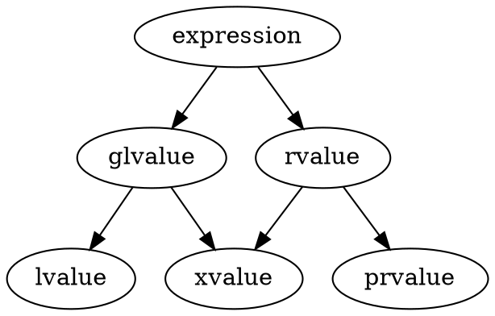

@import "../my-style.less"

#<center>Learning CXX</center>

<!-- @import "[TOC]" {cmd="toc" depthFrom=1 depthTo=6 orderedList=false} -->

<!-- code_chunk_output -->

- [Learning CXX](#centerlearning-cxxcenter)
  - [C++特性](#c特性)
    - [Pimpl Idiom](#pimpl-idiom)
    - [运行时多态-虚函数的虚指针和虚函数表](#运行时多态-虚函数的虚指针和虚函数表)
    - [模板](#模板)
      - [模板实例化和特化](#模板实例化和特化)
      - [隐式实例化](#隐式实例化)
        - [函数模板隐式实例化](#函数模板隐式实例化)
        - [类模板隐式实例化](#类模板隐式实例化)
      - [显式实例化](#显式实例化)
      - [函数模板调用方式](#函数模板调用方式)
      - [模板特化](#模板特化)
        - [函数模板特化](#函数模板特化)
        - [类模板特化](#类模板特化)
    - [C++ 类中使用dllimport和dllexport](#c-类中使用dllimport和dllexport)
    - [容器类](#容器类)
      - [顺序容器](#顺序容器)
      - [关联容器](#关联容器)
      - [无序关联容器](#无序关联容器)
      - [迭代器非法化](#迭代器非法化)
      - [容器适配器](#容器适配器)
          - [priority_queue](#priority_queue)
    - [c++ 关键词](#c-关键词)
      - [cv(const 和 volatile)类型限定符](#cvconst-和-volatile类型限定符)
  - [c++新特性](#c新特性)
    - [可变参数模板](#可变参数模板)
    - [std::function和std::bind](#stdfunction和stdbind)
      - [std::function](#stdfunction)
        - [介绍](#介绍)
        - [原型](#原型)
        - [用法](#用法)
      - [std::bind](#stdbind)
        - [介绍](#介绍-1)
    - [lambda函数](#lambda函数)
      - [多态lambda](#多态lambda)
    - [std::optional](#stdoptional)
    - [转发引用和完美转发](#转发引用和完美转发)
      - [值类别和变量类型](#值类别和变量类型)
        - [值类别](#值类别)
        - [变量类型](#变量类型)
        - [右值引用对纯右值的生命周期延长](#右值引用对纯右值的生命周期延长)
        - [表达式的左右值性与类型无关](#表达式的左右值性与类型无关)
      - [引用折叠](#引用折叠)
      - [转发引用](#转发引用)
      - [完美转发](#完美转发)
      - [std::forward](#stdforward)
      - [移动语义](#移动语义)
      - [std::move](#stdmove)
    - [常量表达式 constexpr](#常量表达式-constexpr)
    - [std::declval](#stddeclval)
    - [decltype 说明符](#decltype-说明符)
    - [多线程](#多线程)
      - [互斥Mutex](#互斥mutex)
      - [互斥对象管理类模板--锁Lock](#互斥对象管理类模板-锁lock)
      - [互斥对象管理类模板的加锁策略](#互斥对象管理类模板的加锁策略)
      - [条件变量](#条件变量)
      - [std::atomic](#stdatomic)
      - [std::future](#stdfuture)
    - [元编程(meta programming)](#元编程meta-programming)
      - [type traits（类型特性）](#type-traits类型特性)
      - [std::constexpr](#stdconstexpr)
      - [异相容器](#异相容器)
      - [std::variant](#stdvariant)
      - [元编程应用：](#元编程应用)
        - [c++ 反射实现：](#c-反射实现)
        - [通用类型安全转换函数](#通用类型安全转换函数)

<!-- /code_chunk_output -->
## C++特性
### Pimpl Idiom

c++通过将私有的部分包装成一个单独的类来限制外界的访问.一个'pimpl'就是一个指针用于隐藏类的私有成员.
```c++
// file x.h
class XIpml; //forward declaration
class X {
// public and protected members
private:
    class XImpl* pimpl_;
    // a pointer to a forward-declared class
};

// file x.cpp
struct XImpl {
// private members; fully hidden, can be
// changed at will without recompiling clients
};
```

这种方式的主要好处是打破了编译时依赖:
- 类成员定义在cpp文件中,不再被客户代码访问,这减少了额外的`#include`并加快了编译速度;
- 类的实现可能改变,这样私有的隐藏成员类可以自由的增减,不需要重新编译客户代码.

使用这个模式的代价是:
- 每次构造和析构需要分配和释放内存;
- 每次访问隐藏成员需要至少一次额外的重定向.

### 运行时多态-虚函数的虚指针和虚函数表
c++为了实现对象在运行时的动态调用函数使用了一种虚函数(vtable)的技术。
虚函数表是编译器在编译阶段为类分配的静态数组，每一个使用了虚函数的类都有自己的虚函数表，表中的存放的都是函数指针，指向该类访问的虚函数。
同时，编译器还添加一个指向vtable的指针，称之为vptr，vptr在创建实例时自动设置。vptr的设定和重置都由每个类的构造、析构和拷贝赋值运算符自动完成。

```c++
#include <iostream>
using namespace std;

typedef void (*Fun)();
class Base {
public:
  Base() {}
  virtual void fun1() { cout << "Base : fun1()" << endl; }
  virtual void fun2() { cout << "Base : fun2()" << endl; }
  virtual void fun3() { cout << "Base : fun3()" << endl; }
  ~Base() {}
};

/**
 * @brief
 * 获取vptr地址与func地址,vptr指向的是一块内存，这块内存存放的是虚函数地址，这块内存就是我们所说的虚表
 *
 */
class Derived : public Base {
public:
  Derived() {}
  void fun1() { cout << "Derived : fun1()" << endl; }
  void fun2() { cout << "Derived : fun2()" << endl; }
  void fun3() { cout << "Derived : fun3()" << endl; }
  void fun4() { cout << "Derived : fnu4()" << endl; }
  ~Derived() {}
};

Fun getAddr(void *obj, unsigned int offset) {
  cout << "====================" << endl;
  void *vptr_addr =
      (void *)*(unsigned long *)obj; // 64位操作系统，占8字节，通过*(unsigned
                                     // long *)obj取出前8字节，即vptr指针
  printf("vptr_addr:%p\n", vptr_addr);
  /**
   * @brief 通过vptr指针访问virtual table，
   * 因为虚表中每个元素(虚函数指针)在64位编译器下是8个字节，因此通过*(unsigned
   * long*)vptr_addr取出前8个字节，后面加上偏移量就是每个函数的地址！
   *
   */
  void *func_addr = (void *)*((unsigned long *)vptr_addr + offset);
  printf("func_addr:%p\n", func_addr);
  return (Fun)func_addr;
}

int main(void) {
  Base ptr;
  Derived d;
  Base *pt = new Derived();
  Base &pp = ptr;
  Base &p = d;
  cout << "基类对象直接调用" << endl;
  ptr.fun1();
  cout << "基类引用指向基类实例" << endl;
  pp.fun1();
  cout << "基类指针指向派生类实例并调用虚函数" << endl;
  pt->fun1();
  cout << "基类引用指向派生类实例并调用虚函数" << endl;
  p.fun1();

  /* 手动查找vptr和vtable */
  Fun f1 = getAddr(pt, 0);
  (*f1)();
  Fun f2 = getAddr(pt, 1);
  (*f2)();
  delete pt;
  Base *pt1 = new Derived(); // 基类指针指向派生类实例
  cout << "基类指针指向派生类实例并调用虚函数" << endl;
  pt1->fun1();
  return 0;
}
```

在getAddr函数中断点调试可以看到：
```c++
(gdb) p obj
$8 = (void *) 0x55555556aeb0
(gdb) x 0x55555556aeb0
0x55555556aeb0: 0x0000555555557cf0
(gdb) x 0x0000555555557cf0
0x555555557cf0 <_ZTV7Derived+16>:       0x00005555555556ac
(gdb) x 0x00005555555556ac
0x5555555556ac <Derived::fun1()>:       0xe5894855fa1e0ff3
(gdb) x 0x0000555555557cf8
0x555555557cf8 <_ZTV7Derived+24>:       0x00005555555556e8
(gdb) x 0x0000555555557d00
0x555555557d00 <_ZTV7Derived+32>:       0x0000555555555724
(gdb) x 0x00005555555556e8
0x5555555556e8 <Derived::fun2()>:       0xe5894855fa1e0ff3
(gdb) x 0x0000555555555724
0x555555555724 <Derived::fun3()>:       0xe5894855fa1e0ff3
(gdb) 
```
可以看到实例对象起始就存放着vptr指针，值为 0x0000555555557cf0，该值是虚函数表的起始地址.取出该地址存放的值，也是一个地址 0x00005555555556ac 。该地址就是 `Derived::fun1()`函数的地址。同理取虚函数表中的下一个地址，可以发现指向的就是`Derived::fun2()`。
### 模板
#### 模板实例化和特化

模板的实例化指函数模板(类模板)生成模板函数(模板类)的过程.对于函数模板而言,模板实例化之后,会生成一个真正的函数.而类模板经过实例化之后,只是完成了类的定义,模板类的成员函数需要到调用时才会被初始化.

#### 隐式实例化

在使用函数模板(类模板)时,没有相对应指定类型的模板函数(模板类)的实体时,由编译器根据调用的类型参数隐式生成模板函数(模板类)的实体即为模板的隐式实例化.

##### 函数模板隐式实例化

调用函数时,发现没有匹配的函数存在,编译器就会寻找同名函数模板,找到就对函数目标进行实例化.

还有一种简介调用函数的情况，也可以完成函数模板的实例化。所谓的简介调用是指将函数入口地址传给一个函数指针，通过函数指针完成函数调用。如果传递给函数指针不是一个真正的函数，那么编译器就会寻找同名的函数模板进行参数推演，进而完成函数模板的实例化。参考如下示例。

```c++
#include <iostream>
using namespace std;
template <typename T> void func(T t){
    cout<<t<<endl;
}

void invoke(void (*p)(int)){
    int num=10;
    p(num);
}
int main(){
    invoke(func);
}
```

##### 类模板隐式实例化

在使用模板类的地方才将模板实例化.

```c++
#include <iostream>
using namespace std;
template<typename T>class A{
    T num;
public:
    A(){
        num=T(6.6);
    }
    void print(){
        cout<<"A'num:"<<num<<endl;
    }
};

int main(){
    A<int> a; //显示模板实参的隐式实例化
    a.print();
}
```

#### 显式实例化

显式实例化又叫做外部实例化.在没有发生调用的情况下将函数模板(类模板)实例化.

对于函数模板而言,不管是否发生函数调用,都可以通过显示实例化将函数模板实例化,格式如下:

```c++
template return_type func<T>(argument_list)
//i.e
template void func<int>(const int&);
```

类模板显示实例化如下:

```c++
template class class_name<T>;
//i.e
template class class_name<int>;
```

#### 函数模板调用方式

在发生函数模板调用时,不指定参数类型而经过参数推演,称之为函数模板的隐式模板实参调用(隐式调用):

```c++
template<typename T> void func(T t)
{
    cout<<t<<endl;
}

func(5);
```

在发生函数模板调用时,显式给出模板参数而不需要经过参数推演,称之为函数模板的显式模板实参调用(显式调用):

```c++
#include <iostream>
using namespace std;
template <typename T> T Max(const T& t1,const T& t2){
    return (t1>t2)?t1:t2;
}

int main(){
    int i=5;
    //cout<<Max(i,'a')<<endl; //无法通过编译
    cout<<Max<int>(i,'a')<<endl; //显示调用，通过编译
}
```

使用模板实参的方式调用函数模板,可以提高代码的可读性,便于代码的理解和维护.

#### 模板特化

模板参数在某种特定类型下的具体实现称为模板的特化.模板的特化有时也被称为模板的具体化.

##### 函数模板特化

函数模板特化是在一个统一的函数模板不能在所有类型实例下正常工作时,需要定义的对应类型的函数模板的特定实现版本.如下:

```c++
#include <iostream>
using namespace std;

template<typename T> T Max(T t1,T t2){
    return (t1>t2)?t1:t2;
}

typedef const char* CCP;
template<> CCP Max<CCP>(CCP s1,CCP s2){
    return (strcmp(s1,s2)>0)?s1:s2;
}

int main(){
//调用实例：int Max<int>(int,int)
    int i=Max(10,5);
    //调用显示特化：const char* Max<const char*>(const char*,const char*)
    const char* p=Max<const char*>("very","good");
    cout<<"i:"<<i<<endl;
    cout<<"p:"<<p<<endl;
}
```

在函数模板特化定义(explicit specialization defintion)中,显示关键字 `template` 和一对`<>`.

除了函数模板特化外,还可以使用函数重载代替:

```c++
typedef const char* CCP;
CCP Max(CCP s1,CCP s2){
    return (strcmp(s1,s2)>0)?s1:s2;
}
```

二者的不同如下:

1. 如果使用普通重载函数,不论是否发生实际调用,都会在目标文件中生成该函数的二进制代码.而如果使用函数模板的特化,除非发生调用,否则不会在目标文件中包含特化模板函数的二进制代码.这也符合函数模板的"惰性实例化"准则.
2. 如果使用普通重载函数,那么在分离编译模式下,应该在各个源文件中包含重载函数的声明,否则在某些源文件中就会使用模板函数,而不是重载函数.

##### 类模板特化

类模板的特化可以细分为全特化和偏特化:

- 全特化就是模板中的模板参数全被指定为确定的类型.
- 偏特化就是模板中的模板参数没有全部确定,需要编译器在编译时进行确定.

类全特化类似于函数模板特化.代码如下:

```c++
#include <iostream>
using namespace std;

template<typename T>class A{
    T num;
public:
    A(){
        num=T(6.6);
    }
    void print(){
        cout<<"A'num:"<<num<<endl;
    }
};

template<>class A<char*>{
    char* str;
public:
    A(){
        str="A' special definition ";
    }
    void print(){
        cout<<str<<endl;
    }
};

int main(){
    A<int> a1;      //显示模板实参的隐式实例化
    a1.print();
    A<char*> a2;    //使用特化的类模板
    A2.print();
}
```

类偏特化类似如下:

```c++
template <class T1,class T2>
class Date
{
public:
    Date()
    {
        cout<<"Date(T1,T2)"<<endl;
    }
private:
    T1 t1;
    T2 t2;
};
template <class T1>
class Date<T1,int>//偏特化
{
public:
    Date()
    {
        cout<<"Date(T1,int)"<<endl;
    }
private:
    T1 t1;
    int t2;
};
```

该模板有两个类型，特化其中一个类型为 int，那么在实例化的时候，只要第二个参数是 int 类型的，都会去调用这个特化后的模板。
特化除了可以特化指定模板参数的基本类型,还可以特化指定模板参数为引用,指针类型.也可以特化为另一个类模板.

```c++
template <class _Iterator>
struct iterator_traits {
  typedef typename _Iterator::iterator_category iterator_category;
  typedef typename _Iterator::value_type        value_type;
  typedef typename _Iterator::difference_type   difference_type;
  typedef typename _Iterator::pointer           pointer;
  typedef typename _Iterator::reference         reference;
};

// specialize for _Tp*
template <class _Tp>
struct iterator_traits<_Tp*> {
  typedef random_access_iterator_tag iterator_category;
  typedef _Tp                         value_type;
  typedef ptrdiff_t                   difference_type;
  typedef _Tp*                        pointer;
  typedef _Tp&                        reference;
};

// specialize for const _Tp*
template <class _Tp>
struct iterator_traits<const _Tp*> {
  typedef random_access_iterator_tag iterator_category;
  typedef _Tp                         value_type;
  typedef ptrdiff_t                   difference_type;
  typedef const _Tp*                  pointer;
  typedef const _Tp&                  reference;
};
```

至于引用特化可以参考上面的[remove_reference](#stdremove_reference).

特化为我们自定义的模板类类型:

```c++
// specialize for any template class type
template <class T1>
struct SpecializedType
{
    T1 x1;
    T1 x2;
};
template <class T>
class Compare<SpecializedType<T> >
{
public:
    static bool IsEqual(const SpecializedType<T>& lh, const SpecializedType<T>& rh)
    {
        return Compare<T>::IsEqual(lh.x1 + lh.x2, rh.x1 + rh.x2);
    }
};
```


### C++ 类中使用dllimport和dllexport

在Windows平台下，编译动态库时：
您可以使用dllimport或dllexport属性声明C++类。这些形式意味着导入或导出整个类。以这种方式导出的类称为可导出类。
以下示例定义可导出的类。导出其所有成员函数和静态数据：
```c++
#ifdef DLLEXPORT
#define _DLL_DECLARE_ declspec(dllexport)
#else
#define _DLL_DECLARE_ declspec(dllimport)

class _DLL_DECLARE_ Math
{
public:
      double Add(double a, double b);
      double Sub(double a, double b);
};
```
请注意，禁止在可导出类的成员上显式使用 dllimport 和 dllexport 属性。
**dllexport类**
声明类dllexport时，将导出其所有成员函数和静态数据成员。您必须在同一程序中提供所有此类成员的定义。否则，将生成链接器错误。此规则的一个例外适用于纯虚函数，您无需为其提供显式定义。但是，因为抽象类的析构函数总是由基类的析构函数调用，所以纯虚拟析构函数必须始终提供定义。请注意，这些规则对于不可导出的类是相同的。

如果导出类类型的数据或返回类的函数，请确保导出该类。

**dllimport类**
声明类dllimport时，将导入其所有成员函数和静态数据成员。与dllimport和dllexport在非类类型上的行为不同，静态数据成员不能在定义dllimport类的同一程序中指定定义。

**继承和可导出的类**
可导出类的所有基类都必须是可导出的。如果不是，则生成编译器警告。此外，所有可访问的成员也必须是可导出的。该规则允许DLLEXPORT类从继承dllimport的类和dllimport的类从继承DLLEXPORT类（但不建议后者）。通常，DLL调用者可访问的所有内容（根据C ++访问规则）应该是可导出接口的一部分。这包括内联函数中引用的私有数据成员。

**选择成员导入/导出**
由于类中的成员函数和静态数据隐式具有外部链接，因此可以使用dllimport或dllexport属性声明它们，除非导出整个类。如果导入或导出整个类，则禁止将成员函数和数据显式声明为dllimport或dllexport。如果将类定义中的静态数据成员声明为dllexport，则定义必须出现在同一程序中的某个位置（与非类外部链接一样）。

同样，您可以使用dllimport或dllexport属性声明成员函数。在这种情况下，您必须在同一程序中的某处提供dllexport定义。

值得注意的是有关选择性成员导入和导出的几个要点：

- 选择性成员导入/导出最适用于提供限制性更强的导出类接口的版本; 也就是说，您可以设计一个DLL，该DLL暴露的公共和私有功能比该语言允许的更少。它对于微调可导出接口也很有用：当您知道调用者（根据定义）无法访问某些私有数据时，您无需导出整个类。

- 如果在类中导出一个虚函数，则必须导出所有虚函数，或者至少提供调用者可以直接使用的版本。

- 如果您有一个使用虚拟函数选择性成员导入/导出的类，则这些函数必须位于可导出接口中或内联定义（对客户端可见）。

- 如果将成员定义为dllexport但未将其包含在类定义中，则会生成编译器错误。您必须在类标头中定义该成员。

- 虽然允许将类成员定义为dllimport或dllexport，但是不能覆盖类定义中指定的接口。

- 如果在声明它的类定义主体之外的位置定义成员函数，则在函数定义为dllexport或dllimport时生成警告（如果此定义与类声明中指定的定义不同）。

### 容器类
容器库是类模板与算法的汇集，允许程序员简单地访问常见数据结构，例如队列、链表和栈。有三类容器——顺序容器、关联容器和无序关联容器——每种都被设计为支持不同组的操作。
容器管理为其元素分配的存储空间，并提供直接或间接地通过迭代器（拥有类似指针属性的对象）访问它们的函数。
大多数容器拥有至少几个常见的成员函数，并共享功能。特定应用的最佳容器不仅依赖于提供的功能，还依赖于对于不同工作量的效率。
#### 顺序容器
顺序容器实现能按顺序访问的数据结构

|容器类|描述|
|:-|:-|
|array (C++11)|静态的连续数组(类模板)|
|vector|动态的连续数组(类模板)|
|deque|双端队列(类模板)
|forward_list(C++11)|单链表(类模板)|
|list|双链表(类模板)|
|basic_string|string是typedef std::basic_string<char>(类模板)|


- **array**是封装固定大小数组的容器，支持下标访问元素。
- **vector**的存储时自动管理的，按需扩张收缩。vector通常占用多于静态数组的空间，以便将来增长的数组。vector 所用的方式不在每次插入元素时，而只在额外内存耗尽时重分配。分配的内存总量可用 capacity() 函数查询。重分配通常是性能上有开销的操作。若元素数量已知，则 reserve() 函数可用于消除重分配。vector操作复杂度：
- - 随机访问——常数O(1);
- - 在末尾插入或删除元素——均摊常数O(1)；
- - 插入或移除元素——与末尾的距离成线性O(n)，因为是连续的内存，删除元素，需要将后面的元素统一向前移位。
- **deque**是有下标的顺序容器，可以在首尾快速删除或插入。deque的元素是不相邻的。存储时自动扩展和收缩。扩展deque比扩展vector更优，因为它不涉及复制既存元素到新的内存位置。另一方面，deque拥有较大的最小内存开销；只保有一个元素的 deque 必须分配其整个内部数组（例如 64 位 libstdc++ 上为对象大小 8 倍； 64 位 libc++ 上为对象大小 16 倍或 4096 字节的较大者）。
- - 随机访问——常数 O(1)
- - 在结尾或起始插入或移除元素——常数 O(1)
- - 插入或移除元素——线性 O(n)
- **forward_list** 是支持从容器中的任何位置快速插入和移除元素的容器。不支持快速随机访问。它实现为单链表，且实质上与其在 C 中实现相比无任何开销。与 std::list 相比，此容器在不需要双向迭代时提供更有效地利用空间的存储。
- **list** 是支持常数时间从容器任何位置插入和移除元素的容器。不支持快速随机访问。它通常实现为双向链表。与 std::forward_list 相比，此容器提供双向迭代但在空间上效率稍低。在 list 内或在数个 list 间添加、移除和移动元素不会非法化迭代器或引用。迭代器仅在对应元素被删除时非法化。
- **basic_string** 在c++17以后是连续空间存储的，以前并没有保证。

#### 关联容器
关联容器实现能快速查找（ O(log n) 复杂度）的数据结构。
|容器类|描述|
|:-|:-|
|set|唯一键的集合，按照键排序(类模板)|
|map|键值对的集合，按照键排序，键是唯一的(类模板)|
|multiset|键的集合，按照键排序(类模板)|
|multimap|键值对的集合，按照键排序(类模板)|

- std::set 是关联容器，含有 Key 类型对象的已排序集。用比较函数 比较 (Compare) 进行排序。搜索、移除和插入拥有对数复杂度。 set 通常以红黑树实现。
- td::map 是有序键值对容器，它的元素的键是唯一的。用比较函数 Compare 排序键。搜索、移除和插入操作拥有对数复杂度。 map 通常实现为红黑树。
- std::multiset 是含有 Key 类型对象有序集的容器。不同于 set ，它允许多个key拥有等价的值。用关键比较函数 Compare 进行排序。搜索、插入和移除操作拥有对数复杂度。
- multimap 是关联容器，含有键值对的已排序列表，同时容许多个元素拥有同一键。按照应用到键的比较函数 Compare 排序。搜索、插入和移除操作拥有对数复杂度。拥有等价键的键值对的顺序就是插入顺序，且不会更改。(C++11 起)

#### 无序关联容器
无序关联容器提供能快速查找（均摊 O(1) ，最坏情况 O(n) 的复杂度）的无序（哈希）数据结构。

|容器类|描述|
|:-|:-|
|unordered_set(C++11 起)|唯一键的集合，按照键生成散列(类模板)|
|unordered_map(C++11 起)|键值对的集合，按照键生成散列，键是唯一的(类模板)|
|unordered_multiset(C++11 起)|键的集合，按照键生成散列(类模板)|
|unordered_multimap(C++11 起)|键值对的集合，按照键生成散列(类模板)|

- unordered_set 是含有 Key 类型唯一对象集合的关联容器。搜索、插入和移除拥有平均常数时间复杂度。在内部，元素并不以任何特别顺序排序，而是组织进桶中。元素被放进哪个桶完全依赖其值的哈希。这允许对单独元素的快速访问，因为哈希一旦确定，就准确指代元素被放入的桶。不可修改容器元素（即使通过非 const 迭代器），因为修改可能更改元素的哈希，并破坏容器。
- unordered_map 是关联容器，含有带唯一键的键-值 pair 。搜索、插入和元素移除拥有平均常数时间复杂度。元素在内部不以任何特定顺序排序，而是组织进桶中。元素放进哪个桶完全依赖于其键的哈希。这允许对单独元素的快速访问，因为一旦计算哈希，则它准确指代元素所放进的桶。
- unordered_multiset 是关联容器，含有可能非唯一 Key 类型对象的集合。搜索、插入和移除拥有平均常数时间复杂度。元素在内部并不以任何顺序排序，只是被组织到桶中。元素被放入哪个桶完全依赖其值的哈希。这允许快速访问单独的元素，因为一旦计算哈希，它就指代放置该元素的准确的桶。
- unordered_multimap 是无序关联容器，支持等价的关键（一个 unordered_multimap 可含有每个关键值的多个副本）和将关键与另一类型的值关联。 unordered_multimap 类支持向前迭代器。搜索、插入和移除拥有平均常数时间复杂度。元素在内部不以任何特定顺序排序，而是组织到桶中。元素被放进哪个桶完全依赖于其关键的哈希。这允许到单独元素的快速访问，因为哈希一旦计算，则它指代元素被放进的准确的桶。
#### 迭代器非法化
只读方法决不非法化迭代器或引用。修改容器内容的方法可能非法化迭代器和/或引用，总结于此表格。

<table class="wikitable" style="font-size:0.8em; line-height:1em; text-align: center;">
<tr>
<th rowspan="2"> 类别
</th>
<th rowspan="2"> 容器
</th>
<td colspan="2"> <b>插入</b>后……
</td>
<td colspan="2"> <b>擦除</b>后……
</td>
<th rowspan="2"> 条件
</th></tr>
<tr>
<td> <b>迭代器</b>合法？
</td>
<td> <b>引用</b>合法？
</td>
<td> <b>迭代器</b>合法？
</td>
<td> <b>引用</b>合法？
</td></tr>
<tr>
<th rowspan="8"> 顺序容器
</th>
<th> <a href="container/array.html" title="cpp/container/array"><tt>array</tt></a>
</th>
<td colspan="2" style="background: #ececec; color: grey; vertical-align: middle; text-align: center;" class="table-na"> <small>N/A</small>
</td>
<td colspan="2" style="background: #ececec; color: grey; vertical-align: middle; text-align: center;" class="table-na"> <small>N/A</small>
</td>
<td>
</td></tr>
<tr>
<th rowspan="3"> <a href="container/vector.html" title="cpp/container/vector"><tt>vector</tt></a>
</th>
<td colspan="2" style="background:#ff9090; color:black; vertical-align: middle; text-align: center;" class="table-no"> 否
</td>
<td colspan="2" style="background: #ececec; color: grey; vertical-align: middle; text-align: center;" class="table-na"> <small>N/A</small>
</td>
<td> 插入更改容量
</td></tr>
<tr>
<td colspan="2" style="background: #90ff90; color: black; vertical-align: middle; text-align: center;" class="table-yes">是
</td>
<td colspan="2" style="background: #90ff90; color: black; vertical-align: middle; text-align: center;" class="table-yes">是
</td>
<td> 被修改元素前
</td></tr>
<tr>
<td colspan="2" style="background:#ff9090; color:black; vertical-align: middle; text-align: center;" class="table-no"> 否
</td>
<td colspan="2" style="background:#ff9090; color:black; vertical-align: middle; text-align: center;" class="table-no"> 否
</td>
<td> 于被修改元素或其后
</td></tr>
<tr>
<th rowspan="2"> <a href="container/deque.html" title="cpp/container/deque"><tt>deque</tt></a>
</th>
<td rowspan="2" style="background:#ff9090; color:black; vertical-align: middle; text-align: center;" class="table-no"> 否
</td>
<td style="background: #90ff90; color: black; vertical-align: middle; text-align: center;" class="table-yes">是
</td>
<td colspan="2" style="background: #ffff90; color: black; vertical-align: middle; text-align: center;" class="table-maybe">是，除了被擦除元素
</td>
<td> 修改首或尾元素
</td></tr>
<tr>
<td style="background:#ff9090; color:black; vertical-align: middle; text-align: center;" class="table-no"> 否
</td>
<td colspan="2" style="background:#ff9090; color:black; vertical-align: middle; text-align: center;" class="table-no"> 否
</td>
<td> 仅修改中部
</td></tr>
<tr>
<th> <a href="container/list.html" title="cpp/container/list"><tt>list</tt></a>
</th>
<td colspan="2" style="background: #90ff90; color: black; vertical-align: middle; text-align: center;" class="table-yes">是
</td>
<td colspan="2" style="background: #ffff90; color: black; vertical-align: middle; text-align: center;" class="table-maybe">是，除了被擦除元素
</td>
<td>
</td></tr>
<tr>
<th> <a href="container/forward_list.html" title="cpp/container/forward list"><tt>forward_list</tt></a>
</th>
<td colspan="2" style="background: #90ff90; color: black; vertical-align: middle; text-align: center;" class="table-yes">是
</td>
<td colspan="2" style="background: #ffff90; color: black; vertical-align: middle; text-align: center;" class="table-maybe">是，除了被擦除元素
</td>
<td>
</td></tr>
<tr>
<th> 关联容器
</th>
<th> <a href="container/set.html" title="cpp/container/set"><tt>set</tt></a>
<p><a href="container/multiset.html" title="cpp/container/multiset"><tt>multiset</tt></a>
</p><p><a href="container/map.html" title="cpp/container/map"><tt>map</tt></a>
</p><p><a href="container/multimap.html" title="cpp/container/multimap"><tt>multimap</tt></a>
</p>
</th>
<td colspan="2" style="background: #90ff90; color: black; vertical-align: middle; text-align: center;" class="table-yes">是
</td>
<td colspan="2" style="background: #ffff90; color: black; vertical-align: middle; text-align: center;" class="table-maybe">是，除了被擦除元素
</td>
<td rowspan="1">
</td></tr>
<tr>
<th rowspan="2"> 无序关联容器
</th>
<th rowspan="2"> <a href="container/unordered_set.html" title="cpp/container/unordered set"><tt>unordered_set</tt></a>
<p><a href="container/unordered_multiset.html" title="cpp/container/unordered multiset"><tt>unordered_multiset</tt></a>
</p><p><a href="container/unordered_map.html" title="cpp/container/unordered map"><tt>unordered_map</tt></a>
</p><p><a href="container/unordered_multimap.html" title="cpp/container/unordered multimap"><tt>unordered_multimap</tt></a>
</p>
</th>
<td style="background:#ff9090; color:black; vertical-align: middle; text-align: center;" class="table-no"> 否
</td>
<td rowspan="2" style="background: #90ff90; color: black; vertical-align: middle; text-align: center;" class="table-yes">是
</td>
<td colspan="2" style="background: #ececec; color: grey; vertical-align: middle; text-align: center;" class="table-na"> <small>N/A</small>
</td>
<td> 插入导致重哈希
</td></tr>
<tr>
<td style="background: #90ff90; color: black; vertical-align: middle; text-align: center;" class="table-yes">是
</td>
<td colspan="2" style="background: #ffff90; color: black; vertical-align: middle; text-align: center;" class="table-maybe">是，除了被擦除元素
</td>
<td> 无重哈希
</td></tr></table>

**线程安全**
- 能同时在不同容器上由不同线程调用所有容器函数。更广泛而言， C++ 标准库函数不读取能通过其他线程访问的对象，除非这些对象能直接或间接地经由函数参数，包含 this 指针访问。
- 能同时在同一容器上由不同线程调用 const 成员函数。而且，成员函数 begin() 、 end(), rbegin() 、 rend() 、 front() 、 back() 、 data() 、 find() 、 lower_bound() 、 upper_bound() 、 equal_range() 、 at() 和除了关联容器中的 operator[] 对于线程安全的目标表现如同 const （即它们亦能同时在同一容器上由不同线程调用）。更广泛而言， C++ 标准库函数不修改对象，除非这些对象能直接或间接地经由函数参数，包含 this 指针访问。
- 同一容器中不同元素能由不同线程同时修改，除了 std::vector<bool> 的元素（例如， std::future 对象的 vector 能从多个线程接收值）。
- 迭代器操作（例如自增迭代器）读但不修改底层容器，而且能与同一容器上的其他迭代器操作同时由 const 成员函数执行。非法化任何迭代器的容器操作修改容器，且不能与任何在既存迭代器上的操作同时执行，即使这些迭代器未被非法化。
- 同一容器上的元素可以同时由不指定为访问这些元素的函数修改。更广泛而言， C++ 标准库函数不间接读取能从其参数访问的对象（包含容器的其他对象），除非其规定要求如此。
- 任何情况下，容器操作（还有算法，或其他 C++ 标准库函数）可于内部并行化，只要不更改用户可见的结果（例如 std::transform 可并行化，但指定了按顺序观览序列的每个元素的 std::for_each 不行）

#### 容器适配器
|容器|特性|
|:-|:-|
|stack|栈，LIFO|
|queue|队列，FIFO|
|priority_queue|A priority queue is a container adaptor that provides constant time lookup of the largest (by default) element, at the expense of logarithmic insertion and extraction.|

###### priority_queue
```c++
template<
    class T,
    class Container = std::vector<T>,
    class Compare = std::less<typename Container::value_type>
> class priority_queue;
```

**Template parameters**
- `T` The type of the stored elements. The behavior is undefined if T is not the same type as Container::value_type. (since C++17)
- `Container`	The type of the underlying container to use to store the elements. The container must satisfy the requirements of SequenceContainer, and its iterators must satisfy the requirements of LegacyRandomAccessIterator. Additionally, it must provide the following functions with the usual semantics:
    - front()
    - push_back()
    - pop_back()
The standard containers std::vector and std::deque satisfy these requirements.

- `Compare`	A Compare type providing a strict weak ordering.
Note that the Compare parameter is defined such that it returns true if its first argument comes before its second argument in a weak ordering. But because the priority queue outputs largest elements first, the elements that "come before" are actually output last. That is, the front of the queue contains the "last" element according to the weak ordering imposed by Compare.

```c++
#include <functional>
#include <queue>
#include <vector>
#include <iostream>
 
template<typename T>
void print_queue(T q) { // NB: pass by value so the print uses a copy
    while(!q.empty()) {
        std::cout << q.top() << ' ';
        q.pop();
    }
    std::cout << '\n';
}
 
int main() {
    std::priority_queue<int> q;
 
    const auto data = {1,8,5,6,3,4,0,9,7,2};
 
    for(int n : data)
        q.push(n);
 
    print_queue(q);
 
    std::priority_queue<int, std::vector<int>, std::greater<int>>
        q2(data.begin(), data.end());
 
    print_queue(q2);
 
    // Using lambda to compare elements.
    auto cmp = [](int left, int right) { return (left ^ 1) < (right ^ 1); };
    std::priority_queue<int, std::vector<int>, decltype(cmp)> q3(cmp);
 
    for(int n : data)
        q3.push(n);
 
    print_queue(q3);
}
```
输出：
```shell
9 8 7 6 5 4 3 2 1 0 
0 1 2 3 4 5 6 7 8 9 
8 9 6 7 4 5 2 3 0 1
```

### c++ 关键词
#### cv(const 和 volatile)类型限定符
- const对象：一个const限定的对象，或const对象的non-mutable子对象。这样的对象不能被修改：直接修改会出现编译错误，间接修改会导致未定义行为（通过对非从const类型的引用或指针修改const对象）。
- volatile对象：一个volatile限定的对象，或volatile对象的子对象，亦或const-volatile对象的mutable子对象。对volatile限定类型的左值表达式的访问（read or write operation, member function call, etc）都显式的不会被编译器优化（也就是说，在单个执行线程中，volatile 访问不能被优化或重新排序，而另一个可见的副作用是在 volatile 访问之前排序或在 volatile 访问之后排序。 这使得 volatile 对象适合与信号处理程序通信，但不适用于另一个执行线程，请参阅 std::memory_order）。任何通过非volatile类型对volatile对象的左值引用或指针都会导致未定义行为。
- const-volatile对象：一个const-volatile限定的对象，一个const-volatile对象的non-mutable子对象，一个volatile对象的const子对象，或一个const对象的non-mutable volatile子对象。行为兼具const和volatile对象。

**mutable说明符**：允许修改声明为 mutable 的类成员，即使包含对象声明为 const。
可能出现在非引用非 const 类型的非静态类成员的声明中：
```c++
class X {
  mutable const int* p;         // OK
  mutable int* const q;         // ill-formed
  mutable int&       r;         // ill-formed
};
```
Mutable 用于指定成员不影响类的外部可见状态（通常用于互斥锁、备忘录缓存、惰性求值和访问检测）。
```c++
class ThreadsafeCounter {
  mutable std::mutex m; // The "M&M rule": mutable and mutex go together
  int data = 0;
 public:
  int get() const {
    std::lock_guard<std::mutex> lk(m);
    return data;
  }
  void inc() {
    std::lock_guard<std::mutex> lk(m);
    ++data;
  }
};
```
```c++
int main()
{
    int n1 = 0;           // non-const object
    const int n2 = 0;     // const object
    int const n3 = 0;     // const object (same as n2)
    volatile int n4 = 0;  // volatile object
    const struct
    {
        int n1;
        mutable int n2;
    } x = {0, 0};      // const object with mutable member
 
    n1 = 1; // ok, modifiable object
//  n2 = 2; // error: non-modifiable object
    n4 = 3; // ok, treated as a side-effect
//  x.n1 = 4; // error: member of a const object is const
    x.n2 = 4; // ok, mutable member of a const object isn't const
 
    const int& r1 = n1; // reference to const bound to non-const object
//  r1 = 2; // error: attempt to modify through reference to const
    const_cast<int&>(r1) = 2; // ok, modifies non-const object n1
 
    const int& r2 = n2; // reference to const bound to const object
//  r2 = 2; // error: attempt to modify through reference to const
//  const_cast<int&>(r2) = 2; // undefined behavior: attempt to modify const object n2
}
```
## c++新特性

### 可变参数模板

可变参数模板是一个接受可变参数的模板函数或模板类,在模板参数列表中,typename...指出接下来的参数可以表示 0 或者多个类型,一个类型名后面跟省略号表示 0 个或多个给定类型的非类型参数的列表.

可变数目的参数被称为参数包(parameter package).存在两种参数包:模板参数包(template parameter package);函数参数包(function parameter package).

通过 sizeof...运算符.我们可以知道保存有多少个元素,且不会对其实参求值.

```c++
class A
{
    template<typename ...Args>
    A(Args&&...args);
}
template <typename ... Args>
void g(Args ... args)
{
    // 类型参数的数目
    cout << sizeof...(Args) << endl;
    // 函数参数的数目
    cout << sizeof...(args) << endl;
    //参数
    A(std::forward<Args>(args)...);
}
```
### std::function和std::bind

C++11提供了std::function和std::bind两个工具，用于引用可调用对象。这些可调用对象包括 普通函数，Lambda表达式，类的静态成员函数，非静态成员函数以及仿函数等。引用可调用对象，可以用于回调，抽象，以及延迟调用等多种场景。
#### std::function
##### 介绍
类模版std::function是一种通用、多态的函数封装。std::function的实例可以对任何可以调用的目标实体进行存储、复制、和调用操作，这些目标实体包括普通函数、Lambda表达式、函数指针、以及其它函数对象等。std::function对象是对C++中现有的可调用实体的一种类型安全的包裹（我们知道像函数指针这类可调用实体，是类型不安全的）。

通常std::function是一个函数对象类，它包装其它任意的函数对象，被包装的函数对象具有类型为T1, …,TN的N个参数，并且返回一个可转换到R类型的值。std::function使用 模板转换构造函数接收被包装的函数对象；特别是，闭包类型可以隐式地转换为std::function。std::function统一和简化了相同类型可调用实体的使用方式，使得编码变得更简单。

**最简单的理解就是：**
通过std::function对C++中各种可调用实体（普通函数、Lambda表达式、函数指针、以及其它函数对象等）的封装，形成一个新的可调用的std::function对象；让我们不再纠结那么多的可调用实体。一切变的简单粗暴。
##### 原型
```c++
template< class R, class... Args >
class function<R(Args...)>
```
R是返回值类型，Args是函数的参数类型，实例一个std::function对象很简单，就是将可调用对象的返回值类型和参数类型作为模板参数传递给std::function模板类。实例化比如：
```c++
std::function<void()> f1;
std::function<int (int , int)> f2;
```
##### 用法
std::function包含于头文件 #include中，可将各种可调用实体进行封装统一，包括

- 普通函数
- lambda表达式
- 函数指针
- 仿函数(functor 重载括号运算符实现)
- 类成员函数
- 静态成员函数

```c++
#include <iostream>
#include <functional>
 
using namespace std;
 
std::function<bool(int, int)> fun;
//普通函数
bool compare_com(int a, int b)
{
    return a > b;
}
//lambda表达式
auto compare_lambda = [](int a, int b){ return a > b;};
//函数对象类
class compare_class
{
public:
    bool operator()(int a, int b)
    {
        return a > b;
    }   
};
//类成员函数
class compare
{
public:
    bool compare_member(int a, int b)
    {
        return a > b;
    }
    static bool compare_static_member(int a, int b)
    {
        return a > b;
    }
};
int main()
{
    bool result;
    fun = compare_com;
    result = fun(10, 1);
    cout << "普通函数输出, result is " << result << endl;
 
    fun = compare_lambda;
    result = fun(10, 1);
    cout << "lambda表达式输出, result is " << result << endl;
 
    fun = compare_class();
    result = fun(10, 1);
    cout << "函数对象类输出, result is " << result << endl;
 
    fun = compare::compare_static_member;
    result = fun(10, 1);
    cout << "类静态成员函数输出, result is " << result << endl;
 
    // 类普通成员函数比较特殊，需要使用bind函数，并且需要实例化对象，成员函数要加取地址符
    compare temp;
    fun = std::bind(&compare::compare_member, temp, std::placeholders::_1, std::placeholders::_2);
    result = fun(10, 1);
    cout << "类普通成员函数输出, result is " << result << endl;
}
```

#### std::bind
##### 介绍
std::bind函数将可调用对象(用法中所述6类)和可调用对象的参数进行绑定，返回新的可调用对象(std::function类型，参数列表可能改变)，返回的新的std::function可调用对象的参数列表根据bind函数实参中std::placeholders::_x从小到大对应的参数确定。
实例如下：
```c++
#include <iostream>
using namespace std;
class A
{
public:
    void fun_3(int k,int m)
    {
        cout<<k<<" "<<m<<endl;
    }
};
 
void fun(int x,int y,int z)
{
    cout<<x<<"  "<<y<<"  "<<z<<endl;
}
 
void fun_2(int &a,int &b)
{
    a++;
    b++;
    cout<<a<<"  "<<b<<endl;
}
 
int main(int argc, const char * argv[])
{
    auto f1 = std::bind(fun,1,2,3); //表示绑定函数 fun 的第一，二，三个参数值为： 1 2 3
    f1(); //print:1  2  3
 
    auto f2 = std::bind(fun, placeholders::_1,placeholders::_2,3);
    //表示绑定函数 fun 的第三个参数为 3，而fun 的第一，二个参数分别有调用 f2 的第一，二个参数指定
    f2(1,2);//print:1  2  3
 
    auto f3 = std::bind(fun,placeholders::_2,placeholders::_1,3);
    //表示绑定函数 fun 的第三个参数为 3，而fun 的第一，二个参数分别有调用 f3 的第二，一个参数指定
    //注意： f2  和  f3 的区别。
    f3(1,2);//print:2  1  3
 
 
    int n = 2;
    int m = 3;
 
    auto f4 = std::bind(fun_2, n,placeholders::_1);
    f4(m); //print:3  4
 
    cout<<m<<endl;//print:4  说明：bind对于不事先绑定的参数，通过std::placeholders传递的参数是通过引用传递的
    cout<<n<<endl;//print:2  说明：bind对于预先绑定的函数参数是通过值传递的
 
 
    A a;
    auto f5 = std::bind(&A::fun_3, a,placeholders::_1,placeholders::_2);
    f5(10,20);//print:10 20
 
    std::function<void(int,int)> fc = std::bind(&A::fun_3, a,std::placeholders::_1,std::placeholders::_2);
    fc(10,20);//print:10 20
 
    return 0;
}
```

### lambda函数
```c++
auto func=[](){}
auto func=[=](){} //绑定外部变量，copy
auto func=[&](){} //绑定外部变量，引用
auto a=1;
auto b="guijiyang"
auto func=[&,b](){} //绑定外部变量，a引用，b复制绑定
//lambda函数默认是const,对于复制绑定变量更改，需要再lambda函数后显示添加mutable
auto func=[a]() mutable{
    a++;
} 
```
所有的lambda函数都有自己的类型，就算内容完全一致，所有不能将一个lambda函数赋于另一个lambda函数，需要使用std::function绑定
```c++
auto func = std::function<void(int)>{};
// Assign a lambda without capture to the std::function object
func = [](int v) { std::cout << v; };
// or
auto func=std::function<void(int)>{[](int v){std::cout<<v;}}
```
需要注意`std::function`绑定的lambda函数有捕获变量或引用时，`std::function`在大多数情况下会在堆上面分配所需的空间存储这些捕获对象。分配堆空间和堆空间分配导致缓存未命中，将使性能略有下降，并且`std::function`的执行速度会下降。
`std::function`比lambda的执行时的代码多，所以会略慢一些。

#### 多态lambda
```c++
auto v=3;
auto lambda = [&](auto v1,auto v2){return v+v1*v2;}
```
多态lambda和普通的lambda类似，只是`operator()`被定义为成员函数模板。转换成类，类似如下的代码：
```c++
class Lambda{
    Lambda(int& v):v_{v}{}
    template<typename T0,typename T1>
    auto operator()(T0 v1,T1 v2){return this.v_+v1*v2;}

    private:
    int& v_{};
}

auto v=3;
auto lambda = Lambda{v};
```
需要注意，捕获值是不能作为模板变量的，只有函数参数可以。调用也比较简单：
```c++
auto va=lambda(1,2);
auto vf=lambda(1.0f,2.0f);
```
编译器将会生成类似如下的代码：
```c++
auto lambda_int = [v](int v0, const int v1) { return v + v0*v1; };
auto lambda_float = [v](float v0, float v1) { return v + v0*v1; };
auto res_int = lambda_int(1, 2);
auto res_float = lambda_float(1.0f, 2.0f)
```

### std::optional
```c++
// Defined in header <optional>
template< class T >
class optional;     // (since C++17)
```
该函数模板用于存放不确定存在的值，如下所示：
```c++
#include <string>
#include <functional>
#include <iostream>
#include <optional>
 
// optional can be used as the return type of a factory that may fail
std::optional<std::string> create(bool b) {
    if (b)
        return "Godzilla";
    return {};
}
 
// std::nullopt can be used to create any (empty) std::optional
auto create2(bool b) {
    return b ? std::optional<std::string>{"Godzilla"} : std::nullopt;
}
 
// std::reference_wrapper may be used to return a reference
auto create_ref(bool b) {
    static std::string value = "Godzilla";
    return b ? std::optional<std::reference_wrapper<std::string>>{value}
             : std::nullopt;
}
 
int main()
{
    std::cout << "create(false) returned "
              << create(false).value_or("empty") << '\n';
 
    // optional-returning factory functions are usable as conditions of while and if
    if (auto str = create2(true)) {
        std::cout << "create2(true) returned " << *str << '\n';
    }
 
    if (auto str = create_ref(true)) {
        // using get() to access the reference_wrapper's value
        std::cout << "create_ref(true) returned " << str->get() << '\n';
        str->get() = "Mothra";
        std::cout << "modifying it changed it to " << str->get() << '\n';
    }
}
```
### 转发引用和完美转发

在说转发引用(forwarding reference)和完美转发(perfect forwarding)之前,首先需要了解值类别(value categories)和变量类型(variable types)

#### 值类别和变量类型
##### 值类别


上图展示了 c++的值类别

- 一个 `lvalue`是通常可以放在等号左边的表达式(左值);

- `glvalue` 是其求值确定一个对象,位域或函数的个体的表达式(范左值);
- `prvalue` 是求值符合下列之一的表达式(纯右值):
- - 某个运算符计算的结果值.
- - 初始化某个对象或位域.
- `xvalue` 是代表其资源能够被重新使用的对象或位域的范左值(将亡值).
- `rvalue` 是纯右值或者将亡值(右值).

左值是有标识符,可以取地址的表达式,最常见的情况有:

- 变量,函数或数据成员;
- 返回左值引用的表达式;
  如++x,x=1,cout<<''

- 字符串字面值是左值,而且是不可被更改的左值。字符串字面值并不具名，但是可以用&取地址所以也是左值。
- 如果一个表达式的类型是一个 lvalue reference (例如, `T&` 或 `const T&`, 等.)，那这个表达式就是一个 lvalue。

纯右值是没有标识符、不可以取地址的表达式，一般也称之为“临时对象”。最常见的情况有：

- 返回非引用类型的表达式或者函数.
  如 x++,x+1
- 除字符串字面量之外的字面量如 42、true

将亡值(xvalue):

- 返回类型为对象的右值引用的函数调用或重载运算符表达式，例如 std::move(x)。

```c++
int && f(){ return 3;}
int main()
{
    f();
    std::move(7); 
    return 0;
}
```

- 对对象类型右值引用的类型转换

```c++
int main()
{
    static_cast<int&&>(7); // The expression static_cast<int&&>(7) belongs to the xvalue category, because it is a cast to an rvalue reference to object type.
    return0;
}
```

- 类成员访问表达式,指定非引用类型的非静态数据成员,其中对象表达式是 xvalue.

```c++
struct As
{
    int i;
};

As&& f(){
    return As();
}

int main()
{
    f().i; // The expression f().i belongs to the xvalue category, because As::i is a non-static data member of non-reference type, and the subexpression f() belongs to the xvlaue category.

    return 0;
}
```

C++11 中：
- 拥有标识符且不可被移动的表达式被称作左值 (lvalue)表达式；
- 拥有标识符且可被移动的表达式被称作亡值 (xvalue)表达式；
- 不拥标识符份且可被移动的表达式被称作纯右值 (prvalue)表达式；
- 不拥标识符份且不可被移动的表达式无法使用。
- 拥有标识符的表达式被称作“泛左值 (glvalue) 表达式”。左值和亡值都是泛左值表达式。
- 可被移动的表达式被称作“右值 (rvalue) 表达式”。纯右值和亡值都是右值表达式。

C++17 中，某些场合强制要求进行复制消除，而这要求将纯右值表达式从被它们所初始化的临时对象中分离出来，这就是我们现有的系统。要注意，**与 C++11 的方案相比，纯右值已不再是可被移动**。

##### 变量类型
变量类型主要有普通变量和引用变量，这里不介绍普通变量，引用变量可以分为左值引用和右值引用：
```c++
// 左值引用
T & ref = target ;
T & ref = { arg1, arg2, ... };
T & ref ( target );
T & ref { arg1, arg2, ... };
// 右值引用
T && ref = target ;
T && ref = { arg1, arg2, ... };
T && ref ( target );
T && ref { arg1, arg2, ... };
```

##### 右值引用对纯右值的生命周期延长
为了方便对临时对象的使用，C++ 对临时对象有特殊的生命周期延长规则。这条规则是：如果一个 `prvalue` 被绑定到一个右值引用上，它的生命周期则会延长到跟这个引用变量一样长。**注意，const 左值引用亦能延长临时对象生存期，但无法修改引用对象**

```c++
#include <iostream>
#include <string>
 
int main() {
    std::string s1 = "Test";
//  std::string&& r1 = s1;           // error: can't bind to lvalue
 
    const std::string& r2 = s1 + s1; // okay: lvalue reference to const extends lifetime
//  r2 += "Test";                    // error: can't modify through reference to const
 
    std::string&& r3 = s1 + s1;      // okay: rvalue reference extends lifetime
    r3 += "Test";                    // okay: can modify through reference to non-const
    std::cout << r3 << '\n';
}
```

**生命周期延长规则只对 `prvalue` 有效,而对 `xvalue` 无效**
```c++
result &&r = std::move(process_shape(circle(), triangle()));
```
输出结果回到无延长的结果。

C++ 会把即将离开作用域的非引用类型的返回值当成纯右值，如函数返回非引用值。C++ 17 要求编译器对纯右值 (prvalue, pure rvalue) 进行拷贝省略优化。

##### 表达式的左右值性与类型无关

值类别(value category)和变量类型(variable type)是两个不相干的术语.前者指的是上面的左值,右值的概念,后者则是与引用类型相对而言的,表明一个变量是代表实际数值,还是引用另一个数值.在 c++中所有原生类型、枚举、结构、联合、类都代表值,只有引用和指针才是引用.在 Python 中一切类型都是引用类型.

一个表达式的左值性(`lvalueness`)或者右值性(`rvalueness`)和它的值类型无关.
如 `lvalue` 的 `int` 变量和 `rvalue` 的 `int`(字面值 10).或者一个 `Widget` 对象 `lvalue`(`Widget` 变量),`rvalue`(`Widget` 构造函数返回值).

表达式的类型不会告诉你它到底是个`lvalue`还是`rvalue`。因为表达式的 `lvalueness` 或 `rvalueness` 独立于它的类型，我们就可以有一个 `lvalue`，但它的类型确是 `rvalue reference`，也可以有一个 `rvalue reference` 类型的 `rvalue` :
```c++
Widget makeWidget();                       // factory function for Widget
 
Widget&& var1 = makeWidget()               // var1 is an lvalue, but
                                           // its type is rvalue reference (to Widget)
 
Widget var2 = static_cast<Widget&&>(var1); // the cast expression yields an rvalue, but
                                           // its type is rvalue reference  (to Widget)
```
#### 引用折叠 
C++11 引入了一个叫做引用折叠(reference collapsing)的规则来处理某些像模板实例化这种情况下带来的"引用的引用"的问题。
```c++
typedef int&  lref;
typedef int&& rref;
int n;
lref&  r1 = n; // type of r1 is int&
lref&& r2 = n; // type of r2 is int&
rref&  r3 = n; // type of r3 is int&
rref&& r4 = 1; // type of r4 is int&&
```
因为有两种类型的引用 (lvalue references 和 rvalue references)，那"引用的引用"就有四种可能的组合: lvalue reference to lvalue reference, lvalue reference to rvalue reference, rvalue reference to lvalue reference, 以及 rvalue reference to rvalue reference。

引用折叠只有两条规则:

- `rvalue reference` 一个 `rvalue reference` 会变成一个 `rvalue reference`。
- 所有其他种类的引用的引用都会折叠为 `lvalue reference`。

引用折叠是转发的基础。

#### 转发引用
转发引用可以绑定到任何变量类型上,如果一个变量或者参数被声明为 `T&&` ,其中 T 是被推导的类型,那这个变量或参数就是一个 `forwarding reference`.

几乎所有的 `forwarding reference` 都是函数模板的参数：
- 函数模板的函数参数声明为对同一函数模板的 cv 非限定类型模板参数的右值引用：

对于 `forwarding reference` 是左值还是右值引用，取决于引用初始化，使用左值初始化就是左值引用,右值亦然。

```c++
template<typename T>
void f(T&& param);

int a;
f(a);  //这时候是左值引用
f(1); //这时候是右值引用
```

注意<font color=red>只有在发生类型推导时 `&&` 才代表 forwarding reference</font>

```c++
template<typename T>
void f(T&& t);  //deduce T type ,forwarding reference

template<typename T>
class Widget {
    Widget(Widget&& rhs); // fully specified parameter type-> no type deduce, rvalue reference
};

template<typename T1>
class Gadget {
    template<typename T2>
    gadget(T2&&rhs); //deduced parameter type->type dedcue, forwarding reference
};

void f(Widget&& param);  //fully specified parameter type -> no type deduce, rvalue reference
```

```c++
template<typename T>
class Widget {
    ...
    Widget(Widget&& rhs);        // rhs’s type is rvalue reference,
    ...                          // but rhs itself is an lvalue
};

template<typename T1>
class Gadget {
    ...
    template <typename T2>
    Gadget(T2&& rhs);            // rhs is a forwarding reference whose type will
    ...                          // eventually become an rvalue reference or
};                               // an lvalue reference, but rhs itself is an lvalue
```

在 `Widget` 的构造函数当中, `rhs` 是一个 `rvalue reference`,右值引用只能绑定右值,所以我们需要调用该构造函数时需要传递一个右值给它,但是 rhs 本身是一个左值,所以当我们想要用到这个被绑定在 rhs 上的 `rvalue` 的 `rvalueness` 的时候,我们就需要把 rhs 转换成一个 `rvalue`。之所以我们想要这么做，是因为我们想将它作为一个移动操作的 source，这就是为什么我们用 `std::move` 将它转换回一个 `rvalue` 。

类似地，`Gadget` 构造函数当中的 rhs 是一个 `forwarding reference`，所以它可能绑定到一个 lvalue 或者 `rvalue` 上，但是无论它被绑定到什么东西上，rhs 本身还是一个 `lvalue` 。

如果它被绑定到一个 `rvalue` 并且我们想利用这个 `rvalue` 的 `rvalueness` ， 我们就要重新将 rhs 转换回一个 `rvalue` 。如果它被绑定到一个 `lvalue` 上，当然我们就不想把它当做 `rvalue` 。
实现转发引用的原因就在于变量初始化时候可能出现的引用折叠。
在对一个 `forwarding reference` 的模板参数进行类型推导时候，同一个类型的 lvalues 和 rvalues 被推导为稍微有些不同的类型。具体来说，类型 T 的 lvalues 被推导为 T&(i.e., lvalue reference to T)，而类型 T 的 rvalues 被推导为 T。(注意，虽然 lvalue 会被推导为 `lvalue reference`，但 rvalues 却不会被推导为 rvalue references!) 我们来看下分别用 rvalue 和 lvalue 来调用一个接受 `forwarding reference` 的模板函数时会发生什么:

```c++
template<typename T>
void f(T&& param);
int x;
f(10);                           // invoke f on rvalue
f(x);                            // invoke f on lvalue
```

当用 `rvalue` 10 调用 f 的时候, T 被推导为 `int`，实例化的 f 看起来像这样:

```c++
void f(int&& param);             // f instantiated from rvalue
```

这里一切都没问题。但是当我们用 `lvalue` x 来调用 f 的时候，T 被推导为 `int&`，而实例化的 f 就包含了一个引用的引用:

```c++
void f(int& && param);           // initial instantiation of f with lvalue
```

这块应用了引用折叠。在用 lvalue 实例化 f 时，应用这两条规则，会生成下面的合法代码，编译器就是这样处理这个函数调用的:

```c++
void f(int& param);              // instantiation of f with lvalue after reference collapsing
```


所以对于 `template <typename T> foo(T&&)`这样的代码。

- 如果传递过去的参数是左值，T 的推导结果是左值引用，那 T&& 的结果仍然是左值引用——即 T& && 坍缩成了 T&
- 如果传递过去的参数是右值，T 的推导结果是参数类型本身。那 T&& 的结果自然就是一个右值引用。

还有一种转发引用，使用auto&&推导，如下所示。
```c++
template<class T>
int f(T&& x) {                    // x is a forwarding reference
    return g(std::forward<T>(x)); // and so can be forwarded
}
 
int main() {
    int i;
    f(i); // argument is lvalue, calls f<int&>(int&), std::forward<int&>(x) is lvalue
    f(0); // argument is rvalue, calls f<int>(int&&), std::forward<int>(x) is rvalue
}
 
template<class T>
int g(const T&& x); // x is not a forwarding reference: const T is not cv-unqualified
 
template<class T> struct A {
    template<class U>
    A(T&& x, U&& y, int* p); // x is not a forwarding reference: T is not a
                             // type template parameter of the constructor,
                             // but y is a forwarding reference
};

auto&& vec = foo();       // foo() may be lvalue or rvalue, vec is a forwarding reference
auto i = std::begin(vec); // works either way
(*i)++;                   // works either way
g(std::forward<decltype(vec)>(vec)); // forwards, preserving value category
```
#### 完美转发
什么是 完美转发 (perfect forwarding)：
- 如果参数是 左值引用，直接以 左值引用 的形式，转发给下一个函数
- 如果参数是 右值引用，要先 “还原” 为 右值引用 的形式，再转发给下一个函数

在转发引用的调用std::forward，可以实现对函数参数的完美转发。
#### std::forward

在分析`std::forward()`之前，先看看`remove_reference`，下面是`remove_reference`的实现：
```c++
//Defined in header <type_traits>
template<typename T>
struct remove_reference
{
    typedef T type;
}
template<typename T>
struct remove_reference<T&>
{
    typedef T type;
}
template<typename T>
struct remove_reference<T&&>
{
    typedef T type;
}
```
`remove_reference`的作用是去除T中的引用部分，只获取其中的类型部分。无论T是左值还是右值，最后只获取它的类型部分。


用来实现完美转发:

1. 转发左值

```c++
//Defined in header <utility>
template<typename T>
constexpr T&& forward(typename std::remove_reference<T>::type& t) noexcept
{
    return static_cast<T&&>(t);
}
```

先获得类型 type，定义 t 为左值引用的左值变量，通过 static_cast 进行强制转换。T&&会发生引用折叠，当 T 推导为左值引用，则折叠为 T& &&，即 T&. 当 T 推导为右值引用，则为本身 T&&,所以 froward 返回值与 static_cast 处都为 T&&。

2. 转发右值

```c++
template<typename T>
constexpr T&& forward(typename std::remove_reference<T>::type&& t) noexcept
{
    static_assert(!std::is_lvalue_reference<T>::value,"template argument substituting _Tp is an lvalue reference type");
    return static_cast<T&&>(t);
}
```

不同与转发左值，t 为右值引用的左值变量，除此之外中间加了一个断言，表示当不是左值的时候，也就是右值，才进行 static_cast 转换。

```c++
#include <iostream>
#include <memory>
#include <utility>

struct A {
    A(int&& n) { std::cout << "rvalue overload, n=" << n << "\n"; }
    A(int& n)  { std::cout << "lvalue overload, n=" << n << "\n"; }
};

class B {
    public:
        template<class T1, class T2, class T3>
        B(T1&& t1, T2&& t2, T3&& t3) :
            a1_{std::forward<T1>(t1)},
            a2_{std::forward<T2>(t2)},
            a3_{std::forward<T3>(t3)}
        {
        }

    private:
        A a1_, a2_, a3_;
};

template<class T, class U>
std::unique_ptr<T> make_unique1(U&& u)
{
    return std::unique_ptr<T>(new T(std::forward<U>(u)));
}

template<class T, class... U>
std::unique_ptr<T> make_unique2(U&&... u)
{
    return std::unique_ptr<T>(new T(std::forward<U>(u)...));
}

int main()
{
    auto p1 = make_unique1<A>(2); // 右值
    int i = 1;
    auto p2 = make_unique1<A>(i); // 左值

    std::cout << "B\n";
    auto t = make_unique2<B>(2, i, 3);
}
```
输出：
```shell
rvalue overload, n=2
lvalue overload, n=1
B
rvalue overload, n=2
lvalue overload, n=1
rvalue overload, n=3
```

<font color=rgb(0,0,0)>一个绑定到 `forwarding reference` 上的对象可能具有 `lvalueness` 或者 `rvalueness`</font>，正是因为有这种二义性，所以催生了 `std::forward`: 如果一个本身是 `lvalue` 的 forwarding reference 如果绑定在了一个 `rvalue` 上面，`std::forward`就把它重新转换为 rvalue。函数的名字 `forward` 的意思就是，我们希望在传递参数的时候，可以保存参数原来的 `lvalueness` 或 `rvalueness`，即是说把参数转发给另一个函数。

#### 移动语义
将一个对象资源移动到另一个对象，通常使用std::move实现资源的转移。转移之后，访问原对象的资源是未定义的。
#### std::move

将输入参数转变为右值(确切的说是将亡值).

```c++
template<typename T>
constexpr typename std::remove_reference_t<T>::type&& move(T&& t)
{
    return static_cast<typename std::remove_reference<T>::type&&>(t);
}
```
最后，std::move()/std::forward() 只是编译时的变量类型转换，不会产生目标代码。
### 常量表达式 constexpr

c++中,我们通常使用 const 来表示常量,这种常量指的是运行期间常量.然后我们需要编译期间的常量性,这是 const 关键字无法保证的.如下的例子

```c++
const int GetConst(){return 1;}

int main()
{
    int arr[GetConst()]={0}; //无法通过编译
    enum{e1=GetConst(), e2}; //无法通过编译

    int cond=1;
    switch(cond)
    {
        case GetConst(): //无法通过编译
            break;
        default:
            break;
    }
}
```

当然可以通过定义宏代替 GetConst 函数。但是这个办法是过于原始，有很多缺点。c++11 中对编译期间的常量可以使用 constexpr。
constexpr 说明符声明在编译的阶段可以确定变量或者函数的值.这样的函数(提供了合适的函数参数)或变量然后能用于在编译期间需要常量表达式的地方.

- 一个 constexpr 说明符用于对象申明或非静态成员函数声明(c++14 前)暗示了这是一个常量或常量函数.
- 一个 constexpr 用于函数或静态成员变量声明(c++17 起)暗含 inline.如果任何函数或函数模板的声明含有 constexpr 说明符,然后每个声明必须包含那个说明符.

一个 constexpr 变量需要满足:

- 类型必须是字面类型(LiteralType).
- 必须即时初始化.
- 其初始化的完整表达式,包含所有的隐式转换,构造函数调用等,必须是常量表达式.

一个 constexpr 函数需要满足:

- 必须非虚(c++20 前);
- 必须不是协程(since C++20);
- 返回类型必须是字面类型;
- 所有参数必须是字面类型;
- 用于构造函数和析构函数(c++20 起),该类必须没有虚基类.
- 至少存在一组函数实参值,这样函数的调用可作为核心常量表达式(Core constant expressions)的子表达式(c++14 起).
- 其函数体必须不是 try 函数块(untile c++20).

```c++
#include <iostream>
#include <stdexcept>

// C++11 constexpr 函数使用递归而非迭代
// （C++14 constexpr 函数可使用局部变量和循环）
constexpr int factorial(int n)
{
    return n <= 1? 1 : (n * factorial(n - 1));
}

// 字面类
class conststr {
    const char* p;
    std::size_t sz;
public:
    template<std::size_t N>
    constexpr conststr(const char(&a)[N]): p(a), sz(N - 1) {}

    // constexpr 函数通过抛异常来提示错误
    // C++11 中，它们必须用条件运算符 ?: 这么做
    constexpr char operator[](std::size_t n) const
    {
        return n < sz ? p[n] : throw std::out_of_range("");
    }
    constexpr std::size_t size() const { return sz; }
};

// C++11 constexpr 函数必须把一切放在单条 return 语句中
// （C++14 无此要求）
constexpr std::size_t countlower(conststr s, std::size_t n = 0,
                                             std::size_t c = 0)
{
    return n == s.size() ? c :
           'a' <= s[n] && s[n] <= 'z' ? countlower(s, n + 1, c + 1) :
                                        countlower(s, n + 1, c);
}

// 输出要求编译时常量的函数，用于测试
template<int n>
struct constN
{
    constN() { std::cout << n << '\n'; }
};

int main()
{
    std::cout << "4! = " ;
    constN<factorial(4)> out1; // 在编译时计算

    volatile int k = 8; //  volatile不允许使用缓存优化
    std::cout << k << "! = " << factorial(k) << '\n'; // 运行时计算

    std::cout << "the number of lowercase letters in \"Hello, world!\" is ";
    constN<countlower("Hello, world!")> out2; // 隐式转换到 conststr
}
```
### std::declval

获取非求值语境中的某个引用.

```c++
#include<utility>
template<class T>
inline typename std::add_rvalue_reference<T>::type declval() noexcept
{
    static_assert(__declval_protector<T>::__stop, "declval() must not be used!");
    return __declval_protector<T>::__delegate();
}
```

将任意类型 T 转换成引用类型,使得在 decltype 表达式中不必经过构造函数就能使用其成员函数.通常在模板中使用 declval,这些模板接受的参数可能没有通常的构造函数,但是有成员函数,需要获取函数的返回值类型.
<font color=red>注意 declval 只能用于非求值语境,且不要求有定义;求值包含此函数的表达式将是错误.</font>

### decltype 说明符

检查实体的声明类型,或表达式的类型和值类别.

```c++
decltype (entity)
decltype (expression)
```

- 如果参数是某个无括号id表达式或某个无括号类成员访问表达式,则 decltype 产生以此表达式命名的实体的类型.若无这种实体,或该实参指名某个重载函数,则程序非良构.
    - 如果参数是指名某个结构化绑定的无括号的id表达式,则 decltype 产生引用的类型.(c++17 起);

    - 如果参数是指名某个非类型模板参数的无括号id表达式,则 decltype 产生模板的参数类型.(c++20 起).
- 若实参是其他类型为`T`的任何表达式,且:
   a) 若值类型为将亡值,则 decltype 产生`T&&`;
   b) 若值类型为左值,则 decltpye 产生`T&`;
   c) 若值类型是纯右值,则 decltype 产生`T`.

请注意，如果对象的名称带有括号，则将其视为普通的左值表达式，因此 decltype(x) 和 decltype((x)) 通常是不同的类型。

decltype 在声明难以或不可能使用标准表示法声明的类型时很有用，例如与 lambda 相关的类型或依赖于模板参数的类型。

```c++
#include <utility>
#include <iostream>

struct Default { int foo() const { return 1; } };

struct NonDefault
{
    NonDefault() = delete;
    int foo() const { return 1; }
};

int main()
{
    decltype(Default().foo()) n1 = 1;                   // n1 的类型是 int
//  decltype(NonDefault().foo()) n2 = n1;               // 错误：无默认构造函数
    decltype(std::declval<NonDefault>().foo()) n2 = n1; // n2 的类型是 int
    std::cout << "n1 = " << n1 << '\n'
              << "n2 = " << n2 << '\n';
}
```
```c++
#include <iostream>
#include <type_traits>
 
struct A { double x; };
const A* a;
 
decltype(a->x) y;       // type of y is double (declared type)
decltype((a->x)) z = y; // type of z is const double& (lvalue expression)
 
template<typename T, typename U>
auto add(T t, U u) -> decltype(t + u) // return type depends on template parameters
                                      // return type can be deduced since C++14
{
    return t + u;
}
 
const int& getRef(const int* p) { return *p; }
static_assert(std::is_same_v<decltype(getRef), const int&(const int*)>);
auto getRefFwdBad(const int* p) { return getRef(p); }
static_assert(std::is_same_v<decltype(getRefFwdBad), int(const int*)>,
    "Just returning auto isn't perfect forwarding.");
decltype(auto) getRefFwdGood(const int* p) { return getRef(p); }
static_assert(std::is_same_v<decltype(getRefFwdGood), const int&(const int*)>,
    "Returning decltype(auto) perfectly forwards the return type.");
 
// Alternatively:
auto getRefFwdGood1(const int* p) -> decltype(getRef(p)) { return getRef(p); }
static_assert(std::is_same_v<decltype(getRefFwdGood1), const int&(const int*)>,
    "Returning decltype(return expression) also perfectly forwards the return type.");
 
int main()
{
    int i = 33;
    decltype(i) j = i * 2;
 
    std::cout << "i and j are the same type? " << std::boolalpha
              << std::is_same_v<decltype(i), decltype(j)> << '\n';
 
    std::cout << "i = " << i << ", "
              << "j = " << j << '\n';
 
    auto f = [](int a, int b) -> int
    {
        return a * b;
    };
 
    decltype(f) g = f; // the type of a lambda function is unique and unnamed
    i = f(2, 2);
    j = g(3, 3);
 
    std::cout << "i = " << i << ", "
              << "j = " << j << '\n';
}
```
输出：
```shell
i and j are the same type? true
i = 33, j = 66
i = 4, j = 9
```
### 多线程
#### 互斥Mutex
互斥限制了多线程下对共享资源的同时访问，防止了数据竞速并使线程保证同步。
|类名|作用|
|:-:|:-|
|`std::mutex` (C++11)|最简单的互斥对象|
|`std::timed_mutex` (C++11)|带有超时机制的互斥对象，允许等待一段时间或直到某个时间点仍未能获得互斥对象的所有权时放弃等待。|
|`std::recursive_mutex` (C++11)|允许同一个线程递归lock和unlock|
|`std::recursive_timed_mutex` (C++11)|带有超时机制的递归互斥对象|
|`std::shared_mutex` (C++17)|允许多个线程共享的所有权的互斥对象，如读写锁|
|`std::shared_timed_mutex` (C++14)|带有超时机制的共享所有权的互斥对象|

#### 互斥对象管理类模板--锁Lock
互斥对象提供了`lock`和`unlock`成员函数用于在线程中加减锁。然而如果线程在执行到加减锁之间抛出异常，则会导致其他线程都会被阻塞在加锁操作上。或者当函数开始时对互斥对象进行`lock`，然而这个函数有多个分支，则需要对每个分支返回前都调用互斥对象`unlock`，否则将导致死锁。
为了解决这种死锁的情况，C++使用RAII(Resource Acquisition Is Initialization)来自动管理资源。
|类模板|作用|
|:-:|:-|
|`std::lock_guard` (C++11)|严格基于作用域(scope-based)的锁管理类模板，构造时是否加锁是可选的(不加锁时假定当前线程已经获得锁的所有权)，析构时自动释放锁，所有权不可转移，对象生存期内不允许手动加锁和释放锁。|
|`std::scoped_lock` (C++17)|创建 `scoped_lock` 对象时，它试图取得给定所有的互斥，构造时是否加锁是可选的，离开创建 `scoped_lock` 对象的作用域时，析构 `scoped_lock` 并以逆序释放互斥。若给出数个互斥，则使用免死锁算法，如同使用 `std::lock`， `scoped_lock` 类不可复制。|
|`std::unique_lock` (C++11)|更加灵活的锁管理类模板，构造时是否加锁是可选的，在对象析构时如果持有锁会自动释放锁，所有权可以转移。对象生命期内允许手动加锁和释放锁。|
|`std::shared_lock` (C++14)|用于管理可转移和共享所有权的互斥对象。|

#### 互斥对象管理类模板的加锁策略
前面提到`std::lock_guard`、`std::scoped_lock`、`std::unique_lock`和`std::shared_lock`类模板在构造时是否加锁是可选的，C++11提供了3种加锁策略。
|策略|tag type|效果|
|:-:|:-|:-|
|默认|无|请求lock，阻塞当前线程直到获得lock|
|std::defer_lock|std::defer_lock_t|不请求锁。|
|std::try_to_lock|std::try_to_lock_t|尝试请求锁，但不阻塞线程，锁不可用时也会立即返回。|
|std::adopt_lock|std::adopt_lock_t|假定当前线程已经获得互斥对象的所有权，所以不再请求锁。|

`unique_lock`用例：
```c++
#include <mutex>
#include <thread>
#include <chrono>
 
struct Box {
    explicit Box(int num) : num_things{num} {}
 
    int num_things;
    std::mutex m;
};
 
void transfer(Box &from, Box &to, int num)
{
    // don't actually take the locks yet
    std::unique_lock<std::mutex> lock1(from.m, std::defer_lock);
    std::unique_lock<std::mutex> lock2(to.m, std::defer_lock);
 
    // lock both unique_locks without deadlock
    std::lock(lock1, lock2);
 
    from.num_things -= num;
    to.num_things += num;
 
    // 'from.m' and 'to.m' mutexes unlocked in 'unique_lock' dtors
}
 
int main()
{
    Box acc1(100);
    Box acc2(50);
 
    std::thread t1(transfer, std::ref(acc1), std::ref(acc2), 10);
    std::thread t2(transfer, std::ref(acc2), std::ref(acc1), 5);
 
    t1.join();
    t2.join();
}
```
`scoped_lock`用例：
```c++
std::scoped_lock lock(e1.m, e2.m);
 
// Equivalent code 1 (using std::lock and std::lock_guard)
// std::lock(e1.m, e2.m);
// std::lock_guard<std::mutex> lk1(e1.m, std::adopt_lock);
// std::lock_guard<std::mutex> lk2(e2.m, std::adopt_lock);

// Equivalent code 2 (if unique_locks are needed, e.g. for condition variables)
// std::unique_lock<std::mutex> lk1(e1.m, std::defer_lock);
// std::unique_lock<std::mutex> lk2(e2.m, std::defer_lock);
// std::lock(lk1, lk2);
```

#### 条件变量
|定义在头文件`<condition_variable>`|
|:-|
|class condition_variable (c++11)|

`condition_variable` 类是同步原语，能用于阻塞一个线程，或同时阻塞多个线程，直至另一线程修改共享变量（条件）并通知 `condition_variable` 。

有意修改线程共享的变量必须:
- 获得 `std::mutex` （常通过 `std::lock_guard` ）
- 在保有锁时进行修改
- 在 `std::condition_variable` 上执行 `notify_one` 或 `notify_all` （不需要为通知保有锁，此时如果没有释放，理论上会导致唤醒的线程获取不到锁，然而实际上大部分实现都预料到这种情况，在通知调用中，直接从条件变量队列转移等待线程到互斥队列，而不唤醒它，以避免此“通知并等待”场景）

即便共享变量是原子操作，也必须在互斥下修改，为了保证正确的向等待线程通知变更。

任何线程等待于`condition_variable`需要：
- 获取`std::unique_lock<std::mutex>`，是保护共享变量的同样的互斥量；
- 执行以下：
- - 检查条件，防止共享变量已经更新和通知了；
- - 执行`wait`、`wait_for`或`wait_until`。等待操作自动释放获取的互斥并暂停当前线程的执行；
- - 当条件变量通知了、超时了，或者虚伪唤醒，等待线程将被唤醒，互斥会自动重新获取。线程随后检查条件并在虚假唤醒是重新恢复等待。
- - 或者使用 wait 、 wait_for 及 wait_until 的有谓词重载，它们包揽以上三个步骤。

`std::condition_variable` 只可与 `std::unique_lock<std::mutex>` 一同使用；此限制在一些平台上允许最大效率。 `std::condition_variable_any` 提供可与任何基本可锁定 (BasicLockable) 对象，例如 `std::shared_lock` 一同使用的条件变量。

`condition_variable` 容许 `wait` 、 `wait_for` 、 `wait_until` 、 `notify_one` 及 `notify_all` 成员函数的同时调用。

类 std::condition_variable 是标准布局类型 (StandardLayoutType) 。它不可以使用复制构造 (CopyConstructible) 、可移动构造 (MoveConstructible) 、可复制赋值 (CopyAssignable) 或可移动赋值 (MoveAssignable) 。

#### std::atomic

`std::atomic`模板用来实现原子操作。
```c++
//Defined in header <atomic>
#include <atomic>
template<class T>
struct atomic;  //since c++11

template<class U>
struct atomic<U*>; //since c++11

//Defined in header <memory>
template<class U>
struct atomic<std::shared_ptr<U>>; //since c++20

template<class U>
struct atomic<std::weak_ptr<U>>; //since c++20
```

对`std::atomic`模板的实例化和全特化都定义一个原子类型。这样当一个线程写，另一个线程读原子对象时不会导致数据冲突。
另外，当访问原子对象时可以建立线程间同步，并按照std::memory_order来排序顺序非原子内存访问。
`std::atomic`不可拷贝和移动。

#### std::future
std::future提供了异步获取结果的方法：
- 异步操作（通过 std::async、std::packaged_task 或 std::promise 创建）可以向该异步操作的创建者提供 std::future 对象。
- 然后，异步操作的创建者可以使用各种方法从 std::future 中查询、等待或提取值。 如果异步操作尚未提供值，这些方法可能会阻塞。
- 当异步操作准备好向创建者发送结果时，它可以通过修改链接到创建者的 std::future 的共享状态（例如 std::promise::set_value）来做到这一点。
```c++
#include <iostream>
#include <future>
#include <thread>
 
int main()
{
    // future from a packaged_task
    std::packaged_task<int()> task([]{ return 7; }); // wrap the function
    std::future<int> f1 = task.get_future();  // get a future
    std::thread t(std::move(task)); // launch on a thread
 
    // future from an async()
    std::future<int> f2 = std::async(std::launch::async, []{ return 8; });
 
    // future from a promise
    std::promise<int> p;
    std::future<int> f3 = p.get_future();
    std::thread( [&p]{ p.set_value_at_thread_exit(9); }).detach();
 
    std::cout << "Waiting..." << std::flush;
    f1.wait();
    f2.wait();
    f3.wait();
    std::cout << "Done!\nResults are: "
              << f1.get() << ' ' << f2.get() << ' ' << f3.get() << '\n';
    t.join();
}
```
输出：
```shell
Waiting...Done!
Results are: 7 8 9
```
```c++
#include <thread>
#include <iostream>
#include <future>
 
int main()
{
    std::promise<int> p;
    std::future<int> f = p.get_future();
 
    std::thread t([&p]{
        try {
            // code that may throw
            throw std::runtime_error("Example");
        } catch(...) {
            try {
                // store anything thrown in the promise
                p.set_exception(std::current_exception());
            } catch(...) {} // set_exception() may throw too
        }
    });
 
    try {
        std::cout << f.get();
    } catch(const std::exception& e) {
        std::cout << "Exception from the thread: " << e.what() << '\n';
    }
    t.join();
}
```
输出：
```shell
Exception from the thread: Example
```

### 元编程(meta programming)
通常的c++代码是用于直接生成字节码，而元编程的代码使用在生成通用的c++代码，再由c++代码生成字节码。元编程最大的用处就在于实现通用的库。
元编程最常见的用法就是使用template生成可以接受不同的参数的类和函数。
#### type traits（类型特性）
类型特性类别有两种：
- 返回一个bool值或者int值来表明type的信息，这种特性接后缀 `_v`或`::value`；
- 返回一个新的type，这种接后缀`_t`或`::type`。
```c++
#include<type_traits>
#include<algorithm>
#include<vector>
auto main()->int {
    // auto i =sizeof(std::string);
    auto same_type = std::is_same_v<uint8_t, unsigned char>;
    auto flt = 0.3f;
    auto is_float_or_double = std::is_floating_point_v<decltype(flt)>;
    class Parent {};
    class Child : public Parent {};
    class Infant {};
    static_assert(std::is_base_of_v<Parent, Child>, "Child is a child of Parent");
    static_assert(!std::is_base_of_v<Parent, Infant>, "Infant is not a child of Parent");

    using remove_ptr = std::remove_pointer_t<int*>;
    using ptr_type = std::add_pointer_t<int>;
    auto vec = std::vector<int>{1,2,3};
    namespace ranges = std::ranges;
    std::find(vec.begin(), vec.end(), 1);
    return 0;
}
```

前面用到的`std::remove_reference_t`也是一种特性。
变量可以通过decltype获取到其类型。
```c++
template <typename Range>
auto to_vector(const Range & r) {
    using IteratorType = decltype(r.begin());
    using ReferenceType = decltype(*IteratorType());
    using ValueType = std::decay_t<ReferenceType>;
    return std::vector<ValueType>(r.begin(), r.end());
}
```
这里的`std::decay_t`定义如下：
```c++
template <class _Tp>
struct  decay
{
private:
    typedef  typename remove_reference<_Tp>::type _Up;
public:
    typedef  typename __decay<_Up, __is_referenceable<_Up>::value>::type type;
};

template <class _Tp> using decay_t = typename decay<_Tp>::type;
```
Applies lvalue-to-rvalue, array-to-pointer, and function-to-pointer implicit conversions to the type T, removes cv-qualifiers, and defines the resulting type as the member typedef type. Formally:

- If T names the type "array of U" or "reference to array of U", the member typedef type is U*.
- Otherwise, if T is a function type F or a reference thereto, the member typedef type is std::add_pointer<F>::type.
- Otherwise, the member typedef type is std::remove_cv<std::remove_reference<T>::type>::type.

**std::integral_constant**
```c++
#include<type_traits>
template< class T, T v >
struct integral_constant;
```
std::integral_constant wraps a static constant of specified type. It is the base class for the C++ type traits.

The behavior of a program that adds specializations for integral_constant is undefined.
```c++
#include <type_traits>
 
int main() 
{
    typedef std::integral_constant<int, 2> two_t;
    typedef std::integral_constant<int, 4> four_t;
 
//  static_assert(std::is_same<two_t, four_t>::value,
//                "two_t and four_t are not equal!"); 
//  error: static assertion failed: "two_t and four_t are not equal!"
 
    static_assert(two_t::value*2 == four_t::value,
       "2*2 != 4"
    );
 
    enum class my_e { e1, e2 };
 
    typedef std::integral_constant<my_e, my_e::e1> my_e_e1;
    typedef std::integral_constant<my_e, my_e::e2> my_e_e2;
 
    static_assert(my_e_e1() == my_e::e1);
 
//  static_assert(my_e_e1::value == my_e::e2,
//               "my_e_e1::value != my_e::e2");
//  error: static assertion failed: "my_e_e1::value != my_e::e2"
 
    static_assert(std::is_same<my_e_e2, my_e_e2>::value,
                  "my_e_e2 != my_e_e2");
}
```
**std::is_float_point_v**
```c++
tempalte<typename T>
std::is_float_point_v<T>
```
判断是不是浮点类型，是返回true，否则返回false。
**std::is_detected**
```c++
#include<experimental/type_traits>
template< template<class...> class Op, class... Args >
using is_detected = /* see below */;
```
检测类中是否有指定的成员，有返回true，无返回false。
```c++
struct Octopus {
    auto mess_with_arms() {}
};
struct Whale {
    auto blow_a_fountain() {}
};

#include <experimental/type_traits>
template <typename T>
using can_mess_with_arms = decltype(&T::mess_with_arms);
template <typename T>
using can_blow_a_fountain = decltype(&T::blow_a_fountain);
auto fish_tester() {
    namespace exp = std::experimental;
    // Octopus
    static_assert(exp::is_detected<can_mess_with_arms, Octopus>::value, "");
    static_assert(!exp::is_detected<can_blow_a_fountain, Octopus>::value, "");
    // Whale
    static_assert(!exp::is_detected<can_mess_with_arms, Whale>::value, "");
    static_assert(exp::is_detected<can_blow_a_fountain, Whale>::value, "");
}

int main(int argc, char const *argv[])
{
    fish_tester();
    return 0;
}
```
#### std::constexpr
**std::constexpr**:编译时常量
**if constexpr**表达式用于编译时多态
```c++
// 使用编译时多态
template <typename Animal>
auto speak(const Animal& a) {
    if constexpr (std::is_same_v<Animal, Bear>) { a.roar(); }
    else if constexpr (std::is_same_v<Animal, Duck>) { a.quack(); }
}
// 使用运行时多态
struct AnimalBase {
virtual ~AnimalBase() {}
virtual auto speak() const -> void {}
};
struct Bear : public AnimalBase {
auto roar() const { std::cout << "roar"; }
auto speak() const override -> void { roar(); }
};
struct Duck : public AnimalBase {
auto quack() const { std::cout << "quack"; }
auto speak() const override -> void { quack(); }
};
auto speak(const AnimalBase* a) {
a->speak();
}
```

#### 异相容器
`std::pair`和`std::tuple`时运行时固定尺寸的异相容器；
`std::any`是运行时动态存储的异相容器。
```c++
auto containter = std::vector<std::any>{ 42,'hi',true }
for (const auto& a : container) {
    if (a.type() == typeid(int)) {
        const auto& value = std::any_cast<int>(a);
        std::cout << value;
    }
    else if (a.type() == typeid(const char*)) {
        const auto& value = std::any_cast<const char*>(a);
        std::cout << value;
    }
    else if (a.type() == typeid(bool)) {
        const auto& value = std::any_cast<bool>(a);
        std::cout << value;
    }
}
```
#### std::variant
std::variant可以指定的存放的类型。
```c++
using VariantType = std::variant<int, std::string, bool>;
auto my_variant = VariantType{}; // The variant is empty
my_variant = 7; // v holds an int
my_variant = std::string{ "Bjarne" }; // v holds a std::string, the integer is overwritten
my_variant = false; // v holds a bool, the std::string is overwritte
std::visit(
    [](const auto& v) { std::cout << v; },
    my_variant
);
```
variant一次只存放一个对象，加入一个新的对象会覆盖上次添加的对象。

#### 元编程应用：
#####c++ 反射实现：
```c++
 // 首先创建一个引用reflect函数typedef别名
#include <experimental/type_traits>
template <typename T>
using has_reflect_member = decltype(&T::reflect);
// 创建一个模板bool调用is_reflectable_v，当true的时候表示类含有reflect成员函数
namespace exp = std::experimental;
template <typename T>
constexpr bool is_reflectable_v =
exp::is_detected<has_reflect_member, T>::value;

// Global equal operator for reflectable types
template <typename T, bool IsReflectable = is_reflectable_v<T>>
auto operator==(const T& a, const T& b)
-> std::enable_if_t<IsReflectable, bool> {
    return a.reflect() == b.reflect();
}
// Global not-equal operator for reflectable types
template <typename T, bool IsReflectable = is_reflectable_v<T>>
auto operator!=(const T& a, const T& b)
-> std::enable_if_t<IsReflectable, bool> {
    return a.reflect() != b.reflect();
}
// Global less-than operator for reflectable types
template <typename T, bool IsReflectable = is_reflectable_v<T>>
auto operator<(const T& a, const T& b)
    -> std::enable_if_t<IsReflectable, bool> {
    return a.reflect() < b.reflect();
}
// Global std::ostream output for reflectable types
template <typename T, bool IsReflectable = is_reflectable_v<T>>
auto operator<<(std::ostream& ostr, const T& v)
-> std::enable_if_t<IsReflectable, std::ostream&> {
    tuple_for_each(v.reflect(), [&ostr](const auto& m) {
        ostr << m << " ";
        });
    return ostr;
}

// 创建一个类有反射member函数
class Town {
public:
    Town(size_t houses, size_t settlers, const std::string& name)
        : houses_{ houses }, settlers_{ settlers }, name_{ name } {}
    auto reflect() const { return std::tie(houses_, settlers_, name_); }
private:
    size_t houses_{};
    size_t settlers_{};
    std::string name_{};
};

// 应用反射
auto town_tester() {
    auto shire = Town{ 100, 200, "Shire" };
    auto mordor = Town{ 1000, 2000, "Mordor" };
    // Prints "100 200 Shire" using reflection
    std::cout << shire;
    // Prints "1000 2000 Mordor" using reflection
    std::cout << mordor;
    // Compares mordor and shire using reflection
    auto is_same = shire == morder;
    assert(!is_same);
}
```
##### 通用类型安全转换函数
```c++
#include<type_traits>
#include<assert.h>
#include<memory>
template <typename T> constexpr auto make_false() { return false; }
template <typename Dst, typename Src>
auto safe_cast(const Src& v) -> Dst {
    using namespace std;
    constexpr auto is_same_type = is_same_v<Src, Dst>;
    constexpr auto is_pointer_to_pointer =
        is_pointer_v<Src> && is_pointer_v<Dst>;
    constexpr auto is_float_to_float =
        is_floating_point_v<Src> && is_floating_point_v<Dst>;
    constexpr auto is_number_to_number =
        is_arithmetic_v<Src> && is_arithmetic_v<Dst>;
    constexpr auto is_intptr_to_ptr =
        (is_same_v<uintptr_t, Src> || is_same_v<intptr_t, Src>)
        && is_pointer_v<Dst>;
    constexpr auto is_ptr_to_intptr =
        is_pointer_v<Src> &&
        (is_same_v<uintptr_t, Dst> || is_same_v<intptr_t, Dst>);

    if constexpr (is_same_type) {
        return v;
    }
    else if constexpr (is_intptr_to_ptr || is_ptr_to_intptr) {
        return reinterpret_cast<Dst>(v);
    }
    else if constexpr (is_pointer_to_pointer) {
        assert(dynamic_cast<Dst>(v) != nullptr);
        return static_cast<Dst>(v);
    }
    else if constexpr (is_float_to_float) {
        auto casted = static_cast<Dst>(v);
        auto casted_back = static_cast<Src>(v);
        assert(!isnan(casted_back) && !isinf(casted_back));
        return casted;
    }
    else if constexpr (is_number_to_number) {
        auto casted = static_cast<Dst>(v);
        auto casted_back = static_cast<Src>(casted);
        assert(casted == casted_back);
        return casted;
    }
    else {
        static_assert(make_false<Src>(), "CastError");
        return Dst{}; // This can never happen,
        // the static_assert should have failed
    }
}
```

