<!-- @import "[TOC]" {cmd="toc" depthFrom=1 depthTo=6 orderedList=false} -->

<!-- code_chunk_output -->

- [计算机系统-程序员视角](#计算机系统-程序员视角)
  - [1 系统概览](#1-系统概览)
    - [gcc编译过程](#gcc编译过程)
    - [典型系统的硬件组织](#典型系统的硬件组织)
    - [hello程序的运行过程](#hello程序的运行过程)
    - [内存层次](#内存层次)
    - [操作系统](#操作系统)
      - [进程](#进程)
      - [虚拟内存](#虚拟内存)
  - [2 程序的机器表示](#2-程序的机器表示)
    - [整数寄存器](#整数寄存器)
    - [压入和弹出栈数据](#压入和弹出栈数据)
    - [运行时栈](#运行时栈)
    - [控制转移](#控制转移)
    - [数据对齐](#数据对齐)
    - [浮点型寄存器](#浮点型寄存器)
  - [4 处理器架构](#4-处理器架构)
    - [4.3 序列Y86-64实现](#43-序列y86-64实现)
      - [4.3.1 处理过程分阶段](#431-处理过程分阶段)
      - [4.3.2 `SEQ`硬件结构](#432-seq硬件结构)

<!-- /code_chunk_output -->
# 计算机系统-程序员视角

## 1 系统概览

### gcc编译过程


- 预处理：预编译器修改源代码，在 `#include <stdio.h>`行读入系统头文件`stdio.h`并直接插入到该行，结果生成`.i`后缀的源代码；
- 编译：编译器翻译`hello.i`到`hello.s`，这是一个汇编代码程序。
- 汇编：汇编器翻译`hello.s`到机器码，把它们打包到一个可重定位对象程序，将结果存储到对象文件`hello.o`。
- 链接：由于hello调用了系统库函数`printf`，这个函数位于标准c库中的`printf.o`，这里需要链接器将该部分融合(动态或静态)进`hello.o`文件生成最终的`hello`文件。

### 典型系统的硬件组织

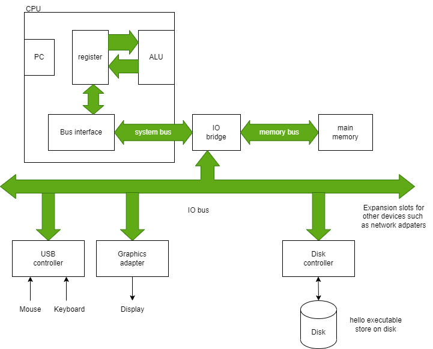

总线：用于各个组件之间传递字节信息，通常设置成传输固定尺寸字节块`words`。`word`中的字节数是计算机系统的基础参数。大多数现代机器`word`尺寸是4bytes(32位)或8bytes(64位)。
IO设备：用于系统和外部世界连接：这些设备包括键盘、鼠标、显示器，硬盘和网络等。
主存：用于临时存放程序和数据当处理器执行程序时。物理上，主存由动态随机访问内存(DRAM)组成。
处理器：用于解释或执行存放于主存的指令。它的核心是一个word-size的存储设备(register)被称为程序计数器(PC)。PC总是指向主存中的某个机器指令。处理器读取PC所指向的指令，解释并执行指令的位和操作，然后更新PC指向下一个指令。需要注意该指令不一定和上一个指令在内存上连续（比如调用函数）。处理器中寄存器设备是由word-size大小的多个register组成。算术逻辑单元(ALU)用于计算新的数据和地址值。

### hello程序的运行过程

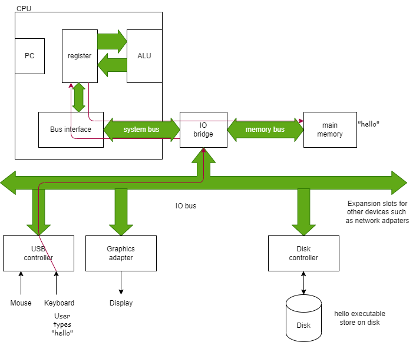

==图 1.3 从键盘读入命令 hello==

- 首先，shell程序执行指令，等待用户输入命令，当我们通过键盘输入`./hello`字符串，shell程序将这些字符分别读入到寄存器，然后存储到主存中(图 1.3)。
- 当我们在键盘输入`enter`，`shell`知道我们完成了命令键入。然后`shell`加载可执行的`hello`文件，通过执行一系列指令复制硬盘中hello文件中的代码和数据到主存中。
- 使用直接内存访问(DMA)技术，数据直接从硬盘传递到主存中，而不需要通过处理器(图 1.4)。
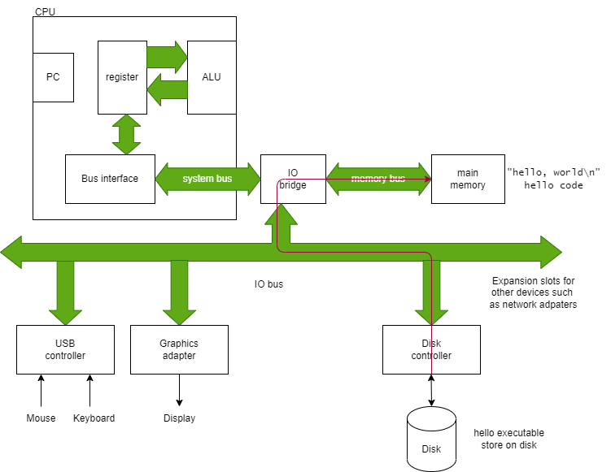

==图 1.4 将可执行文件从硬盘加载到主存==

- 一旦hello对象的代码和数据加载到主存中，处理器开始执行hello程序的机器指令，这些指令复制字符串`hello, world\n`字节到寄存器文件，然后从寄存器到显示设备，并在屏幕上显示(图 1.5)。
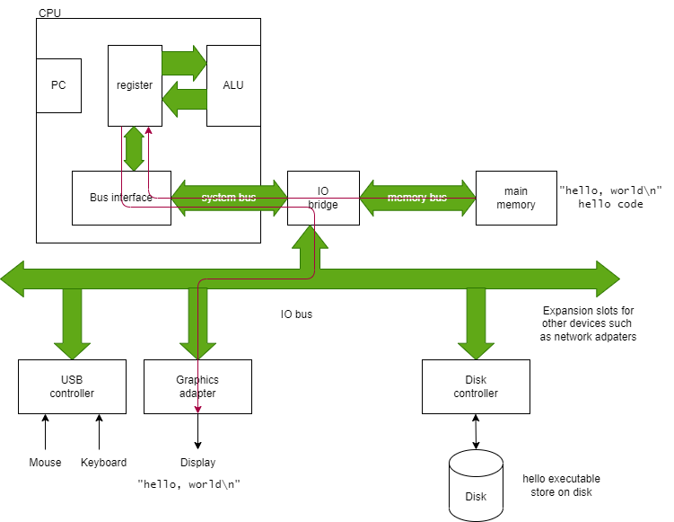

==图 1.5 从主存读取字符串并显示

### 内存层次

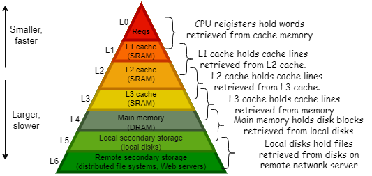

==图 1.6 缓存的层次结构==
如上图所示典型的系统中，层次越靠上的缓存读取速度越快，缓存空间越小，反之则读取越慢，缓存空间越大。为了解决处理器和缓存之间的间隙，系统添加了更小更快的存储设备叫做缓存，用作临时存储空间存放处理器接下来很可能使用到的信息。这些缓存设备集成处理器中，L1缓存大概可以存放几十到数百字节并可以以接近寄存器的读取速度访问，更大的L2缓存可以存放几千到百万的字节，并和处理器使用一个特殊的总线连接，有些处理器在L2缓存的基础上又增加了L3缓存。这些缓存又被叫做静态随机访问内存(SRAM)。

### 操作系统

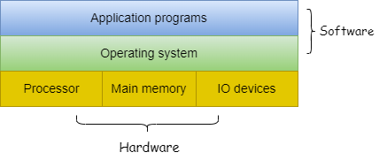
==图 1.7 系统的层次==
操作系统是介于应用程序和硬件的软件层，使用操作系统的目的是：

- 保护应用误用硬件
- 提供应用一个简单、统一的操作大量不同硬件的方式。

操作系统通过如下抽象实现了上述的目的：

- 使用files作为IO设备的抽象；
- 虚拟内存作为主存和硬盘IO设备的抽象；
- 进程作为处理器，主存和IO设备的抽象。

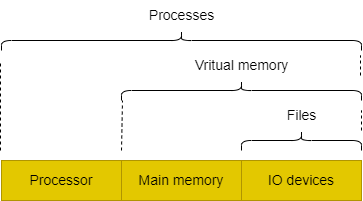
==图 1.8 操作系统的抽象==

#### 进程

当一个程序比如`hello`在运行时，操作系统给了我们一个假象：这个程序是系统唯一在运行的程序。程序看起来好像是独占了处理器、主存以及IO设备。处理器看起来像是在按顺序执行程序的指令，一个接着一个，没有中断。这些假象是进程表示提供的。
一个进程是操作系统对运行的程序的抽象。多个程序可以并发(concurrently)的运行在同一个系统上，并且每一个进程貌似都是独占硬件。这里的并发是指一个进程和另一个进程的指令交错执行。

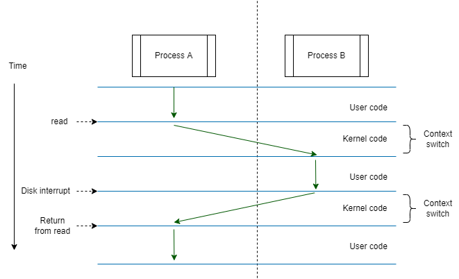
==图 1.9 进程上下文切换==
操作系统通过上下文切换实现多个进程指令交错执行。如上图所示。操作系统保存进程运行所需的所有状态信息。这个状态被称为上下文，包含PC的当前值，寄存器文件和主存的内容。在任意时间段，一个单核系统只能执行一个进程的代码，当操作系统决定将控制权从当前进程转移一个新的进程，将执行上下文切换，通过保存当前线程的上下文，恢复新的线程的上下文，然后将控制权转移给新的进程，新的进程根据上下文，继续执行未执行的指令。
从图上可以看出，线程切换是由内核完成的，内核时操作系统中部分代码，始终驻存于主存中。当应用需要一些操作系统的动作，比如读写文件，将会调用一个特殊的系统调用指令，将控制权转移给内核。内核然后执行请求操作并在完成后将控制权交还给应用。

#### 虚拟内存

虚拟内存提供了进程独占主存的假象。每一个进程都有相同的内存视角，被称为虚拟地址空间。

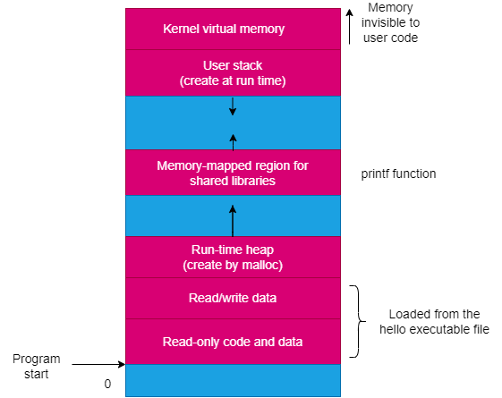
==图 1.10 虚拟内存空间布局==

## 2 程序的机器表示

### 整数寄存器

这里介绍的寄存器是x86-64架构的：
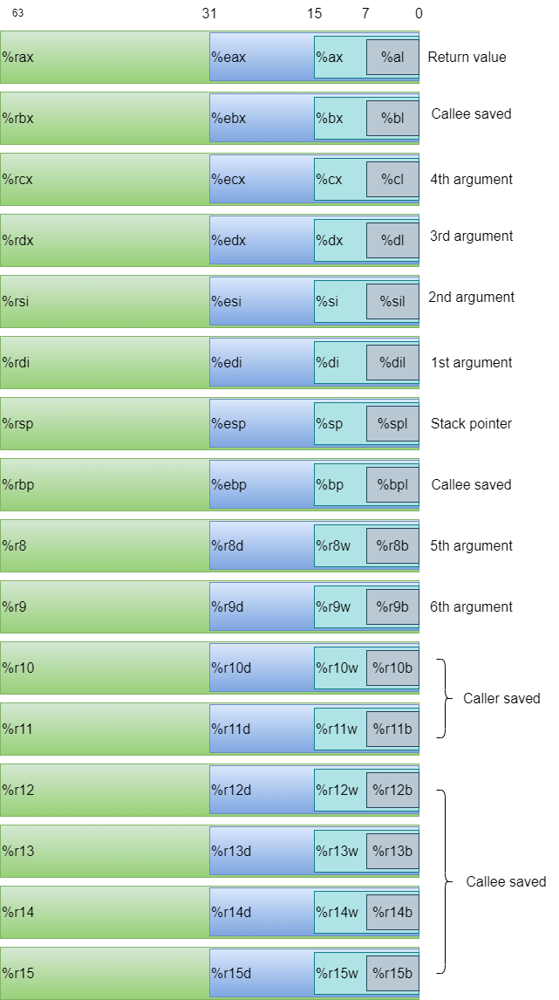
==图 2.1 x86-64架构整数寄存器==
x86-64架构CPU包含一组16个通用目的寄存器可以存储最多64bit值。这些寄存器可以存储整型数据和指针。

### 压入和弹出栈数据

指令|效果|描述
:-|:-|:-
pushq S|R[%rsp] <- R[%rsp]-8; M[R[%rsp]] <- S|压入8字节数据S
popq D|D <- M[R[%rsp]]; R[%rsp] <- R[%rsp]+8|弹出8字节数据到D

### 运行时栈

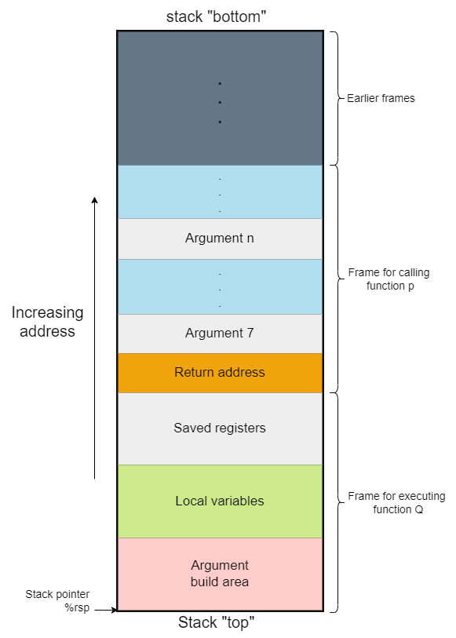
==图 2.2 当前栈帧结构==
x86-64栈向低地址增长，栈指针`%rsp`始终指向栈顶元素。数据可以通过`pushq`指令存储数据，也可以通过`popq`寻回数据。可以通过简单的减栈指针地址分配栈内存，也可以反向释放内存。
当x86-64过程调用需要的内存大于寄存器可以保存的时候，将会在栈上分配内存。这块分配的区域就是过程调用的栈帧。如上图所示，当过程调用`P`调用过程`Q`，会将返回地址压入栈，我们将返回地址看作是`P`的栈帧的一部分，因为它保存了和`P`有关的状态。`Q`的代码分配了栈空间，用于存储寄存器的值，局部变量和设置参数用于过程调用。

### 控制转移

指令|描述
:-|:-
call Label| Procedure call
call *Operand| Procedure call
ret|Return from call

从函数`P`到函数`Q`转移控制涉及到简单的设置PC指向`Q`的代码起始位置。然而，当随后`Q`返回时，处理器必须记录有恢复执行`P`的代码位置。这个信息被运行的指令`call Q`记录下来。这个指令将返回地址`A`压入栈并将PC指向`Q`的起始位置。这个地址`A`就是机器码中紧随`call`指令的下一个指令地址。然后当`Q`结束时，会调用对应的`ret`指令将地址`A`弹出栈，并将PC指向该地址。


==图 2.3 call和ret时栈和寄存器变化==

两个函数的汇编码如下

```text
  Beginning of function multstore
1 0000000000400540 <multstore>:
2 400540: 53                      push %rbx
3 400541: 48 89 d3                mov %rdx,%rbx
  ...
  Return from function multstore
4 40054d: c3                      retq
  ...
  Call to multstore from main
5 400563: e8 d8 ff ff ff          callq 400540 <multstore>
6 400568: 48 8b 54 24 08          mov 0x8(%rsp),%rdx
```

一个更详细的过程调用和返回例子：

```text
  Disassembly of leaf(long y)
  y in %rdi
1 0000000000400540 <leaf>:
2 400540: 48 8d 47 02             lea 0x2(%rdi),%rax    L1: z+2
3 400544: c3                      retq                  L2: Return

4 0000000000400545 <top>:
  Disassembly of top(long x)
  x in %rdi
5 400545: 48 83 ef 05             sub $0x5,%rdi         T1: x-5
6 400549: e8 f2 ff ff ff          callq 400540 <leaf>   T2: Call leaf(x-5)
7 40054e: 48 01 c0                add %rax,%rax         T3: Double result
8 400551: c3                      retq                  T4: Return

  ...
  Call to top from function main
9 40055b: e8 e5 ff ff ff          callq 400545 <top>    M1: Call top(100)
10 400560: 48 89 c2               mov %rax,%rdx         M2: Resume
```

上述代码执行过程中指令和寄存器状态：
Label|PC|Instruction|%rdi|%rax|%rsp|*%rsp|Description
--|--|--|--|--|--|--|--
M1| 0x40055b |callq| 100| —| 0x7fffffffe820| —| Call top(100)
T1| 0x400545 |sub| 100| —| 0x7fffffffe818| 0x400560| Entry of top
T2| 0x400549 |callq| 95| —| 0x7fffffffe818| 0x400560| Call leaf(95)
L1| 0x400540 |lea| 95| —| 0x7fffffffe810| 0x40054e| Entry of leaf
L2| 0x400544 |retq| —| 97| 0x7fffffffe810| 0x40054e| Return 97 from leaf
T3| 0x40054e |add| —| 97| 0x7fffffffe818| 0x400560| Resume top
T4| 0x400551 |retq| —| 194| 0x7fffffffe818| 0x400560| Return 194 from top
M2| 0x400560 |mov| —| 194| 0x7fffffffe820| —| Resume main

### 数据对齐

许多计算机系统对原始数据类型的内存地址有严格的限制，需要某些多项的地址必须时某些值K(2,4,8字节)的倍数。这种对齐限制简化了构成处理器和存储器之间接口的硬件的设计。
x86-64系统可以在数据不对齐时正确运行。但是数据对齐可以提高内存系统的性能，可以一次性读入数据，而不是可能多次读入。数据对齐的准则是任何原始数据类型大小K字节必须要满足地址是K的倍数。
K|类型
--|————
1|char
2|short
4|int,float
8|long,double,指针

当数据涉及到结构体或类时，编译器可能会在成员之间添加间隙以保证成员满足对齐要求。比如如下的类：

```c++
class S1 {
int i;
char c;
int j;
};
```

编译器对实例对象成员`c`和`j`中加入了3字节的间隙:

最后类`S1`尺寸为12字节，且编译器进一步要求类必须保持4字节对齐，这保证了成员`i`和`j`满足它们自身的4字节对齐要求。
下面的类：

```c++
class S2{
  int i;
  int j;
  char c;
};
```

如果类尺寸为9字节，可以满足自身成员的对齐要求，但是对于类数组则不满足对齐要求：

```c++
class S2 d[4];
```

为此，编译器会给类对象分配12字节空间，最后的3字节空间是无用的，仅用于保证对齐。

### 浮点型寄存器

待完善

## 4 处理器架构

### 4.3 序列Y86-64实现

#### 4.3.1 处理过程分阶段

处理一个指令通常涉及到多个操作。我们将这些操作组织成一个特殊的阶段序列，目的是为了让所有的指令都遵循一个统一的顺序，即使这些指令的实际操作差异很大。下面的描述是关于序列的阶段的描述：

- Fetch(读取阶段) 顾名思义，这个阶段是从内存中读取指令的字节串，使用PC作为需要读取内存的地址。它会从指令中提取出2个4bit的指令特定字节，称之为 `icode`(指令码)和`ifun`(指令函数)。它可能读取一个寄存器说明符字节，根据给出的一个或两个寄存器操作数说明符 `rA` 和 `rB`。它还有可能读取一个8字节常量 `valC`。它计算序列顺序的当前指令的下一个指令的地址到 `valP`，所以，`valP` 等于PC加上读取的指令字节码长度。
- Decode(解码阶段) 从寄存器文件读取最多两个操作数，姑且称之为 `valA`和 `valB`。它所读取的寄存器由读取阶段的 `rA` 和 `rB`字段限定，当然有些指令会读取寄存器 `%rsp`。
- Execute(运行阶段) 算术逻辑单元(`ALU`)要么执行指令指定的操作(根据 `ifun` 的值)，计算内存引用的有效地址，或增减帧指针。我们将结果称之为 `valE`。它有可能会设置条件码。对于一个条件移动指令，该阶段将计算条件码和移动条件(由 `ifun` 给出)并仅在条件成立时启用目标寄存器的更新。类似的，对于一个跳转指令，它决定一个分支是否被运行。
- Memory(内存阶段) 该阶段可能写入数据到内存，或者读取内存的数据。我们将读取内存的数据称之为 `valM` 。
- Write back(写回阶段) 该阶段最多写入两个结果到寄存器文件。
- PC update(PC更新阶段) 将PC设置为下一个需要执行的指令的地址。

阶段|OPq rA,rB|rrmovq rA,rB|irmovq V,rB
:-|:-|:-|:-
Fetch|icode:ifun $\gets$ $M_1$[PC]<br>rA:rB $\gets$ $M_1$[PC+1]<br><br>valP $\gets$ PC+2|icode:ifun $\gets$ $M_1$[PC]<br>rA:rB $\gets$ $M_1$[PC+1]<br><br>valP $\gets$ PC+2|icode:ifun $\gets$ $M_1$[PC]<br>rA:rB $\gets$ $M_1$[PC+1]<br>valC $\gets$ $M_8$[PC+2]<br>valP $\gets$ PC+10
Decode|valA $\gets$ R[rA]<br>valB $\gets$ R[rB]|valA $\gets$ R[rA]||
Execute|valE $\gets$ valB OP valA<br> 设置 CC|valE $\gets$ 0+valA|valE $\gets$ 0+valC|
Memory|||
Write back|R[rB] $\gets$ valE|R[rB] $\gets$ valE|R[rB] $\gets$ valE
PC update|PC $\gets$ valP|PC $\gets$ valP|PC $\gets$ valP
==表 4.1 Y86-64指令序列执行的计算 OPq, rrmovq,irmovq.==

阶段|pushq rA| popq rA
:-|:-|:-
Fetch|icode:ifun $\gets$ $M_1$[PC]<br>rA:rB $\gets$ $M_1$[PC+1]<br><br>valP $\gets$ PC+2|icode:ifun $\gets$ $M_1$[PC]<br>rA:rB $\gets$ $M_1$[PC+1]<br><br>valP $\gets$ PC+2
Decode|valA $\gets$ R[rA]<br>valB $\gets$ R[%rsp]|valA $\gets$ R[%rsp]<br>valB $\gets$ R[%rsp]
Execute|valE $\gets$ valB+(-8)|valE $\gets$ valB+8
Memory|$M_8$[valE] $\gets$ valA|valM $\gets$ $M_8$[valA]
Write back|R[%rsp] $\gets$ valE|R[%rsp] $\gets$ valE<br>R[rA] $\gets$ valM
PC update|PC $\gets$ valP|PC $\gets$ valP
==表 4.2 Y86-64指令序列执行的计算 pushq和 popq==

阶段|jXX Dest|call Dest|ret
:-|:-|:-|:-
Fetch|icode:ifun $\gets$ $M_1$[PC]<br>valC $\gets$ $M_8$[PC+1]<br>valP $\gets$ PC+9|icode:ifun $\gets$ $M_1$[PC]<br>valC $\gets$ $M_8$[PC+1]<br>valP $\gets$ PC+9|icode:ifun $\gets$ $M_1$[PC]<br><br>valP $\gets$ PC+1
Decode||valB $\gets$ R[%rsp]|valA $\gets$ R[%rsp]<br>valB $\gets$ R[%rsp]
Execute|Cnd $\gets$ Cond(CC,ifun)|valE $\gets$ valB+(-8)|valE $\gets$ valB+8
Memory||$M_8$[valE] $\gets$ valP|valM $\gets$ $M_8$[valA]
Write back||R[%rsp] $\gets$ valE|R[%rsp] $\gets$ valE
PC update|PC $\gets$ Cnd?valC:valP|PC $\gets$ valC|PC $\gets$ valM
==表 4.3 Y86-64指令序列执行的计算 jXX,call和ret==

#### 4.3.2 `SEQ`硬件结构

执行所有 Y86-64 指令所需的计算可以组织为一系列六个基本阶段：`fetch`，`decode`，`execute`，`memory`，`write back` 和 `PC update`。
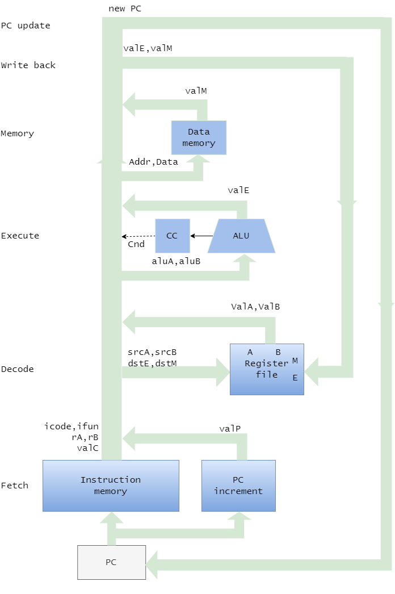
==图 4.1 `SEQ`的抽象视图，顺序实现。在指令执行期间处理的信息遵循顺时针流程，从使用程序计数器 (PC) 获取指令开始，如图左下角所示。==

上图显示了执行这些计算的硬件结构的抽象视图。程序计数器存储于一个寄存器 `PC` 。信息通过箭头的指向流动，先向上然后向右。在右侧返回的反馈路径包含要写入寄存器文件的更新值和更新的程序计数器。在 `SEQ` 中，所有的硬件单元的处理都在一个时钟周期。