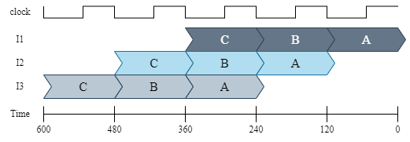

<!-- @import "[TOC]" {cmd="toc" depthFrom=1 depthTo=6 orderedList=false} -->

<!-- code_chunk_output -->

- [计算机系统-程序员视角](#计算机系统-程序员视角)
  - [1 系统概览](#1-系统概览)
    - [gcc编译过程](#gcc编译过程)
    - [典型系统的硬件组织](#典型系统的硬件组织)
    - [hello程序的运行过程](#hello程序的运行过程)
    - [内存层次](#内存层次)
    - [操作系统](#操作系统)
      - [进程](#进程)
      - [虚拟内存](#虚拟内存)
  - [3 程序的机器表示](#3-程序的机器表示)
    - [整数寄存器](#整数寄存器)
    - [操作数标识符](#操作数标识符)
    - [数据移动指令](#数据移动指令)
    - [压入和弹出栈数据](#压入和弹出栈数据)
    - [运行时栈](#运行时栈)
    - [算术和逻辑运算](#算术和逻辑运算)
      - [特殊算数运算](#特殊算数运算)
    - [控制](#控制)
      - [条件码](#条件码)
      - [访问条件码](#访问条件码)
        - [条件码组合](#条件码组合)
        - [跳转指令](#跳转指令)
        - [跳转指令编码](#跳转指令编码)
        - [实现条件分支](#实现条件分支)
          - [条件控制实现分支](#条件控制实现分支)
          - [条件移动实现分支](#条件移动实现分支)
      - [循环](#循环)
      - [switch语句](#switch语句)
    - [控制转移](#控制转移)
    - [数据对齐](#数据对齐)
    - [浮点型寄存器](#浮点型寄存器)
  - [4 处理器架构](#4-处理器架构)
    - [4.3 序列Y86-64实现](#43-序列y86-64实现)
      - [4.3.1 处理过程分阶段](#431-处理过程分阶段)
      - [4.3.2 `SEQ`硬件结构](#432-seq硬件结构)
    - [4.4 流水线的一般原则](#44-流水线的一般原则)

<!-- /code_chunk_output -->
# 计算机系统-程序员视角

## 1 系统概览

### gcc编译过程

{title="图 1.1 gcc编译过程"}

- 预处理：预编译器修改源代码，在 `#include <stdio.h>`行读入系统头文件`stdio.h`并直接插入到该行，结果生成`.i`后缀的源代码；
- 编译：编译器翻译`hello.i`到`hello.s`，这是一个汇编代码程序。
- 汇编：汇编器翻译`hello.s`到机器码，把它们打包到一个可重定位对象程序，将结果存储到对象文件`hello.o`。
- 链接：由于hello调用了系统库函数`printf`，这个函数位于标准c库中的`printf.o`，这里需要链接器将该部分融合(动态或静态)进`hello.o`文件生成最终的`hello`文件。

### 典型系统的硬件组织


总线：用于各个组件之间传递字节信息，通常设置成传输固定尺寸字节块`words`。`word`中的字节数是计算机系统的基础参数。大多数现代机器`word`尺寸是4bytes(32位)或8bytes(64位)。
IO设备：用于系统和外部世界连接：这些设备包括键盘、鼠标、显示器，硬盘和网络等。
主存：用于当处理器执行程序时临时存放程序和数据。物理上，主存由动态随机访问内存(DRAM)组成。
处理器：用于解释或执行存放于主存的指令。它的核心是一个word-size的存储设备(register)被称为程序计数器(PC)。PC总是指向主存中的某个机器指令。处理器读取PC所指向的指令，解释并执行指令的位和操作，然后更新PC指向下一个指令。需要注意该指令不一定和上一个指令在内存上连续（比如调用函数）。处理器中寄存器设备是由word-size大小的多个register组成。算术逻辑单元(ALU)用于计算新的数据和地址值。

### hello程序的运行过程


- 首先，shell程序执行指令，等待用户输入命令，当我们通过键盘输入`./hello`字符串，shell程序将这些字符分别读入到寄存器，然后存储到主存中(图 1.3)。
- 当我们在键盘输入`enter`，`shell`知道我们完成了命令键入。然后`shell`加载可执行的`hello`文件，通过执行一系列指令复制硬盘中hello文件中的代码和数据到主存中。
- 使用直接内存访问(DMA)技术，数据直接从硬盘传递到主存中，而不需要通过处理器(图 1.4)。


- 一旦hello对象的代码和数据加载到主存中，处理器开始执行hello程序的机器指令，这些指令复制字符串`hello, world\n`字节到寄存器文件，然后从寄存器到显示设备，并在屏幕上显示(图 1.5)。
{}

### 内存层次


==图 1.6 缓存的层次结构==
如上图所示典型的系统中，层次越靠上的缓存读取速度越快，缓存空间越小，反之则读取越慢，缓存空间越大。为了解决处理器和缓存之间的间隙，系统添加了更小更快的存储设备叫做缓存，用作临时存储空间存放处理器接下来很可能使用到的信息。这些缓存设备集成处理器中，L1缓存大概可以存放几十到数百字节并可以以接近寄存器的读取速度访问，更大的L2缓存可以存放几千到百万的字节，并和处理器使用一个特殊的总线连接，有些处理器在L2缓存的基础上又增加了L3缓存。这些缓存又被叫做静态随机访问内存(SRAM)。

### 操作系统

{title="图 1.7 系统的层次"}
==图 1.7 系统的层次==
操作系统是介于应用程序和硬件的软件层，使用操作系统的目的是：

- 保护应用误用硬件
- 提供应用一个简单、统一的操作大量不同硬件的方式。

操作系统通过如下抽象实现了上述的目的：

- 使用files作为IO设备的抽象；
- 虚拟内存作为主存和硬盘IO设备的抽象；
- 进程作为处理器，主存和IO设备的抽象。


==图 1.8 操作系统的抽象==

#### 进程

当一个程序比如`hello`在运行时，操作系统给了我们一个假象：这个程序是系统唯一在运行的程序。程序看起来好像是独占了处理器、主存以及IO设备。处理器看起来像是在按顺序执行程序的指令，一个接着一个，没有中断。这些假象是进程表示提供的。
一个进程是操作系统对运行的程序的抽象。多个程序可以并发(concurrently)的运行在同一个系统上，并且每一个进程貌似都是独占硬件。这里的并发是指一个进程和另一个进程的指令交错执行。


==图 1.9 进程上下文切换==
操作系统通过上下文切换实现多个进程指令交错执行。如上图所示。操作系统保存进程运行所需的所有状态信息。这个状态被称为上下文，包含PC的当前值，寄存器文件和主存的内容。在任意时间段，一个单核系统只能执行一个进程的代码，当操作系统决定将控制权从当前进程转移一个新的进程，将执行上下文切换，通过保存当前线程的上下文，恢复新的线程的上下文，然后将控制权转移给新的进程，新的进程根据上下文，继续执行未执行的指令。
从图上可以看出，进程切换是由内核完成的，内核是操作系统中部分代码，始终驻存于主存中。当应用需要一些操作系统的动作，比如读写文件，将会调用一个特殊的系统调用指令，将控制权转移给内核。内核然后执行请求操作并在完成后将控制权交还给应用。

#### 虚拟内存

虚拟内存提供了进程独占主存的假象。每一个进程都有相同的内存视角，被称为虚拟地址空间。


==图 1.10 虚拟内存空间布局==

## 3 程序的机器表示

### 整数寄存器

这里介绍的寄存器是x86-64架构的：

==图 2.1 x86-64架构整数寄存器==
x86-64架构CPU包含一组16个通用目的寄存器可以存储最多64bit值。这些寄存器可以存储整型数据和指针。

### 操作数标识符

操作数标识符是汇编语言中用来表示操作数的符号。操作数可以是寄存器、内存引用或者立即数。
大多数指令有一个或多个操作数标识符，这些标识符用来指定指令执行时需要使用的源数据和目标数据。

Type|Form|Operand value|Name
:-|:-|:-|:-
Immediate|$$imm$|$imm$|立即数
Register|$r_i$|R[$r_i$]|寄存器
Memory|$Imm$|M[$Imm$]|绝对内存引用
Memory|($r_i$)|M[R[$r_i$]]|寄存器间接内存引用
Memory|($r_i$,$s_i$)|M[R[$r_i$] + R[$s_i$]]|基址加偏移量内存引用
Memory|($r_i$,$s_i$,$S$)|M[R[$r_i$] + R[$s_i$] * $S$]|基址加索引内存引用
Memory|Imm($r_i$)|M[Imm + R[$r_i$]]|基址加立即数内存引用
Memory|Imm($r_i$,$s_i$)|M[Imm + R[$r_i$] + R[$s_i$]]|基址加偏移量加立即数内存引用
Memory|Imm($r_i$,$s_i$,$S$)|M[Imm + R[$r_i$] + R[$s_i$] * $S$]|基址加索引加立即数内存引用

缩放因子$S$只能是1、2、4、8。

### 数据移动指令

指令|效果|描述
:-|:-|:-
movb S,D|D <- S|将1字节数据S复制到D
movw S,D|D <- S|将2字节数据S复制到D
movl S,D|D <- S|将4字节数据S复制到D
movq S,D|D <- S|将8字节数据S复制到D
movabsq I,D|D <- I|将64位立即数I复制到D

源操作数S和目标操作数D可以是寄存器或者内存引用。立即数只能作为源操作数。
x86-64架构强制要求源操作数和目标操作数不能同时是内存引用。
mov指令只会更改寄存器或内存中指定的字节，而不会更改其他字节。除了movl以寄存器作为目标地时，将会设置寄存器的高4字节为0，这个例外起源自x86-64架构的惯例，任何在目标寄存器中生成32位值的指令，都会将寄存器高位四字节设置为0。

```s {.line-numbers}
movl $0x40, %eax  #Immediate->Register, 4 bytes
movw %bp,%sp      #Register->Register, 2 bytes
movb (%rdi, %rdx),%al  #Memory->Register, 1 byte
movb $-17,(%esp)  #Immediate->Memory, 1 byte
movq %rax,-12($rpb)  #Register->Memory, 8 bytes
```

movabsq指令将64位立即数复制到寄存器。因为movq指令只能将有符号32位二进制补码作为源立即数操作数，这个值通过符号扩展到64位，然后复制到目标寄存器。movabsq指令可以避免符号扩展，因为源立即数是64位，直接复制到目标寄存器且必须是寄存器。

扩展数据移动指令

指令|效果|描述
:-|:-|:-
movzbq S,D|D <- zero-extend(S)|零扩展移动字节到四字
movzbw S,D|D <- zero-extend(S)|零扩展移动字节到字
movzwl S,D|D <- zero-extend(S)|零扩展移动字到四字
movzbq S,D|D <- zero-extend(S)|零扩展移动字节到四字
movzwq S,D|D <- zero-extend(S)|零扩展移动字到四字
movsbw S,D|D <- sign-extend(S)|符号扩展移动字节到字
movsbl S,D|D <- sign-extend(S)|符号扩展移动字节到四字
movswl S,D|D <- sign-extend(S)|符号扩展移动字到四字
movsbq S,D|D <- sign-extend(S)|符号扩展移动字节到四字
movswq S,D|D <- sign-extend(S)|符号扩展移动字到四字
movslq S,D|D <- sign-extend(S)|符号扩展移动四字到八字
cltq|%rax <- sign-extend(%eax)|符号扩展%eax到%rax

movz通过对扩展位置零来扩展数据，而movs则通过对扩展位复制符号位来扩展数据。

### 压入和弹出栈数据

指令|效果|描述
:-|:-|:-
pushq S|R[%rsp] <- R[%rsp]-8; M[R[%rsp]] <- S|压入8字节数据S
popq D|D <- M[R[%rsp]]; R[%rsp] <- R[%rsp]+8|弹出8字节数据到D


### 运行时栈


==图 2.2 当前栈帧结构==
x86-64栈向低地址增长，栈指针`%rsp`始终指向栈顶元素。数据可以通过`pushq`指令存储数据，也可以通过`popq`寻回数据。可以通过简单的减栈指针地址分配栈内存，也可以反向释放内存。
当x86-64过程调用需要的内存大于寄存器可以保存的时候，将会在栈上分配内存。这块分配的区域就是过程调用的栈帧。如上图所示，当过程调用`P`调用过程`Q`，会将返回地址压入栈，我们将返回地址看作是`P`的栈帧的一部分，因为它保存了和`P`有关的状态。`Q`的代码分配了栈空间，用于存储寄存器的值，局部变量和设置参数用于过程调用。

### 算术和逻辑运算

指令|效果|描述
:--|:--|:--
leaq S,D|D <- &S|加载有效地址，不访问内存，常用于快速计算
INC D| D <- D+1|递增
DEC D| D <- D-1|递减
NEG D| D <- -D|取负数
NOT D| D <-~D|取反
ADD S,D|D <- D+S|加法
SUB S,D|D <- D-S|减法
IMUL S,D|D <- D*S|乘法
XOR S,D|D <- D^S|异或
OR S,D|D <- D|S|或
AND S,D|D <- D&S|并
SAL k,D|D <- D<<k|左移
SHL k,D|D <- D<<k|左移(等同于SAL)
SAR k,D|D <- D>>A^k|算数右移（填充符号位）
SHR k,D|D <- D>>L^k|逻辑右移（填充0）

```c
// C code
long arith(long x,long y,long z)
{
  long t1=x^y;
  long t2=z*48;
  long t3=t1&0x0F0F0F0F;
  long t4=t2-t3;
  return t4;
}
```

```s
# assembly code 
arith:
  xorq %rsi,%rdi  # tx=x^y
  leaq (%rdx,%rdx,2),%rax   # 3*z
  salq $4,%rax  # t2=16*(3*z)=48*z
  andl $252645135,$edi  # t3=t1&0x0F0F0F0F
  subq %rdi,%rax  # t4=t2-t3
  ret
```

#### 特殊算数运算

指令|效果|描述
:--|:--|:--
imulq S|R[%rdx]:R[%rax] <- S*R[%rax]|有符号全乘
mulq S|R[%rdx]:R[%rax] <- S*R[%rax]|无符号全乘
cqto|R[%rdx]:R[%rax] <- signExtend(R[%rax])|转变成128位
idivq S|R[%rdx] <- R[%rdx]:R[%rax] mod S; R[%rax] <- R[%rdx]:R[%rax] / S|有符号除
divq S|R[%rdx] <- R[%rdx]:R[%rax] mod S; R[%rax] <- R[%rdx]:R[%rax] / S|无符号除

### 控制

#### 条件码

CPU中除了整数寄存器还维持有一组单位的条件码寄存器用来描述最近算术或逻辑运算的属性，这些寄存器可以在随后的条件分支被用来作为判断。最有用的几个条件码如下：

- CF：Carry flag，最近的运算产生了一个最高位的进位，用于检测无符号运算的溢出。
- ZF: Zero flag，最近的运算生成了0.
- SF：Sign flag，最近的运算产生了一个负值。
- OF：Overflow flag，最近的运算产生了二进制补码溢出---正溢出或负溢出。

对于c代码`t=a+b`，可能会设置的条件码如下：

- CF (unsigned) t< (unsigned) a 无符号溢出
- ZF (t==0)  0
- SF (t<0) 负
- OF (a<0 == b<0)&&(t<0 != a<0) 符号溢出
除了`leaq`不改变条件码，其他算术和逻辑运算指令都会设置条件码。
对于移位操作，进位符（CF）设置为最后被移除的位，溢出符（OF）被设置为0。
`INC`和`DEC`指令设置OF和ZF，但不改变CF。

以下判断指令也会改变条件码寄存器

指令|依据|描述
:--|:--|:--
CMP $S_1$,$S_2$|$S_2-S_1$|比较
cmpb||比较一字节
cmpw||比较字(word)
cmpl||比较2字(double word)
cmpq||比较4字(quad word)
TEST $S_1$,$S_2$|$S_1\&S_2$|测试并
testb||字节测试
testw||字测试
testl||2字测试
testq||4字测试

testq %rax,%rax可以检测%rax是负，0，正。

#### 访问条件码

条件码有三种访问方式：

- 通过条件码的组合设置单字节的0或1；
- 条件跳转到程序的其他部分；
- 条件传递数据。

##### 条件码组合

指令|同义词|作用|设置条件
:--|:--|:--|:--
sete D|setz|D <- ZF|相等、0
setne D|setnz| D <- ~ZF|不等、非0
sets D||D <- SF|负
setns D||D <- ~SF|正
setg D|setnle|D <- ~(SF^OF) & ~ZF|大于(signed>)
setge D|setnl|D <- ~(SF^OF)|大于等于(signed>=)
setl D|setnge|D <- SF^OF|小于(signed<)
setle D|setng|D <- (SF^OF) \| ZF|小于等于(signed<=)
seta D|setnbe|D <- ~CF & ~ZF|大于(unsigned>)
setae D|setnb|D <- ~CF|大于等于(unsigned>=)
setb D|setnae|D <- CF|小于(unsigned<)
setbe D|setna|D <- CF \| ZF|小于等于(unsigned<=)

==表3.14 SET指令，每个指令根据条件码组合设置一个字节到0或1，有些指令有同义词，可以相互替换使用==

如下C代码计算a<b，其中a和b都是long类型：

```c
int comp(data_t a,data_t b)
{
  return a<b;
}
```

如下生成的汇编代码：

```s
comp:
  cmpq %rsi,%rdi
  setl %al
  movzbl %al,%eax  //Clear rest of %eax and rest of %rax
  ret
```

##### 跳转指令

指令|同义词|跳转条件|描述
:--|:--|:--|:--
jmp L||true|直接跳转
jmp *操作数||true|间接跳转
je L|jz|ZF|相等、0
jne L|jnz|~ZF|不相等、非0
js L||SF|负
jns L||~SF|非负
jg L|jnle|~(SF^OF) & ~ZF|大于(signed>)
jge L|jnl|~(SF^OF)|大于等于(signed>=)
jl L|jnge|SF^OF|小于(signed<)
jle L|jng|(SF^OF) \| ZF|小于等于(signed<=)
ja L|jnbe|~CF & ~ZF|大于(unsigned>)
jae L|jnb|~CF|大于等于(unsigned>=)
jb L|jnae|CF|小于(unsigned<)
jbe L|jna|CF \| ZF|小于等于(unsigned<=)

==表3.15 jump指令==

*操作数指定跳转到操作数指代的位置。如
`jmp *%rax`
使用%rax的值作为跳转的目标，如
`jmp *(%rax)`
使用%rax指代的内存地址处的值作为跳转的目标。

##### 跳转指令编码

在汇编代码中，跳转目标通过符号化标签（symbolic labels）表示。汇编器和后续的链接器会生成跳转目标的正确编码。跳转指令有多种编码方式，其中最常用的是PC相对寻址（PC-relative）。这种方式通过计算目标指令地址与跳转指令下一条指令地址之间的差值（偏移量）来编码。偏移量可以用1、2或4字节表示。另一种编码方式是使用"绝对地址"，直接通过4字节指定目标地址。汇编器和链接器会根据需要选择合适的编码方式。

例如，以下汇编代码（通过编译branch.c生成）展示了PC相对寻址的跳转。第2行的jmp指令向前跳转到更高地址的目标，而第7行的jg指令向后跳转到更低地址的目标。

```s {.line-numbers}
movq %rdi, %rax
jmp .L2
.L3:
sarq %rax
.L2:
testq %rax, %rax
jg .L3
rep; ret
```

可重定位对象文件.O格式的反汇编版本由汇编器生成如下：

```s{.line-numbers}
0: 48 89     f8 mov %rdi,%rax
3: eb 03     jmp 8 <loop+0x8>
5: 48 d1     f8 sar %rax
8: 48 85     c0 test %rax,%rax
b: 7f f8     jg 5 <loop+0x5>
d: f3 c3     repz retq
```

从上面第一个跳转指令的编码是0x03,加上0x5（当前指令的下一个地址），我们就得到了目标地址0x8。同样第二个跳转指令的目标的编码是0xf8，加上下一个指令地址0xd，我们得到了0x5。
从这些例子证明，程序计数器的值在执行PC-相对地址寻址时是跳转指令的下一个地址，而不是跳转的地址本身。这个惯例起源于早期处理器在执行指令时可能第一步先更新PC。
下面的反汇编显示了程序链接后的形式：

```s{.line-numbers}
1   4004d0: 48 89    f8 mov %rdi,%rax
2   4004d3: eb 03    jmp 4004d8 <loop+0x8>
3   4004d5: 48 d1    f8 sar %rax
4   4004d8: 48 85    c0 test %rax,%rax
5   4004db: 7f f8    jg 4004d5 <loop+0x5>
6   4004dd: f3 c3    repz retq
```

##### 实现条件分支

###### 条件控制实现分支

最通用的将C代码的条件表达式和语句翻译成机器码的方式是使用条件和无条件跳转。

原始C代码：

```c
long lt_cnt=0;
long ge_cnt=0;

long absdiff_se(long x,long y)
{
  long result;
  if(x<y)
  {
    lt_cnt++;
    result=y-x;
  }
  else {
    ge_cnt++;
    return=x-y;
  }
  return result;
}
```

等价goto版本

```c
long goto_diff_se(long x,long y)
{
  long result;
  if(x>=y)
    goto x_ge_y;
  lt_cnt++;
  result=y-x;
  return result;
x_ge_y:
  ge_cnt++;
  result=x-y;
  return result;
}
```

生成的汇编代码：

```s
absdiff_se:
  cmpq %rsi,%rdi
  jge .L2
  addq $1,lt_cnt(%rip)
  movq %rsi,%rax
  subq %rdi,%rax
  ret
.L2：
  addq $1,ge_cnt(%rip)
  movq %rdi,%rax
  subq %rsi,%rax
  ret
```

###### 条件移动实现分支

另一种实现分支的策略是通过一个条件移动数据。这种方式计算条件运算的结果然后选择满足条件的分支。这种方式只在有限场景下有效，但是可以通过简单的条件移动指令并在现代处理器下高效的执行。
下表展示了x86-64架构的部分可用条件移动指令

指令|同义词|移动条件|描述
:--|:--|:--|:--
cmove S,R|cmovz|ZF|相等、0
cmovne S,R|cmovnz|~ZF|不等、非0
cmovs S,R||SF|负
cmovns S,R||~SF|非负
cmovg S,R|cmovnle|~(SF^OF) \& ~ZF|有符号大于
cmovge S,R|cmovnl|~(SF^OF)|有符号大于等于
cmovl S,R|cmovnge|SF^OF|有符号小于
cmovle S,R|cmovng|(SF^OF)\|ZF|有符号小于等于
cmova S,R|cmovnbe|~CF \& ~ZF|无符号大于
cmovae S,R|cmovnb|~CF|无符号大于等于
cmovb S,R|cmovnae|CF|无符号小于
cmovbe S,R|cmovna|CF\|ZF|无符号小于等于

==表3.18 条件移动指令，在满足条件时从源S复制值到目的地R==

条件移动指令的两个操作数，源S可以是寄存器或内存，目的地R必须是寄存器。源、目的值可以是16，32或64位长，不支持单字节长度条件移动。
不同于条件跳转，处理器可以执行条件移动指令而不需要预测条件测试的结果。处理器简单的从源读取值，检测条件码，而后决定是不是要更新目的地。

```c
// 源代码：
long absdiff(long x,long y)
{
  long result;
  if(x<y)
    result=y-x;
  else
    result=x-y;
  return result;
}

// 等效汇编的代码：
long cmovdiff(long x,long y)
{
  long rval=y-x;
  long eval=x-y;
  long ntest=x>=y;
  // line below requires single instruction
  if(ntest) rval=eval;
  returm rval;
}
```

```s
# 汇编代码
absdiff:
  movq %rsi,%rax
  subq %rdi,%rax
  movq %rdi,%rdx
  subq %rsi,%rdx
  cmpq %rsi,%rdi
  cmovge %rdx,%rax
  ret
```

#### 循环

C提供了几种循环结构--`do-while`,`while`,`for`。
通常使用条件测试和跳转来实现对应的循环效果。

**do-while循环**

```c
// C源代码
long fact_do(long n)
{
  long result=1;
  do {
    result*=n;
    n=n-1;
  } while(n>1);
  return result;
}

// 等效goto版本
long fact_do_goto(long n)
{
  long result=1;
loop:
  result*=n;
  n=n-1;
  if(n>1)
    goto loop;
  return result;
}
```

```assmebly
fact_do:
  movl $1,%rax
.L2:
  imulq %rdi,%rax
  subq $1,%rdi
  cmpq $1,%rdi
  jg .L2
  rep; ret
```

**while循环**

```c
// C代码
long fact_while(long n)
{
  long result=1;
  while(n>1)
  {
    result*=n;
    n=n-1;
  }
  return result;
}

// 等效goto版本
long fact_while_im_goto(long n)
{
  long result=1;
  goto test;
loop:
  reult*=n;
  n=n-1;
test:
  if(n>1)
    goto loop;
  return result;
}
```

```assmebly
fact_while:
  movl $1,%rax
  jmp .L5
.L6
  imulq %rdi,%rax
  subq $1,%rdi
.L5
  cmpq $1,%rdi
  jg .L6
  rep; ret
```

**for循环**
类似于如下的循环

```text
init-expr;
while(test-expr)
{
  body-statement;
  update-expr;
}
```

```c
// 源代码
long fact_for(long n)
{
  long result=1;
  for(long i=2;i<=n;i++)
    result*=i;
  return result;
}

// 等效goto版本
long fact_for_jm_goto(long n)
{
  long i=2;
  long result=1;
  goto test;
loop:
  result*=i;
  i++;
test:
  if(i<=n)
    goto loop;
  return result;
}
```

```assmebly
fact_for:
  movl $1,%eax
  movl $2,%edx
  jmp .L8
.L9
  imulq %rdx,%rax
  addq $1,rdx
.L8:
  cmpq %rdi,%rax
  jle .L9
rep; ret
```

#### switch语句

实现switch语句的关键在于通过跳转表访问代码位置，如下所示使用goto语句引用到一个跳转表jt。

```c
// 源代码
void switch_eg(long x,long n,long *dest)
{
  long val=x;

  switch(n)
  {
    case 100:
      val*=13;
      break;
    case 102:
      val+=10;
    case 103:
      val+=11;
      break;
    case 104:
    case 106:
      val*=val;
      break;

    default:
      val=0;
  }
  *dest=val;
}

// 扩展C代码
void switch_eg_impl(long x,long n,long *dest)
{
  // 代码跳转表
  static void *jt[7]= {
    &&loc_a,&&loc_def,&&loc_b,&&loc_c,&&loc_d,&&loc_def,&&loc_d
  };
  unsigned long index=n-100;
  long val;

  if(index>6)
    goto loc_def;
  goto *jt[index];

loc_a:
  val=x*13;
  goto done;
loc_b:
  x=x+10;
loc_c:
  val=x+11;
  goto done;
loc_d:
  val=x*x;
  goto done;
loc_def:
  val=0;
done:
  *dest=val;
}
```

```assmebly

.section    .rodata
.align 8
.L4:
  .quad .L3
  .quad .L8
  .quad .L5
  .quad .L6
  .quad .L7
  .quad .L8
  .quad .L7

  
switch_eg:
  subq $100,%rsi
  cmpq $6,%rsi
  ja .L8
  jmp *.L4(,%rsi,8)
.L3:
  leaq (%rdi,%rdi,2),$rax
  lead(%rdi,%rax,4),%rdi
  jmp .L2
.L5:
  addq $10,%rdi
.L6:
  addq $11,%rdi
  jmp .L2
.L7:
  imulq %rdi,%rdi
  jmp .L2
.L8:
  movl $0,edi
.L2:
  movq %rdi,(%rdx)
  ret
```

### 控制转移

指令|描述
:-|:-
call Label| Procedure call
call *Operand| Procedure call
ret|Return from call

从函数`P`到函数`Q`转移控制涉及到简单的设置PC指向`Q`的代码起始位置。然而，当随后`Q`返回时，处理器必须记录有恢复执行`P`的代码位置。这个信息被运行的指令`call Q`记录下来。这个指令将返回地址`A`压入栈并将PC指向`Q`的起始位置。这个地址`A`就是机器码中紧随`call`指令的下一个指令地址。然后当`Q`结束时，会调用对应的`ret`指令将地址`A`弹出栈，并将PC指向该地址。


==图 2.3 call和ret时栈和寄存器变化==

两个函数的汇编码如下

```text
  Beginning of function multstore
1 0000000000400540 <multstore>:
2 400540: 53                      push %rbx
3 400541: 48 89 d3                mov %rdx,%rbx
  ...
  Return from function multstore
4 40054d: c3                      retq
  ...
  Call to multstore from main
5 400563: e8 d8 ff ff ff          callq 400540 <multstore>
6 400568: 48 8b 54 24 08          mov 0x8(%rsp),%rdx
```

一个更详细的过程调用和返回例子：

```text
  Diss of leaf(long y)
  y in %rdi
1 0000000000400540 <leaf>:
2 400540: 48 8d 47 02             lea 0x2(%rdi),%rax    L1: z+2
3 400544: c3                      retq                  L2: Return

4 0000000000400545 <top>:
  Diss of top(long x)
  x in %rdi
5 400545: 48 83 ef 05             sub $0x5,%rdi         T1: x-5
6 400549: e8 f2 ff ff ff          callq 400540 <leaf>   T2: Call leaf(x-5)
7 40054e: 48 01 c0                add %rax,%rax         T3: Double result
8 400551: c3                      retq                  T4: Return

  ...
  Call to top from function main
9 40055b: e8 e5 ff ff ff          callq 400545 <top>    M1: Call top(100)
10 400560: 48 89 c2               mov %rax,%rdx         M2: Resume
```

上述代码执行过程中指令和寄存器状态：
Label|PC|Instruction|%rdi|%rax|%rsp|*%rsp|Description
--|--|--|--|--|--|--|--
M1| 0x40055b |callq| 100| —| 0x7fffffffe820| —| Call top(100)
T1| 0x400545 |sub| 100| —| 0x7fffffffe818| 0x400560| Entry of top
T2| 0x400549 |callq| 95| —| 0x7fffffffe818| 0x400560| Call leaf(95)
L1| 0x400540 |lea| 95| —| 0x7fffffffe810| 0x40054e| Entry of leaf
L2| 0x400544 |retq| —| 97| 0x7fffffffe810| 0x40054e| Return 97 from leaf
T3| 0x40054e |add| —| 97| 0x7fffffffe818| 0x400560| Resume top
T4| 0x400551 |retq| —| 194| 0x7fffffffe818| 0x400560| Return 194 from top
M2| 0x400560 |mov| —| 194| 0x7fffffffe820| —| Resume main

### 数据对齐

许多计算机系统对原始数据类型的内存地址有严格的限制，需要某些多项的地址必须时某些值K(2,4,8字节)的倍数。这种对齐限制简化了构成处理器和存储器之间接口的硬件的设计。
x86-64系统可以在数据不对齐时正确运行。但是数据对齐可以提高内存系统的性能，可以一次性读入数据，而不是可能多次读入。数据对齐的准则是任何原始数据类型大小K字节必须要满足地址是K的倍数。
K|类型
--|————
1|char
2|short
4|int,float
8|long,double,指针

当数据涉及到结构体或类时，编译器可能会在成员之间添加间隙以保证成员满足对齐要求。比如如下的类：

```c++
class S1 {
int i;
char c;
int j;
};
```

编译器对实例对象成员`c`和`j`中加入了3字节的间隙:

最后类`S1`尺寸为12字节，且编译器进一步要求类必须保持4字节对齐，这保证了成员`i`和`j`满足它们自身的4字节对齐要求。
下面的类：

```c++
class S2{
  int i;
  int j;
  char c;
};
```

如果类尺寸为9字节，可以满足自身成员的对齐要求，但是对于类数组则不满足对齐要求：

```c++
class S2 d[4];
```

为此，编译器会给类对象分配12字节空间，最后的3字节空间是无用的，仅用于保证对齐。

### 浮点型寄存器

待完善

## 4 处理器架构

### 4.3 序列Y86-64实现

#### 4.3.1 处理过程分阶段

处理一个指令通常涉及到多个操作。我们将这些操作组织成一个特殊的阶段序列，目的是为了让所有的指令都遵循一个统一的顺序，即使这些指令的实际操作差异很大。下面的描述是关于序列的阶段的描述：

- Fetch(读取阶段) 顾名思义，这个阶段是从内存中读取指令的字节串，使用PC作为需要读取内存的地址。它会从指令中提取出2个4bit的指令特定字节，称之为 `icode`(指令码)和`ifun`(指令函数)。它可能读取一个寄存器说明符字节，根据给出的一个或两个寄存器操作数说明符 `rA` 和 `rB`。它还有可能读取一个8字节常量 `valC`。它计算序列顺序的当前指令的下一个指令的地址到 `valP`，所以，`valP` 等于PC加上读取的指令字节码长度。
- Decode(解码阶段) 从寄存器文件读取最多两个操作数，姑且称之为 `valA`和 `valB`。它所读取的寄存器由读取阶段的 `rA` 和 `rB`字段限定，当然有些指令会读取寄存器 `%rsp`。
- Execute(运行阶段) 算术逻辑单元(`ALU`)要么执行指令指定的操作(根据 `ifun` 的值)，计算内存引用的有效地址，或增减帧指针。我们将结果称之为 `valE`。它有可能会设置条件码。对于一个条件移动指令，该阶段将计算条件码和移动条件(由 `ifun` 给出)并仅在条件成立时启用目标寄存器的更新。类似的，对于一个跳转指令，它决定一个分支是否被运行。
- Memory(内存阶段) 该阶段可能写入数据到内存，或者读取内存的数据。我们将读取内存的数据称之为 `valM` 。
- Write back(写回阶段) 该阶段最多写入两个结果到寄存器文件。
- PC update(PC更新阶段) 将PC设置为下一个需要执行的指令的地址。

阶段|OPq rA,rB|rrmovq rA,rB|irmovq V,rB
:-|:-|:-|:-
Fetch|icode:ifun $\gets$ $M_1$[PC]<br>rA:rB $\gets$ $M_1$[PC+1]<br><br>valP $\gets$ PC+2|icode:ifun $\gets$ $M_1$[PC]<br>rA:rB $\gets$ $M_1$[PC+1]<br><br>valP $\gets$ PC+2|icode:ifun $\gets$ $M_1$[PC]<br>rA:rB $\gets$ $M_1$[PC+1]<br>valC $\gets$ $M_8$[PC+2]<br>valP $\gets$ PC+10
Decode|valA $\gets$ R[rA]<br>valB $\gets$ R[rB]|valA $\gets$ R[rA]||
Execute|valE $\gets$ valB OP valA<br> 设置 CC|valE $\gets$ 0+valA|valE $\gets$ 0+valC|
Memory|||
Write back|R[rB] $\gets$ valE|R[rB] $\gets$ valE|R[rB] $\gets$ valE
PC update|PC $\gets$ valP|PC $\gets$ valP|PC $\gets$ valP
==表 4.1 Y86-64指令序列执行的计算 OPq, rrmovq,irmovq.==

阶段|rmmovq rA,D(rB)|mrmovq D(rB),rA
:-|:-|:-
Fetch|icode:ifun $\gets$ $M_1$[PC]<br>rA:rB $\gets$ $M_1$[PC+1]<br>valC $\gets$ $M_8$[PC+2]<br>valP $\gets$ PC+10|icode:ifun $\gets$ $M_1$[PC]<br>rA:rB $\gets$ $M_1$[PC+1]<br>valC $\gets$ $M_8$[PC+2]<br>valP $\gets$ PC+10
Decode|valA $\gets$ R[rA]<br>valB $\gets$ R[rB]|valB $\gets$ R[rB]
Execute|valE $\gets$ valB+valC|valE $\gets$ valB+valC
Memory|$M_8$[valE] $\gets$ valA|valM $\gets$ $M_8$[valE]
Write back||R[rA] $\gets$ valM
PC update|PC $\gets$ valP|PC $\gets$ valP|PC $\gets$ valP
==表 4.2 Y86-64指令序列执行的计算 rmmovq 和 mrmovq.==

阶段|pushq rA| popq rA
:-|:-|:-
Fetch|icode:ifun $\gets$ $M_1$[PC]<br>rA:rB $\gets$ $M_1$[PC+1]<br><br>valP $\gets$ PC+2|icode:ifun $\gets$ $M_1$[PC]<br>rA:rB $\gets$ $M_1$[PC+1]<br><br>valP $\gets$ PC+2
Decode|valA $\gets$ R[rA]<br>valB $\gets$ R[%rsp]|valA $\gets$ R[%rsp]<br>valB $\gets$ R[%rsp]
Execute|valE $\gets$ valB+(-8)|valE $\gets$ valB+8
Memory|$M_8$[valE] $\gets$ valA|valM $\gets$ $M_8$[valA]
Write back|R[%rsp] $\gets$ valE|R[%rsp] $\gets$ valE<br>R[rA] $\gets$ valM
PC update|PC $\gets$ valP|PC $\gets$ valP
==表 4.3 Y86-64指令序列执行的计算 pushq和 popq==

阶段|jXX Dest|call Dest|ret
:-|:-|:-|:-
Fetch|icode:ifun $\gets$ $M_1$[PC]<br>valC $\gets$ $M_8$[PC+1]<br>valP $\gets$ PC+9|icode:ifun $\gets$ $M_1$[PC]<br>valC $\gets$ $M_8$[PC+1]<br>valP $\gets$ PC+9|icode:ifun $\gets$ $M_1$[PC]<br><br>valP $\gets$ PC+1
Decode||valB $\gets$ R[%rsp]|valA $\gets$ R[%rsp]<br>valB $\gets$ R[%rsp]
Execute|Cnd $\gets$ Cond(CC,ifun)|valE $\gets$ valB+(-8)|valE $\gets$ valB+8
Memory||$M_8$[valE] $\gets$ valP|valM $\gets$ $M_8$[valA]
Write back||R[%rsp] $\gets$ valE|R[%rsp] $\gets$ valE
PC update|PC $\gets$ Cnd?valC:valP|PC $\gets$ valC|PC $\gets$ valM
==表 4.4 Y86-64指令序列执行的计算 jXX,call和ret==

#### 4.3.2 `SEQ`硬件结构

执行所有 Y86-64 指令所需的计算可以组织为一系列六个基本阶段：`fetch`，`decode`，`execute`，`memory`，`write back` 和 `PC update`。

==图 4.1 `SEQ`的抽象视图，顺序实现。在指令执行期间处理的信息遵循顺时针流程，从使用程序计数器 (PC) 获取指令开始，如图左下角所示。==

上图显示了执行这些计算的硬件结构的抽象视图。程序计数器存储于一个寄存器 `PC` 。信息通过箭头的指向流动，先向上然后向右。在右侧返回的反馈路径包含要写入寄存器文件的更新值和更新的程序计数器。在 `SEQ` 中，所有的硬件单元的处理都在一个时钟周期。

### 4.4 流水线的一般原则


==图 4.2 非流水线计算硬件。在每个320 ps的周期内，系统花费300 ps评估组合逻辑函数，并在20 ps内将结果存储在输出寄存器中。==
对于非流水线，吞吐量计算如下：
$$
throughput=\frac {1 instruction} {(20+300) picoseconds} * \frac {1,000 picoseconds} {1 nanosecond} \approx 3.12GIPS
$$
延迟是执行一个完整的指令所花费的时间，对于上图的非流水线则为`20+300=320ps`。

为了让管线并行，我们将上面的非流水线指令拆分为三级执行管线。这样延迟微增到(100+20)*3=360ps，但是吞吐量有明显的提升，8.33/3.12 = 2.67，提高了2倍有余。

==图 4.3 三级流水线计算硬件。计算被分成A、B和C三个阶段。在每个120ps的周期内，每个指令都会经过一个阶段。==

==图 4.4 三级流水线定时。时钟信号的上升沿控制指令从一个流水线阶段移动到下一个阶段==

==图 4.5 流水线操作的一个时钟周期。在时间240（点1）的时候，指令I1（用深灰色表示）和I2（用蓝色表示）已经完成了B和A阶段。时钟上升后，这些指令开始在C和B阶段传播，而指令I3（用浅灰色表示）开始在A阶段传播（点2和3）。就在时钟再次上升之前，指令的结果已经传播到了流水线寄存器的输入端（点4）。==
