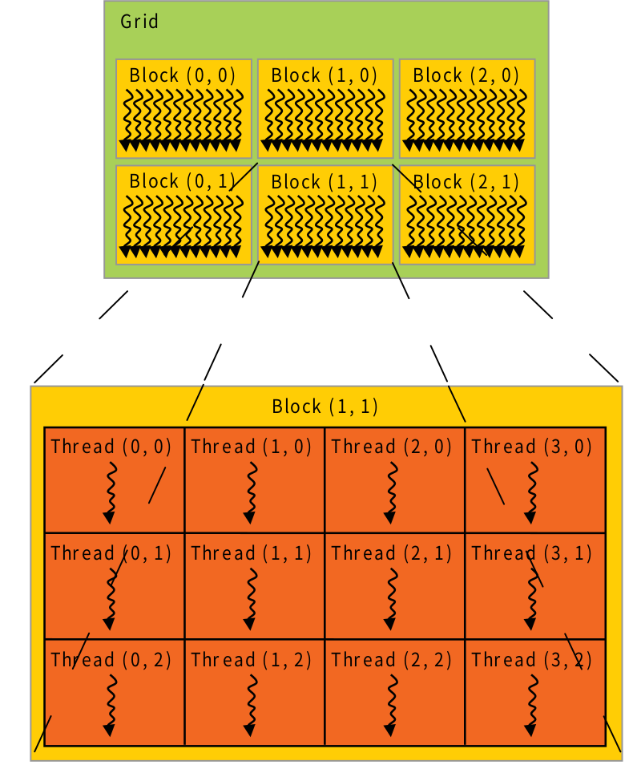

<!-- @import "[TOC]" {cmd="toc" depthFrom=1 depthTo=6 orderedList=false} -->

<!-- code_chunk_output -->

- [GPU架构和cuda程序的配置优化](#gpu架构和cuda程序的配置优化)
  - [GPU的内部拓扑结构](#gpu的内部拓扑结构)
  - [设备程序运行过程](#设备程序运行过程)
  - [程序的优化:](#程序的优化)
  - [compute capability](#compute-capability)
    - [5.x](#5x)
      - [架构](#架构)
      - [全局内存](#全局内存)
      - [共享内存](#共享内存)

<!-- /code_chunk_output -->
# GPU架构和cuda程序的配置优化
## GPU的内部拓扑结构
GPU中包含几个SMs.拓扑结构如下:


- 控制单元(Control Unit)用于分发指令到执行单元,这里包含两种单元:
- -  warp调度器(warp scheduler)
- - 指令分发器(instruction dispatcher)

在compute capability 3.x, 5.x, 6.1, 6.2 和 7.X 的设备上warp调度器是4个.特别的,在compute capability 6.0的设备上warp调度器的个数为2.

- 执行单元(execution unit)包含了多种用于特殊计算的流水线:
- - 单精度 CUDA core;
- - 双精度CUDA core;
- - SFU,LD/ST;

- 内存单元(memory unit)存储数据:
- - 在芯片上(on chip)
- - - 寄存器;
- - - 缓存:
- - - - L1;
- - - - texture cache;
- - - - shared memory;
- - - - constant cache;
- - - 芯片外(slower):
- - - - L2 cache;
- - - - 全局内存(global memory).

如下图所示为内存的层次结构:


## 设备程序运行过程

- 从核函数的执行配置上将线程组分成不同的grid和block.block由一个或多个线程组成,而grid又由一个或者多个block组成.它们的层次结构如下:

- 核函数的实际执行的时候,会将block中的线程在分成不同warp,warp是 作为并发的基本单元,也就是说一个warp同时执行相同的代码段.
- 控制单元获取warp队列中待执行指令并将它发送给执行单元.warp指令是用来调度和执行的基本单元.

- 执行单元执行指令或者内存的读写.

需要注意的是SM通常不止一个流水线(如SM_35有四个调度器),所以可以预期同时执行多个warp,由于warp尺寸为32,所以可以并发执行的线程数为4*32=128个,也就是说就算SM中的线程数大于128,在一个时钟时间最多也只能执行128条线程.

## 程序的优化:
**blockDim的优化**
block中的threads都被分到不同的warp中,每一个warp包含32个线程.所以在选择blockDim时,需要满足blockDim.x\*blockDim.y*blockDim.z是warp的乘倍数.否则多出来的线程需要单独在占据一块warp,会影响到性能.

**warp的优化**
一个warp中的线程是在block中连续的,通常为了warp中线程执行的效率,尽量避免线程执行分支语句(warp diverge),这样warp会将所有的分支都执行一遍,然后根据条件禁止不符合条件的线程.

- 避免shared memory出现Bank conflict.
为了提高读写带宽,cuda将shared memory按照4byte(默认)或者8byte分为32个Bank,每个Bank都可以同时读写,但是同一个bank的不同地址只能串行读写(如果是同一个地址读则进行广播,不会出现冲突).需要注意的是compute capability 3以上的才支持8字节的bank size.
**通过nvvp,nvprof可以查看程序是否存在bank conflict**
```shell
nvprof --events shared_ld_bank_conflict,shared_st_bank_conflict exe
```
查看bank size的函数为:```cudaDeviceGetSharedMemConfig(cudaSharedMemConfig* pConfig)```,设置bank size的函数为:```cudaDeviceSetSharedMemConfig(cudaSharedMemConfig config)```


## compute capability

### 5.x

#### 架构
一个多处理器组成如下:
- 128个CUDA核,用于算法计算;
- 32个特殊函数单元,用于单精度浮点型先验性函数;
- 4个warp调度器;

当一个多处理器得到可执行的warps时,首先将warps分配到四个调度器中,然后在每个指令分发时段,每个调度器将被分配到的一个可执行的warp的一个指令分发到执行单元.
一个多处理器有:
- 只读常量缓存被所有函数单元共享,由于只读常量缓存属于芯片上内存,读取速度比global memory更快.
- 一个24KB的L1/纹理缓存用于从global memory读取的缓存.
- 64KB的共享内存(compute capability5.0);96KB共享内存(compute capability5.2).

#### 全局内存

全局内存(global memory)通常是缓存在L2中,这点和compute capability3.x的设备是一样的.

在核函数执行的整个生命周期只读的数据可以缓存到L1/纹理缓存中,通过__ldg()读取.非只读的数据将无法缓存到L1/纹理缓存中.

#### 共享内存

当一个warp中的线程组访问相同的bank中同一个32-bit word时,是不会出现bank conflict:这时对于读取,当前的word会广播到所有的请求线程中,写的时候只有一个线程(没有确定的执行线程).

但是当warp中的线程组访问同一个bank中的不同的32-bit word时,将会产生bank conflict,所以需要避免这种情况.


