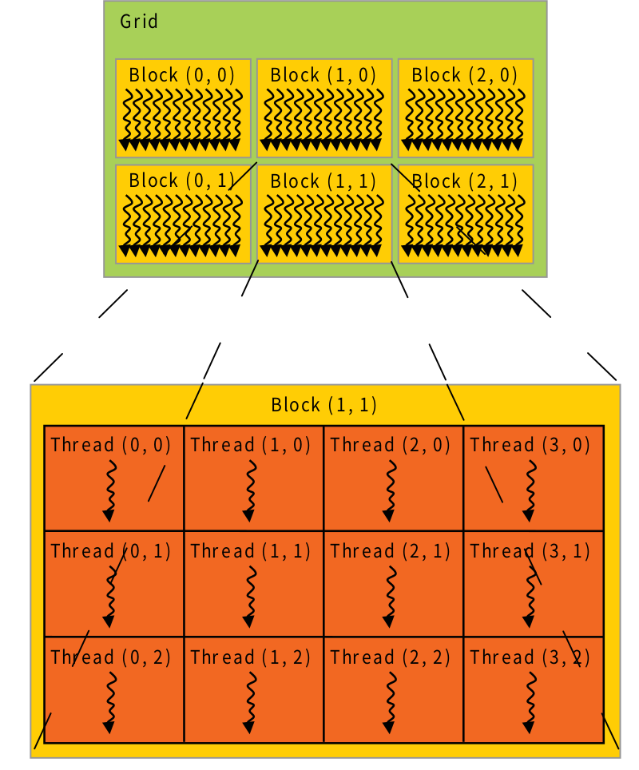

<!-- @import "[TOC]" {cmd="toc" depthFrom=1 depthTo=6 orderedList=false} -->

<!-- code_chunk_output -->

- [
cuda中grid,block,thread的关系
](#centercuda中gridblockthread的关系center)
  - [cuda中gridDim,blockDim,blockIdx,threadIdx的使用](#cuda中griddimblockdimblockidxthreadidx的使用)

<!-- /code_chunk_output -->
# 
cuda中grid,block,thread的关系

## cuda中gridDim,blockDim,blockIdx,threadIdx的使用
- gridDim表示网格的维度，是一个dim3类型，比如一个(1,1,1)大小的网格代表网格中的线程块数量为1；
- blockDim表示线程块的维度，也是一个dim3类型，比如一个(2,2,2)大小的线程块表示一个三维线程块，一块中线程总数为8；
- blockIdx表示在网格(grid)中的线程块的索引，是一个uint3类型，索引是对gridDim线程块先从左到右，然后从上到下，最后从前到后的排序。所以下图中网格线程块的索引就是
$$
\begin{matrix}
0&1&2\\
3&4&5
\end{matrix}
$$
线程块id通用计算方式为
$$ \begin{aligned}blockId=&gridDim.x*gridDim.y*blockIdx.z\\&
+gridDim.x*blockIdx.y\\&+blockIdx.x\end{aligned}$$
- threadIdx表示线程块中线程的索引，也是一个uint3类型，threadIdx索引是对blockDim线程先从左到右，然后从上到下，最后从前到后的排序。所以下图中在本线程块中线程的排序就是
$$
\begin{matrix}
0&1&2&3\\
4&5&6&7\\
8&9&10&11
\end{matrix}
$$
线程id通用计算方法为
$$\begin{aligned}
threadId=&blockId*(blockDim.x*blockDim.y*blockDim.z)\\&+blockDim.x*blockDim.y*blockIdx.z\\&+blockDim.x*blockIdx.y\\&+blockIdx.x
\end{aligned}$$

