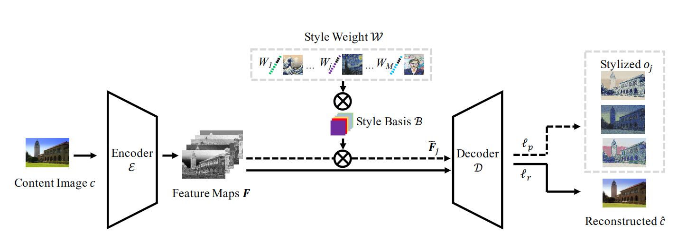

<!-- @import "../../my-style.less" -->
# StyleRemix:一种可理解的图像神经风格迁移表示

StyleRemix致力于学习每个风格的紧凑和可理解的连续向量表示。如下图所示。

StyleRemix模型由三部分组成：
- 一个自编解码器，包括图上的编码器$\varepsilon$和解码器$D$。
- 一个风格基础层$B$。
- 一个风格权重层$W$。
StyleRemix中风格集合中的所有风格都被分解存储到一个共享卷积层，每个特殊的风格都是有一个加权风格基构成。这样，我们可以简单使用一个风格权重+共享卷积基来表示指定的风格。最终，加权风格基和中间层的特征图谱关联形成风格图像$o$。

## 风格基和权重

- **风格基**
通过共享冗余卷积运算产生相似的纹理模式，描述了一个嵌入风格空间集合。StyleRemix通过一个加权卷积过滤来描述指定的风格$s_j$。中间层特征图谱$F$与加权风格基$B_j$经过卷积操作生成迁移特征图谱$\tilde{F_j}$：
$$\tilde{F_j}=B_j\otimes F\tag{1}$$
这里$F\in\R^{c_{in}\times h\times w}$，$B_j\in\R^{c_{out}\times c_{in}\times k_h\times k_w}$，$\tilde{F_j}\in\R^{c_{out}\times h\times w}$。$B_j$是由对应坐标的风格权重$w_j$决定的：
$$B_j=(Xw^T_j)\odot B\tag{2}$$
这里$X\in\R^{c_{out}\cdot k_h\cdot k_w\times1}$，$w_j\in\R^{c_{in}\times1}$，$B\in\R^{c_{out}\cdot k_h\cdot k_w\times c_{in}}$，这里的$\odot$表示按元素相乘。公式1和2中的$B_j$通过变形操作得到。
在StyleRemix中，风格基$B$用一个卷积层$\Beta$表示。
- **风格权重**
使用风格基的一个目的是压缩不同风格的冗余信息。另一个目的是希望风格基可以被解释。换句话说，如果风格基对特定的风格没有贡献，那么它的相关系数应该为0。这就是说，风格权重$w_j$的简单形式如下：
$$
\begin{cases}
    \Delta c_{in}=\{w_j\in\R^{c_{in}\times1}\} \\
     w_j[i]\geq 0 \tag{3}\\
     \sum_{i}w_j[i]=1\\
     \end{cases}
$$
风格基和风格权重同步进行训练。有很多方法可以在学习权重的同时满足公式3的限制。我们把风格权重作为一个可学习的网络层$W$，这个层有两个子层组成：一个没有偏移的线性层$L$和一个softmax层$S$。线性层可以表示为：
$$
y=ax \tag{4}
$$
$a$是标量，$x,y\in\R^{c_{in}\times1}$。softmax层定义为：
$$
y_i=\frac{exp(y_i)}{\sum_jexp(y_j)} \tag{5}
$$
这里的$y_i$表示$y$中的第$i$个元素。