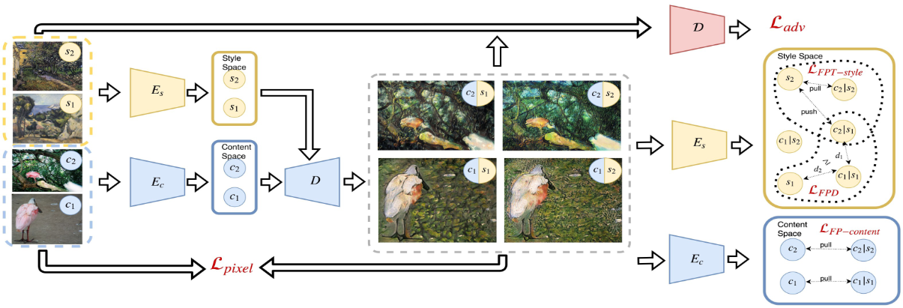

# 
艺术性风格迁移的内容和风格解构

通常来说,艺术家的绘画风格是会发生变化的.为了产生从艺术上可靠的风格化,风格迁移模型需要反应出这些变化和不同.

通过引入两种新的损失:一个定点的三角风格损失用于学习一个或者多种风格内部的细微变化,一个定点的解构损失用于确保风格不会对实际输入的图像有限制性的要求.我们呈现了一个新颖的方式捕获风格的特点和内部的变化,并将样式和内容分开.
这篇文章的主要贡献如下:
- 提出两个新颖的损失用于获得更好图像的风格和风格分布更好的收敛,定点结构损失和定点三角风格损失;
- 我们提出了一个解构艺术作品的风格和内容的方法,在艺术角度使其的风格更有吸引力,并且保持了更多的内容;
- 我们的模型提供了一个平滑的风格空间,可用于一个风格或多个风格的插值化.

## 方法

我们的首要任务如下:
- 给定收集的艺术作品集$(y,s)\sim \bold{Y}$,这里$y$表示一件艺术画,$s$表示一个风格分类标签. 给定照片集$x\sim \bold{X}$,我们想学习转换$\mathcal{G}: X\rarr Y$.为了测定映射$\mathcal{G}$和$\bold{Y}$分布的近似度有多高,我们引入一个识别器$\mathcal{D}$,它的任务是分辨真实样本$y\in \bold{Y}$和样本$x\in\bold{X}$生成的样本$\mathcal{G}(x)$.这个任务相当于学习从照片域到艺术品域的任意的映射关系.

- 为了保存原始图片的内容信息.我们强制要求生成的图片与原图片在像素域上近似.通过最小化距离损失$||\mathcal{G}(x)-x||_2$.

- 我们的生成器是三个网络的结合:内容信息编码器$E_c$和解码器$D$,风格编码器$E_s$.前面两个网络用于生成图像,后面的网络用于从图像$y$中推断风格向量$E_s(y)$.

- 我们希望我们的图像在查询风格图像$\mathcal{G}(x|y)$的条件下,可以进行更好的风格控制.这需要固定输入风格图像$y$时,有条件的调整生成图像.我们建议使用风格编码器$E_s$调整输出,方法是从风格图像$y$中提取风格$E_s(y)$,然后调整生成网络的风格向量.

首先我们致力于通过保持给定画作的风格类别来生成艺术上可靠的风格.对应的条件对抗损失如下:
$$\mathcal{L}_{adv}:=\mathbb{E}_{\substack{(y,s)\sim \bold{Y}}}[\log(\mathcal{D}(y|s))]+\Bbb{E}_{\substack{x\sim\bold{X}\\(y,s)\sim \bold{Y}}}[\log(1-\mathcal{D}(\bold{D}(E_c(x),E_s(y))|s)]$$

然后,通过风格图像$(y,s)$和输入内容图像$x$获得风格化图像应该类似于输入内容图像.因此,我们使用输入图像和风格化图像的重构损失:
$$\mathcal{L}_{pixel}:=\mathbb{E}_{\substack{x\sim \bold{X}\\(y,s)\sim\bold{Y}}}[||(D(E_c(x),E_s(y)))-x||_2^2]$$

然而,我们的目标不仅仅是要求输入内容图像简单的像素级别的相似.事实上这样的损失不利于风格迁移任务,因为许多画师会对颜色和形状改变突出,这样导致像素级别的损失会阻碍风格化任务.考虑到这些,我们让内容编码器$E_c$来决定哪些些特征关系到内容,而哪些可以忽略.这通过定点的内容损失实现:
$$\mathcal{L}_{FP-content}:=\Bbb{E}_{\substack{x\sim\bold{X}\\(y,s)\sim\bold{Y}}}[||E_c(D(E_c(x),E_s(y)))-E_c(x)||_2^2]$$

尽管这些损失已经足够获取一个指定的艺术家的可信风格化信息,但是它们不适用于训练一个合并多艺术家风格的单网络模型.
且如果模型只是用这些损失训练,将会无意中限制输入内容的风格.因此我们引入两个额外的损失用于风格迁移:**定点三角风格损失**和**定点解构损失**.

## 定点三角损失

我们引入定点三角损失:
$$\mathcal{L}_{FP-style}:=\mathbb{E}_{\substack{x\sim\bold{X}\\(y,s)\sim\bold{Y}}}[||E_s(s)-E_s(D(E_c(x),E_s(s)))||^2]$$

这个损失促使网络维持输入风格.然而它对于具有相同风格的不同观感的样本$(y_1,s),(y_2,s)\sim\bold{Y}$表现相似,都映射到相同的点$E_s(y_1)\equiv E_s(y_2)$.这导致了相同的风格化$D(E_c(x),E_s(y_1))\equiv D(E_c(x),E_s(y_2))$.

这个推理可以表现为以下形式:首先,我们希望输入风格用例和风格空间中风格化是类似的.然后,不同风格得到的风格化在风格表示空间中必须表现出距离.这和度量学中广泛应用的三角损失类似.

在这里,对于风格样本$(y_1,s),(y_2,s)\sim\bold{Y}$和内容照片$x\sim\bold{X}$,锚点是风格编码得到的$E_s(y_1)$,正样本是$E_s(D(E_c(x),E_s(y_1)))$,负样本是$E_s(D(E_c(x),E_s(y_2)))$.对应风格边缘尺寸$r$,我们定义对于该风格的定点三角损失:
$$\begin{aligned}\mathcal{L}_{FPT-style}:&=\mathbb{E}_{\substack{x\sim\bold{X}\\(y_1,s_1),(y_2,s_2)\sim\bold{Y}}}\max\Big(0,\\ 
&r+||E_s(y_1)-E_s(D(E_c(x),E_s(y_1)))||^2-\\
&||E_s(y_1)-E_s(D(E_c(x),E_s(y_2)))||^2\Big)\end{aligned}$$

## 解构损失

内容和风格是纠缠在一起的.为了分离二者,必须是目标风格独立于目标内容.这可以通过最小化以下损失实现:
$$\mathbb{E}[||E_s(D(E_c(x_1),E_s(y)))-E_s(D(E_c(x_2),E_s(y)))||^2]$$

然而,这个损失太严格,阻碍了模型的成功训练.因此我们需要软化限制:我们简单的使用风格损失$\mathcal{L}_{FP-style}$绑定.对于输入风格样本$(y,s)\sim\bold{Y}$和两个随机图片$x_1,x_2\sim\bold{X}$,我们定义定点解构损失:
$$\begin{aligned}\mathcal{L}_{FPD}&=\mathbb{E}_{\substack{x_1,x_2\sim\bold{X}\\(y,s)\sim\bold{Y}}}\max\Big(0,\\
&||E_s(D(E_c(x_1),E_s(y)))-E_s(D(E_c(x_2),E_s(y)))||^2-\\
&||E_s(y)-E_S(D(E_c(x_1),E_s(y)))||^2
\end{aligned}$$

定点三角损失阻止不同的风格化形成相同的风格,而定点解构损失缓解内容图片对风格化的影响.

## 训练和模型架构

如图所示,训练迭代中使用一对内容信息$c_1,c_2$的内容图片和一对风格信息$s_1,s_2$的风格图片.下一步,图像对分别通过内容编码器$E_c$和风格编码器$E_s$.现在通过解码器$\mathcal{D}$生成了所有可能的内容和风格组合表示.结果图像再次输入到样式编码器$E_s$来计算$\mathcal{L}_{FPT-style}$.结果图像被输入到识别器$\mathcal{D}$来计算条件对抗损失$\mathcal{L}_{adv}$,结果图像被输入到$E_c$来计算在风格化$c_2|s_2,c_1|s_1$和原$c_2,c_1$之间的$\mathcal{L}_{FP-content}$.