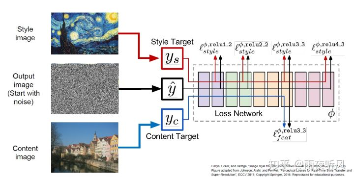
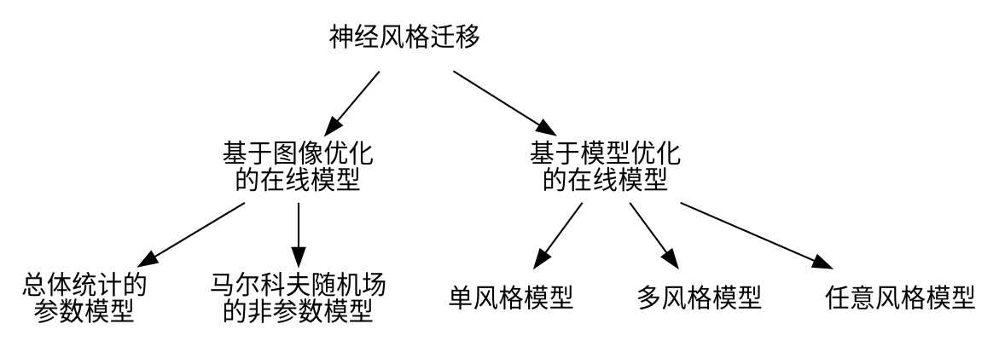

<!-- @import "../../my-style.less" -->

<!-- @import "[TOC]" {cmd="toc" depthFrom=1 depthTo=6 orderedList=false} -->

<!-- code_chunk_output -->

- [风格迁移](#center风格迁移center)
  - [风格迁移的引入](#风格迁移的引入)
  - [风格迁移的分类](#风格迁移的分类)
  - [多风格模型](#多风格模型)
    - [StyleBank：一个神经图像风格迁移的确切方法](#stylebank一个神经图像风格迁移的确切方法)
      - [介绍](#介绍)
      - [网络结构](#网络结构)
  - [任意风格模型](#任意风格模型)
  - 

<!-- /code_chunk_output -->

# 
风格迁移

风格迁移是指将一张照片转化成指定风格的图像的新的图像，从而实现风格滤镜的效果。
从 2015 年[A Neural Algorithm of Artistic Style](https://arxiv.org/abs/1508.06576)文章发表以后，图像风格迁移正在成为神经网络热门的研究方向，由此衍生出许多网络，在实时性和效果上都有了很大的提升。现在已有相关的风格滤镜应用如 Prisma、microsoft 使用了风格迁移神经网络。下面将从风格迁移的发展一步步讲解不同的神经网络模型。

## 风格迁移的引入

简单来说便是输入一张随机噪音构成的底图，通过计算 Style Loss 和 Content Loss，迭代 update 底图，使其风格纹理上与 Style Image 相似，内容上与原照片相似。正常的训练过程是通过 loss 反向传播更新网络参数，这里则是用一个已经训练好的 VGG16 作为 backbone，锁住参数，更新输入的底图。

- content loss

$$
\mathcal{L}_{content}(\overrightarrow{p},\overrightarrow{x},l)=\frac{1}{2}\sum_{i,j}(F_{ij}^l-P_{ij}^l)^2
$$

即 Content image 和 Output image 在某一层（VGG16 第四层）的距离的平方和

- style loss
  $$E_l=\frac{1}{4N_l^2M_l^2}\sum_{i,j}(G_{ij}^l-A_{ij}^l)^2$$

这里需要用到一个在纹理生成领域比较常见的 Gram Matrix，来衡量 Style image 和 output image 在某一层的风格相似性。作者对前四层的 feature map 都进行了计算，加权求和。这里给出 CS231n 描述的计算方法还有另一位博主写的理解以供参考（[Image Style Transfer：多风格 TensorFlow 实现](https://link.zhihu.com/?target=https%3A//www.cnblogs.com/subic/p/8110478.html)）。

    Each layer of CNN gives C x H x W tensor of features; H x W grid of C-dimensional vectors. Outer product of two C-dimensional vectors gives C x C matrix measuring co-occurrence. Average over all HW pairs of vectors, giving Gram matrix of shape C x C
    Gram矩阵就是每一层滤波后的feature map, 后将其转置并相乘得到的矩阵，如下图所示。其实就是不同滤波器滤波结果feature map两两之间的相关性。譬如说，（如下图）某一层中有一个滤波器专门检测尖尖的塔顶这样的东西，另一个滤波器专门检测黑色。又有一个滤波器负责检测圆圆的东西，又有一个滤波器用来检测金黄色。对梵高的原图做Gram矩阵，谁的相关性会比较大呢？如上图所示，“尖尖的”和“黑色”总是一起出现的，它们的相关性比较高。而“圆圆的”和“金黄色”都是一起出现的，他们的相关性比较高。因此在风格转移的时候，其实也在风景图里去寻找这种“匹配”，将尖尖的渲染为黑色，将圆圆的渲染为金黄色。如果我们承认“图像的艺术风格就是其基本形状与色彩的组合方式” ，这样一个假设，那么Gram矩阵能够表征艺术风格就是理所当然的事情了

## 风格迁移的分类

现在风格迁移神经网络方法可以分为:

## 多风格模型

### StyleBank：一个神经图像风格迁移的确切方法

#### 介绍

&emsp;为了研究一个确切的风格表示方式，我们重新考虑了通过回接 texton(被称为纹理的基本元素)映射的方法来进行神经风格迁移，此时一个 texton 到目标位置的映射等价于一个 texton 到图像空间的狄拉克$\delta$函数(表示取样位置)之间的卷积。

&emsp;基于以上想法，提出了 StyleBank(风格库)，由多个卷积过滤器组成，每一个卷积过滤器表示一个特定的样式。为了实现图片的特定风格迁移，需要对相应的过滤器和一个自编码器产生的中间特征进行卷积运算，将原图像分解成多层特征响应图谱。这让我们第一次得到了一个神经风格迁移的潜在机理的确切理解。

&emsp;在我们所提出的前馈网络中使用了联合学习的方式来学习 StyleBank 和自编码器。这让我们不仅可以同时学习一系列不同的风格时，而且可以为一个新的图像风格提供一个非常有效的增量学习。这是保持自编码器固定的同时通过学习一个新的过滤器实现。

&emsp;我们确信这对最近的融合风格迁移类型的手机应用非常有效(如 Prisma)，因为我们不再需要对每种不同的风格训练一个单独的网络。更重要的是这甚至可以让用户有效的自定义他们自己的风格滤镜并分享给他人。因为我们的图像编码在不同的风格之间共享，这将给用户提供一个更快速便利的风格切换。

&emsp;确切的表示方法让我们更容易的控制风格迁移和创造新的有趣的风格融合效果。更特别的是我们可以将不同的风格线性融合起来，或者在特定区域产生风格融合效果。换句话说我们有可能将梵高和毕加索的画像融合到一个艺术品中。

&emsp;相比以前的风格迁移网络，我们的创新点在于：

- 我们提出了一个确切的风格表达方法。这让我们的网络在学习后可以将内容和风格完全分离。
- 由于确切的风格表达让我们的方法可用于基于区域的风格迁移。这在已有的神经网络中是不可能实现的，尽管传统的纹理迁移方法可以实现这个。
- 我们的方法不仅可以同步训练共享一个自编码器的多个风格过滤器，还可以固定自编码器时增量学习一个新风格过滤器。

&emsp;StyleBank 包含多个卷积过滤库。每一个过滤库表示一种风格，过滤库中的所有通道可以看作风格元素的基(如纹理模式，硬的或软的笔触)。通过和内容图像中间特征图谱的卷积运算，过滤库可以映射到内容图像产生不同的风格结果。实际上这类似与纹理基元映射到图像空间，可以被解释为纹理基元和狄拉克$\Delta$函数的卷积运算(表示取样位置)。

---

#### 网络结构

**编码器和解码器** 图像编码器$\varepsilon$由一个步长 1 的卷积层和两个步长 2 的卷积层组成，图像解码器$\mathcal{D}$对称的由两个步长 1/2 的卷积层和一个步长 1 的卷积层组成。所有的卷积层后都跟随着实例归一化(Instance Normalization)和一个 RELU 激活函数除了最后输出层。实例归一化已经被证明在处理由 padding 带来的边界伪影比空间批归一化更好。除了第一层和最后一层使用 9x9 的卷积核，所有其他的层都是用 3x3 的卷积核。得益于确切的表示，我们的网络可以去除以前风格迁移网络中所有的参差块。这在保持模型的表现的同时进一步减少了模型尺寸和计算代价。

---

**StyleBank 层** 我们的网络允许多种风格同时开始训练。在 StyleBank 层$\mathcal{K}$，我们学习 n 个过滤库$\lbrace K_i\rbrace,(i=1,2,\cdots,n)$(作为风格库)。在训练时我们需要指定第 i 个风格，并使用对应的过滤库$K_i$前向和反向传播梯度。这是迁移的特征$\tilde{F_i}$由此得到

$$\tilde{F_i}=K_i\otimes F\tag{1}$$

这里$\large F\in \R^{c_{in}\times h\times w}$,$\large K_i\in \R^{c_{out}\times c_{in}\times k_h\times k_w}$，$\large\tilde{F}\in\R^{c_{out}\times h\times w}$，$c_{in}$和$c_{out}$表示对应$F$和$\tilde{F}$特征通道，$(h,w)$是特征图片的尺寸，$(k_w,k_h)$表示卷积核大小。为了充分训练我们网络中的新风格，我们会在新的训练中重用编码器$\Large\varepsilon$和解码器$\mathcal{D}$。我们固定$\Large\varepsilon$和$\mathcal{D}$，仅仅只训练随机初始化的新过滤库$\mathcal{K}$层。

---

**损失函数** 我们的网络包含两个分支：自编码器$\Large\varepsilon\normalsize\rightarrow\mathcal{D}$；风格化$\Large\varepsilon\normalsize\rightarrow\mathcal{K}\rightarrow\mathcal{D}$，是交替训练的。因此我们需要定义两个损失函数对应到两个分支。

- 自编码器分支，我们使用 MSE 损失(均方差损失)作为输入图像$I$和输出图像$O$的等价的损失$\mathcal{L_I}$：

$$\mathcal{L_I}(I,O)=||O-I||^2\tag{2}$$

- 风格化分支中，我们使用感知损失$\mathcal{L_K}$(perceptual loss)，这个损失由内容损失$\mathcal{L_c}$，风格损失$\mathcal{L_s}$和一个变量正则化损失$\mathcal{L}_{tv}(O_i)$

$$\mathcal{L_K}(I,S_i,O_i)=\alpha\mathcal{L_c}(O_i,I)+\beta\mathcal{L_s}(O_i,S_i)+\gamma\mathcal{L}_{tv}(O_i)\tag{3}$$

这里的$I,S_i,O_i$分别是输入图像，风格图像和风格化结果(第 i 个风格)。$\mathcal{L_c}$和$\mathcal{L_s}$使用相同的定义：

$$
\mathcal{L_c}(O_i,I)=\sum_{l\in\lbrace l_c\rbrace}||F^l(O_i)-F^l(I)||^2\\
\mathcal{L_s}(O_i,S_i)=\sum_{l\in\lbrace l_s\rbrace}||G_i(F^l(O_i))-G_i(F^l(S_i))||^2\tag{4}
\end{aligned}$$

这里$F^l$和$G_i$是VGG-16网络(经过ImageNet数据集上预训练)层$l$对应的特征图谱和格拉姆矩阵。$\lbrace l_c\rbrace,\lbrace l_s\rbrace$是VGG-16的指定层用于计算对应的内容损失和风格损失

------------------------------------
**训练策略** 我们使用一个T+1步交替训练策略来平衡两个分支。训练时，在每个T+!迭代中，我们首先在分支$\mathcal{K}$上训练T次，然后在自编码器分支上训练一次。下面展示了训练的过程。

----------------------------------
**for** 每T+1次迭代 **do**
&emsp;//训练分支$\Large\varepsilon\normalsize\rightarrow\mathcal{K}\rightarrow\mathcal{D}$
&emsp; **for** t=1 to T **do**
&emsp; &emsp;- 取样本$m$张图像$X=\lbrace x_i\rbrace$和风格片段$Y=\lbrace y_i \rbrace$，$i\in\{1,\cdots,m\}$作为一个最小批次。
&emsp; &emsp;- 更新$\Large\varepsilon$ ，$\mathcal{D}$和$\{K_j\},j\in Y$：
$$

\Delta*{\theta*{\varepsilon,D}}^{\mathcal{K}}\leftarrow\nabla*{\theta*{\varepsilon,D}}\mathcal{L*K}\\
&\Delta*{\theta*{\mathcal{K}}}\leftarrow\nabla*{\theta\_{\mathcal{K}}}\mathcal{L_K}

$$
&emsp;**end for**
&emsp;训练分支$\Large\varepsilon\normalsize\rightarrow\mathcal{D}$：
&emsp;&emsp;- 只更新$\Large\varepsilon$ ，$\mathcal{D}$:
$$

\Delta*{\theta*{\varepsilon,D}}^{\mathcal{I}}\leftarrow\nabla*{\theta*{\varepsilon,D}}\mathcal{L*I}\\
\Delta*{\theta*{\varepsilon,D}}^{\mathcal{I}}\leftarrow\lambda\frac{||\Delta*{\theta*{\varepsilon,D}}^{\mathcal{K}}||}{||\Delta*{\theta*{\varepsilon,D}}^{\mathcal{I}}||}\Delta*{\theta\_{\varepsilon,D}}^{\mathcal{I}}\\

$$
**end for**

---

这里的$\lambda$是两个分支的权衡。$\Delta_{\theta_{\mathcal{K}}}$表示过滤库$\mathcal{K}$的梯度。$\Delta_{\theta_{\varepsilon,D}}^{\mathcal{K}}$，$\Delta_{\theta_{\varepsilon,D}}^{\mathcal{I}}$代表风格化分支的梯度$\Large\varepsilon$和$\mathcal{D}$。
$$

## 任意风格模型

##

$$
$$
