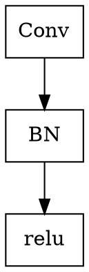
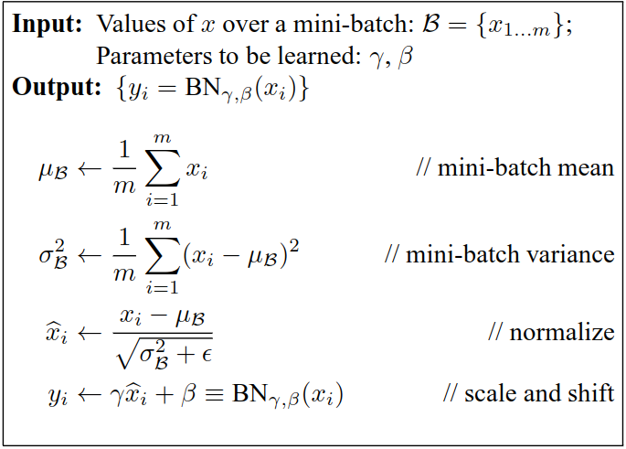
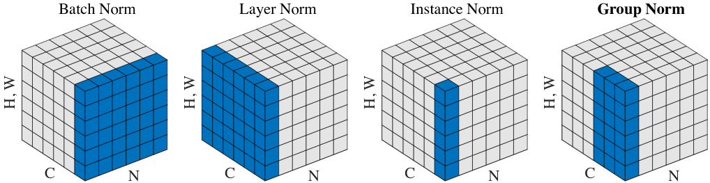

<!-- @import "[TOC]" {cmd="toc" depthFrom=1 depthTo=6 orderedList=false} -->

<!-- code_chunk_output -->

- [深度学习中的各种normalization](#center深度学习中的各种normalizationcenter)
  - [1. batch normalization(批正则化)](#1-batch-normalization批正则化)
  - [2. Group Normalization(组正则化)](#2-group-normalization组正则化)

<!-- /code_chunk_output -->
# 
深度学习中的各种normalization

机器学习领域有一个重要的假设:IID独立同分布假设,就是假设训练数据和测试数据是满足相同分布的,这是通过训练数据获得的模型能够在测试集获得好的效果的一个基本保障.

随着深度神经网络层数加深,训练起来越困难,收敛越来越慢.

## 1. batch normalization(批正则化)

batch normalization适用于解决"Internal Covariate Shift"问题的."Covariate Shift"是指深度神经网络在训练的过程中,每一个网络层的参数不停的变化,导致相应的下一层输入分布不停的变化."Internal Covariate Shift"则是指网络的隐藏层发生的这种问题.在这种变化往往需要良好的层参数初始化和更小的学习率,进而导致训练效果降低.
因此,怎样让每个隐藏层的激活输入分布固定下来?

因为深层神经网络在做非线性变换前的激活输入值(就是$x=WU+B$,$U$是输入)随着网络层数的加深或者在训练过程中,其分布逐渐发生偏移或者变动,之所以训练收敛慢,一般是整体分布逐渐往非线性函数的取值区间的上下线两端靠近(对于Sigmoid函数来说,意味着激活输入值$WU+B$是大的负值或正值),所以这导致反向传播时越靠前的网络层的梯度越小,最终导致前面的网络梯度消失,这是训练深层网络收敛越来越慢的原因.

而BN通过一定的规范化手段,把每层神经网络任意神经元这个输入值的分布强行拉回到正态分布,这样使得激活输入值落在非线性函数对输入比较敏感的区域,这样输入的小变化就会导致损失函数较大的变化.这样就可以让梯度变大,避免梯度消失的问题,梯度变大意味着损失函数加速趋向收敛,大大加快了训练速度.

如果直接将当前层输入简单的归一化处理会改变当前层表达信息,如将Sigmoid输入进行归一化将会促使非线性转化为线性函数,这样该层就失去了表达能力.
$$\hat{x}^{(k)}=\frac{x^{(k)}-E[x^{(k)}]}{\sqrt{Var[x^{(k)}]}}$$

k表示当前层id.
为了解决这个问题,将归一化得到的标准正太分布转变为以下形式:
$$y^{(k)}=\gamma^{(k)}\hat{x}^{(k)}+\beta^{(k)}$$

最终BN的转化形式如下:

## 2. Group Normalization(组正则化)

BN的误差随着batch尺寸的变小迅速增加,这是源于不正确的batch统计估计.这将限制BN在检测,分割,视频等机器视觉的大模型的训练和特征迁移,这些训练因为内存消耗的关系需要小batch尺寸.

GN作为BN的替换选择,将图像通道分成groups然后计算每个group的平均值和方差,用于标准化.GN的计算独立于batch尺寸,且在batch尺寸大的变化范围都有稳定的准确率.

Batch Norm, Layer Norm, Instance Norm, Group Norm对比:
