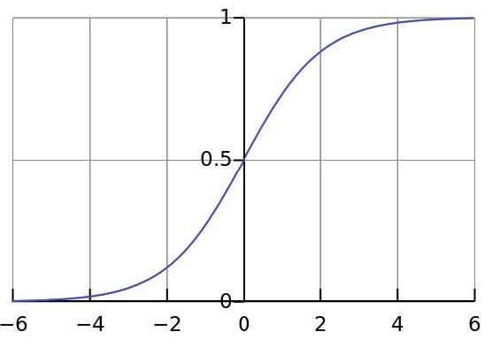

# 激活函数
神经网络中在两个神经元之间的函数即是激活函数.

激活函数主要是向神经网络引入非线性函数,这样神经网络的表达能力就更加强大,不再是输入的线性组合,几乎可以逼近任何函数.如果没有激活函数,无论神经网络的层次有多深,输出都是输入的线性组合,与没有隐藏层效果相当.

现在有许多激活函数,如下:
- Sigmoid函数;
- tanh函数;
- relu函数;

# Sigmoid函数

Sigmoid函数的数学形式如下:
$$f(x)=\frac{1}{1+e^{-x}}$$

Sigmoid几何图像如下:

**优点**:
它能够将连续的输入转化为0~1之间的连续输出.
**缺点**:
在深度神经网络反向传播的过程中,随着层深的增加,梯度不断递减,容易造成梯度消失的问题.导致深度神经网络中前面部分的神经元得不到训练.而在训练之前神经元的参数往往是通过随机的初始化正太分布的,这将前面的几个神经元没有实际的表达效果.

Sigmoid的输出不是0均值的,导致$f(x)=w^Tx+b$对$w$的求局部梯度同号,这样在反向传播的过程中每个神经元的$w$会向相同的方向更新,导致一个捆绑效果,使得收敛缓慢.

Sigmoid中含有幂运算,计算机求解相对较费时.

# tanh函数

tanh函数的数学形式如下:
$$tanh(x)=\frac{e^{x}-e^{-x}}{e^{x}+e^{-x}}$$

tanh函数解决了Sigmoid函数不是0均值的问题,但是梯度消失的问题和幂运算的问题依然存在.

# relu函数
relu函数的形式如下:
$$relu=max(0,x)$$

Relu函数在除了0点之外的地方的导数为常数.,有几个优点:
- 解决了梯度消失的问题(正区间);
- 计算速度很快;
- 收敛速度远快于Sigmoid和tanh.

缺点有几点需要注意:
- 输出不是0均值的,均值应该是大于0的某个值;
- 部分神经元可能永远不会被激活,导致相应的参数永远不会被更新.两种导致这种情况的原因:(1)不合理的参数初始化;(2)learning rate太高导致在训练过程中参数更新太大.解决办法是可以采用Xavier初始化方法,以及避免设置过大的学习率或者使用adagrad等自动调节学习率的方法.

**leaky relu函数**
leaky relu函数的表达式:
$$f(x)=max(ax,x)$$
上式的a是一个很小的数,如下图所示:

这里的a取0.01,导致左半边的直线斜率接近于0.

理论上leaky relu有relu的所有优点,且避免了相应的问题,但是实际上,并没有完全证明Leaky relu总好于relu.

**ELU函数**

函数的表达式:
$$f(x)=\begin{cases}
x, &if\  x>0\\
a(e^x-1), &otherwise
\end{cases}
$$

缺点是在左边面计算量较大,涉及到幂运算.类似于leaky relu.