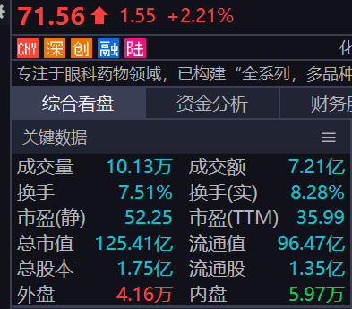

<!-- @import "[TOC]" {cmd="toc" depthFrom=1 depthTo=6 orderedList=false} -->

<!-- code_chunk_output -->

- [投资笔记](#投资笔记)
  - [同花顺软件的用法](#同花顺软件的用法)
    - [A股股票交易订单按数额分类](#a股股票交易订单按数额分类)
    - [历史换手衰减系数](#历史换手衰减系数)
    - [BUG](#bug)
    - [板块对应标记](#板块对应标记)
  - [技术指标](#技术指标)
    - [布林带](#布林带)
    - [KDJ](#kdj)
    - [KDJ和布林带](#kdj和布林带)
      - [协同判断超买超卖](#协同判断超买超卖)
      - [进阶用法：背离与形态共振](#进阶用法背离与形态共振)
      - [参数优化与注意事项](#参数优化与注意事项)
    - [K线图形分析](#k线图形分析)
      - [多方炮](#多方炮)
      - [乌云盖顶](#乌云盖顶)
  - [澄明之境阅读笔记](#澄明之境阅读笔记)
    - [澄明之境-投资哲学](#澄明之境-投资哲学)
    - [澄明之境-投资思路和策略](#澄明之境-投资思路和策略)
      - [澄明之境-交易思路](#澄明之境-交易思路)
      - [澄明之境-风险管控](#澄明之境-风险管控)
      - [澄明之境-交易策略](#澄明之境-交易策略)
    - [澄明之境-建立对自己的交易系统的投资信仰](#澄明之境-建立对自己的交易系统的投资信仰)
      - [澄明之境-对信则灵的理解](#澄明之境-对信则灵的理解)
      - [澄明之境-投资信仰过程](#澄明之境-投资信仰过程)
  - [市场行情的分析](#市场行情的分析)
    - [多方和空方](#多方和空方)
    - [股票趋势中的引导者](#股票趋势中的引导者)
    - [外盘和内盘](#外盘和内盘)
    - [竞价+分时图+振幅的含义](#竞价分时图振幅的含义)
    - [成交量的含义](#成交量的含义)
    - [股票的盘面分析确定买卖点](#股票的盘面分析确定买卖点)
      - [最佳买卖点](#最佳买卖点)
      - [做多拐点](#做多拐点)
      - [做空拐点](#做空拐点)
    - [关于热点板块的一些思考](#关于热点板块的一些思考)
  - [交易系统](#交易系统)
    - [一些交易历史的回顾](#一些交易历史的回顾)
    - [做T](#做t)
      - [趋势情况下不要做T](#趋势情况下不要做t)
    - [风控](#风控)
    - [股票数量的控制](#股票数量的控制)
    - [可参与的交易策略的初步设想](#可参与的交易策略的初步设想)
      - [短线热点交易](#短线热点交易)
      - [短线趋势波段交易](#短线趋势波段交易)
    - [交易策略](#交易策略)
      - [买入的策略](#买入的策略)
      - [卖出的策略](#卖出的策略)
      - [网上的一段关于下跌趋势中的反弹做法](#网上的一段关于下跌趋势中的反弹做法)

<!-- /code_chunk_output -->

# 投资笔记

## 同花顺软件的用法

### A股股票交易订单按数额分类

A股股票交易订单按数额分类为特大单，大单，中单和小单。

- 特大单：>=100w的数额的单笔交易
- 大单：>=30,<100W的数额的单笔交易
- 中单：>=5W,<30W的数额的单笔交易
- 小单：<5W的数额的单笔交易

### 历史换手衰减系数

在讲这个概念之前，我们先分享两个股票的基本概念。股票上市时分为流通股和非解禁的股票。

为什么股票会解禁和非解禁呢？在A股市场中，经常会存在这样的现象，也就是大股东清仓式减持，试想下，公司的创始股东就已经开始清仓式减持，那么后续公司的前景可想而知。所以，为了保护中小投资者，防止股票一上市就有人高位套现，所以股票刚上市时，大股东的部分是非解禁的，也就是卖不了。这部分股票每年解禁一部分。这样就可以有效避免大股东套现。

在筹码系统中，只对流通盘的股票进行研究。

但是流通盘的股票也会有所不同，我们都知道，每一支股票都有大股东，甚至有的股票大股东占比超过了90%，有的股票十大流通股东占比只有10%不到，正是由于不同股票的流通股东占比不同，所以筹码系统，只能按照每个上市公司没有大股东，所有流通盘的股票都可以买卖，来进行筹码统计。

但是，实际上不是这样的，占比超过90%的股票，实际上流通盘只有10%。也就是假如流通股本10亿的话，只有1亿能够买到，所以这个时候的筹码就是错误的，必须进行历史换手衰减系数的调整，对筹码进行优化。这就是历史换手衰减系数的来源。其计算方法：历史换手衰减系数 = 1/（1-十大流通股东占比）。

假如十大流通股东占比90%的股票，衰减系数就是10，相当于筹码的移动速度放大了10倍，那么筹码分布情况，会有很大不同。

### BUG

全a指数页面中有关大单净量和主力净流入的值应该放反了。

### 板块对应标记

|标记|板块|
|---|---|
|1| 电子|
|2| 机械设备或建筑装饰|
|3| 计算机通信或零售|
|4| 金融或传媒|
|5| 金属材料或建筑材料|
|6| 电力设备或电力|
|7| 基础化工|
|8| 汽车或食品饮料|
|9| 医药生物|

|标记|颜色|板块|
|---|---|---|
|1|白色|半导体|
|1|橙色|消费电子|
|1|粉色|光学光电子|
|1|蓝色|其他电子|
|1|绿色|元件|
|1|红色|电子化学品|
|1|紫色|军工电子|
|2|白色|通用设备|
|2|橙色|自动化设备|
|2|粉色|专用设备|
|2|蓝色|工程机械|
|2|绿色|轨交设备|
|2|紫色|建筑装饰|
|2|红色|军工装备|
|3|白色|IT服务|
|3|橙色|软件开发|
|3|粉色|计算机设备|
|3|蓝色|零售|
|3|绿色|通信设备|
|3|紫色|通信服务|
|3|红色|游戏|
|4|白色|电网设备|
|4|橙色|电池|
|4|粉色|光伏设备|
|4|蓝色|电机|
|4|绿色|其他电源设备|
|4|紫色|电力|
|4|红色|风电设备|
|5|白色|汽车零部件|
|5|橙色|汽车整车|
|5|粉色|电器|
|5|蓝色|白酒|
|5|绿色|食品加工|
|5|紫色|饮料制造|
|5|红色|汽车服务及其他|
|6|白色|工业金属|
|6|橙色|金属新材料|
|6|粉色|小金属|
|6|蓝色|能源金属|
|6|绿色|建筑材料|
|6|紫色|钢铁|
|6|红色|贵金属|
|7|白色|化学制品|
|7|橙色|塑料制品|
|7|粉色|化学原料|
|7|蓝色|农化制品|
|7|绿色|橡胶制品|
|7|紫色|其他材料|
|7|红色|化学纤维|
|8|白色|医疗服务|
|8|橙色|医疗器械|
|8|粉色|化学制药|
|8|蓝色|中药|
|8|绿色|生物制品|
|8|紫色|医药商业|
|9|白色|银行|
|9|橙色|多元金融|
|9|粉色|保险|
|9|蓝色|证券|
|9|绿色|文化传媒|
|9|紫色|影视院线|

其他不在这里面的板块，是因为标记种类有限，实在放不下了。

## 技术指标

### 布林带

布林带（Bollinger Bands）的计算方法及用途

***布林带的计算公式***

布林带由三条线组成：中轨线（中线）、上轨线（Upper Band）和下轨线（Lower Band）。具体计算步骤如下：
>中轨线（中线）:
中轨线是价格的简单移动平均线（SMA），默认周期通常为 20天。
公式：
$$中轨线=SMA(N)=\frac{\sum_{i=1}^N收盘价_i}{N}$$
$N$ 为周期，如20天
>
>上轨线与下轨线:
上轨线 = 中轨线 + k×标准差
下轨线 = 中轨线 - k×标准差
标准差（Standard Deviation）：衡量价格波动性，默认k=2（即两倍标准差）。
公式：
$$标准差=\sqrt{\frac{\sum_{i=1}^N({收盘价_i−SMA(N)})^2}{N}}$$

***布林带的核心用途***

布林带通过动态反映价格波动性，帮助交易者分析市场趋势和潜在交易信号：
>判断价格波动性
>>带宽（Bandwidth）：上轨与下轨之间的距离。
>>>带宽扩大：市场波动性增加（如趋势启动或重大消息影响）。
带宽收窄：市场波动性降低（如盘整阶段）。
>
>识别超买与超卖区域
>>价格触及上轨：可能处于超买状态，短期回调概率较高。
价格触及下轨：可能处于超卖状态，短期反弹概率较高。
注意：在强势趋势中，价格可能沿上轨或下轨持续运行，需结合趋势判断。
>
>趋势确认
>>价格在中轨上方运行：表明市场处于上升趋势。
价格在中轨下方运行：表明市场处于下降趋势。
中轨斜率变化：反映趋势强度的变化。
>
>捕捉突破信号
>>价格突破上轨：若伴随成交量放大，可能预示上涨趋势延续。
价格突破下轨：若伴随恐慌性抛售，可能预示下跌趋势加速。
假突破：需结合其他指标（如RSI、MACD）验证。
>
>布林带收口与开口
>>收口（Squeeze）：带宽极窄时，预示即将爆发大波动（突破行情）。
开口：带宽扩大时，标志趋势确立或加速。

***布林带的实战应用示例***

震荡行情中的交易
>策略：价格触及下轨时买入，触及上轨时卖出（需结合其他指标过滤信号）。
风险：在趋势行情中可能频繁止损。

趋势行情中的跟随
>策略：价格沿上轨运行时持有或加仓，沿下轨运行时减仓或做空。
优势：捕捉趋势中段利润，避免过早止盈。

结合其他指标增强信号
>MACD：布林带收口时，若MACD出现金叉，可预判向上突破。
成交量：突破布林带时需成交量配合，否则可能是假信号。

***参数调整与注意事项***

参数优化
>周期（N）：默认20天，缩短周期（如10天）可提高灵敏度，但信号噪音增加。
标准差倍数（k）：默认2倍，增大倍数（如3倍）可减少误判，但可能错过交易机会。

常见误区
>盲目逆势操作：在单边行情中，逆势交易（如触碰上轨即做空）可能导致重大亏损。
忽视市场环境：需结合大盘趋势、行业背景和基本面分析综合判断。

适用市场
>股票、外汇、加密货币：适用于流动性高、波动性强的市场。
不适用场景：流动性差或长期横盘的市场，布林带信号可能失效。

***总结***

布林带通过量化价格波动性，为交易者提供趋势判断、超买超卖信号及突破预警。其核心价值在于：
>动态适应市场：带宽随波动性自动调整，避免静态指标的滞后性。
多场景适用：既可用于震荡行情的高抛低吸，也可用于趋势行情的持仓跟随。

关键要点：
>价格触及布林带上下轨并非绝对反转信号，需结合趋势和成交量验证。
布林带收口是潜在突破的前兆，需提前制定交易计划。
参数设置需根据交易品种和周期优化，避免“一刀切”。

通过灵活运用布林带，交易者可更精准地捕捉市场机会，但需与其他工具结合使用以提升胜率。

### KDJ

***KDJ指标构成***

KDJ指标由三条曲线组成：
> K线（快线）：反映短期价格波动，对价格变化敏感。
>D线（慢线）：K线的平滑移动平均线，过滤短期噪音，体现中期趋势。
>J线（方向线）：通过K与D的差值进一步放大波动，提前预警趋势变化。

***计算公式***

KDJ的计算基于最高价、最低价、收盘价，默认周期为9天，具体步骤如下：

>计算RSV（未成熟随机值）：
$$RSV=\frac{Close_t−Low_9}{High_9−Low_9}×100$$
$Closet_t$​：当日收盘价
$High_9$​和$Low_9$​：过去9天内的最高价和最低价。
>
>计算K值和D值：
>>K值：RSV的3日指数移动平均（EMA）
$$K_t=\frac{2}{3}×K_{t−1}+\frac{1}{3}×RSV_t$$
D值：K值的3日EMA
$$D_t=\frac{2}{3}×D_{t−1}+\frac{1}{3}×K_t$$
计算J值：
$$J_t=3×K_t−2×D_t$$

***核心应用方法***

> 超买超卖信号
>> 超买区域：K、D线 > 80，预示价格可能回调。
超卖区域：K、D线 < 20，预示价格可能反弹。
>
> 交叉信号
>> 金叉（买入信号）：K线从下向上穿越D线，尤其在超卖区（<20）时更可靠。
死叉（卖出信号）：K线从上向下穿越D线，尤其在超买区（>80）时更有效。
>
> 背离判断
>> 顶背离：价格创新高，但KDJ未创新高，预示上涨动力衰竭。
底背离：价格创新低，但KDJ未创新低，暗示下跌动能减弱。
>
> J线的辅助作用
>> J线 > 100：极度超买，短期可能见顶。
J线 < 0：极度超卖，短期可能触底。

***实战技巧与注意事项***

>适用场景
>>震荡市：KDJ在20-80区间内波动时，金叉/死叉信号有效性高。
趋势市：需结合趋势指标（如MACD、均线）过滤虚假信号，避免逆势操作。
>
>参数调整
>>缩短周期（如5天）：提高灵敏度，适合短线交易。
延长周期（如14天）：减少噪音，适合中长线分析。
>
>结合其他指标
>>与MACD配合：MACD判断趋势方向，KDJ捕捉买卖点。
与布林线配合：在布林带上下轨附近验证超买超卖信号。

***KDJ的优缺点***
>优点：
>>反应灵敏，适合捕捉短期波动。
直观显示超买超卖状态，辅助判断反转时机。
>
>缺点：
>>趋势市易钝化：单边行情中KDJ可能长期处于超买/超卖区，导致信号失效。
噪音干扰：短期价格波动可能引发频繁交叉，需结合其他工具过滤。

***案例解析***
震荡市中的操作：
>当股价在箱体内波动时，KDJ在20附近金叉可视为买入信号，80附近死叉则卖出。

趋势市中的背离：
>若股价持续上涨但KDJ高点逐步下移（顶背离），提示需警惕回调风险。

### KDJ和布林带

#### 协同判断超买超卖

***震荡市场中的策略***
超买信号：
>KDJ：K线与D线 >80，J线 >100。
布林带：价格触及或突破上轨。
操作建议：若两者同时触发，短期回调概率高，可减仓或做空。

超卖信号：
>KDJ：K线与D线 <20，J线 <0。
布林带：价格触及或跌破下轨。
操作建议：若两者共振，反弹可能性大，可分批建仓。

案例：
某股在横盘震荡期间，KDJ的K/D线升至85，同时股价触及布林带上轨，随后出现3%的回调。

***趋势市场中的修正策略***
上升趋势：
>布林带：价格沿上轨运行，中轨向上。
KDJ：可能长期处于超买区（K/D线 >80），但趋势未改。
操作建议：忽略KDJ超买信号，以布林带中轨为支撑持有，跌破中轨再离场。

下降趋势：

>布林带：价格沿下轨下跌，中轨向下。
KDJ：可能持续超卖（K/D线 <20），但反弹乏力。
操作建议：避免盲目抄底，等待布林带收窄且价格站稳中轨后再介入。

案例：
在单边上涨行情中，某股KDJ连续两周超买，但布林带保持开口向上，股价继续上涨15%。

#### 进阶用法：背离与形态共振

顶背离（看跌信号）
>价格表现：股价创新高，但布林带上轨未同步上移（动能减弱）。
KDJ表现：K/D线未创新高，甚至出现死叉。
意义：上涨动力不足，可能反转。

底背离（看涨信号）
>价格表现：股价创新低，但布林带下轨未同步下移（抛压减轻）。
KDJ表现：K/D线未创新低，且出现金叉。
意义：下跌动能衰竭，反弹在即。

案例：
某股股价创阶段新低，但布林带下轨走平，同时KDJ在超卖区形成金叉，随后反弹8%。

#### 参数优化与注意事项

- 参数调整建议

|指标|默认参数|适用场景|调整建议|
|:--|:--|:--|:--|
|KDJ (9,3,3)| 短线交易| 震荡市：|缩短周期至(5,3,3)|
|布林带 (20,2) |中线趋势跟踪 |趋势市：|周期调至26，标准差调至1.5|

- 需规避的误区
- - 钝化陷阱：在强势趋势中，KDJ超买/超卖信号可能持续失效，需以布林带方向为主导。
- - 假突破干扰：价格短暂突破布林带上下轨后快速回归，需结合成交量确认（放量突破更可信）。
- - 周期错配：避免KDJ使用日线而布林带用周线，两者周期应一致（如均用日线或60分钟线）。

### K线图形分析

#### 多方炮

@import "img/duofangpao.png"{width="80px",height="240px"}
这种形态通常出现在股价上涨过程中，第一根阳线，第二根长阴线放量，第三根阳线缩量反包，这种形态股价可能会继续上涨，需要注意的是下一个交易日必须要高开，且中途回撤不能跌破第三个阳线收盘，才能确认向上。

如果只有上图后两根K线，必须要有量能和幅度，确认向上的方式和多方炮一样，需要高开，且中途回撤不能跌破阳线收盘。

#### 乌云盖顶

上图前两个K线就组成了乌云盖顶，必须要有量能和幅度，确认向下的方式和多方炮类似，需要低开，且中途反弹不能突破阴线收盘。

## 澄明之境阅读笔记

### 澄明之境-投资哲学

最近在看澄明之境，里面说到投资需要有自己的哲学——投资的理论、模型、假设决定市场观察和操作。这种哲学观念或者说思维模式强调的是标准在先，用理论、模型、假设去解读这个混沌的市场，给市场定位（当时没有哪个模型能完全覆盖整个市场的运动，只能对市场的某些情形做出解读）。所以我当前这种随性的交易逻辑，观察市场的方式，是无法在这样的市场生存的，没有自己的交易模型，使用别人的理论去观察市场总是会出现混乱的情况，常常出现一种方法判断股票将会上涨，另一方面却又得到相反的趋势，没办法判断市场的方向，也就导致交易时举棋不定，无法做出正确的决策。
**重要的要建立自己的模型去解读市场，不要追求大而全的覆盖这个市场，这是做不到的，市场本身时不可知的，就好像真理是不可知的，科学中的不同理论人类用来解释宇宙的某些现象的方法，但我们并不能知道这个宇宙的真理。投资模型同样也是用来解释市场的部分运动，所以需要根据市场的运动情况，不断调整自己的模型，使之更加符合市场的部分运动逻辑，这样才能够在市场中生存下来。**

### 澄明之境-投资思路和策略

#### 澄明之境-交易思路

今天休市，主要是在阅读澄明之境这本书，我总结下我觉得感受比较深的部分。

作者认为金融市场交易需要有自己的交易思路，完整的交易思路包括多个环节，从交易目标到投资哲学、投资理论、交易策略和方法、风险管理、交易心理心态等，对这些要素有清晰的认识和思考以后，才能构筑成一个完整的交易思路。市场中优秀投资者都有自己的交易思路。

交易风格就是交易员再长期的交易经历中，根据自己的个性、知识结构、生活经历与交易经验逐渐形成的相对稳定的交易思维、行为、心理特征。
金融市场的投机成功有它的规律，需要遵守一系列的原则，包括顺势而为、合理的盈亏比、有优势有胜算的模式等。任何投资风格的形成，都不能和这些成功的基本原则背道而驰，否则就没有生命力，即便短暂成功也难以持久，也就不可能形成什么交易风格。
作者从投机的角度看，有两种风格是成功交易员中比较常见的：一是`顺势、轻仓、止损、长线`；二是`顺势、重仓、相对短的止损、中短线`。在市场中，这两种风格各自都有极为成功的例子。

交易策略是交易思路、交易风格和市场之间连接的桥梁，多好的交易思路和想法也要通过具体的进场策略、加仓策略、止损策略、持仓策略、平仓策略等很多环节来实现。
作者通过自己的经历来说明为什么要使用试探加码的交易策略，早期看到机会时，要么不做，要么重仓出击，基本属于孤注一掷式赌博。结果要么大赚一笔，要么输的一塌糊涂。

#### 澄明之境-风险管控

澄明之境的作者曾经做过一个统计分析，在设定一些风控条件的情况下，对一个交易员一年的资金曲线进行优化测试。
先把一年的实际资金曲线图制作出来。每当资金曲线回撤5%，假如交易暂停一天，两天，三天，你会得到三张新的资金曲线图。通过比较，这三张模拟的资金曲线图之间结果差异并不大，但和原始的资金曲线图相比，采取暂停交易策略，整体权益可以得到显著的改善。

我的思考是就是在交易斩仓的时候，不要急于在当天去投入下一支股票，而是应该给自己冷静下来，分析为什么会出现亏损，及时调整自己的操作策略，并在盘后冷静的思考接下去要操作的股票，发掘信号，总比急匆匆从一个亏损股，跳到下一只亏损股要好。

#### 澄明之境-交易策略

文中这个策略说起来很简单，就是当市场出现交易信号时，先试试手，感觉一下市场走势。如果走势和预期一致，市场出现凌厉的涨跌，快速增加仓位，有时候很容易获得暴利。
如果走势不合意，就拿着这部分仓位继续观察，因为仓位小，风险小，压力就小，我可以比较从容地等待市场的演化，实在不行就砍了，损失也不会太大。如果市场只是一个小调整，随后峰回路转，我会在解套后加大仓位，因为市场走势符合我预期的可能性大大增加。当然，真实操作中的情况比这里说的要复杂很多。
使用试探加码策略的目的很简单，就是想在判断失误，交易亏损的时候仓位小，判断正确，交易盈利的时候仓位大，在风险可控的情况下，把握市场重大波动的利润，获取高回报。

==加码方式==：

- 正金字塔加码：开始头寸大（目前我设置成可用资金的一半），后来加码的头寸越来越小（依然是可用资金的一半），确定性较大的时候常用；
- 倒金字塔加码：开始头寸小（可以设置成可用资金的20%），后来加码的头寸越来越大（可用资金的一半），偶尔使用；

平仓策略取决于交易风格。如果你是个短线交易者，就应该用短线平仓策略，如果你是个长线趋势交易者，就应该用长线趋势的平仓策略，也就是等到市场趋势反转了，你再出场。一致性地按照你的交易规则操作，只赚属于你自己的那部分利润。

<!-- 对我来说，==短线平仓==应该分情况：

- 浮盈时超过30%时坚定持有，直到回撤到达最高盈利的10%，此时应该及时平仓，或者平至少一半仓位，后续如果继续回撤到达最高利盈利的15%，全部平仓；
- 浮亏时，市场下跌后，亏损达到5%以上，及时清50%仓位，亏损达到10%以上，全部清仓； -->

记住：
我在多年的操盘生涯中也形成了一个自己的交易习惯：每天收盘以前，仔细审查一遍自己保留的仓位。凡是感觉可疑的、有问题的单子，一律清除。而只持有自己认为有前途、有信心，而且最好是有浮动赢利的交易。

触发我制定这条交易规则的直接原因有几个：

- 我的经验表明，因为期货投机的高风险，勉勉强强、可做可不做的交易，还是不要去做为妙。

- 投机者应该把自己的精力集中在一些符合自己的思维框架、个性习惯，非常有把握的市场机会上。没有必要在一些令人伤神的亏损交易上冥思苦想，希望转危为安。一刀砍了它，也许你就立地成佛了。
“泰德·威廉姆斯是过去70年来惟一一个单个赛季打出400次安打的棒球运动员。他把击打区划分为77个棒球那么大的格子。只有当球落在他的‘最佳’格子时，他才会挥棒，即使他有可能因此而三振出局，因为挥棒去打那些‘最差’格子会大大降低他的成功率。作为一个证券投资者，你可以一直观察各种企业的证券价格，把它们当成一些格子。在大多数时候，你什么也不用做，只要看着就好了。每隔一段时间，你将会发现一个速度很慢、线路又直，而且正好落在你最爱的格子中间的‘好球’，那时你就全力出击。这样呢，不管你的天分如何，你都能极大地提高你的上垒率。许多投资者的共同问题是他们挥棒太过频繁。”

### 澄明之境-建立对自己的交易系统的投资信仰

#### 澄明之境-对信则灵的理解

我本人一向不信鬼神，所以一直对这种说法比较排斥。但是在看到作者对这句话的看法之后，我觉得这里面是有道理的。

为什么“信则灵”？其实也不难理解。

因为任何哲学体系甚至科学理论，都不可能是完美的，都是有缺陷的。牛顿经典力学是科学吧？但是，根据爱因斯坦的相对论，牛顿力学只有宏观物体速度远小于光速的时候是成立的，对于微观粒子，牛顿第二定律不成立，对于接近光速运动的物体，牛顿第二定律也不成立。
如果连我们曾经信奉为绝对真理的传统经典自然科学都有适用的范围，都只能解释宇宙中特定时空条件中的某些现象，在所谓的社会科学领域，包括金融市场，还有放之四海而皆准的完美真理吗？

投资的目的是求财，如果一套方法能够让我赢多亏少，它是不是科学，或者你甚至说它是伪科学，这个重要吗？一点也不重要。
只不过我发现，对于这样一套时对时错、时灵时不灵的投资方法，我只有充分相信它，一以贯之地按照它的要求买卖，它才会对我有价值。如果我偶尔相信，偶尔不相信，没有严格遵循它的指令行动，我就有大麻烦了。我不能用实用主义的态度来对待它，在它帮我赚钱时就相信它，在它给我带来亏损时就抛弃它。无数次血淋淋的教训告诉我，当我自作聪明，主观地对它给出的信号进行二次过滤时，我的选择总是被证明极为愚蠢。亏钱的时候我次次在场，赚钱的交易我却在外面看热闹。
终于有一天，我决定放弃挣扎、放弃思考，再也不冥思苦想，自寻烦恼，它让我买我就买，它让我空我就空。天下本无十全十美的方法，像个傻子一样跟着它有什么不好？

实际上市场没有内在的、不以人的意志为转移的规律，你无法据此去预测市场价格变动，你交易的只是你自己信仰的思想体系而已。

#### 澄明之境-投资信仰过程

交易员需要认同自己的投资思想和体系策略，根据作者所说，交易员对他的投资思想和体系策略的认知和接受过程分为四个阶段：第一是知道，第二是相信，第三是信任，第四是信仰，这四个阶段是循序渐进提升的。

- “知道”阶段的投资者，这个过程是相对比较简单的，只是一个知识接受的过程，大概十天、八天，他们就能达到“知道”这个阶段。
- “相信”阶段的投资者，他们已经知道体系的优点和缺点，在“知”的层面没有问题。但是，在实际操作过程中，不能一致性地做到真正的知行合一。他们的思维和行为容易出现下面的问题：
- - 实用主义。对体系的态度是，当下的交易结果好就信，当下的交易结果不好就不太相信。
投资市场没有包赚不赔的方法，投资成功的核心是亏小钱赚大钱，这是投资市场成功的基本规律。对一个有优势、有胜算的交易体系而言，任何单次交易盈亏并不重要，长期而言，投资者只要控制好风险，一致性地根据体系操作，结果是有保证的。但在真实的操作过程中，我们很容易急功近利，仅仅根据一两次交易的盈亏、短期市场的正负反馈，就对交易体系盲目乐观或者失去信心。
- - 心理、思想上有杂念。在实际交易中，往往是吃着碗里的看着锅里的，容易陷入脚踩两条船，什么机会都想要的境地。
你用我们的体系去理解、观察市场，你看到的是用我们的体系理解到的、观察到的市场。如果你欲望太大，同时夹杂着别的理论体系方法，那么你实际上是用多种不同的观念去看待市场，你看到的并非是你想象中的清澈世界，而是一个混乱的世界。
- “信任”阶段的投资者，他们不但了解交易体系的优点和缺点，在“知”的层面几乎没有问题，而且基本能够达到知行合一。绝大多数情况下，他们能够信任体系，自觉地根据体系的要求做出合理的操作动作。所以，处于“信任”阶段的投资者，能够达到在市场中稳定盈利的境界。
但是，在实际操作过程中，在某些特殊的情况下，当交易结果和预期差异巨大时，会短暂表现出痛苦、摇摆、怀疑、胆小的心理状态，行为上会出现谨小慎微、缩手缩脚的特点，不敢一致性大胆、坚定地按体系给出的信号操作。
冷静下来以后，处于这个阶段的投资者清楚地知道不能回到过去，不能换方法，不能违反体系的要求，那样做的结果是死路一条。大多数情况下，他们会通过主动调整自己的状态，恢复对体系和自己的信心。
能够达到这种境界的投资者，一定能够在交易中取得很大的成就，非常不容易，在市场中几乎凤毛麟角。
- 处于“信仰”阶段的投资者完全不认为自己的交易体系是最好的，当然知道其他的方法也能从市场中挣钱，但这和我们有关系吗？投资者不会在各种方法之间摇摆、犹豫，而是内心干净，纯粹地只用自己的这套方法去观察市场、理解市场，并毫不动摇地据此行动，把投资当做一种信仰。这种状态是我心目中成功交易员应该追求的理想心态和精神境界——进入澄明之境。

交易思想、原则和方法是经验和智慧的产物，但不是人行为的动力，投资者行为的真正动力一定来自于干净超越的灵魂，来自于对自我投资体系的信仰。当你的精神世界开始堕落，所有的交易规则和理论都不能改变你的命运，你在金融市场的失败成为无可逃避的必然。

作为一个投资者，为了成功必须长期地进行精神上的自我净化，也可以说是修炼，努力拯救自己的灵魂。

==有无数种原因会让你在交易中失败。赔钱可能给投机者带来情绪上的负面作用，让你赌性大发，违背体系纪律而疯狂赌博，陷入无法自拔的深渊；赚钱也会让你情绪激昂，精神亢奋，赚得越多，自我感觉越好，也极容易让你受到情绪的控制，过于激进，违背交易原则。==
所以说：拯救灵魂的唯一方法是禁欲、牺牲及对简单和朴素毫不动摇的坚持。
以平和心态看待成败得失，成功的事情简单重复地去做，是投资者的一种很高的修养和境界。

## 市场行情的分析

今天要做的就是怎么去理解市场的行情，具体是做几件事：

- 研究下怎么看盘口，外盘内盘的作用；
- 研究下在交易当中什么是多方，什么是空方；
- 研究下怎么看股票的盘面，通过当前走势和成交量来推测多空双方的心理变化过程，推断未来的趋势，确立买卖点；
- 研究下板块的盘面，来推测板块的走势，从而确定有交易空间的股票；
- 研究大盘的盘面变化，判断总体多空双方的形式，从而推断接下来大盘走势，并决定怎么操作交易。

### 多方和空方

首先持股人可以是多方，也可以是空方，当持股人选择继续持有股票时，他属于多方，而当持股人选择卖出股票时，他就转变为空方。

持股人从多方转变成空方可分为几种情况：

- 股价上涨，现在的价格让持股人觉得风险偏高的时候；
- 股价下跌，持股人对股票的态度从积极变成消极，并对未来的走势进一步看跌的时候，这是一种悲观情绪的产生；
- 股票的基本面劣化，持股人看空股票未来，这种通常会扭转股票的走势；
- 股票的消息面劣化，比如在场外唱空的小作文可能会影响到持股人的继续持有的信念，进而导致本身看多的持股人转变为看空。
- 大盘或者板块劣化，持股人为了避免股价跟随，选择卖出。

场外选择观望的交易者属于看空方，持股人而以挂卖出价消极出售的则属于看空方，此时虽然没有主动下压股价，但是这些挂单是股票上涨的阻力，所以这就形成了事实的看空，以内盘的方式积极出售股票就是空头。

除此之外融券做空也是空方的一种。这种情况通常发生在股市上涨后，成交量大增，多方数次尝试上涨都无法取得突破，多方和空方的力量对比逐渐从多方胜到多空胶着，趋势也从原来的上涨变成震荡，在反复震荡的过程中，原本积极看多的一方中的一部分在看到上涨无望时会有转化为空头，此时多空双方的力量发生了反转，个股、大盘有震荡趋势转变为下跌趋势，这时候，场外观望的人从中发现了做空的机会，通过借入的股票以内盘的方式卖出，砸低股价后，然后在低位买回股票。

持股人选择持有股票属于看多方，场外人员以挂买入价消极买入的也属于看多方，这种挂单通常也会阻止股价下跌，形成了事实的看多。场外人员以外盘的方式积极买入的则属于多头。
随着股价的下跌，原本场外观望的空方，有部分会转化为看多方，选择积极买入，做多，或者消极买入，等反弹，而原来的空方随着股价下降会逐渐衰弱。

### 股票趋势中的引导者

通常来说，拥有大资金体量的交易者会是市场的引导者，通常反应在交易中就是大单数据的净流入。这种主导者会在趋势不明的时候，会去试探市场的方向，比如试图主动买入，拉升股价，观察市场上的抛压，用于确认现在市场的上行阻力，或者抛售筹码，观察市场上的承接力量，用于确定市场上的下行力量。这些交易者在上行启动时就是多方中的多头，高潮时会转变为空方，下行启动时时空方的空头，到下行趋势衰减时变成了多方。
而对于资金体量较小的交易者来说，通常都是被动反应的一方，通常都是限价买卖操作。因为大部分的散户无法读懂市场的趋势时，也没有足够的资金和筹码做多或做空，被套时他们通常不选择主动放弃筹码，而在略有浮盈时通常会匆匆了结获利盘，所以散户通常会是趋势转变时的阻力，趋势持续时期的助力，高潮时期则会分化。通常我们可以通过大单来研究个股的主力动向，通过中小单来研究散户的动向。

### 外盘和内盘

股票的外盘和内盘是反映市场买卖情况的指标：

- 内盘：以盘口买入价成交的股票数量，表示投资者愿意以当前或更低价格卖出，通常被视为卖盘。
- 外盘：以盘口卖出价成交的股票数量，表示投资者愿意以当前或更高价格买入，通常被视为买盘。
当内盘大于外盘时，通常说明空头抛售的力度大于多头做多的力度：
- 如果股价收实体绿柱且没有长下影线，说明了当前价格区间多头力量弱于空头，且市场上多方在盘中价格位置处承接力度不足，市场上空方占据优势。
- 如果股价收红且无长上影线，说明虽然多头力度弱于空头，但目前价格区间的承接力比较强，市场上多方占据优势地位。
反之外盘大于内盘时，通常说明多头做多的力度大于空头抛售的力度：
- 如果股价收红且无长上影线，说明当前价格区间多头力度强于空头，市场上多方占优。
- 如果股价收绿且无下影线，说明虽然当前价格多头力度强于空头，但价格上方有明显的抛压，市场上空方占优。
不过这也需要结合当前股价的涨跌幅和成交量能来看。
{width="400px" height="400px" title="股票关键数据"}

### 竞价+分时图+振幅的含义

当股票在上升趋势中，开盘出现竞价低开需要警惕空头做空，如果空头开盘就往下砸盘，且价格砸到较大的跌幅和振幅，说明这个位置多方的承接力不够，出现了明显了多空分歧，且空方现在占据优势，当前趋势不满足向上的条件。多方在空方做空结束之后，可能会继续尝试将股价拉升，来判断空头的是否还有余力，如果股价拉升后迅速回落说明，空头还有明显的优势，那么现在趋势可能会从上涨转为回撤调整或者趋势反转，这时候就可以在多头拉升的高位后迅速回调的过程中先出掉筹码，等待多空交手确定结果。在没有跌破上涨趋势的情况下，后续如果出现交易日开盘15分钟内如果股价平开波动很小（振幅3%以内）或略微低开缓慢高走的时候选择买入，在这时候买入的原因是因为当前股价没有空头砸盘，只要上涨趋势还在，等多头拉动就可以继续上涨趋势。

### 成交量的含义

首先让我们理清日k线图中成交量的作用：成交量缩量说明多空双方没有分歧，结合趋势可以判断当前走势；成交量放量说明多空双方出现分歧，未来的走势还不明确。

### 股票的盘面分析确定买卖点

想要确立买卖点，首先就是需要我们根据已经走出来的日k线图来判断当前的走势，只有在我们判断出该股当前的走势，我们才能合理的推断未来走势。

- ==上涨趋势==：当股票在近几个交易日连续上涨，没有明显的回撤（包括日间回撤），且没有放量，就说明目前是上涨趋势
- - 如果此时股票的日k线图在形态上继续缩量/温和放量上涨（成交量是相对前面的交易日的，最好量比不要超过1.5），最好尾盘不出现大幅回撤的情况（大幅回撤中回撤对上涨的比例有待进一步确定），这是因为缩量或者温和放量上涨形态表明了现在的空头力量不足，更多的持股人选择继续看多，尾盘如果出现明显的回撤，此时多头优势有可能已经变成空头优势，不过因为没有放量，所以判断这种趋势转变的可能性需要通过下一个交易日的k线走势确定。确定好现在的趋势依然是上涨时，这就是买入的点位。
- - 如果股票上涨形态中，出现缩量非涨停上涨（包括炸板），这里持股人大多数也是坚定看多，可以判定上涨趋势将继续，这里也是买入点位。
- - 如果此时股票的日k线图在形态上出现放量大涨，且尾盘回撤不多，说明虽然有部分持股人转变为空方，但是目前多方占据优势，在大涨的过程中抛压被完全接下，也可以推断上涨趋势将继续（最好结合该股历史上涨的山顶位置来配合判断）。这里也是可以买入的点位，不过需要注意，这里多方阵营已经开始逐渐分化，空头的力量开始增强，有比较大的可能上涨将加速，直到趋势的转换，这里需要谨慎买入，但是对于持股人可以继续持有。在这里买入违背一句交易的金科法则：“==买在一致（多方占据绝对优势），卖在分歧（多空双方活跃，且空方逐渐占据优势力量）==”。
- - 而当股票出现放量（对于放量的定义我觉得对大中小盘来说是不一样的，对小盘来说最少也要达到15%以上，中盘要达到10%，大盘我不确定，以后再完善）滞涨（收盘价相对上涨幅度较小或者下跌）的时候说明空方明显增多，这可能是由于部分持股人在这个位置由看多转变为看空，积极或消极的抛售股票，导致多方在拉伸的时候阻力明显增大，这种阻力增大的现象也会进一步导致其他持股人从原来看多转变为看空，这样空方力量不断累积，而原来占优的多方实力却逐渐衰弱，最终趋势从上涨变成震荡或者下跌，这取决于多空双方的力量对比，这就是上涨趋势终结的拐点。这里不是做多的点位。
- ==下跌趋势==：相比上涨趋势，下跌趋势通常会更长且呈现出长期缓跌+少量深跌+少量反弹，这里主要是由于下跌过程相比上涨更容易受到板块和大盘趋势的影响，比如对于非热门板块下跌过程通常是着大盘的波动，比较难以概括具体的下跌形态。
- - 股票出现放量滞涨或者高位放量震荡，此时多空双方力量逐渐平衡，如果现在k线图上显示出深跌和高成交量（虽然相比高位放量的成交量有所下降），这时多空双方对趋势的判断有明显分岐，且空方在当前价格区间占据优势，这种趋势的变化会让持股人从看多变为空方，积极或消极抛售股票，股价深跌就反映了这一点。所以可以推断趋势将会变成空头行情。这里是做空的点位。
- - 在股票从上涨或者震荡转换为下跌趋势的早期，k线图显示缓跌但高成交量，依然是多空双方分歧，但是空方占优。此时会是做空的好点位。
- - 下跌趋势中，k线图显示随着股价下跌的过程，成交量逐渐缩小，此时个股关注度显著下降，进入了缓慢的下跌寻底过程，此时原来的多空双方都出现了衰弱的情况，只是空头还是占据了微弱的优势。这时可以合理推断在没有新的多头出现的情况下跌行情会持续，这个过程非常漫长曲折，这不是做空的好点位。

#### 最佳买卖点

对交易员来说最好的点位应该就是趋势的拐点了吧，因为进入拐点意味着股票将朝着原来相反的方向运动，如果你在这个市场抓住了机会，就意味你将享受到最肥美的一段行情。
但是想抓住拐点确难上又难，我将这个拐点分为两种：

- 下跌或震荡过程结束，转为上涨，称之为做多拐点；
- 上涨或震荡过程结束，转为下跌，称之为做空拐点。
什么才能叫做拐点呢，我目前判断是盘面趋势发生明显变化的时候，k线图成交量明显变化的时候。比如股价低位时，在长期缩量的时候某一天突然成交量大涨（量比要超过2），或者在一段时间内成交量都比较大的时候突然出现缩量（量比小于0.5）。
以我现在的见识，很难分析总结拐点，留待以后完善吧。

#### 做多拐点

做多拐点的位置可能是最难确定的位置了，他受到太多的因素的影响，我只能尽量去覆盖一些可能的情况。一种情况时股价下跌和震荡的时间很长，不断寻底的过程中，原本不坚定看多的持股人已经在股价不断下跌反弹的震荡中主动或被动的卖空出局了，空头也失去了潜在空方力量的协力，在场的就是坚定持股看多的消极多方和做空的空头：

- 这时候如果空头继续做空，走势会有两种可能：
- - 股价表现日内收跌，且盘中基本单边下跌，没有什么反弹，成交量不活跃，这个形态表明了趋势会继续向下；
- - 股价低开，开市后分时线内盘出现大单砸盘，但尾盘出现明显的收复甚至上攻的趋势，振幅扩大（6%以上）但跌幅相对收敛，在k线图上呈现出长下影线，有的时候可能还会出现上影线。这是因为场外原本看空的看到股价下跌，转变立场，积极或消极买入，导致空方为了进一步打压股票，抛出更多的筹码，被多方承接，空方没有更多的力量，或者空方发现现在的位置已经无法压制多方，这种情况说明现在已经不属于单边下跌的情况。后续交易日可能会有新的空方加入，尝试做空，如果继续出现这种k线形态，这时候基本就可以确定见底了，更多的交易者也会明白现在的趋势变化。接下来的趋势可能是股价在短暂震荡后反弹，或者直接V字反转（这两种情况显示了多头的力量强弱），股价上涨到一个高度后进入震荡趋势调整或者继续上涨创出相对新高（这取决于主力多头的力量和持股人态度的变化）。比如下面的股价走势图中箭头标识**做多拐点**的位置，这里成交量放大，说明空头为了保证股价收跌，必须抛出更多的筹码，市场上对股票的求购看多导致向下阻力变大，继续做空已经属于趋势逆势。结合下面这张K线走势图，可以看到股价在下探到2.86的过程中，下跌的阻力已经相当明显，后一个交易日做多拐点，股价低开高走，收盘时完全覆盖了前一个交易日的跌幅，且后续持续两日交易日大涨拉升，形成一个V字低，确认了底部，这里做多拐点就是我们最好的买入点通常是在尾盘确定了形式的情况下买入，这里至少可以反弹回震荡位置，大胆一点还可以在拐点前一日尾盘推断出未来走势，提前进场。

- 还有一种情况空头力量减弱，多头也没有拉升的动力，股价将变成自由运动，在板块和大盘变动的情况下，进行无规律震荡，股票成交量持续低迷（下图6形态），这里的拐点比较难判断，可以确定的在某个时间，当比较强力的多方主动拉升时，将会转为上涨的趋势，会有明显的成交量增加（比如量比超过2），这里做多的拐点。这里图中3的形态虽然也是震荡，但是震荡幅度较大，成交量也没有完全萎靡，说明多空双方虽然力量都出现明显的衰减，但是多空双方积极争夺优势地位，虽然后面多头获胜，但是这里距离前高太近，多头显然没有继续拉动的动力，所以上涨趋势（或者说反弹）在很短的时间内就结束了，虽然可以进入做多，但是空间有限。

除了股票长期阴跌震荡的情况，还有一种股票在成交量较大的快速下跌之后，K线形态显示盘中出现较大跌幅相对其他交易日跌幅明显放大（比如跌幅比高于1.75，且跌幅不小于3%，振幅最好大于3%），最好尾盘出现多头占优的情况出现，且尾盘上涨的越多越好，但成交量相对前几个交易日没有发生明显的放量（通常量比不超过1.5），最好是出现明显缩量，此时可以认为空头失去了优势地位，因为前几个交易日放量的持股人在卖出股票后，已经变成无关人员，空头的力量在减弱，而剩余的持股人大部分都立场坚定，继续看多，接下去如果空头没有眼色，继续做空，场外原本观望的看空者在看到空方力量减弱的情况下，将很有可能会转变为看多者，趁机低吸股票，积极介入做多，多空双方趋势逆转，多方逐渐占据优势，空方做空将失败，后续将有很大的机会看涨。

#### 做空拐点

- 要确定股票的走势，需要确定趋势变化的拐点，同时也可以是我们的买卖点：
- - 无论什么情况，我们都可以明确的一点当成交放量的时候，空方的力量得到了加强。此时就有可能转变原来的趋势，当然也不一定，不如上涨的过程中，某一日出现放量大涨，且尾盘也持续上涨或者直接涨停，说明虽然空方力量加强，但是多方力量更强，这时往往后面的交易日会继续上涨，直到空头的力量继续增长到多方已经无力压制。
- - 通常对于上涨过程，
- - 对于下跌过程，空方占据（明显）优势的时候，股票会出现
- 首先总结下什么情况下股票属于上涨趋势：
- -

### 关于热点板块的一些思考

我最近一直被一个现象所困扰，我在看好一支股票后，因为各种问题没有买入，后续该股却成为了市场的热点，股票短期出现了大幅上涨，涨幅多到让我不敢再进去，所以虽然我还是很看好这只股票，但是心理却有一种想法，这个股我要等后面回撤稳定之后再买入，但是好几次（实际上是每一次）都是眼看着它在短期震荡调整后，又继续上涨，涨到让我更加不敢进去的位置，后续继续震荡，然后等到下一次板块轮动到时，又开始出现上涨。
这时候我突然意识到了，这只股票在上涨龙头趋势下，调整可能就只会横盘震荡，而不会出现明显的回撤。
我想到也许这样的股票就是板块的龙头，在板块趋势刚起来的时候领涨，市场一致看多，在大盘和板块行情变弱后，持有者也坚信该股未来还会继续上涨，因此哪怕不是在行情中也很难真的跌下去，而等到板块下一次轮动的时候，市场上会首先想到该股，继续出现积极的买入现象，导致股票继续上涨。后续反复多次出现同样的情况，直到有一天，市场上更多的人对该股预期发生了改变，比如更多的人觉得在原来的预期中现在股价已经得到了体现，后续没有新的预期出现股价很难在继续上涨，或者到了预期转化为业绩逐渐兑现的时候，这时候反而股票却走出来上涨趋势。
所以考虑到这种情况，我想对我自己的股票要求做一些修正，对于这些板块的龙头，简单的波浪理论很难正确的描述他的股价变化，龙头通常会是短期大幅上涨，然后调整几天后，继续上涨，再调整，继续上涨，直到兑现了对股价的预期或者超出了预期。所以在发现市场的龙头的情况下，只要对他的预期还没有兑现或没有发生改变，他在未来就还会继续上涨，这时候，不管实在调整的时候，还是在上涨的过程中，都是可以积极买入的，而不是违背市场心理，自己主观的认定一个买入价格，或者在场外期待着后续回调买入，真要等回调买入，那有可能属于下跌的趋势了。对这样的股票，首先要做的是选好股票，确定这支股票是板块的龙头，这方面可以借用AI的力量来寻找确定。比如我最近一段时间通过AI发现的板块龙头有博创科技（铜缆）、每日互动（DS龙头），而通过市场发现的龙头有广和通（AIOT端侧）、瑞芯微（AI芯片）、长盛轴承（宇树机器人）、卧龙电驱（机器人）。需要注意的时，板块的龙头有时候并不是只有一个，可能会存在多个。

## 交易系统

### 一些交易历史的回顾

去年十二月到目前，我交易的股票有

- 12/6号买入光洋股份（22手），10.35 in，10.5 out，持股T+1，短线`成功`。
- 12/6号卖出荣盛发展，并转而买入光大嘉宝（74手），4.74 in，12/24号 3.45 out，持股T+12，短线交易`失败`。从荣盛到光大，属于地产板块内的股票切换，原因是我观测当时光大的近日涨幅明显优于荣盛。结果这个交易做错了，事后判断当时地产已经处于高位下滑后的反弹阶段，本来荣盛处于浮盈阶段，因为贪心作祟，在看到光大盘中冲高切换到光大，结果后续地产持续下行，最终在3.45的位置割肉清仓。从事后来看，我没有控制住情绪，激情买入光大是一个错误，割肉时候的对地产下行趋势的判断是正确的。从我切换到光大，地产板块就处于持续下滑阶段，光大目前股价已经到了2.99。
- 12/9号 宝鼎科技（17）13.551 in，12/13号 14.06 out，持股T+4，短线`失败`。买入时根据盘中大单冲刺信号，但是实际上属于冲动买入，根据盘中的加速可以发现其实该股加速较慢，主力没有明显的拉升决心，且缺少主力大单冲刺的情况下，股价有明显的回落，导致我买入的位置在盘中高位，并在随后的3日内震荡调整，直到第四个交易日开盘冲高，但后续盘中缺少大单冲刺，股价高开低走，于是我选择清仓处理。事后来看好在我及时清仓，后续股价持续下行了一段时间，最低到12，但随后有两次涨停，目前股价在14.48。虽然股价比我卖出的要高，但是我不后悔，股价高开低走，我判断的趋势下行短期来看是正确的。
- 12/13号 香农芯创（18）31.38 in，目前股价26.75，持有中，短线`失败`，转为`中长线`。买入逻辑是盘中有大单试盘，冲动买入，结果盘中高位收盘就跌破了，后续始终没有回到这个位置。事后来看，当时根据盘中异动大单冲动买入是不靠谱的，日后要谨记，寻找更好的可靠的趋势判断标准，目前继续持有的原因是因为我考虑到该股财务水平不错，连续多年盈利，且3-4月份将出年报，可以预期一下年报预增涨。
- 12/24号 汇纳科技（8）30.05 in，12/30号 28.3 out，持股T+4，短线`失败`。买入逻辑也是因为盘中多次大单拉升股价，且到盘尾没有明显股价回落，判断卖出筹码不多，所以盘尾买入。实际上判断出错了，因为这只股票和光大的问题是一样的，前期高位票，我的买入时机处于下行过程中的反弹，我判断错了信号，导致买入后，持续下跌，且出现连续几日没有反抗的较大幅度的下跌，因此在股价早盘冲高时果断卖出，截至目前股价已经跌到21.85。现在来看，我买入时机错误，卖出时机正确，及时斩仓避免进一步的损失，相比光大的交易，这点我有所进步，但是对买入时机的判断依然有错。另外据我观察，这只股票有明显的庄，对股票的走势控制能力极强，除非后续有新的大资金进入，否则，不能随便进入，除非等到低位时，考虑埋伏。
- 12/30号 每日互动 16.28（23）in，16.05（14） in，15.95（3）in，2025/1/2号 16.52（35） in，16.630（40）out，2025/1/3号 16.2（20）in，15.97（21）in。持有中，短线浮亏8.42%。买入逻辑是当时deep seek热度正高，每日互动和deep seek母公司幻方量化有密切的连续，可能有炒作的机会，因此在早盘高开的情况下又一次冲动买入，但实际上当日该股高开低走，没有大资金买入拉升，直到T+3日高开，并在盘中涨停，盘尾又出现涨停位置撤单，导致炸板，我判断这是看多资金吸筹的行为，有很大的可能盘尾会回封，所以持续买入，但是结果发现判断不准缺，所以尾盘竞价阶段卖出了所有可卖的筹码。第二天我判断该股会继续做多，如果低开，我就继续加仓，等随后回升的时候卖出筹码做T，但是该股虽然低开，但并没有高走，反而继续下跌，最终收跌11.55%，导致我的浮盈变成浮亏。目前大盘形式严重恶化，成交量下滑，后续走势不乐观，这只股票的走势以股价位置来说属于高位震荡，但是我始终觉得它和deep seek的关系，股价的潜力并没有完全发挥出来，所以我暂时没有斩仓，这是一场赌博，哎，希望以后一定要做好买入的判断，在这里吃了多少亏了，怎么就不长记性？
- 12/30号 露笑科技（37）7.6 in，持有中，短线浮亏8.61%。买入逻辑是露笑科技近日在高位大跌，且前几日有游资买入，但不确定有没有卖出，因此准备在大跌后博反弹，但是买入后第二日继续大跌，目前来看，博弈反弹失败了。但是我没有斩仓的原因在于这个股票交易活跃，波动较大，且公司子公司有高速铜缆业务，这块近两年会有高预期，所以我决定继续持有，看后续走势。

### 做T

目前我想到的做T思路是以下几点：

- 做T是一定不要全仓做，因为这样很有可能会操作变形，在下跌的过程中，按照原有的仓位加一倍仓，但是很有可能在单边下跌行情下，加重自己的亏损，同样在上涨的过程中，通过将所有的仓位清空来做T，也会导致两种情况，一种做反T，一种是眼看股价上涨，放弃买回仓位，结果错失了主行情。所以为了避免违法交易系统，在做T的时候需要减少操作的仓位比例，目前考虑使用25%或50%的比例进行操作，比例太小的话操作过于繁琐，比例太大的话操作的细粒度差。
- 做T需要根据分时均线来确定买卖，在现价高于均价时卖出，低于均价时买入。
- 当分时均线上升趋势衰减时，就是卖出时机，当下跌趋势衰减时，就是买入时机。
- 当分时均线呈现单边趋势时，上升说明该股看多，此时不应该做T，下跌说明该股看空，此时或许应该及时止盈、止损。
- 同时也可以通过15分钟k线走势结合KDJ指标做T，在KDJ金叉后，j线上涨，现价高于MA5均价时，卖出；在死叉后，j线下跌，现价低于MA5均价时，买入。

#### 趋势情况下不要做T

我想要精细下做T思路，对于日内长期处于均线一侧的股票，独立于大盘行情变化的情况下，此时说明股票具有驱动力向上或向下，==日内单边趋势不要做T，比如单边下跌选择买入股票，结果被套，或者单边上涨选择卖出，结果踏空，都是错误的行为==。
对于行情没有明显趋势的股票，通常会伴随着大盘趋势变动，可以结合均线和短线精灵，确实个股的日内的短期动向，比如股价相对其他分时高出均线较多时，同时大盘从大量买单提示转变为大量抛单提示的开始时候及时选择卖出，因为通常没有趋势的股票的价格通常会跟随大盘震荡，在大盘在出现大量抛单的时候会出现下跌现象，且这个过程相比短线精灵有一定的滞后性，反之则买入。

### 风控

澄明之境的作者自己做期货交易有四道防线，我觉得也适用于股票：

- 第一道防线：仓位管理，重仓交易时极度危险的，操作策略是试探盈利加码，目的就是保证盈利时仓位大，亏损时仓位小；
- 第二道防线：时间止损和主动止损，所谓时间止损，就是当我开仓以后，市场价格运动没有符合我的预期，交易结果没有正反馈，我会主动减仓，有意识地降低风险。
- 第三道防线：价格止损，开仓时设定一个价格止损点，当市场价格触及这个止损点时，被动止损就触发。
- 第四道防线：止损后，不要再立即进场，而是要冷静下来，让自己修整下，调整心态，恢复状态。

==风控的作用就是平稳操作时的心态，了解再行情过程中何时会有超自然的情绪反应，并使进场离场都成为理性思考的产物。==

### 股票数量的控制

要注意不要分仓太多，现在的资金量顶多分仓两支。过多的分仓会分散注意力，导致无法集中精力去观察市场，从而无法及时做出正确的决策。还有就是短线分仓就说明你对这只股票的趋势没有把握，潜意识不敢投入更多的资金，所以只能分仓，这样会导致资金利用率低。

股票数量应该根据所拥有的资金来分配：

- 资金量在50以下，主仓位2~3支，副仓位1支；
- 资金量在50-100，主仓位2~4支，副仓位1支；
- 资金量在100-500，主仓位3~5支，副仓位2支；
- 资金量在500-1000，主仓位4~6支，副仓位2支；
- 资金量在1000-5000，主仓位5~7支，副仓位3支；
- 资金量在5000以上，主仓位6~8支，副仓位3支；

主仓位主要参与成熟的交易策略，主仓位最多占总资金80%，副仓位主要参与不成熟的交易策略，最多占总资金20%。

### 可参与的交易策略的初步设想

对我来说，可以参与的交易有两种：一种是短线趋势波段交易，通过股价波动趋势和成交量判断未来股票走势；
另一种是更具确定性的短线热点交易，通过伴随着风口（政策、新闻等）炒作短期的连板。

#### 短线热点交易

想要参与短线连板票，首先你需要去预判炒作的方向，然后根据这个方向确定有被炒作可能的股票。要预判炒作的方向，需要通过大量的阅读新闻，找准题材，这点其实很考验选股的能力。
通常这种股票应该有以下特征：

>股票在的炒作方向上；
板块热度很高，领涨市场，个股出现了预期差；

***买点***
==首先需要保证炒作风口还在，比如同板块的龙头指标股没有出现明显的亏钱效应。==

- 板块启动时，低位出现量价齐升，说明了市场资金认可这个题材。
- 连板票缩量连板后出现换手爆量，开盘后迅速深水，大量抛压被承接住，可以深水买入，至少这样日内向上的空间是明显大于向下的空间。
- 大涨后出现缩量大涨或微跌，且短期没有前高压力，说明抛压不大。

***卖点***
首先，板块爆量滞涨：

- 出现连续上板或滞涨时，股价冲高爆量回落形成很长的实体柱的情况下；
- 如果不确信，想吃最后一口，那就是要跌破5日线就是最后的卖点。

实际上可以在冲高出现爆量的时候，结合盘口来确定冲高是否要卖出，比如在连板的过程中很少有换手，一路缩量上来，日内高开拉升出现爆量后，盘口中主力拉升力度衰竭，且股价形成尖锐峰，这时候就是卖点，日内股价后续如果能维持高位甚至再次冲高封板，需要结合拉动的量能判断是否可以买入。

#### 短线趋势波段交易

要做短线趋势波段，首先就需要判断出什么情况下，什么是短线趋势波段：在前期缩量震荡，布林带持续收口的情况下，突然出现日k量价齐升，布林带中轨的原来持续向下趋势衰竭或向下转为向上（平行），这里有极大的可能性会转变为上涨趋势，最好有预期差的变化，形成上涨趋势后，股价先突破中轨，后沿着布林带上轨持续上升，并且布林带中轨向上，斜率从小变大在变小，到达短期上涨势能衰竭，形成顶背离，这个过程就是短线趋势的波段。不过这种趋势通常会受到大盘的影响，因此，应该在大盘走势良好的情况下去参与。

***买点判断***

- 判断趋势向上，日k量价齐升，通常刚开始趋势在短期量价齐升后会出现回调，这时候可以选择买入；
- 确定趋势向上后，如果股价在相对高位后进入阶梯缩量震荡或者下跌，有可能主力锁仓，并通过震仓打压下方获利筹码，减轻继续上涨的抛压，形成了明显的调整浪，这这里需要结合布林带判断，布林带中轨向上，且股价不下穿布林带中轨，可以大概率确定上涨趋势继续，这时就是好的买点或者加仓点。

不要在盘中追高，对于短期趋势，最好的办法是在股价回踩到布林带中轨，或者在调整浪时确定抛压不大后买入，不然你的持股体验很差。

***持仓判断***

满足以下条件可以持有：

- 趋势刚刚形成时，出现量价齐升后，股价通常会出现短期回调，只要不跌破布林带中轨，就可以继续持有；
- 趋势持续之后，股价沿着布林带上轨或上轨之上上涨时，日内没有明显的亏钱效应，比如出现高开下杀形成绿柱且成交量爆量，也可以继续持有；
- 布林带中轨向上且没有出现明显的向上趋势衰竭。

***卖点判断***

- 和连板卖点一样的，冲高爆量回落形成很长的实体柱的情况下是卖点；
- 根据盘口判断如果出现大量连续主动抛单，直接先跑，后面如果缓住再考虑是不是要买回。
- 或者在确认跌破布林带中轨时卖出，防止后续卖飞。

短线趋势波段卖点2和连板不一样的点就是趋势使用布林带中轨判断趋势是否完结，连板使用5日线判断连板是否完结。

### 交易策略

#### 买入的策略

在进行股票的买入时，需要根据一些关键点位进行判断是否要买入：

>对于短线趋势波段：
>
>- 股价在上涨趋势开始时，日内股价回落到放量前高形成的支撑位处，如果股价在支撑位获得了有效的支撑，则此时可以买入。
>- 股价在上涨趋势中，日内多次下跌试探没有跌破的点位，可以作为买入点，这个位置可能是竞价的位置，也可能是5日线、10日线、20日线等情况。

#### 卖出的策略

卖出策略和买入策略类似，也是在一些关键点位卖出。

>- 股价高位放量滞涨时，出现拉高不放量的时候，这个是卖出点。
>- 股价高位放量，日内多次冲高都没有突破的点位，后续如果拉高到这个位置却没有放量，这个是日内卖出点，这个位置可能是竞价的位置，也可能是前高压力位等情况。

#### 网上的一段关于下跌趋势中的反弹做法

谈一谈“抄底”，为什么要在下降趋势里做这波超跌反弹
我回顾一下这一周的想法和操作
行情不好的时候也有机会，因为普跌造成的错杀必然会有大修复，普涨相反的道理
德不配位，必有灾殃
本来到头的票随大流普涨上去了，很快会跌回来
本来还能涨的票随大流跌下去了，很快会涨回来
所以做的就是这个区间的修复，只要看对了，胜率和赔率都很好看
一般的趋势突破其实不好做，因为新高往往面临着历史压力，假突破太多，大概率亏小钱小概率赚大钱
而赚修复的钱，往往在压力区间没什么压力，轻轻松松就能涨回去
赚钱没有高贵低贱之分
炒股能稳定赚钱就行，你管他怎么赚
我喜欢用数学道理来阐述博弈的事实
按体系买点一企稳建仓三成，由于我是平铺热点板块，且尾盘入场点选的好，普遍止损在两个点以内，假设第二天全部跌破新低，损失在0.3*2%=0.006，也就是亏损总资金1%，这是买点一的试错成本
全部大幅低开或者暴雷的极小概率事件不去考虑，炒股总会遇到的，而且这也是我为什么选择多票平铺的原因，总有时间让我出的
而确认企稳以后，买点二出现加仓，仓位在五到八成，由于买点一的盈利和形态突破止损上移，这一天基本可以做到止损放在保本线附近了
这也是我买了二十几个票只有几个亏损的，不是因为我跌了就卖，其实那些亏损原来都是有盈利的，我是等到了我设置的止损价利润回撤完才出的
去弱留强，剩下的就继续拿着让他涨
所以我亏损的可能基本只出现在第一天试错，只要试错成功就有利润垫了，同时由于试错仓位小下去也就亏一个点
而试错成功，反弹行情开启体系会指导我加仓让我在上涨的时候仓位是重仓，周二反弹到周五我基本保持在六到八成仓以上
并且超跌以后形成的短期上涨空间是比较大的，普遍有十几二十个点以上，取决于前期急跌的幅度。
==反弹行情，先看大盘，再看板块和个股，做和指数同步的，特立独行的容易补跌==
