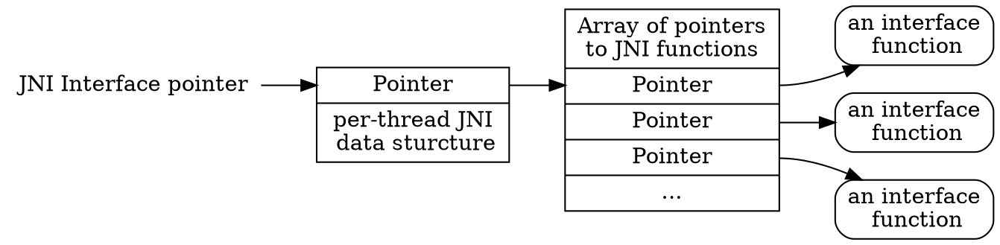

#<center> JNI(java native interface)</center>

## 1.总体设计

### 1.1 JNI 接口函数和指针

原生代码通过 JNI 函数访问 Java 虚拟机特性.JNI 函数可通过接口指针访问.一个接口指针是一个指针的指针,这个指针指向一个指针数组,里面的每个指针都指向一个接口.每一个接口函数位于数组预定义的偏移位置.如下图所示是接口 指针的组织结构.



JNI 接口被组织成类似与 c++虚函数表或一个组件(COM)接口.相比硬连接函数入口,使用接口表的好处是 JNI 名称空间将独立于原生代码.一个 VM 可以简单的提供多个版本的 JNI 函数表.例如,VM 可能支持两个 JNI 函数表:

- 一个执行经历非法参数检查,用于调试;
- 另一个执行 JNI 规定所需的最小化检查,这样更有效率.

JNI 接口指针只在当前线程有效.因此原生方法不可以传递接口指针给其他线程.一个 VM 为了实现 JNI 可能分配和存储数据于线程的局部空间,该空间地址存放在 JNI 接口指针.

原生方法接收 JNI 接口指针作为一个参数.VM 保证从同一个线程多次调用原生方法需要传递相同的接口指针到该原生方法.然而,一个原生方法可能被不同的 Java 线程调用,因此可能接收到不同的 JNI 接口指针.

### 1.2 编译,加载和链接原生方法

由于 Java 虚拟机是多线程的,原生库需要在被原生编译器编译和链接时支持多线程.对于 GNU gcc 编译器,需要设置`-D_REENTRANT`或`-D_POSIX_C_SOURCE`.

原生函数通过`System.loadLibrary`函数加载.下面的例子是一个类初始化函数加载指定平台原生库,库中定义了一个原生函数 f:

```java
package pkg;

class Cls{
    native double f(int i, String s);

    static {
        System.loadLibrary("pkg_Cls");
    }
}
```

`System.loadLibrary`中的参数是自定义的库名称.系统遵循标准但特定于平台的方法，将库名转换为原生库名.例如,对 Solaris 系统`pkg_Cls`转换为`libpkg_Cls.so`,而 Window 系统`pkg_Cls`转换为`pkg_Cls.dll`.

程序员可以使用一个库存放所有的用于任何类的原生方法,然后这些类使用相同的类加载器加载.VM 内部维持一个类加载器加载原生库的列表.需要注意的是避免库名称冲突.

原生库可以与 VM 静态链接。 库和 VM 映像的组合方式取决于实现.必须成功使用 `System.loadLibrary` 或等效 API 才能将该库视为已加载。

当且仅当库导出了一个名为 JNI_OnLoad_L 的函数时，其映像已与 VM 合并的库 L 被定义为静态链接。

如果一个静态链接库 L 导出一个函数名为`JNI_OnLoad_L`和一个函数名为`JNI_OnLoad`,`JNI_OnLoad`函数将被忽视.

如果库 L 是静态链接的，则在第一次调用 System.loadLibrary（“ L”）或等效的 API 时，将使用与 JNI_OnLoad 函数指定的参数相同的参数和预期的返回值来调用 JNI_OnLoad_L 函数。

当包含静态链接的本机库 L 的类加载器被垃圾回收时，如果导出了`JNI_OnUnload_L`此类函数，则 VM 将调用该函数。

程序员也可以调用 JNI 函数`RegisterNatives()`来注册原生函数关联于一个类.`RegisterNatives()`函数特别适合静态链接函数.

#### 1.2.1 原生函数名解析

动态链接器通过名称解析入口,一个原生方法名是由以下组成:

- 前缀`Java_`
- 一个齐整的完全限定类名
- 一个下划线分隔符'\_'
- 一个齐整的方法名
- 对于重载的原生方法,伴随着双下划线和齐整的参数字符.

#### 1.2.2 原生函数参数

JNI 接口指针是原生函数的第一个参数.JNI 接口指针是 JNIEnv 类型.第二个参数取决于原生方法是不是静态的.非静态原生方法的第二个参数是一个引用对象.静态方法的第二个参数是一个 Java 类.

其余参数对应于常规 Java 方法参数。 原生方法调用通过返回值将其结果传递回调用例程。

以下代码示例说明了使用 C 函数来实现原生方法 f。 原生方法 f 声明如下：

```java
package pkg;

class Cls {
    native double f(int i, String s);
    // ...
}
```

长整齐的名称 Java_pkg_Cls_f_ILjava_lang_String_2 的 C 函数实现原生方法 f：

```c++
jdouble Java_pkg_Cls_f__ILjava_lang_String_2 (
     JNIEnv *env,        /* interface pointer */
     jobject obj,        /* "this" pointer */
     jint i,             /* argument #1 */
     jstring s)          /* argument #2 */
{
     /* Obtain a C-copy of the Java string */
     const char *str = (*env)->GetStringUTFChars(env, s, 0);

     /* process the string */
     ...

     /* Now we are done with str */
     (*env)->ReleaseStringUTFChars(env, s, str);

     return ...
}
```

注意，我们总是使用接口指针 env 来操纵 Java 对象。 使用 C++，您可以编写稍微干净一点的代码版本，如以下代码示例所示：

```c
extern "C" /* specify the C calling convention */

jdouble Java_pkg_Cls_f__ILjava_lang_String_2 (

     JNIEnv *env,        /* interface pointer */
     jobject obj,        /* "this" pointer */
     jint i,             /* argument #1 */
     jstring s)          /* argument #2 */

{
     const char *str = env->GetStringUTFChars(s, 0);

     // ...

     env->ReleaseStringUTFChars(s, str);

     // return ...
}
```

使用 C++时，额外的间接级别和接口指针参数将从源代码中消失。 但是，底层机制与 C 完全相同。在 C++中，JNI 函数被定义为扩展为 C 对应函数的内联成员函数。

### 1.3 引用 Java 对象

在 Java 和原生代码之间原始类型直接复制，例如整数，字符等。 另一方面，通过引用传递任意 Java 对象。 VM 必须跟踪已传递给原生代码的所有对象，以便垃圾回收器不会释放这些对象。 反过来，原生代码必须具有一种通知 VM 不再需要对象的方法。 另外，垃圾收集器必须能够移动由原生代码引用的对象。

#### 1.3.1 全局和局部引用

JNI 将本机代码使用的对象引用分为两类：局部引用和全局引用。 局部引用在原生方法调用期间有效，并在原生方法返回后自动释放。 全局引用在显式释放之前一直保持有效

对象作为局部引用传递给原生方法。 JNI 函数返回的所有 Java 对象都是局部引用。 JNI 允许程序员从局部引用创建全局引用。 JNI 函数期望的 Java 对象可以是全局和局部引用。 原生方法可能会返回对 VM 的局部或全局引用作为其结果。
