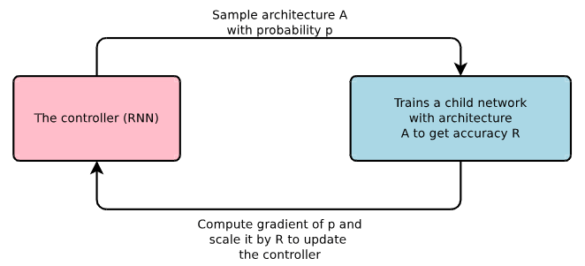
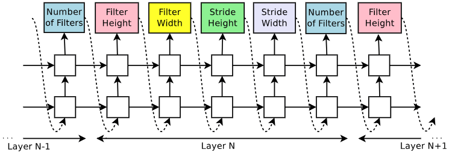
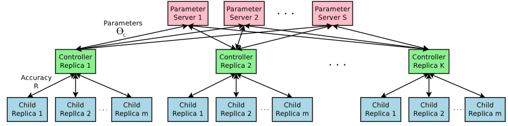
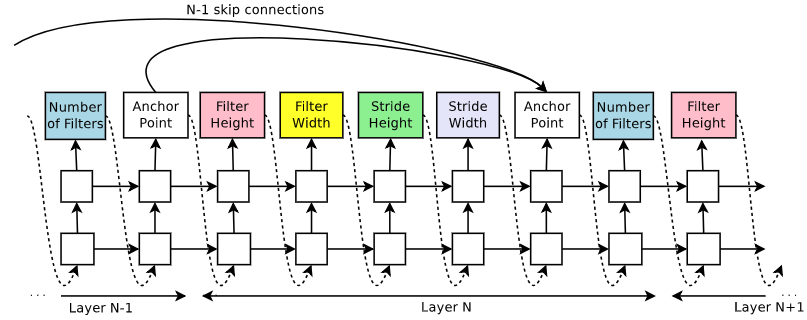
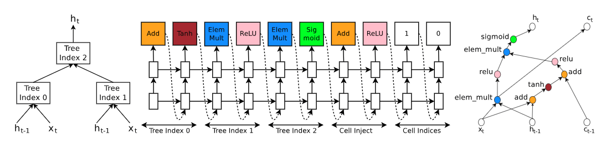

# 神经网络结构搜索(Neural Architecture search)

神经网络搜索已经展现出了作为发现和优化网络结构的有效工具[Neural Architecture Search](https://arxiv.org/pdf/1611.01578.pdf%EF%BC%89)。

在不确定网络的长度和结构的情况下，使用一个循环神经网络(recurrent network)作为控制器来生成网络结构的字段，用来构建子神经网络。将训练子网络之后的准确率作为控制器回馈信号(reward signal)，通过计算策略梯度(policy gradient)更新控制器，这样不断的迭代循环。在下一次迭代中，控制器将有更高的概率提出一个高准确率的网络结构。总之，伴随着时间的推移，控制器将通过不断的学习来提高搜索结果。如下图所示就是网络结构搜索。


<!-- ```dot
digraph G {
    rankdir=LR;
    控制器 [style=filled, color=pink];
    训练子网络A获取准确率R [shape=dwarf, style=filled, color=skyblue]
    控制器  -> 训练子网络A获取准确率R [ label="概率为p样本网络结构A"];
    训练子网络A获取准确率R -> 控制器 [label="计算概率p的梯度并乘与R,更新控制器"];
}
``` -->

## 通过一个循环神经网络控制器生成模型描述

神经结构搜索中，我们使用控制器产生神经网络的超参数。控制器使用的是一个循环神经网络。假设我们希望预测只有卷积层的前馈神经网络，就可以使用控制器来生成这些超参数的序列。

当网络层数超过一个限定的值时，控制器停止生成网络。在我们训练过程中这个值随着计划增长。一旦控制器完成生成网络结构，这样结构的网络将被构造和训练。损失收敛之后，在验证集上面测试得到准确率。接着更新控制器的参数$\theta_c$，以使得所提议的网络结构达到最大的验证准确率。

## 使用增强学习训练(Training with reinforce)

控制器可以看到代理(agent),生成的超参数序列(网络结构的描述字符串)可以被看做代理一系列的动作(actions)$a_{1:T}$。子网络在收敛后将达到准确率$R$。随后，将$R$作为回馈信号并使用增强学习训练控制器。具体的说，为了优化的结构，需要让控制器最大化期望回馈，期望回馈可以表示为$J(\theta_c)$:$$J(\theta_c)=E_{P(a_{1:T};\theta_c)}[R]$$
由于$R$不可微分，因此不能使用传统的BP算法。我们需要使用回馈更新代理的策略参数$\theta_c$，进而实现回馈的最优化。这里我们使用[Williams](https://link.springer.com/content/pdf/10.1007/BF00992696.pdf)提出的REINFORCE，这个公式关联了回馈$R$和策略参数$\theta_c$：$$\nabla_{\theta_c}J(\theta_c)=\sum_{t=1}^TE_{P(a_{1:t};\theta_c)}[\nabla_{\theta_c}\log P(a_t|a_{t-1}:1;\theta_c)R]$$
上述数值的可以近似表示为：$$\frac{1}{m}\sum_{k=1}^m\sum_{t=1}^T\nabla_{\theta_c}\log P(a_t|a_{(t-1):1};\theta_c)R_k$$
$m$是控制器一个批样本网络模型的数量，$T$是控制器生成的网络结构的超参数数量。$R_k$是第$k$个神经网络模型的准确率。
上述更新的梯度是梯度的无偏估计，但是方差很大。为了减小方差，我们使用了一个基线函数：$$\frac{1}{m}\sum_{k=1}^m\sum_{t=1}^T\nabla_{\theta_c}\log P(a_t|a_{(t-1):1};\theta_c)(R_k-b)$$。
只要$b$不依赖与当前的动作，这个梯度导数将始终是无偏估计。这里，我们的$b$是准确率的指数移动平均值[EMA](https://blog.csdn.net/tz_zs/article/details/78341306)。


## 分布式加速训练

在神经网络搜索中，训练一个子网络可能需要几个小时的时间。使用分布式训练和并行参数更新可以加速控制器的学习过程。我们使用参数服务器保存所有参数，服务器将参数分发给控制器，控制器被分成$K$个，每一个控制器使用得到的参数进行模型的构建，由于得到的参数可能不同，构建模型的策略也是随机的，导致每次构建的网络结构也会不同。每个控制器会构建一个batch,$m$个子网络，然后并行训练子网络得到准确率。计算出参数的梯度。然后计算完梯度的控制器将梯度传递到参数服务器，分别对自己负责的参数进行更新。接下来控制器得到更新的参数开始构建新的神经网络模型。这里，每一个控制器独立的发送自己的梯度更新服务器参数，不需要控制器之间同步，这及时异步更新。这里子网络的训练次数固定(epochs)。这种并行架构如下图所示。


### 添加跳跃连接(skip connection)和其他类型网络层

为了让控制器产生跳跃连接。在第$N$层中，添加一个锚点(anchor point)表示是否和前面的网络层连接：
$$P(Layer\ j\ is\ an\ input\ to\ layer\ i)=sigmoid(v^Ttanh(W_{prev}*h_j+W_{curr}*h_i)))$$
$h_j$表示控制器第$j$层网络锚点的隐藏状态，$j$介于0到$N-1$之间。根据这些sigmoids的结果来决定哪些网络层被用作当前层的输入。$W_{prev}$，$W_{curr}$和$v$是可训练参数。
通常对于多个输入层网络层，总是会使用通道维度串联的方式把输入结合起来。这是如果输入层的通道数不同会导致"编译失败"。为了绕过这些问题，我们引入三个规则：
- 首先，如果网络层没有任何输入层，那么图片将作为它的输入层，也就是这个网络层是整个模型的最底层；
- 其次，在最高层我们将所有没有被连接到网络层的网络输出串联到一起，再将最终的隐藏状态输传递给分类器；
- 最后，如果多个需要串联的输入的通道size不同，我们将会在size较小的输入层补0，这样串联的时候保证有一样的size。
在这里，我们并没有使用控制器生成学习率，池化层，批标准化层等结构，如果想要产生这些网络，则需要在控制器RNN中添加额外的步骤，这样就可以关联到其他超参数。

###　生成循环元胞

为了产生循环元胞。控制器需要找到一个公式，以$x_t$和$h_{t-1}$作为输入，$h_t$作为结果。最简单的方式$h_t=tanh(W_1*x_t+W_2*h_{t-1})$，这是一个基本的循环细胞的公式。一个更复杂的公式是广泛应用的LSTM循环元胞。
基础RNN和LSTM都可以描述为一个树形结构，输入$x_t$和$h_(t-1)$，产生$h_t$，这些变量作为叶子。控制器RNN需要标明树上的每个节点的结合方法(相加，按元素相乘等)和激活函数，用于融合两个输入并产生一个输出。然后两个节点输出又被作为树上下一个节点的输入。为了控制器可以选择这些方法和函数，我们将树上的节点以一定的顺序编号，这样控制器可以顺序的预测。

如图所示是一个从两个叶节点和一个中间节点的树构造出循环网络元胞循环网络元胞的例子。左边是树定义的计算步骤让控制器去做预测。中间是控制器关于树的计算步骤的预测集；右边是从控制器预测结果中得到的循环元胞的计算图。