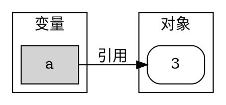
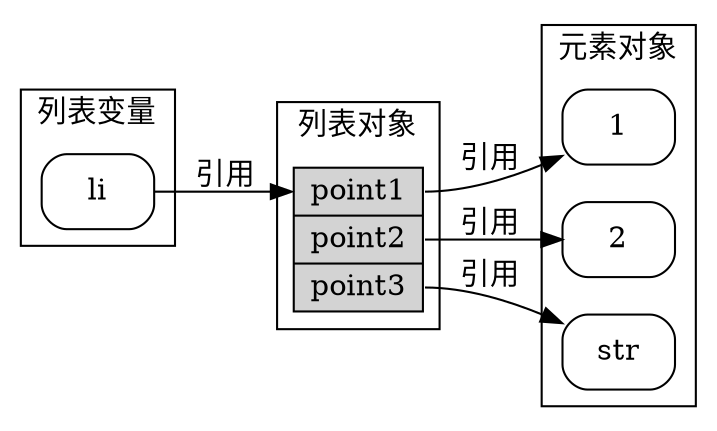
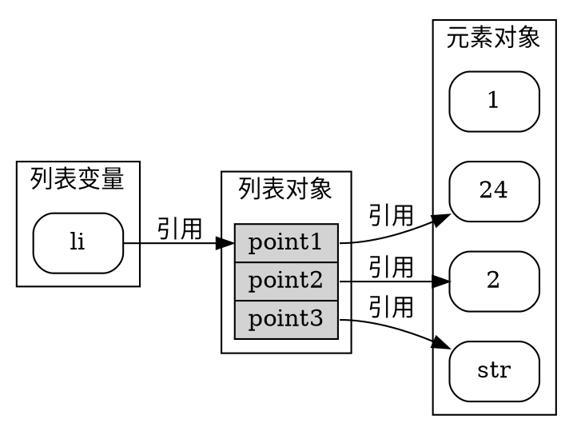

<!-- @import "../my-style.less" -->


# Python学习总结
<!-- @import "[TOC]" {cmd="toc" depthFrom=1 depthTo=6 orderedList=false} -->

<!-- code_chunk_output -->

- [Python学习总结](#python学习总结)
  - [模块](#模块)
    - [import模块原理](#import模块原理)
      - [python模块编译](#python模块编译)
      - [python模块运行](#python模块运行)
    - [模块搜索路径](#模块搜索路径)
    - [模块文件选择](#模块文件选择)
    - [模块的创建](#模块的创建)
    - [模块的使用](#模块的使用)
    - [重载模块](#重载模块)
    - [模块包](#模块包)
      - [`__init__.py`包初始化文件](#__init__py包初始化文件)
      - [包初始化文件的作用](#包初始化文件的作用)
      - [包相对引用](#包相对引用)
      - [模块中的数据隐藏](#模块中的数据隐藏)
    - [字节码文件](#字节码文件)
    - [模块设计理念](#模块设计理念)
  - [动态推导](#动态推导)
    - [变量，对象和引用](#变量对象和引用)
    - [共享引用](#共享引用)
      - [共享引用和原位变换](#共享引用和原位变换)
      - [共享内存和等式](#共享内存和等式)
  - [类型](#类型)
    - [字符串](#字符串)
      - [字符串构造](#字符串构造)
      - [字符串构造方法](#字符串构造方法)
  - [对象灵活性](#对象灵活性)
  - [python主要内建类型](#python主要内建类型)
  - [python作用域](#python作用域)
    - [名称解析:LEGB规则](#名称解析legb规则)
    - [global声明](#global声明)
    - [nonlocal声明](#nonlocal声明)
  - [函数](#函数)
    - [函数参数](#函数参数)
  - [类](#类)
    - [类与实例](#类与实例)
      - [类方法调用](#类方法调用)
      - [编写类树](#编写类树)
    - [运算符重载](#运算符重载)
  - [并行执行](#并行执行)
    - [多进程————基于进程的并行](#多进程基于进程的并行)
      - [start method](#start-method)
      - [多进程使用的准则](#多进程使用的准则)
    - [concurrent.futures————启动并行任务](#concurrentfutures启动并行任务)
      - [执行对象](#执行对象)
      - [ProcessPoolExecutor](#processpoolexecutor)
      - [Future对象](#future对象)
      - [Module Functions](#module-functions)
  - [网络和进程间通讯](#网络和进程间通讯)
    - [异步IO](#异步io)
      - [协程和任务](#协程和任务)
        - [协程](#协程)
        - [Awaitables](#awaitables)
        - [并发执行任务](#并发执行任务)
        - [阻止撤销(Shielding From Cancellation)](#阻止撤销shielding-from-cancellation)
        - [等待API](#等待api)
      - [同步基元Synchronization Primitives](#同步基元synchronization-primitives)
      - [子进程Subprocesses](#子进程subprocesses)
        - [创建子进程](#创建子进程)
        - [常量](#常量)
      - [队列(Queues)](#队列queues)
      - [异常(Exceptions)](#异常exceptions)
      - [事件循环(Event Loop)](#事件循环event-loop)
        - [获取事件循环](#获取事件循环)
        - [事件循环方法](#事件循环方法)
          - [运行和停止循环](#运行和停止循环)
        - [调度回调(Scheduling callbacks)](#调度回调scheduling-callbacks)
        - [调度延迟回调(Scheduling delayed callbacks)](#调度延迟回调scheduling-delayed-callbacks)
        - [创建`Futures`和`Tasks`](#创建futures和tasks)
      - [Futures](#futures)
        - [Future函数](#future函数)

<!-- /code_chunk_output -->

  
## 模块

### import模块原理

程序第一次导入指定文件时，会执行三个步骤。

1.找到模块文件。

2.编译成位码——发现位码时间早于模块更新时间时。

3.执行模块的代码来创建其所定义的对象。

记住，这三个步骤只在程序执行时，模块第一次导入时才会进行。在这之后，导入相同模块时，会跳过这三个步骤，而只提取内存中已加载的模块对象。从技术上讲，Python把载入的模块存储到一个名为sys.modules的表中，并在一次导入操作的开始检查该表。如果模块不存在，将会启动一个三个步骤的过程。

如果想要看看已经导入了哪些模块，可以导入sys并打印list(sys.modules.keys())。

#### python模块编译

python程序执行时，在第一次加载模块的时候，会遍历模块搜索路径，找到符合import语句的源代码后，Python会检查文件的时间戳，如果发现字节码比源文件旧（源文件有过修改），接下来会将其编译成字节码，否则就跳过编译字节码环节。此外，如果模块在搜索路径只找到字节码，没有找到源代码，就会直接加载字节码。

注意：当文件导入时，就会进行编译。因此，通常不会看见程序顶层文件的.pyc字节码文件，除非这个文件也被其他文件导入：只有被导入的文件才会在机器上留下.pyc。顶层文件的字节码是在内部使用后就丢弃了；被导入文件的字节码则保存在文件中从而可以提高之后导入的速度。

顶层文件通常是设计成直接执行，而不是被导入的。稍后我们将会看到，设计一个文件，使其作为程序的顶层文件，并同时扮演被导入的模块工具的角色也是有可能的。这类文件既能执行也能导入，因此，的确会产生.pyc。

#### python模块运行

import操作的最后步骤是执行模块的字节码。文件中所有语句会依次执行，从头至尾，而此步骤中任何对变量名的赋值运算，都会产生所得到的模块文件的属性。因此，这个执行步骤会生成模块代码所定义的所有工具。例如，文件中的def语句会在导入时执行，来创建函数，并将模块内的属性赋值给那些函数。之后，函数就能被程序中这个文件的导入者来调用。

因为最后的导入步骤实际上是执行文件的程序代码，如果模块文件中任何顶层代码确实做了什么实际的工作，你就会在导入时看见其结果。例如，当一个模块导入时，该模块内顶层的print语句就会显示其输出。函数的def语句只是简单地定义了稍后使用的对象。

正如你所见到的那样，import操作包括了不少的操作：搜索文件、或许会运行一个编译器以及执行Python代码。因此，任何给定的模块在默认情况下每个进程中只会导入一次。未来的导入会跳过导入的这三个步骤，重用已加载内存内的模块。如果你在模块已加载后还需要再次导入（例如，为了支持终端用户的定制），你就得通过调用reload（下一章我们将会学到的一个工具）强制处理这个问题。

### 模块搜索路径

模块的搜索路径主要有以下几种组成：

- 1.程序的主目录。
- 2.PYTHONPATH环境变量设置的目录（如果已经进行了设置）。
- 3.标准链接库目录。
- 4.任何.pth文件的内容（如果存在的话）。
- 5.第三方扩展路径。
  
搜索的第一、第三和第五路径是自动定义的，但是因为Python会从头到尾搜索这些组件组合的结果，第二和第四路径，就可以用于拓展路径，从而包含你自己的源代码目录。
 python代码中可以通过内建的sys.path列表查看模块搜寻路径。

### 模块文件选择

记住，文件名的后缀（例如，.py）是刻意从import语句中省略的。Python会选择在搜索路径中第一个符合导入文件名的文件。例如，import b形式的import叙述可能会加载。

·源代码文件b.py。

·字节码文件b.pyc。

·目录b，包导入（在第23章说明）。

·编译扩展模块（通常用C或C++编写），导入时使用动态连接（例如，Linux的b.so以及Cygwin和Windows的b.dll或b.pyd）。

·用C编写的编译好的内置模块，并通过静态连接至Python。

·ZIP文件组件，导入时会自动解压缩。

·内存内映像，对于frozen可执行文件。

·Java类，在Jython版本的Python中。

··NET组件，在IronPython版本的Python中。

### 模块的创建

一个以.py结尾的文件就是一个Python模块。在模块顶层指定的所有变量名都会变成其属性（与模块对象结合的变量名），并且可以到处供客户端来使用。
例如，在名为module1.py的文件中输入下面的def语句，并将这个文件导入，就会创建一个拥有一个属性的模块对象：变量名printer，而这个变量名恰巧引用了一个函数对象。

```python
def printer(x):  #module attribute
    print(x)
```

因为模块名在Python程序中会变成变量名（没有.py）。因此，应该遵循第11章所提到的普通变量名的命名规则。例如，你可以建立名为if.py的模块文件，但是无法将其导入，因为if是保留字。当尝试执行import if时，会得到语法错误。事实上，包导入中所用的模块的文件名和目录名（下一章讨论），都必须遵循第11章所介绍的变量名规则。例如，只能包含字母、数字以及下划线。包的目录也不能包含平台特定的语法，例如，名称中有空格。

当一个模块被导入时，Python会把内部模块名映射到外部文件名，也就是通过把模块搜索路径中的目录路径加在前边，而.py或其他后缀名添加在后边。例如，名为M的模块最后会映射到某个包含模块程序代码的外部文件：＜directory＞\M.＜extension＞。

正像上一章所提到的那样，也有可能使用C或C++（或Java，Python这门语言的Jython实现）这类外部语言编写代码来创建Python模块。这类模块称为扩展模块，一般都是在Python脚本中作为包含外部扩展库来使用的。当被Python代码导入时，扩展模块的外观和用法与Python源代码文件所编写的模块一样：也是通过import语句进行读取，并提供函数和对象作为模块属性。扩展模块不在本书讨论范围之内。参考Python的标准手册，或者参考更高级的书籍，如《Programming Python》来获得更多细节。

### 模块的使用

客户端可以执行import或from语句，以使用我们刚才编写的简单模块文件。如果模块还没有加载，这两个语句就会去搜索、编译以及执行模块文件程序。主要的差别在于，import会读取整个模块，所以必须进行定义后才能读取它的变量名；from将获取（或者说是复制）模块特定的变量名。

- **import语句**
  
下面的变量名module1有两个不同目的：识别要被载入的外部文件，同时生成脚本中的变量，在文件加载后，用来引用模块对象。

```python
import module1  #Get module as a whole
module1.printer('Hello world!') #Qualify to get names
```

因为import使一个变量名引用了整个模块对象，我们必须通过模块名称来得到该模块的属性（module1.printer）

- **from语句**

因为from会把变量名复制到另一个作用域，所以它就可以让我们直接在脚本中使用复制后的变量名，而不需要通过模块(printer)。

```python
from module1 import printer #copy out one variable
printer('Hello world!') #No need to qualify name
```

这和上一个例子有着相同的效果，但是from语句出现时，导入的变量名会复制到作用域内，在脚本中使用该变量名就可以少输入一些：我们可直接使用变量名，而无须再嵌套模块名称之后。
from语句其实只是稍稍扩展了import语句而已。它照常导入了模块文件，但是多了一个步骤，讲文件中的一个或多个变量从文件中复制了出来。

```python
from module1 import * #Copy out all variables
printer('Hello world')
```

当我们使用*时，会取得模块顶层所有赋了值的变量名的拷贝。在这里，我们还是在脚本中使用复制后得到的变量名printer，而不需要通过模块名。

在Python3.0中，这里所描述的from *语句只能用在一个模块文件的顶部，不能用于一个函数中。

模块会在第一次import或from时载入并执行，并且只在第一次如此。

- **import和from是赋值语句**

就像def一样，import和from是可执行的语句，而不是编译期间的声明，而且它们可以嵌套在if测试中，出现在函数def之中等，直到执行程序时，Python执行到这些语句，才会进行解析。换句话来说，被导入的模块和变量名，直到它们所对应的import或from语句执行后，才可以使用。此外，就像def一样，import和from都是隐性的赋值语句。

·import将整个模块对象赋值给一个变量名。

·from将一个或多个变量名赋值给另一个模块中同名的对象。

我们谈过的关于赋值语句方面的内容，也适用于模块的读取。例如，以from复制的变量名会变成对共享对象的引用。就像函数的参数，对已取出的变量名重新赋值，对于其复制之处的模块并没有影响，但是修改一个已取出的可变对象，则会影响导入的模块内的对象。为了解释清楚，思考一下下面的文件small.py。

lifted
```python
# small.py
x=1
y=[1,2]

# main.py
from small import x,y   #Copy two names out
x=42    #Changes local x only
y[0]=42 #Changes shared mutable in-place

```

此处，x并不是一个共享的可变对象，但y是。导入者中的变量名y和被导入者都引用相同的列表对象，所以在其中一个地方的修改，也会影响另一个地方的这个对象。

如果需要修改模块的x变量，需要:

```python
import small
small.x=42
```

因为像这样修改其他模块内的变量是常常困惑开发人员的原因之一（通常也是不良设计的选择），本书这一部分稍后会再谈到这个技巧。注意：前一个会话中对y[0]的修改是不同的。这是修改了一个对象，而不是一个变量名。

### 重载模块

要强制使模块代码重新载入并重新运行，需要调用reload内置函数(Python2.6)。在Python3.0中，使用imp标准库模块中——imp.reload。

因为reload期望得到的是对象，在重载之前，模块一定是已经预先成功导入了（如果因为语法或其他错误使得导入没成功，你得继续试下去，否则将无法重载）。此外，import语句和reload调用的语法并不相同：reload需要小括号，但import不需要。重载看起来如下所示。

```python
import module #Initial import
...
from imp import reload #Get reload itself
reload(module) #Get updated exports
...
```

- reload会在模块当前命名空间内执行模块文件的新代码。重新执行模块文件的代码会覆盖其现有的命名空间，并非进行删除而进行重建。
- 文件中顶层赋值语句会使得变量名换成新值。例如，重新执行的def语句会因为重新赋值函数变量名而取代命名空间内该函数之前的版本。
- 重载会影响所有使用import读取了模块的客户端。因为使用import的客户端需要通过点号运算取出属性，在重载后，他们会发现模块对象中变成了新的值。
- 重载只会对以后使用from的客户端造成影响。之前使用from来读取属性的客户端并不会收到重载的影响，那些客户端引用的依然是重载前所取出的旧对象。

### 模块包

Python除了导入模块名之外，还可以导入指定目录路径。这样的代码的目录就称为包。事实上，包导入是把计算机上的目录变成另一个Python命名空间，而属性对应于目录中所包含的子目录和模块文件。

#### `__init__.py`包初始化文件

包导入语句的路径中的每个目录内都必须有`__init__.py`这个文件，否则导入包会失败。(python3.3之后可以没有这个文件)

这种形式的import语句：

```python
import dir1.dir2.mod
```

其目录结构应该是这样：

```shell
diro\
    dir1\
        `__init__.py`
        dir2\
            `__init__.py`
            mod.py
```

这些文件可以防止有相同名称的目录不小心隐藏在模块搜索路径中，而之后才出现真正需要的模块。

#### 包初始化文件的作用
`__init__.py`文件作为包初始化时的钩子，将该目录声明为一个python包，并为该目录生成一个模块命名空间。 同时也实现了 from * 语句：
- 包初始化
Python首次导入某个目录时，会自动执行该目录下`__init__.py`文件中的所有程序代码。一般而言，如果直接执行`__init__.py`文件没什么用，当包首次读取时，就会自动运行。
- 模块可用性声明
python `__init__.py`文件也部分作为该目录时python包的证明。 
- 模块命名空间初始化
- `from *`语句的行为
作为一个高级功能，你可以在`__init__.py`文件内使用`__all__`列表来定义目录以`from *` 语句形式导入时，需要导出什么。在`__init__.py`文件中，`__all__`列表是指当包（目录）名称使用`from *` 的时候，应该导入的子模块的名称清单。如果没有设定`__all__`，`from *`语句不会自动导入嵌套于该目录内的子模块。取而代之的是，只导入该目录的`__init__.py`文件中赋值语句定义的变量名，包括该文件中程序代码明确导入的任何子模块。例如，某目录中`__init__.py`内的语句`from submodule import X`，会让变量名X可在该目录的命名空间内使用。

#### 包相对引用

```python
from . import attribute
from .modulename import attribute
from .. import attribute
from ..modulename import attribute
```

#### 模块中的数据隐藏

python中from *默认会拷贝所有模块下的所有属性。为了隐藏模块中的数据需要，我们可以在变量前加上一个单下划线`_X`防止外界使用`from *`语句拷贝这些变量。
或者我们可以在`__init__.py`文件中定义变量`__all__`，将所有需要拷贝出的变量名列入该列表中。
从效果上面，`_X`定义那些变量不被拷贝；而`__all__`定义那些变量被拷贝。

### 字节码文件

在python3.2之后字节码存放到源码的子文件夹`__pycache__`。

### 模块设计理念

- 总是在Python的模块内编写代码。
- 模块耦合要降到最低：全局变量。
- 最大化模块的黏合性：同一目标。
- 模块应该少去修改其他模块的变量。

## 动态推导

### 变量，对象和引用


python中的变量始终指向对象，但是对象有可能指向其他对象——如一个列表对象包含了的元素既是指向的对象。
python中的引用是一种关联，通过指向内存的指针实现。
总结而言：
- 变量是系统表的元素，包含空间用于指向对象——这个空间应该是存放的指针或者说引用；
- 对象是一块分配的内存，用于存放所代表的值；
- 引用自动生成指针，用于变量指向对象

### 共享引用

我们已经知道将变量赋值引用到对象，现在将该变量a赋于另一个变量b。
```python
a = 3
b = a
```
这种情况下，这两个变量都是指向对象3的引用，这表示两个变量共享引用一个对象。
接下来给原变量赋予一个新的对象：
```python
a = 'spam'
```
这样，原变量a的引用对象变成新的对象，而变量b保持引用对象不变。

```python
a = 3
b = a
a = a + 2
```
上面的代码会将变量a的重新指向对象5，而不会改变对象3。记住python整数是不可变的，这种算数运算会在新的内存产生一个新对象，然后再将变量指向该新对象。

#### 共享引用和原位变换
python的可变类型包括列表，字典和集合。也就是说对这些对象的元素进行操作将会改变这个对象而不是产生一个新的元素。

***内在实现逻辑，猜想***
在可变对象的内存位置存放的是元素的指针，通过元素指针获取对应的对象。假如现在变量引用的是一个列表，那么现在变量所引用的就是列表内存的起始位置，也就是列表的第一个元素指针，由于指针的尺寸是固定的，那么就可以通过偏移量来获取其他的元素指针。这样列表的元素的变换本质上是内存上指针地址的变化。
```python
li = [1,3,'str']
```

现在对列表li第一个元素赋新值：
```python
l1[0]=24
```
列表li会发生变化:

列表的第一个元素指针将指向对象24的位置。

#### 共享内存和等式

```python
L = [1,2,3]
M = L
L == M  #是不是相同的元素值
L is M #是不是相同的对象
```
```shell
>> True
>> True
```
## 类型

### 字符串

#### 字符串构造
```python
'That is %d %s bird!'%(1, 'dead') #format expression
'The knights who say %s!'%exclamation
'%s -- %s -- %s'%(42,3.14159,[1,2,3])
```
字符串构造类型：
|Code|作用|
|:-:|:-:|
|s|字符串|
|r|等同于s,但使用repr而不是str方法|
|c|字符(int或str)|
|d|十进制|
|o|八进制|
|x|十六进制|
|X|十六进制，但是使用大写字母|
|i|整形|
|e|浮点型并加上指数，小写|
|E|浮点型并加上指数，大写|
|f|浮点型|
|F|浮点型，大写|

基于字典的字符串构造
```python
'%(key1) %(key2)'%{'key1':1, 'key2':'food'}
```

#### 字符串构造方法

```python
'{0}, {1} and {2}'.format(1,'test','good')
'{}, {} and {}'.format(1,'test','good')
```
```python
'{0:e}, {1:.3e}, {2:g}'.format(3.14159,3.14159,3.14159)
```
输出：
```shell
'3.141590e+00, 3.142e+00, 3.14159'
```
```python
'{0:X}, {1:o}, {2:b}'.format(255,255,255)
```
输出:
```shell
'FF, 377, 11111111'
```

## 对象灵活性
- 列表，字典和元组可以存放任意对象；
- 集合可以存放任意不可变对象；
- 列表，字典和元组可以任意嵌套；
- 列表，字典和集合可以动态增减。

```python
X=[1,2,3]
L=['a',X,'b']
D={'x':X,'y':2}
```


## python主要内建类型

```dot
digraph{
  size="12.5"
  subgraph cluster0{
    Collections [style=rounded, shape=box]
    Sequences [style=rounded, shape=box]
    Mappings [style=rounded, shape=box]
    Sets [style=rounded, shape=box]
    Immutable [style=rounded, shape=box]
    Mutable [style=rounded, shape=box]
    Dictionary [style=filled, shape=box]
    Set [style=filled, shape=box]
    String [style=filled, shape=box, ]
    List [style=filled, shape=box]
    Frozenset [style=filled, shape=box]
    Tuple [style=filled, shape=box]
    Bytes [style=filled, shape=box, label="Bytes (3.X)"]
    Unicode [style=filled, shape=box, label="Unicode (2.X)"]
    Bytearray [style=filled, shape=box, label="Bytearray (3.X/2.6+)"]
    Collections->Sequences,Mappings,Sets
    Sequences->Immutable
    Sequences->Mutable
    Mappings->Dictionary
    Sets->Set, Frozenset
    Immutable->String,Unicode,Bytes,Tuple
    Mutable->List,Bytearray
  }

  subgraph cluster1{
    Numbers [style=rounded, shape=box]
    Integers [style=rounded, shape=box]
    Float [style=filled, shape=box]
    Integer [style=filled, shape=box]
    Complex [style=filled, shape=box]
    Long [style=filled, shape=box, label="Long(2,X)"]
    Decimal [style=filled, shape=box]
    Boolean [style=filled, shape=box]
    Fraction [style=filled, shape=box]
    Numbers->Integers,Float,Complex,Decimal,Fraction
    Integers->Integer,Long,Boolean

  }
  subgraph cluster2{
    Callables [style=rounded, shape=box]
    Function [style=filled, shape=box]
    Generator [style=filled, shape=box]
    Class [style=filled, shape=box]
    Callables->Function,Generator,Class
  }

  subgraph cluster3{
    Other [style=rounded, shape=box]
    Module [style=filled, shape=box]
    Instance [style=filled, shape=box]
    File [style=filled, shape=box]
    None [style=filled, shape=box]
    View [style=filled, shape=box, label="View (3.X/2.7)"]
    Other->Module,Instance,File,None,View
  }

  subgraph cluster4{
    Internals [style=rounded, shape=box]
    Type [style=filled, shape=box]
    Code [style=filled, shape=box]
    Frame [style=filled, shape=box]
    Traceback [style=filled, shape=box]
    Internals->Type,Code,Frame,Traceback
  }
}
```

## python作用域

- **封闭的模块是全局作用域**
- **全局作用域仅限于单文件**
- **赋值的名字是局部的，除非申明了`global`或`nonlocal`参数**
- **所有其他名字都是封闭函数的局部，全局或者`Built-in`作用域**
- **每次调用一个函数都会对应创建一个新的局部作用域**

### 名称解析:LEGB规则

- 在函数内部使用一个未明确的名字时，python会依次搜寻四个作用域——局部(L)，然后封闭(E)的def和lambda的局部，再然后时全局(G)作用域,最后是`build-in`(B)作用域——并在第一个发现的位置停止搜寻。
- 在函数中给名字赋值，python通常会再局部作用域创建或更改名字。除非声明为`global`或`nonlocal`
- 当在函数外给名字赋值，此时局部作用域等同于全局作用域——模块的命名空间。


### global声明
```python
# thismod.py
var = 99

def local():
  var = 0

def glob1():
  global var
  var +=1

def glob2():
  var = 0
  import thismod
  thismod.var +=1

def glob3():
  var = 0
  import sys
  glob=sys.modules['thismod']
  glob.var +=1

def test():
  print(var)
  local();glob1();glob2();glob3()
  print(var)
```
输出
```shell
>>>import thismod
>>>thismod.test()
99
102
```
### nonlocal声明

nonlocal需要用在包裹的def中，表示他们在def包裹的空间可用。
```python
def tester(start):
   state=start
   def nested(label):
      nonlocal state
      print(label, state)
      state+=1
   return nested

F=tester(0)
F('gui')
F('chang')
```
## 函数

### 函数参数

|语法|位置|解释|
|:-:|:-:|:-:|
|fun(value)|Caller|正常的参数：按位置匹配|
|fun(name=value)|Caller|关键词的参数：按名字匹配|
|fun(*iterable)|Caller|所有对象传入到一个可迭代对象作为一个独立的位置参数输入|
|fun(**dict)|Caller|将所有键值对传入到一个字典作为独立的关键词参数输入|
|def fun(name)|Function|正常参数：按位置传入|
|def fun(name=value)|Function|默认参数|
|def fun(*name)|Function|将所有匹配的传入参数放入一个元组参数|
|def fun(**name)|Function|将所有匹配的键值对放入一个字典参数|
|def fun(*name,other)|Function|必须传入对应的关键词参数|

## 类

### 类与实例

在Python对象模型中，类和通过类产生的实例是两种不同的对象类型。
**类**:
类是实例工厂。类的属性提供了行为（数据以及函数），所有从类产生的实例都继承该类的属性（例如，通过时薪和小时数计算员工薪水的函数）。
**实例**:
代表程序领域中具体的元素。实例属性记录数据，而每个特定对象的数据都不同（例如，一个员工的社会安全号码）。

虽然在Python模型中，类和实例是两种不同的对象类型，但放在这些树中时，它们几乎完全相同：每种类型的主要用途都是用来作为另一种类型的命名空间（变量的封装，也就是我们可以附加属性的地方）。因此，如果类和实例听起来像模块，那也应该如此。然而，类树中的对象也有对其他命名空间对象的自动搜索连接，而类对应的是语句，并不是整个文件。

类和实例的主要差异在于，类是一种产生实例的工厂。例如，在现实的应用中，我们可能会有一个Employee类，定义所谓的员工。通过这个类，我们可以产生实际的Employee实例。这是类和模块的另一个差异：内存中特定模块只有一个实例（所以我们得重载模块以取得其新代码），但是，对类而言，只要有需要，制作多少实例都可以。

从操作的角度来说，类通常都有函数（例如，computeSalary），而实例有其他基本的数据项，类的函数中使用了这些数据（例如，hoursWorked）。事实上，面向对象模型与经典的程序加记录的数据处理模型相比，并没有太多的差异。在OOP中，实例就像是带有“数据”的记录，而类是处理这些记录的“程序”。不过，在OOP中，还有继承层次的概念，和之前的模型相比，更好地支持了软件定制。

#### 类方法调用

每当我们调用附属于类的函数时，总会隐含这个类的实例。这个隐含的主体或环境就是将其称为面向对象模型的一部分原因：当运算执行时，总是有个主体对象。
Python把隐含的实例传进方法中的第一个特殊参数，习惯上将其称为self。方法能通过实例（bob.giveRaise()）或类（Employee.giveRaise(bob)）进行调用，而两种形式在脚本中都有各自的用途。

#### 编写类树

类和对象的关系：

- 每个class语句会生成一个新的类对象。
- 每次类调用时，就会生成一个新的实例对象。
- 实例自动连接至创建了这些的实例的类。
- 类连接至超类的方式是，将超类列在类头部的括号内。其从左至右的顺序会决定树中的次序。

```python
class C2: ... #Make class objects(ovals)

class C3:...
class C1(C2,C3):... #Linked to superclasses

I1=C1() #Make instance objects(rectangles)
I2=C2() #Linked to their classes
```

因为继承搜索以这种方式进行，你要进行属性附加的对象就变得重要起来：这决定了变量名的作用域。附加在实例上的属性只属于那些实例，但附加在类上的属性则由所有子类及其实例共享。稍后，我们将会深入研究把属性增加在这些对象上的代码。我们将会发现：

- 属性通常是在class语句中通过赋值语句添加在类中，而不是嵌入在函数的def语句内。

- 属性通常是在类内，对传给函数的特殊参数（也就是self），做赋值运算而添加在实例中的。

```python
class C1(C2,C3): #Make and link class C1
    def setname(self,who): #Assign name：C1.setname
        self.name=who #self is either I1 or I2

I1=C1() #Make two instances
I2=C2()
I1.setname('bob') #Sets I1.name to 'bob'
I2.setname('mel') #Sets I2.name to 'mel'
print(I1.name) #Prints 'bob'
```

当def出现在这种类的内部时，通常称为方法，而且会自动接收第一个特殊参数（通常称为self），这个参数提供了被处理的实例的参照值。
通常类的变量名需要在其实例中设置，在构造时填好这个属性，防止产生未定义变量名的错误。

```python
class C1(C2,C3):
    def __init__(self,who): #Set name when constructed
        self.name=who #Self is either I1 or I2
I1=C1('bob') #Sets I1.name to 'bob'
I2=C2('mel') #Sets I2.name to 'mel'
print(I1.name) #Prints 'bob'
```

类产生实例时，Python会自动调用__init__方法。
由于__init__方法的运行时机，它也称作是构造函数。这是所谓的运算符重载方法这种较大类型方法中最常用的代表，我们会在接下来几章详细介绍这种方法。这种方法会像往常一样在类树中被继承，而且在变量名开头和结尾都有两个下划线以使其变得特别。当能够支持通信操作的实例出现在对应的运算时，Python就会自动运行它们，而且它们是使用简单方法调用最常用的替代方法。这类方法也是可选的：省略时，不支持这类运算。

### 运算符重载

python的类运算符重载使用类方法解释python内建的运算操作——当类实例遇到内建运算操作时，python将自动调用类方法。

常用的运算符重载方法有：
|方法|调用方法|
|:-:|:-:|
|__init__|x=Class(args)|
|__del__|类实力销毁|
|__add__|X+Y, X+=Y|
|__or__|X\|Y,x\|=Y(在没有重载__ior__的情况下)|
|__repr__,__str__|print(X),repr(X),str(X)|
|__call__|X(*args,**kargs)|
|__getitem__|X[key],X[i:j]|
|__setitem__|X[key]=value,X[i:j]=iterable|
|__len__|len(X)|
|__bool__|bool(X)|
|__get__|X.attr, X.attr=value|

## 并行执行
只介绍多进程并行，多线程并行不能真正并行执行。
### 多进程————基于进程的并行
multiprocessing是一个支持派生进程的包，multiprocessing支持本地和远程的并行，通过子进程有效的规避了全局解释锁对线程的负面作用。
```python
from multiprocessing import Process

def f(name):
  print('hello', name)

if __name__=='__main__':
  p=Process(target=f, args=('bob',))
  p.start()
  p.join()
```
#### start method
```python
import  multiprocessing as mp
print(mp.get_start_method())
```
上述代码可以获取生成多进程的方式。
- spawn : windows 下默认的生成方式，只继承父进程必要的资源；
- fork : unix系统下的默认生成方式，继承父进程的所以资源；
- forkserver : unix系统下的生成一个服务进程，不继承父进程的资源。
spawn和forkserver会在创建时同步创建一个进程用于资源追踪。window系统下只有spawn方式，unix系统下可以使用三种生成方式。可以使用下面的方法设置进程生成方式：
```python
import multiprocessing as mp 
mp.set_start_method('spawn')
```
#### 多进程使用的准则
**Explicitly pass resources to child processes**:
On Unix using the fork start method, a child process can make use of a shared resource created in a
parent process using a global resource. However, it is better to pass the object as an argument to the
constructor for the child process.

Apart from making the code (potentially) compatible with Windows and the other start methods this
also ensures that as long as the child process is still alive the object will not be garbage collected in the
parent process. This might be important if some resource is freed when the object is garbage collected
in the parent process.


**Avoid shared state**:
As far as possible one should try to avoid shifting large amounts of data between processes.
It is probably best to stick to using queues or pipes for communication between processes rather than
using the lower level synchronization primitives.

**Picklability**：
Ensure that the arguments to the methods of proxies are picklable.


### concurrent.futures————启动并行任务
concurrent.futures 模块为异步执行可调用对象提供了高级接口。
可以使用线程ThreadPoolExecutor或单独的进程 ProcessPoolExecutor 执行异步调用。 两者都实现了相同的接口，该接口由抽象 Executor 类定义。
#### 执行对象
`class concurrent.futures.Executor`
提供异步执行调用的方法的抽象类。 不应该直接使用，而是使用它的具体子类。
- submit(fn, /, *args, **kwargs)：
安排可调用的 fn 作为 fn(*args, **kwargs) 执行并返回一个表示可调用的执行的未来对象。
  ```python
  with ThreadPoolExecutor(max_workers=1) as executor:
  future = executor.submit(pow, 323, 1235)
  print(future.result())
  ```
- map(func, *iterables, timeout=None, chunksize=1):
类似于 map(func, *iterables) 除了：
• iterables 被立即收集而不是延迟收集；
• func 是异步执行的，对 func 的多个调用可以同时进行
  返回的迭代器会引发 concurrent.futures.TimeoutError--如果__next__() 被调用，但对 Executor.map() 的调用 timeout 秒后结果不可用时。 timeout 可以是 int 或 float。 如果超时不是没有指定或None，等待时间没限制。

  使用 ProcessPoolExecutor 时，此方法可将其分成多个块，并作为单独的任务提交给进程池。 这些块的（近似）大小可以通过将 chunksize 设置为正整数来指定。 对于非常长的迭代，使用较大的chunksize值与默认大小 1 相比可以显着提高性能。使用ThreadPoolExecutor，chunksize 没有效果。

- shutdown(wait=True, *, cancel_futures=False)：
  向执行器发出信号，等待当前的正在处理的未来对象执行完，再释放所有使用的资源；在该函数调用后调用 Executor.submit() 或 Executor.map() 会触发 RuntimeError。

  如果 wait 为 True 则此方法将不会返回，直到所有未执行的未来对象都执行完毕，并且与执行者相关的资源已被释放；如果为 False ，等待当前的正在处理的未来对象执行完，这个方法将立即返回并释放与执行程序相关的资源。 不管 wait 的值如何，整个 Python 在所有未来对象执行完之前，程序不会退出。

  如果 cancel_futures 为 True，此方法将取消所有等待执行的未来对象，任何已完成或正在运行的未来对象都不会被取消，无论cancel_futures 的值是什么。

  如果 wait 和 cancel_futures 都为 True，所有已经开始执行的未来对象都会执行完，该方法才会返回，剩余的等待执行的未来对象将被取消。
  
  如果使用 with 语句，可以避免显式调用此方法，这将关闭 Executor（等待就好像 Executor.shutdown() 被调用时等待设置为真）：
  ```python
  import shutil
  with ThreadPoolExecutor(max_workers=4) as e:
  e.submit(shutil.copy, 'src1.txt', 'dest1.txt')
  e.submit(shutil.copy, 'src2.txt', 'dest2.txt')
  e.submit(shutil.copy, 'src3.txt', 'dest3.txt')
  e.submit(shutil.copy, 'src4.txt', 'dest4.txt')

  ```
#### ProcessPoolExecutor
ProcessPoolExecutor 类是 Executor 子类，它使用进程池异步执行调用。 ProcessPoolExecutor 使用多处理模块，这允许它绕过全局解释器锁，但也意味着只能执行和返回可提取(picklable)对象。

`class concurrent.futures.ProcessPoolExecutor(max_workers=None, mp_context=None,
initializer=None, initargs=())`

一个执行器使用一个最多`max_workers`进程数量的进程池异步调用。在window中，`max_workers`不能大于61。`mp_context`是一个多处理器上下文或None，将会用于启动工作进程。如果`mp_context`是None或未给定，将使用默认的多处理器上下文。

initializer 是一个可选的可调用对象，在每个工作进程开始时被调用； initargs 是传递给初始化器的参数元组。 如果初始化程序引发异常，所有当前挂起的作业以及任何向池提交更多作业的尝试都将引发一个 BrokenProcessPool。
```python
import concurrent.futures
import math

PRIMES = [
    112272535095293,
    112582705942171,
    112272535095293,
    115280095190773,
    115797848077099,
    1099726899285419]

def is_prime(n):
    if n < 2:
        return False
    if n == 2:
        return True
    if n % 2 == 0:
        return False

    sqrt_n = int(math.floor(math.sqrt(n)))
    for i in range(3, sqrt_n + 1, 2):
        if n % i == 0:
            return False
    return True

def main():
    with concurrent.futures.ProcessPoolExecutor() as executor:
        for number, prime in zip(PRIMES, executor.map(is_prime, PRIMES)):
            print('%d is prime: %s' % (number, prime))

if __name__ == '__main__':
    main()
```
#### Future对象
`Future`类封装了对可调用对象的异步执行。`Future`实例由`Executor.submit()`创建，但是不要直接创建除非用于测试。
#### Module Functions
`concurrent.futures.wait(fs, timeout=None, return_when=ALL_COMPLETED)`
等待 fs 给定的 Future 实例（可能由不同的 Executor 实例创建）完成。fs 中重复的未来对象将被删除，并且只会返回一次。 返回一个命名的 2 元集合，第一个集合，名为 done，包含在等待之前完成（完成或取消的未来对象）的未来对象。 第二组，名为 not_done，包含未完成的未来对象（待定或运行未来对象）。
timeout 用来控制方法返回前的最大等待时间。如果 timeout 未指定或 None ，将没有等待时限。
return_when 表示方法什么状态下返回，必须是以下常量：
|常量|描述|
|:-|:-|
|FIRST_COMPLETED|方法在任何未来对象被调用或者完成时返回|
|FIRST_EXCEPTION|方法在任何未来对象触发异常完成时返回，如果没有异常相当于ALL_COMPLETED|
|ALL_COMPLETED|方法在所有未来对象完成或者取消时返回|

`concurrent.futures.as_completed(fs, timeout=None)`

## 网络和进程间通讯
### 异步IO
`asyncio`是一个使用`async/await`实现并发代码的库。`asyncio`是许多python实现的异步框架的基础，如高性能网络、web服务、数据库连接库、分派任务队列。`asyncio`常用于IO密集型和高层次结构化网络代码。
`asyncio`提供了一组高层次APIs：
- 协程和任务(Coroutines and Tasks)
- 流(streams)
- 同步基元(Synchronization primitives)
- 子进程(subprocess)
- 队列(queues)
- 异常(exceptions)
同时也提供了低层次APIs用于库和框架的搭建：
- 事件循环(Event Loop)
- Funtures
- 传输和协议(Transports and protocols)
- 策略(policies)
- 平台支持(Platform Support)
#### 协程和任务
##### 协程
协程声明使用`async/await`语法是最佳的方式。直接调用协程函数并不会被执行，为了实际运行协程，`asyncio`提供了三种主要机制：
- `asyncio.run()`运行协程顶层入口函数；
```python
import asyncio

async def print_hello():
    print("Hello")
    await asyncio.sleep(10)
    print("World")

asyncio.run(print_hello())
```
- 等待一个协程；
```python
import asyncio
import time

async def say_after(delay, what):
    await asyncio.sleep(delay)
    print(what)

async def main():
    print(f"Start at {time.strftime('%X')}")
    await say_after(1,"Hello")
    await say_after(2,"World")
    print(f"End at {time.strftime('%X')}")

asyncio.run(main())
```
输出
```
Start at 20:12:49
Hello
World
End at 20:12:52
```
- `asyncio.create_task()`函数将协程作为异步任务并发执行。
```python
import asyncio
import time

async def say_after(delay, what):
    await asyncio.sleep(delay)
    print(what)

async def main():
    task1=asyncio.create_task(say_after(1,"Hello"))
    task2=asyncio.create_task(say_after(2,"World"))
    print(f"Start at {time.strftime('%X')}")
    await task1
    await task2
    print(f"End at {time.strftime('%X')}")

asyncio.run(main())
```
输出
```
Start at 20:20:37
Hello
World
End at 20:20:39
```

##### Awaitables
可以在`await`表达式中被使用的对象是`awaitable`对象。
`awaitable`对象主要有三种：
- 协程
```python
import asyncio

async def nested():
    return 42

async def main():
    # Nothing happens if we just call "nested()".
    # A coroutine object is created but not awaited,
    # so it *won't run at all*.
    nested()

    # Let's do it differently now and await it:
    print(await nested())  # will print "42".

asyncio.run(main())
```
- 任务
任务可用于调度协程并发，当一个协程包裹到一个任务中，协程将自动调度马上执行。
```python
import asyncio

async def nested():
    return 42

async def main():
    # Schedule nested() to run soon concurrently
    # with "main()".
    task = asyncio.create_task(nested())

    # "task" can now be used to cancel "nested()", or
    # can simply be awaited to wait until it is complete:
    await task

asyncio.run(main())
```
- Futures
`Future`是低层次`awaitable`对象，表示异步操作的结果。
`Future`使用`await`表示协程将等待直到`Future`在其他地方被解析。
`Future`对象一般不需要直接创建，而是通过库或`asyncio`APIs暴露出来。
```python
async def main():
    await function_that_returns_a_future_object()

    # this is also valid:
    await asyncio.gather(
        function_that_returns_a_future_object(),
        some_python_coroutine()
    )
```
A good example of a low-level function that returns a Future object is loop.run_in_executor().

##### 并发执行任务
```shell
awaitable asyncio.gather(*aws, return_exceptions=False)
```
并发执行位于`aws`序列中的`awaitable`对象。如果`awaitable`对象是协程，将自动调度为任务。
```python
import asyncio

async def factorial(name, number):
    f = 1
    for i in range(2, number + 1):
        print(f"Task {name}: Compute factorial({number}), currently i={i}...")
        await asyncio.sleep(1)
        f *= i
    print(f"Task {name}: factorial({number}) = {f}")
    return f

async def main():
    # Schedule three calls *concurrently*:
    L = await asyncio.gather(
        factorial("A", 2),
        factorial("B", 3),
        factorial("C", 4),
    )
    print(L)

asyncio.run(main())
```
输出：
```python
# Expected output:
#
#     Task A: Compute factorial(2), currently i=2...
#     Task B: Compute factorial(3), currently i=2...
#     Task C: Compute factorial(4), currently i=2...
#     Task A: factorial(2) = 2
#     Task B: Compute factorial(3), currently i=3...
#     Task C: Compute factorial(4), currently i=3...
#     Task B: factorial(3) = 6
#     Task C: Compute factorial(4), currently i=4...
#     Task C: factorial(4) = 24
#     [2, 6, 24]
```

##### 阻止撤销(Shielding From Cancellation)
```shell
awaitable asyncio.shield(aw)
```
阻止`awaitable`对象被撤销。
如果`aw`是协程，将自动调度为任务。
下面的代码：
```python
res = await shield(something())
```
等同于:
```python
res = await something()
```
除了当协程被取消时，`something`中的任务不会被取消——对于任务自身会继续执行，然而调用者取消了这个任务，所以`await`表达式还是会触发`CancelledError`。
所有使用`shield`最好配合try catch。
```python
try:
    res = await shield(something())
except CancelledError:
    res = None
```
##### 等待API
`coroutine asyncio.wait_for(aw, timeout)`
Wait for the aw awaitable to complete with a timeout.
`coroutine asyncio.wait(aws, *, timeout=None, return_when=ALL_COMPLETED)`
Run awaitable objects in the aws iterable concurrently and block until the condition specified by return_when.
The aws iterable must not be empty.

Returns two sets of Futures: (done, pending).
Usage:
```python
done, pending = await asyncio.wait(aws)
```
return_when indicates when this function should return. It must be one of the following constants:
|常量|描述|
|:-|:-|
|FIRST_COMPLETED|函数在任何`future`完成或者被取消的时候返回|
|FIRST_EXCEPTION|函数在任何`future`完成引起异常时返回，如果没有`future`引起错误，相当于 ALL_COMPLETED|
|ALL_COMPLETED|函数在所有`future`完成或被取消时返回|

Returns two sets of Tasks/Futures: (done, pending).

Note wait() schedules coroutines as Tasks automatically and later returns those implicitly created Task objects in (done, pending) sets. Therefore the following code won’t work as expected:
```python
async def foo():
    return 42

coro = foo()
done, pending = await asyncio.wait({coro})

if coro in done:
    # This branch will never be run!
```
Here is how the above snippet can be fixed:
```python
async def foo():
    return 42

task = asyncio.create_task(foo())
done, pending = await asyncio.wait({task})

if task in done:
    # Everything will work as expected now.
```

`asyncio.as_completed(aws, *, timeout=None)`
Run awaitable objects in the aws iterable concurrently. Return an iterator of coroutines. Each coroutine returned can be awaited to get the earliest next result from the iterable of the remaining awaitables.
Raises asyncio.TimeoutError if the timeout occurs before all Futures are done.
```python
for coro in as_completed(aws):
    earliest_result = await coro
    # ...
```
#### 同步基元Synchronization Primitives
`asyncio`基础同步基元:
- Lock
- Event
- Condition
- Semaphore
- BoundedSemaphore

`class asyncio.Lock`
Implements a mutex lock for asyncio tasks. Not thread-safe.
最佳使用方式：
```python
lock = asyncio.Lock()

# ... later
async with lock:
    # access shared state
```
`class asyncio.Event`
An event object. Not thread-safe.
```python
async def waiter(event):
    print('waiting for it ...')
    await event.wait()
    print('... got it!')

async def main():
    # Create an Event object.
    event = asyncio.Event()

    # Spawn a Task to wait until 'event' is set.
    waiter_task = asyncio.create_task(waiter(event))

    # Sleep for 1 second and set the event.
    await asyncio.sleep(1)
    event.set()

    # Wait until the waiter task is finished.
    await waiter_task

asyncio.run(main())
```

`class asyncio.Condition(lock=None)`
A Condition object. Not thread-safe.
最佳使用方式：
```python
cond = asyncio.Condition()

# ... later
async with cond:
    await cond.wait()
```

`class asyncio.Semaphore(value=1)`
A Semaphore object. Not thread-safe.
A semaphore manages an internal counter which is decremented by each acquire() call and incremented by each release() call. The counter can never go below zero; when acquire() finds that it is zero, it blocks, waiting until some task calls release().
最佳使用方式：
```python 
sem = asyncio.Semaphore(10)

# ... later
async with sem:
    # work with shared resource
```

`class asyncio.BoundedSemaphore(value=1)`
A bounded semaphore object. Not thread-safe.

Bounded Semaphore is a version of Semaphore that raises a ValueError in release() if it increases the internal counter above the initial value.


#### 子进程Subprocesses
##### 创建子进程
`coroutine asyncio.create_subprocess_exec(program, *args, stdin=None, stdout=None, stderr=None, limit=None, **kwds)`
创建一个子进程。
有限的参数设置`Process.stdout`和`Process.stderr`的`StreamReader`包裹的缓冲区限制。(if subprocess.PIPE is passed to stdout and stderr arguments).
`coroutine asyncio.create_subprocess_shell(cmd, stdin=None, stdout=None, stderr=None, limit=None, **kwds)`
运行shell命令。
`asyncio`同时也有以下的低层次 APIs 用于子进程工作: loop.subprocess_exec(), loop.subprocess_shell(), loop.connect_read_pipe(), loop.connect_write_pipe(),和子进程传输、协议一样。
 

```python
import asyncio

async def runSubProc(cmd):
    proc =await asyncio.create_subprocess_shell(cmd, stdout=asyncio.subprocess.PIPE, stderr=asyncio.subprocess.PIPE)
    stdout,stderr = await proc.communicate()

    print(f'[{cmd!r} exited with {proc.returncode}]')
    if stdout:
        print(f'[stdout]\n{stdout.decode()}')
    if stderr:
        print(f'[stderr]\n{stderr.decode()}')


asyncio.run(runSubProc('ls /zzz'))

async def main():
    await asyncio.gather(
        runSubProc('ls /zzz'),
        runSubProc('sleep 1; echo "hello"'))

asyncio.run(main())
```

##### 常量
- asyncio.subprocess.PIPE：可以传递给`stdin`, `stdout` 或者 `stderr`参数。
If PIPE is passed to stdin argument, the Process.stdin attribute will point to a StreamWriter instance.
If PIPE is passed to stdout or stderr arguments, the Process.stdout and Process.stderr attributes
will point to StreamReader instances.
- asyncio.subprocess.STDOUT：
Special value that can be used as the stderr argument and indicates that standard error should be redirected.
into standard output.
- asyncio.subprocess.DEVNULL:
Special value that can be used as the stdin, stdout or stderr argument to process creation functions. It indicates
that the special file os.devnull will be used for the corresponding subprocess stream

#### 队列(Queues)
asyncio queues are designed to be similar to classes of the queue module. Although asyncio queues are not thread safe, they are designed to be used specifically in async/await code.
Note that methods of asyncio queues don’t have a timeout parameter; use asyncio.wait_for() function to do
queue operations with a timeout.
- class asyncio.Queue(maxsize=0)
A first in, first out (FIFO) queue.
If maxsize is less than or equal to zero, the queue size is infinite. If it is an integer greater than 0, then await
put() blocks when the queue reaches maxsize until an item is removed by get().
- class asyncio.PriorityQueue
A variant of Queue; retrieves entries in priority order (lowest first).
Entries are typically tuples of the form (priority_number, data)
- class asyncio.LifoQueue
A variant of Queue that retrieves most recently added entries first (last in, first out
```python
import asyncio
import random
import time

async def worker(name, queue):
    while True:
        # 从队列中获取一个任务
        sleep_time = await queue.get()

        # 这个任务是让协程休眠sleep_time时间
        await asyncio.sleep(sleep_time)

        # 通知queue任务已经被执行了
        queue.task_done()

        print(f"{name} sleep for {sleep_time:.2f} seconds")


async def main():
    # 创建一个queue用于存放工作负载
    queue = asyncio.Queue()

    total_sleep_time = 0
    for i in range(20):
        sleep_time = random.uniform(0.05, 1)
        total_sleep_time+=sleep_time
        queue.put_nowait(sleep_time)
    tasks = []
    for i in range(3):
        task = asyncio.create_task(worker(f"worker_{i}", queue)) 
        tasks.append(task)
    # Wait until the queue is fully processed.
    started_at = time.monotonic()
    await queue.join()
    total_slept_for = time.monotonic() - started_at
    # Cancel our worker tasks.
    for task in tasks:
        task.cancel()
    # Wait until all worker tasks are cancelled.
    await asyncio.gather(*tasks, return_exceptions=True)
    print('====')
    print(f'3 workers slept in parallel for {total_slept_for:.2f} seconds')
    print(f'total expected sleep time: {total_sleep_time:.2f} seconds')

asyncio.run(main())
```

#### 异常(Exceptions)
- exception asyncio.TimeoutError
Important: This exception is different from the builtin TimeoutError exception
- exception asyncio.CancelledError
The operation has been cancelled.
- exception asyncio.InvalidStateError
Invalid internal state of Task or Future.
Can be raised in situations like setting a result value for a Future object that already has a result value set
- exception asyncio.SendfileNotAvailableError
The “sendfile” syscall is not available for the given socket or file type.
- exception asyncio.IncompleteReadError
The requested read operation did not complete fully
- exception asyncio.LimitOverrunError
Reached the buffer size limit while looking for a separator.

#### 事件循环(Event Loop)
事件循环是每个异步应用的核心。事件循环运行异步任务和回调，执行网络IO操作，以及运行子进程。
应用开发者应该使用高层次`asyncio`函数如`asyncio.run()`，并尽量不涉及循环对象或调用它的方法。
这节主要是面向低层次代码、库和框架的作者，这些需要精确控制事件循环行为的场景。
##### 获取事件循环
- `asyncio.get_running_loop()`:
返回当前系统线程正在运行的事件循环。
如果此时没有正在运行的事件循环将触发`RuntimeError`异常。这个函数只能在协程或者回调中调用。
- `asyncio.set_event_loop(loop)`:
设置`loop`作为当前系统线程的当前事件循环。
- `asyncio.new_event_loop()`:
创建并返回一个新的事件循环。
##### 事件循环方法
事件循环的底层APIs有：
• Running and stopping the loop
• Scheduling callbacks
• Scheduling delayed callbacks
• Creating Futures and Tasks
• Opening network connections
• Creating network servers
• Transferring files
• TLS Upgrade
• Watching file descriptors
• Working with socket objects directly
• DNS
• Working with pipes
• Unix signals
• Executing code in thread or process pools
• Error Handling API
• Enabling debug mode
• Running Subprocesse

###### 运行和停止循环
- `loop.run_until_complete(future)`:
运行直到`future`实例完成。
如果参数是一个协程对象，隐含了调度运行作为一个`asyncio.Task`。
返回Future’s的结果或引发一个异常。
- `loop.run_forever()`:
运行事件循环直到`stop()`调用了。
- `loop.stop()`:
停止事件循环。
- `loop.is_running()`
如果时间循环在循行返回正。
- `loop.close()`
关闭事件循环。
这个函数调用的时候循环必须不是运行状态的。所有等待的回调将被放弃。
这个方法清除所有队列并中止执行器，但是并不会等待执行器执行完。
- `coroutine loop.shutdown_asyncgens()`
将所有当前打开的异步生成器对象关闭。调用这个方法之后，事件循环会在一个新的一部生成器迭代的时候生成一个issue。
```python
try: 
  loop.run_forever()
finally:
  loop.run_until_complete(loop.shutdown_asyncgens())
  loop.close()
```
- `coroutine loop.shutdown_default_executor()`
Schedule the closure of the default executor and wait for it to join all of the threads in the
ThreadPoolExecutor. After calling this method, a RuntimeError will be raised if loop.
run_in_executor() is called while using the default executor

##### 调度回调(Scheduling callbacks)
- `loop.call_soon(callback, *args, context=None)`:
调度回调`callback`在事件循环的下一个迭代中被调用。
- `loop.call_soon_threadsafe(callback, *args, context=None)`:
一个线程安全的`call_soon`。

##### 调度延迟回调(Scheduling delayed callbacks)
事件循环提供了未来某个时间点调用回调函数的机制：
- loop.call_later(delay, callback, *args, context=None)
- loop.call_at(when, callback, *args, context=None)
- loop.time()

##### 创建`Futures`和`Tasks`
- loop.create_future()
创建asyncio.Future对象附属到事件循环。
- loop.create_task(coro, *, name=None)
调度执行一个协程。返回一个Task对象。
- loop.set_task_factory(factory)
设置任务工厂用于`loop.create_task()`。
- loop.get_task_factory()
返回一个任务工厂或None。

call_soon用例：
```python
import asyncio
def hello(loop):
     print('Hello')
     loop.stop()

loop=asyncio.new_event_loop()

loop.call_soon(hello, loop)

try:
    loop.run_forever()
finally:
    loop.close()
```
call_later用例：
```python
import asyncio
import datetime

def display_date(end_time, loop):
    print(datetime.datetime.now())
    if(loop.time()+1.0)<end_time:
        loop.call_later(1,display_date, end_time, loop)
    else:
        loop.stop()

loop=asyncio.get_event_loop()

end_time=loop.time()+5.0
loop.call_soon(display_date, end_time, loop)

try:
    loop.run_forever()
finally:
    loop.close()
```

```python
import asyncio
import functools
import os
import signal


def ask_exit(signame, loop):
    print("got signal %s: exit" % signame)
    loop.stop()


async def main():
    loop = asyncio.get_running_loop()
    for signame in {"SIGINT", "SIGTERM"}:
        loop.add_signal_handler(
            getattr(signal, signame), functools.partial(ask_exit, signame, loop)
        )
    await asyncio.sleep(3600)


print("Event loop running for 1 hour, press Ctrl+C to interrupt.")
print(f"pid {os.getpid()}: send SIGINT or SIGTERM to exit.")
asyncio.run(main())
```

#### Futures
`Futures`对象可以用于桥接低层次回调代码和高层次async/await代码。
##### Future函数
- asyncio.isfuture(obj)
如果obj是以下：
- - `asyncio.Future`实例
- - `asyncio.Task`实例
- - 一个Future-like对象并含有`_asyncio_future_blocking`属性。
返回True。
- asyncio.ensure_future((obj, *, loop=None)
返回：
- - obj参数，如果obj是一个Future，Task或Future-like对象。
- - 一个Task对象包裹着obj，如果obj是一个协程(iscoroutine()用于测试)；在这种情形下协程将被ensure_future()调度。
- - 一个Task对象可能await在obj，如果obj是可等待的(inspect,isawaitable()用于test)。
- asyncio.wrap_future(future,*,loop=None)
包裹一个`concurrent.futures.Future`对象在一个`asyncio.Future`对象。