<!-- @import "[TOC]" {cmd="toc" depthFrom=1 depthTo=6 orderedList=false} -->

<!-- code_chunk_output -->

- [投资笔记](#投资笔记)
  - [股票买卖记录](#股票买卖记录)
  - [亏损卖出股记录](#亏损卖出股记录)
  - [短线投机方法，待完善](#短线投机方法待完善)
  - [交易思考](#交易思考)
    - [做T方法](#做t方法)
      - [做T思路2](#做t思路2)
    - [同花顺软件的用法](#同花顺软件的用法)
      - [A股股票交易订单按数额分类](#a股股票交易订单按数额分类)
      - [历史换手衰减系数](#历史换手衰减系数)
      - [BUG](#bug)
    - [网上的一段关于下跌趋势中的反弹做法](#网上的一段关于下跌趋势中的反弹做法)
    - [交易系统完善](#交易系统完善)
      - [多方和空方](#多方和空方)
      - [股票趋势中的引导者](#股票趋势中的引导者)
      - [外盘和内盘](#外盘和内盘)
      - [竞价+分时图+振幅的含义](#竞价分时图振幅的含义)
      - [成交量的含义](#成交量的含义)
      - [股票的盘面分析确定买卖点](#股票的盘面分析确定买卖点)
        - [最佳买卖点](#最佳买卖点)
        - [做多拐点](#做多拐点)
        - [做空拐点](#做空拐点)
    - [关于板块龙头的一些思考](#关于板块龙头的一些思考)
  - [板块对应标记](#板块对应标记)
  - [技术指标](#技术指标)
    - [布林带](#布林带)
    - [KDJ](#kdj)
    - [KDJ和布林带](#kdj和布林带)
      - [协同判断超买超卖](#协同判断超买超卖)
      - [进阶用法：背离与形态共振](#进阶用法背离与形态共振)
      - [参数优化与注意事项](#参数优化与注意事项)
  - [股票市场行情](#股票市场行情)
  - [交易日志](#交易日志)
    - [2024/12/31](#20241231)
    - [2025/1/2](#202512)
    - [2025/1/3](#202513)
    - [2025/1/4](#202514)
    - [2025/1/5](#202515)
      - [澄明之境-投资思路和策略的阅读笔记](#澄明之境-投资思路和策略的阅读笔记)
    - [2025/1/6](#202516)
    - [2025/1/7](#202517)
      - [澄明之境--投资信仰的阅读笔记](#澄明之境-投资信仰的阅读笔记)
    - [2025/1/8](#202518)
      - [澄明之境--信则灵的感悟](#澄明之境-信则灵的感悟)
    - [2025/1/9](#202519)
    - [2025/1/10](#2025110)
    - [2025/1/13](#2025113)
    - [2025/1/14](#2025114)
    - [2025/1/15](#2025115)
    - [2025/1/16](#2025116)
    - [2025/1/17](#2025117)
    - [2025/1/20](#2025120)
    - [2025/1/21](#2025121)
    - [2025/1/22](#2025122)
    - [2025/1/23](#2025123)
    - [2025/1/24](#2025124)
    - [2025/1/27](#2025127)
    - [2025/2/5](#202525)
    - [2025/2/6](#202526)
    - [2025/2/7](#202527)
    - [2025/2/10](#2025210)
    - [2025/2/11](#2025211)
    - [2025/2/12](#2025212)
    - [2025/2/13](#2025213)
    - [2025/2/14](#2025214)
    - [2025/2/17](#2025217)
    - [2025/2/18](#2025218)
    - [2025/2/19](#2025219)
    - [2025/2/20](#2025220)
    - [2025/2/21](#2025221)
    - [2025/2/24](#2025224)
    - [2025/2/25](#2025225)
    - [2025/2/26](#2025226)

<!-- /code_chunk_output -->

# 投资笔记

## 股票买卖记录

|股票名| 卖出价| 买入价| 买入数量（手）|买入原因|结果|总结|
|---|---|---|---|---|---|---|
|光大嘉宝| 3.45| 4.74| 74|地产板块上涨(或者说是反弹趋势下)，因为前几天买入的荣盛发展涨势不如光大，2024-12-06日将其卖出，换购光大嘉宝|光大嘉宝在购买当日日内冲高，然后一路往下，从盘中高点转为收绿，并在次日低开震荡4日，然后持续型下跌，出现明显的下行趋势，且缺少反弹，最终在2024-12-25日盘中清仓。清仓后该股出现了短暂的横盘调整|留待后续观察，2025/1/2观察该板块目前有一定的企稳趋势，但是大盘下杀可能导致该股跟随下跌|
|汇纳科技|28.3|30.05|8|2024-12-24日盘尾买入，和腾讯有合作关系，期待腾讯微信小店的炒作带动|买入后次日低开低走，次日收红十字，次日低开低走，跌幅超过5%，2024-12-30日盘中红盘清仓，清仓后该股日内低走，最终收跌超过5%|根据日走势图，我判断该股属于庄股下行趋势中，买入的时间点属于股价高潮后续的下跌过程中的反弹（第二次反弹），判断会继续下跌，伴随少量的反弹，且反弹高度不会超过上一次反弹高度，下跌趋势将最后在缩量低波动的时候结束，进入持续低成交量不活跃状态，直到下一次大盘行情时，庄股再次拉动|
|露笑科技|-|7.60|37|2025/1/2日：该股目前处于大跌后，刚刚企稳，可能会有反弹阶段，且前两日有游资进入，但没有卖出，所以买入后等待明后天的可能的反弹；|2025/1/6号，实际上到目前为止并没有反弹，反而单边下跌|以后在市场行情不好的时候尤其是不要轻易博弈这种反弹|

## 亏损卖出股记录

|名称 |卖出价（¥） |买入价（¥）|亏损（¥）|
|---|---|---|---|
|杭钢股份| 4.26| -||
|基蛋生物| 8.85| -||
|精达股份| 6.72| 7.81|8,938|
|光大嘉宝| 3.45| 4.74| 9,620|
|中盐化工|10.95 |16.94|36,108|
|皖维高新||6.48||
|松芝股份|6.78|10|2,557|
|华力创通|25.65|30.87|1,620|

## 短线投机方法，待完善

现在有个关于短期投机的想法：
通常股价在5日均线上说明近1-2交易日股价有所上涨，如果股价在10日线上说明最近交易日有明显的股价上涨

## 交易思考

### 做T方法

目前我想到的做T思路是以下几点：

- 做T是一定不要全仓做，因为这样很有可能会操作变形，在下跌的过程中，按照原有的仓位加一倍仓，但是很有可能在单边下跌行情下，加重自己的亏损，同样在上涨的过程中，通过将所有的仓位清空来做T，也会导致两种情况，一种做反T，一种是眼看股价上涨，放弃买回仓位，结果错失了主行情。所以为了避免违法交易系统，在做T的时候需要减少操作的仓位比例，目前考虑使用25%或50%的比例进行操作，比例太小的话操作过于繁琐，比例太大的话操作的细粒度差。
- 做T需要根据分时均线来确定买卖，在现价高于均价时卖出，低于均价时买入。
- 当分时均线上升趋势衰减时，就是卖出时机，当下跌趋势衰减时，就是买入时机。
- 当分时均线呈现单边趋势时，上升说明该股看多，此时不应该做T，下跌说明该股看空，此时或许应该及时止盈、止损。
- 同时也可以通过15分钟k线走势结合KDJ指标做T，在KDJ金叉后，j线上涨，现价高于MA5均价时，卖出；在死叉后，j线下跌，现价低于MA5均价时，买入。

#### 做T思路2

我想要精细下做T思路，对于在股价开盘后长期处于均线一侧的股票使用常规的均线做T方法无效，对于股价始终处于上涨或者下跌的股票，说明股票有==明确的趋势，最好不要进行做T，因为日内单边趋势很难做T，比如单边下跌选择买入股票，结果被套，或者单边上涨选择卖出，结果踏空，都是错误的行为==。
对于行情没有明显趋势的股票，需要结合大盘的短线精灵，确实个股和市场的短期未来动向，在大盘大量抛单初现的时候卖出，因为通常没有趋势的股票的价格通常会跟随大盘震荡，而大盘在出现大量抛单的时候下跌，且这个过程有滞后性，反之则买入，这种做法可以结合均线一起操作，效果应该会更好，需要我后续验证。

### 同花顺软件的用法

#### A股股票交易订单按数额分类

A股股票交易订单按数额分类为特大单，大单，中单和小单。

- 特大单：>=100w的数额的单笔交易
- 大单：>=30,<100W的数额的单笔交易
- 中单：>=5W,<30W的数额的单笔交易
- 小单：<5W的数额的单笔交易

#### 历史换手衰减系数

在讲这个概念之前，我们先分享两个股票的基本概念。股票上市时分为流通股和非解禁的股票。

为什么股票会解禁和非解禁呢？在A股市场中，经常会存在这样的现象，也就是大股东清仓式减持，试想下，公司的创始股东就已经开始清仓式减持，那么后续公司的前景可想而知。所以，为了保护中小投资者，防止股票一上市就有人高位套现，所以股票刚上市时，大股东的部分是非解禁的，也就是卖不了。这部分股票每年解禁一部分。这样就可以有效避免大股东套现。

在筹码系统中，只对流通盘的股票进行研究。

但是流通盘的股票也会有所不同，我们都知道，每一支股票都有大股东，甚至有的股票大股东占比超过了90%，有的股票十大流通股东占比只有10%不到，正是由于不同股票的流通股东占比不同，所以筹码系统，只能按照每个上市公司没有大股东，所有流通盘的股票都可以买卖，来进行筹码统计。

但是，实际上不是这样的，占比超过90%的股票，实际上流通盘只有10%。也就是假如流通股本10亿的话，只有1亿能够买到，所以这个时候的筹码就是错误的，必须进行历史换手衰减系数的调整，对筹码进行优化。这就是历史换手衰减系数的来源。其计算方法：历史换手衰减系数 = 1/（1-十大流通股东占比）。

假如十大流通股东占比90%的股票，衰减系数就是10，相当于筹码的移动速度放大了10倍，那么筹码分布情况，会有很大不同。

#### BUG

全a指数页面中有关大单净量和主力净流入的值应该放反了。

### 网上的一段关于下跌趋势中的反弹做法

谈一谈“抄底”，为什么要在下降趋势里做这波超跌反弹
我回顾一下这一周的想法和操作
行情不好的时候也有机会，因为普跌造成的错杀必然会有大修复，普涨相反的道理
德不配位，必有灾殃
本来到头的票随大流普涨上去了，很快会跌回来
本来还能涨的票随大流跌下去了，很快会涨回来
所以做的就是这个区间的修复，只要看对了，胜率和赔率都很好看
一般的趋势突破其实不好做，因为新高往往面临着历史压力，假突破太多，大概率亏小钱小概率赚大钱
而赚修复的钱，往往在压力区间没什么压力，轻轻松松就能涨回去
赚钱没有高贵低贱之分
炒股能稳定赚钱就行，你管他怎么赚
我喜欢用数学道理来阐述博弈的事实
按体系买点一企稳建仓三成，由于我是平铺热点板块，且尾盘入场点选的好，普遍止损在两个点以内，假设第二天全部跌破新低，损失在0.3*2%=0.006，也就是亏损总资金1%，这是买点一的试错成本
全部大幅低开或者暴雷的极小概率事件不去考虑，炒股总会遇到的，而且这也是我为什么选择多票平铺的原因，总有时间让我出的
而确认企稳以后，买点二出现加仓，仓位在五到八成，由于买点一的盈利和形态突破止损上移，这一天基本可以做到止损放在保本线附近了
这也是我买了二十几个票只有几个亏损的，不是因为我跌了就卖，其实那些亏损原来都是有盈利的，我是等到了我设置的止损价利润回撤完才出的
去弱留强，剩下的就继续拿着让他涨
所以我亏损的可能基本只出现在第一天试错，只要试错成功就有利润垫了，同时由于试错仓位小下去也就亏一个点
而试错成功，反弹行情开启体系会指导我加仓让我在上涨的时候仓位是重仓，周二反弹到周五我基本保持在六到八成仓以上
并且超跌以后形成的短期上涨空间是比较大的，普遍有十几二十个点以上，取决于前期急跌的幅度。
==反弹行情，先看大盘，再看板块和个股，做和指数同步的，特立独行的容易补跌==

### 交易系统完善

今天要做的就是完善自己的交易系统，确定交易逻辑，买卖点，具体是做几件事：

- 研究下怎么看盘口，外盘内盘的作用；
- 研究下在交易当中什么是多方，什么是空方；
- 研究下怎么看股票的盘面，通过当前走势和成交量来推测多空双方的心理变化过程，推断未来的趋势，确立买卖点；
- 研究下板块的盘面，来推测板块的走势，从而确定有交易空间的股票；
- 研究大盘的盘面变化，判断总体多空双方的形式，从而推断接下来大盘走势，并决定怎么操作交易。

#### 多方和空方

首先持股人可以是多方，也可以是空方，当持股人选择继续持有股票时，他属于多方，而当持股人选择卖出股票时，他就转变为空方。

持股人从多方转变成空方可分为几种情况：

- 股价上涨，现在的价格让持股人觉得风险偏高的时候；
- 股价下跌，持股人对股票的态度从积极变成消极，并对未来的走势进一步看跌的时候，这是一种悲观情绪的产生；
- 股票的基本面劣化，持股人看空股票未来，这种通常会扭转股票的走势；
- 股票的消息面劣化，比如在场外唱空的小作文可能会影响到持股人的继续持有的信念，进而导致本身看多的持股人转变为看空。
- 大盘或者板块劣化，持股人为了避免股价跟随，选择卖出。

场外选择观望的交易者属于看空方，持股人而以挂卖出价消极出售的则属于看空方，此时虽然没有主动下压股价，但是这些挂单是股票上涨的阻力，所以这就形成了事实的看空，以内盘的方式积极出售股票就是空头。

除此之外融券做空也是空方的一种。这种情况通常发生在股市上涨后，成交量大增，多方数次尝试上涨都无法取得突破，多方和空方的力量对比逐渐从多方胜到多空胶着，趋势也从原来的上涨变成震荡，在反复震荡的过程中，原本积极看多的一方中的一部分在看到上涨无望时会有转化为空头，此时多空双方的力量发生了反转，个股、大盘有震荡趋势转变为下跌趋势，这时候，场外观望的人从中发现了做空的机会，通过借入的股票以内盘的方式卖出，砸低股价后，然后在低位买回股票。

持股人选择持有股票属于看多方，场外人员以挂买入价消极买入的也属于看多方，这种挂单通常也会阻止股价下跌，形成了事实的看多。场外人员以外盘的方式积极买入的则属于多头。
随着股价的下跌，原本场外观望的空方，有部分会转化为看多方，选择积极买入，做多，或者消极买入，等反弹，而原来的空方随着股价下降会逐渐衰弱。

#### 股票趋势中的引导者

通常来说，拥有大资金体量的交易者会是市场的引导者，通常反应在交易中就是大单数据的净流入。这种主导者会在趋势不明的时候，会去试探市场的方向，比如试图主动买入，拉升股价，观察市场上的抛压，用于确认现在市场的上行阻力，或者抛售筹码，观察市场上的承接力量，用于确定市场上的下行力量。这些交易者在上行启动时就是多方中的多头，高潮时会转变为空方，下行启动时时空方的空头，到下行趋势衰减时变成了多方。
而对于资金体量较小的交易者来说，通常都是被动反应的一方，通常都是限价买卖操作。因为大部分的散户无法读懂市场的趋势时，也没有足够的资金和筹码做多或做空，被套时他们通常不选择主动放弃筹码，而在略有浮盈时通常会匆匆了结获利盘，所以散户通常会是趋势转变时的阻力，趋势持续时期的助力，高潮时期则会分化。通常我们可以通过大单来研究个股的主力动向，通过中小单来研究散户的动向。

#### 外盘和内盘

股票的外盘和内盘是反映市场买卖情况的指标：

- 内盘：以盘口买入价成交的股票数量，表示投资者愿意以当前或更低价格卖出，通常被视为卖盘。
- 外盘：以盘口卖出价成交的股票数量，表示投资者愿意以当前或更高价格买入，通常被视为买盘。
当内盘大于外盘时，通常说明空头抛售的力度大于多头做多的力度：
- 如果股价收实体绿柱且没有长下影线，说明了当前价格区间多头力量弱于空头，且市场上多方在盘中价格位置处承接力度不足，市场上空方占据优势。
- 如果股价收红且无长上影线，说明虽然多头力度弱于空头，但目前价格区间的承接力比较强，市场上多方占据优势地位。
反之外盘大于内盘时，通常说明多头做多的力度大于空头抛售的力度：
- 如果股价收红且无长上影线，说明当前价格区间多头力度强于空头，市场上多方占优。
- 如果股价收绿且无下影线，说明虽然当前价格多头力度强于空头，但价格上方有明显的抛压，市场上空方占优。
不过这也需要结合当前股价的涨跌幅和成交量能来看。
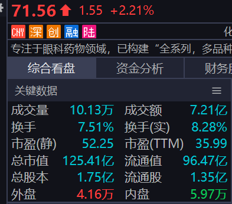

#### 竞价+分时图+振幅的含义

当股票在上升趋势中，开盘出现竞价低开需要警惕空头做空，如果空头开盘就往下砸盘，且价格砸到较大的跌幅和振幅，说明这个位置多方的承接力不够，出现了明显了多空分歧，且空方现在占据优势，当前趋势不满足向上的条件。多方在空方做空结束之后，可能会继续尝试将股价拉升，来判断空头的是否还有余力，如果股价拉升后迅速回落说明，空头还有明显的优势，那么现在趋势可能会从上涨转为回撤调整或者趋势反转，这时候就可以在多头拉升的高位后迅速回调的过程中先出掉筹码，等待多空交手确定结果。在没有跌破上涨趋势的情况下，后续如果出现交易日开盘15分钟内如果股价平开波动很小（振幅3%以内）或略微低开缓慢高走的时候选择买入，在这时候买入的原因是因为当前股价没有空头砸盘，只要上涨趋势还在，等多头拉动就可以继续上涨趋势。

#### 成交量的含义

首先让我们理清日k线图中成交量的作用：成交量缩量说明多空双方没有分歧，结合趋势可以判断当前走势；成交量放量说明多空双方出现分歧，未来的走势还不明确。

#### 股票的盘面分析确定买卖点

想要确立买卖点，首先就是需要我们根据已经走出来的日k线图来判断当前的走势，只有在我们判断出该股当前的走势，我们才能合理的推断未来走势。

- ==上涨趋势==：当股票在近几个交易日连续上涨，没有明显的回撤（包括日间回撤），且没有放量，就说明目前是上涨趋势
- - 如果此时股票的日k线图在形态上继续缩量/温和放量上涨（成交量是相对前面的交易日的，最好量比不要超过1.5），最好尾盘不出现大幅回撤的情况（大幅回撤中回撤对上涨的比例有待进一步确定），这是因为缩量或者温和放量上涨形态表明了现在的空头力量不足，更多的持股人选择继续看多，尾盘如果出现明显的回撤，此时多头优势有可能已经变成空头优势，不过因为没有放量，所以判断这种趋势转变的可能性需要通过下一个交易日的k线走势确定。确定好现在的趋势依然是上涨时，这就是买入的点位。
- - 如果股票上涨形态中，出现缩量非涨停上涨（包括炸板），这里持股人大多数也是坚定看多，可以判定上涨趋势将继续，这里也是买入点位。
- - 如果此时股票的日k线图在形态上出现放量大涨，且尾盘回撤不多，说明虽然有部分持股人转变为空方，但是目前多方占据优势，在大涨的过程中抛压被完全接下，也可以推断上涨趋势将继续（最好结合该股历史上涨的山顶位置来配合判断）。这里也是可以买入的点位，不过需要注意，这里多方阵营已经开始逐渐分化，空头的力量开始增强，有比较大的可能上涨将加速，直到趋势的转换，这里需要谨慎买入，但是对于持股人可以继续持有。在这里买入违背一句交易的金科法则：“==买在一致（多方占据绝对优势），卖在分歧（多空双方活跃，且空方逐渐占据优势力量）==”。
- - 而当股票出现放量（对于放量的定义我觉得对大中小盘来说是不一样的，对小盘来说最少也要达到15%以上，中盘要达到10%，大盘我不确定，以后再完善）滞涨（收盘价相对上涨幅度较小或者下跌）的时候说明空方明显增多，这可能是由于部分持股人在这个位置由看多转变为看空，积极或消极的抛售股票，导致多方在拉伸的时候阻力明显增大，这种阻力增大的现象也会进一步导致其他持股人从原来看多转变为看空，这样空方力量不断累积，而原来占优的多方实力却逐渐衰弱，最终趋势从上涨变成震荡或者下跌，这取决于多空双方的力量对比，这就是上涨趋势终结的拐点。这里不是做多的点位。
- ==下跌趋势==：相比上涨趋势，下跌趋势通常会更长且呈现出长期缓跌+少量深跌+少量反弹，这里主要是由于下跌过程相比上涨更容易受到板块和大盘趋势的影响，比如对于非热门板块下跌过程通常是着大盘的波动，比较难以概括具体的下跌形态。
- - 股票出现放量滞涨或者高位放量震荡，此时多空双方力量逐渐平衡，如果现在k线图上显示出深跌和高成交量（虽然相比高位放量的成交量有所下降），这时多空双方对趋势的判断有明显分岐，且空方在当前价格区间占据优势，这种趋势的变化会让持股人从看多变为空方，积极或消极抛售股票，股价深跌就反映了这一点。所以可以推断趋势将会变成空头行情。这里是做空的点位。
- - 在股票从上涨或者震荡转换为下跌趋势的早期，k线图显示缓跌但高成交量，依然是多空双方分歧，但是空方占优。此时会是做空的好点位。
- - 下跌趋势中，k线图显示随着股价下跌的过程，成交量逐渐缩小，此时个股关注度显著下降，进入了缓慢的下跌寻底过程，此时原来的多空双方都出现了衰弱的情况，只是空头还是占据了微弱的优势。这时可以合理推断在没有新的多头出现的情况下跌行情会持续，这个过程非常漫长曲折，这不是做空的好点位。

##### 最佳买卖点

对交易员来说最好的点位应该就是趋势的拐点了吧，因为进入拐点意味着股票将朝着原来相反的方向运动，如果你在这个市场抓住了机会，就意味你将享受到最肥美的一段行情。
但是想抓住拐点确难上又难，我将这个拐点分为两种：

- 下跌或震荡过程结束，转为上涨，称之为做多拐点；
- 上涨或震荡过程结束，转为下跌，称之为做空拐点。
什么才能叫做拐点呢，我目前判断是盘面趋势发生明显变化的时候，k线图成交量明显变化的时候。比如股价低位时，在长期缩量的时候某一天突然成交量大涨（量比要超过2），或者在一段时间内成交量都比较大的时候突然出现缩量（量比小于0.5）。
以我现在的见识，很难分析总结拐点，留待以后完善吧。

##### 做多拐点

做多拐点的位置可能是最难确定的位置了，他受到太多的因素的影响，我只能尽量去覆盖一些可能的情况。一种情况时股价下跌和震荡的时间很长，不断寻底的过程中，原本不坚定看多的持股人已经在股价不断下跌反弹的震荡中主动或被动的卖空出局了，空头也失去了潜在空方力量的协力，在场的就是坚定持股看多的消极多方和做空的空头：

- 这时候如果空头继续做空，走势会有两种可能：
- - 股价表现日内收跌，且盘中基本单边下跌，没有什么反弹，成交量不活跃，这个形态表明了趋势会继续向下；
- - 股价低开，开市后分时线内盘出现大单砸盘，但尾盘出现明显的收复甚至上攻的趋势，振幅扩大（6%以上）但跌幅相对收敛，在k线图上呈现出长下影线，有的时候可能还会出现上影线。这是因为场外原本看空的看到股价下跌，转变立场，积极或消极买入，导致空方为了进一步打压股票，抛出更多的筹码，被多方承接，空方没有更多的力量，或者空方发现现在的位置已经无法压制多方，这种情况说明现在已经不属于单边下跌的情况。后续交易日可能会有新的空方加入，尝试做空，如果继续出现这种k线形态，这时候基本就可以确定见底了，更多的交易者也会明白现在的趋势变化。接下来的趋势可能是股价在短暂震荡后反弹，或者直接V字反转（这两种情况显示了多头的力量强弱），股价上涨到一个高度后进入震荡趋势调整或者继续上涨创出相对新高（这取决于主力多头的力量和持股人态度的变化）。比如下面的股价走势图中箭头标识**做多拐点**的位置，这里成交量放大，说明空头为了保证股价收跌，必须抛出更多的筹码，市场上对股票的求购看多导致向下阻力变大，继续做空已经属于趋势逆势。结合下面这张K线走势图，可以看到股价在下探到2.86的过程中，下跌的阻力已经相当明显，后一个交易日做多拐点，股价低开高走，收盘时完全覆盖了前一个交易日的跌幅，且后续持续两日交易日大涨拉升，形成一个V字低，确认了底部，这里做多拐点就是我们最好的买入点通常是在尾盘确定了形式的情况下买入，这里至少可以反弹回震荡位置，大胆一点还可以在拐点前一日尾盘推断出未来走势，提前进场。

做多拐点1

- 还有一种情况空头力量减弱，多头也没有拉升的动力，股价将变成自由运动，在板块和大盘变动的情况下，进行无规律震荡，股票成交量持续低迷（下图6形态），这里的拐点比较难判断，可以确定的在某个时间，当比较强力的多方主动拉升时，将会转为上涨的趋势，会有明显的成交量增加（比如量比超过2），这里做多的拐点。这里图中3的形态虽然也是震荡，但是震荡幅度较大，成交量也没有完全萎靡，说明多空双方虽然力量都出现明显的衰减，但是多空双方积极争夺优势地位，虽然后面多头获胜，但是这里距离前高太近，多头显然没有继续拉动的动力，所以上涨趋势（或者说反弹）在很短的时间内就结束了，虽然可以进入做多，但是空间有限。

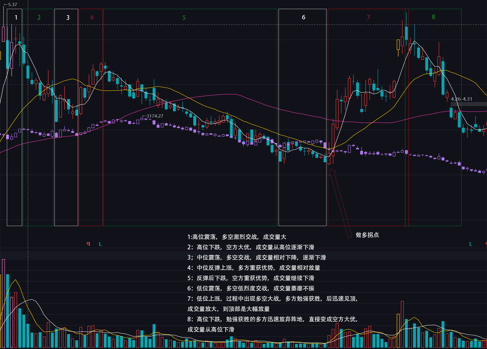

做多拐点2

除了股票长期阴跌震荡的情况，还有一种股票在成交量较大的快速下跌之后，K线形态显示盘中出现较大跌幅相对其他交易日跌幅明显放大（比如跌幅比高于1.75，且跌幅不小于3%，振幅最好大于3%），最好尾盘出现多头占优的情况出现，且尾盘上涨的越多越好，但成交量相对前几个交易日没有发生明显的放量（通常量比不超过1.5），最好是出现明显缩量，此时可以认为空头失去了优势地位，因为前几个交易日放量的持股人在卖出股票后，已经变成无关人员，空头的力量在减弱，而剩余的持股人大部分都立场坚定，继续看多，接下去如果空头没有眼色，继续做空，场外原本观望的看空者在看到空方力量减弱的情况下，将很有可能会转变为看多者，趁机低吸股票，积极介入做多，多空双方趋势逆转，多方逐渐占据优势，空方做空将失败，后续将有很大的机会看涨。

##### 做空拐点

- 要确定股票的走势，需要确定趋势变化的拐点，同时也可以是我们的买卖点：
- - 无论什么情况，我们都可以明确的一点当成交放量的时候，空方的力量得到了加强。此时就有可能转变原来的趋势，当然也不一定，不如上涨的过程中，某一日出现放量大涨，且尾盘也持续上涨或者直接涨停，说明虽然空方力量加强，但是多方力量更强，这时往往后面的交易日会继续上涨，直到空头的力量继续增长到多方已经无力压制。
- - 通常对于上涨过程，
- - 对于下跌过程，空方占据（明显）优势的时候，股票会出现
- 首先总结下什么情况下股票属于上涨趋势：
- -

### 关于板块龙头的一些思考

我最近一直被一个现象所困扰，我在看好一支股票后，因为各种问题没有买入，后续该股却成为了市场的热点，股票短期出现了大幅上涨，涨幅多到让我不敢再进去，所以虽然我还是很看好这只股票，但是心理却有一种想法，这个股我要等后面回撤稳定之后再买入，但是好几次（实际上是每一次）都是眼看着它在短期震荡调整后，又继续上涨，涨到让我更加不敢进去的位置，后续继续震荡，然后等到下一次板块轮动到时，又开始出现上涨。
这时候我突然意识到了，这只股票在上涨龙头趋势下，调整可能就只会横盘震荡，而不会出现明显的回撤。
我想到也许这样的股票就是板块的龙头，在板块趋势刚起来的时候领涨，市场一致看多，在大盘和板块行情变弱后，持有者也坚信该股未来还会继续上涨，因此哪怕不是在行情中也很难真的跌下去，而等到板块下一次轮动的时候，市场上会首先想到该股，继续出现积极的买入现象，导致股票继续上涨。后续反复多次出现同样的情况，直到有一天，市场上更多的人对该股预期发生了改变，比如更多的人觉得在原来的预期中现在股价已经得到了体现，后续没有新的预期出现股价很难在继续上涨，或者到了预期转化为业绩逐渐兑现的时候，这时候反而股票却走出来上涨趋势。
所以考虑到这种情况，我想对我自己的股票要求做一些修正，对于这些板块的龙头，简单的波浪理论很难正确的描述他的股价变化，龙头通常会是短期大幅上涨，然后调整几天后，继续上涨，再调整，继续上涨，直到兑现了对股价的预期或者超出了预期。所以在发现市场的龙头的情况下，只要对他的预期还没有兑现或没有发生改变，他在未来就还会继续上涨，这时候，不管实在调整的时候，还是在上涨的过程中，都是可以积极买入的，而不是违背市场心理，自己主观的认定一个买入价格，或者在场外期待着后续回调买入，真要等回调买入，那有可能属于下跌的趋势了。对这样的股票，首先要做的是选好股票，确定这支股票是板块的龙头，这方面可以借用AI的力量来寻找确定。比如我最近一段时间通过AI发现的板块龙头有博创科技（铜缆）、每日互动（DS龙头），而通过市场发现的龙头有广和通（AIOT端侧）、瑞芯微（AI芯片）、长盛轴承（宇树机器人）、卧龙电驱（机器人）。需要注意的时，板块的龙头有时候并不是只有一个，可能会存在多个。

## 板块对应标记

|标记|板块|
|---|---|
|1| 电子|
|2| 机械设备或建筑装饰|
|3| 计算机通信或零售|
|4| 金融或传媒|
|5| 金属材料或建筑材料|
|6| 电力设备或电力|
|7| 基础化工|
|8| 汽车或食品饮料|
|9| 医药生物|

|标记|颜色|板块|
|---|---|---|
|1|白色|半导体|
|1|橙色|消费电子|
|1|粉色|光学光电子|
|1|蓝色|其他电子|
|1|绿色|元件|
|1|红色|电子化学品|
|1|紫色|军工电子|
|2|白色|通用设备|
|2|橙色|自动化设备|
|2|粉色|专用设备|
|2|蓝色|工程机械|
|2|绿色|轨交设备|
|2|紫色|建筑装饰|
|2|红色|军工装备|
|3|白色|IT服务|
|3|橙色|软件开发|
|3|粉色|计算机设备|
|3|蓝色|零售|
|3|绿色|通信设备|
|3|紫色|通信服务|
|3|红色|游戏|
|4|白色|电网设备|
|4|橙色|电池|
|4|粉色|光伏设备|
|4|蓝色|电机|
|4|绿色|其他电源设备|
|4|紫色|电力|
|4|红色|风电设备|
|5|白色|汽车零部件|
|5|橙色|汽车整车|
|5|粉色|电器|
|5|蓝色|白酒|
|5|绿色|食品加工|
|5|紫色|饮料制造|
|5|红色|汽车服务及其他|
|6|白色|工业金属|
|6|橙色|金属新材料|
|6|粉色|小金属|
|6|蓝色|能源金属|
|6|绿色|建筑材料|
|6|紫色|钢铁|
|6|红色|贵金属|
|7|白色|化学制品|
|7|橙色|塑料制品|
|7|粉色|化学原料|
|7|蓝色|农化制品|
|7|绿色|橡胶制品|
|7|紫色|其他材料|
|7|红色|化学纤维|
|8|白色|医疗服务|
|8|橙色|医疗器械|
|8|粉色|化学制药|
|8|蓝色|中药|
|8|绿色|生物制品|
|8|紫色|医药商业|
|9|白色|银行|
|9|橙色|多元金融|
|9|粉色|保险|
|9|蓝色|证券|
|9|绿色|文化传媒|
|9|紫色|影视院线|

其他不在这里面的板块，是因为标记种类有限，实在放不下了。

## 技术指标

### 布林带

布林带（Bollinger Bands）的计算方法及用途

***布林带的计算公式***

布林带由三条线组成：中轨线（中线）、上轨线（Upper Band）和下轨线（Lower Band）。具体计算步骤如下：

    中轨线（中线）

        中轨线是价格的简单移动平均线（SMA），默认周期通常为 20天。

        公式：
$$中轨线=SMA(N)=\frac{\sum_{i=1}^N收盘价_i}{N}$$
    （$N$ 为周期，如20天）

    上轨线与下轨线

        上轨线 = 中轨线 + k×标准差

        下轨线 = 中轨线 - k×标准差

        标准差（Standard Deviation）：衡量价格波动性，默认k=2（即两倍标准差）。

        公式：
$$标准差=\sqrt{\frac{\sum_{i=1}^N({收盘价_i−SMA(N)})^2}{N}}$$
        ​

***布林带的核心用途***

布林带通过动态反映价格波动性，帮助交易者分析市场趋势和潜在交易信号：

    判断价格波动性

        带宽（Bandwidth）：上轨与下轨之间的距离。

            带宽扩大：市场波动性增加（如趋势启动或重大消息影响）。

            带宽收窄：市场波动性降低（如盘整阶段）。

    识别超买与超卖区域

        价格触及上轨：可能处于超买状态，短期回调概率较高。

        价格触及下轨：可能处于超卖状态，短期反弹概率较高。

        注意：在强势趋势中，价格可能沿上轨或下轨持续运行，需结合趋势判断。

    趋势确认

        价格在中轨上方运行：表明市场处于上升趋势。

        价格在中轨下方运行：表明市场处于下降趋势。

        中轨斜率变化：反映趋势强度的变化。

    捕捉突破信号

        价格突破上轨：若伴随成交量放大，可能预示上涨趋势延续。

        价格突破下轨：若伴随恐慌性抛售，可能预示下跌趋势加速。

        假突破：需结合其他指标（如RSI、MACD）验证。

    布林带收口与开口

        收口（Squeeze）：带宽极窄时，预示即将爆发大波动（突破行情）。

        开口：带宽扩大时，标志趋势确立或加速。

***布林带的实战应用示例***

    震荡行情中的交易

        策略：价格触及下轨时买入，触及上轨时卖出（需结合其他指标过滤信号）。

        风险：在趋势行情中可能频繁止损。

    趋势行情中的跟随

        策略：价格沿上轨运行时持有或加仓，沿下轨运行时减仓或做空。

        优势：捕捉趋势中段利润，避免过早止盈。

    结合其他指标增强信号

        MACD：布林带收口时，若MACD出现金叉，可预判向上突破。

        成交量：突破布林带时需成交量配合，否则可能是假信号。

***参数调整与注意事项***

    参数优化

        周期（N）：默认20天，缩短周期（如10天）可提高灵敏度，但信号噪音增加。

        标准差倍数（k）：默认2倍，增大倍数（如3倍）可减少误判，但可能错过交易机会。

    常见误区

        盲目逆势操作：在单边行情中，逆势交易（如触碰上轨即做空）可能导致重大亏损。

        忽视市场环境：需结合大盘趋势、行业背景和基本面分析综合判断。

    适用市场

        股票、外汇、加密货币：适用于流动性高、波动性强的市场。

        不适用场景：流动性差或长期横盘的市场，布林带信号可能失效。

***总结***

布林带通过量化价格波动性，为交易者提供趋势判断、超买超卖信号及突破预警。其核心价值在于：

    动态适应市场：带宽随波动性自动调整，避免静态指标的滞后性。

    多场景适用：既可用于震荡行情的高抛低吸，也可用于趋势行情的持仓跟随。

关键要点：

    价格触及布林带上下轨并非绝对反转信号，需结合趋势和成交量验证。

    布林带收口是潜在突破的前兆，需提前制定交易计划。

    参数设置需根据交易品种和周期优化，避免“一刀切”。

通过灵活运用布林带，交易者可更精准地捕捉市场机会，但需与其他工具结合使用以提升胜率。

### KDJ

***KDJ指标构成***

KDJ指标由三条曲线组成：

    K线（快线）：反映短期价格波动，对价格变化敏感。

    D线（慢线）：K线的平滑移动平均线，过滤短期噪音，体现中期趋势。

    J线（方向线）：通过K与D的差值进一步放大波动，提前预警趋势变化。

***计算公式***

KDJ的计算基于最高价、最低价、收盘价，默认周期为9天，具体步骤如下：

计算RSV（未成熟随机值）：
$$RSV=\frac{Close_t−Low_9}{High_9−Low_9}×100$$
$Closet_t$​：当日收盘价
$High_9$​和$Low_9$​：过去9天内的最高价和最低价。

计算K值和D值：

K值：RSV的3日指数移动平均（EMA）
$$K_t=\frac{2}{3}×K_{t−1}+\frac{1}{3}×RSV_t$$

D值：K值的3日EMA
$$D_t=\frac{2}{3}×D_{t−1}+\frac{1}{3}×K_t$$

计算J值：
$$J_t=3×K_t−2×D_t$$

***核心应用方法***

1. 超买超卖信号

    超买区域：K、D线 > 80，预示价格可能回调。
    超卖区域：K、D线 < 20，预示价格可能反弹。

2. 交叉信号

    金叉（买入信号）：K线从下向上穿越D线，尤其在超卖区（<20）时更可靠。
    死叉（卖出信号）：K线从上向下穿越D线，尤其在超买区（>80）时更有效。

3. 背离判断

    顶背离：价格创新高，但KDJ未创新高，预示上涨动力衰竭。
    底背离：价格创新低，但KDJ未创新低，暗示下跌动能减弱。

4. J线的辅助作用

    J线 > 100：极度超买，短期可能见顶。
    J线 < 0：极度超卖，短期可能触底。

四、实战技巧与注意事项

    适用场景

        震荡市：KDJ在20-80区间内波动时，金叉/死叉信号有效性高。

        趋势市：需结合趋势指标（如MACD、均线）过滤虚假信号，避免逆势操作。

    参数调整

        缩短周期（如5天）：提高灵敏度，适合短线交易。

        延长周期（如14天）：减少噪音，适合中长线分析。

    结合其他指标

        与MACD配合：MACD判断趋势方向，KDJ捕捉买卖点。

        与布林线配合：在布林带上下轨附近验证超买超卖信号。

五、KDJ的优缺点

    优点：

        反应灵敏，适合捕捉短期波动。

        直观显示超买超卖状态，辅助判断反转时机。

    缺点：

        趋势市易钝化：单边行情中KDJ可能长期处于超买/超卖区，导致信号失效。

        噪音干扰：短期价格波动可能引发频繁交叉，需结合其他工具过滤。

六、案例解析

    震荡市中的操作：
    当股价在箱体内波动时，KDJ在20附近金叉可视为买入信号，80附近死叉则卖出。

    趋势市中的背离：
    若股价持续上涨但KDJ高点逐步下移（顶背离），提示需警惕回调风险。

### KDJ和布林带

#### 协同判断超买超卖

***震荡市场中的策略***

    超买信号：

        KDJ：K线与D线 >80，J线 >100。

        布林带：价格触及或突破上轨。

        操作建议：若两者同时触发，短期回调概率高，可减仓或做空。

    超卖信号：

        KDJ：K线与D线 <20，J线 <0。

        布林带：价格触及或跌破下轨。

        操作建议：若两者共振，反弹可能性大，可分批建仓。

案例：
某股在横盘震荡期间，KDJ的K/D线升至85，同时股价触及布林带上轨，随后出现3%的回调。
***趋势市场中的修正策略***

    上升趋势：

        布林带：价格沿上轨运行，中轨向上。

        KDJ：可能长期处于超买区（K/D线 >80），但趋势未改。

        操作建议：忽略KDJ超买信号，以布林带中轨为支撑持有，跌破中轨再离场。

    下降趋势：

        布林带：价格沿下轨下跌，中轨向下。

        KDJ：可能持续超卖（K/D线 <20），但反弹乏力。

        操作建议：避免盲目抄底，等待布林带收窄且价格站稳中轨后再介入。

案例：
在单边上涨行情中，某股KDJ连续两周超买，但布林带保持开口向上，股价继续上涨15%。

#### 进阶用法：背离与形态共振

    顶背离（看跌信号）
    
        价格表现：股价创新高，但布林带上轨未同步上移（动能减弱）。
    
        KDJ表现：K/D线未创新高，甚至出现死叉。
    
        意义：上涨动力不足，可能反转。

    底背离（看涨信号）
    
        价格表现：股价创新低，但布林带下轨未同步下移（抛压减轻）。
    
        KDJ表现：K/D线未创新低，且出现金叉。
    
        意义：下跌动能衰竭，反弹在即。

案例：
某股股价创阶段新低，但布林带下轨走平，同时KDJ在超卖区形成金叉，随后反弹8%。

#### 参数优化与注意事项

1. 参数调整建议

|指标|默认参数|适用场景|调整建议|
|:--|:--|:--|:--|
|KDJ (9,3,3)| 短线交易| 震荡市：|缩短周期至(5,3,3)|
|布林带 (20,2) |中线趋势跟踪 |趋势市：|周期调至26，标准差调至1.5|

2. 需规避的误区

    钝化陷阱：在强势趋势中，KDJ超买/超卖信号可能持续失效，需以布林带方向为主导。

    假突破干扰：价格短暂突破布林带上下轨后快速回归，需结合成交量确认（放量突破更可信）。

    周期错配：避免KDJ使用日线而布林带用周线，两者周期应一致（如均用日线或60分钟线）。

## 股票市场行情

|日期|全A-沪深指数（%）|全A-沪深成交量（万亿元）|全A-主力资金（亿元）|全A-大单净额（亿元）|上涨数（支）|下跌数（支）|涨停数（支）|跌停数（支）|上证指数（%）|深成指数（%）|
|---|---|---|---|---|---|---|---|---|---|---|
|2025/1/2|-1.86|1.3965||-592.49|925|4383|67|32|-2.66|-3.14|
|2025/1/3|-3.63|1.2676||-458.16|615|4726|55|111|-1.57|-1.89|
|2025/1/6|-0.47|1.0585||-220.63|2292|2932|68|91|-0.14|-0.12|
|2025/1/7|2.19|1.0765||108.07|4393|902|104|18|0.71|1.14|
|2025/1/8|-0.10|1.2428||-201.29|1978|3250|74|9|0.02|-0.54|
|2025/1/9|0.3|1.1118||-31.98|2728|2459|97|11|-0.58|0.32|
|2025/1/10|-2.67|1.1481||-348.09|536|4802|44|52|-1.33|-1.80|
|2025/1/13|0.21|0.9962||-150.98|3007|2180|52|41|-0.24|0.00|
|2025/1/14|4.57|1.3505||479.33|5333|38|157|3|2.54|3.77|
|2025/1/15|-0.41|1.1887||-345.00|1666|3554|81|10|-0.43|-1.03|
|2025/1/16|0.61|1.2931||-138.92|3368|1816|84|7|0.28|0.41|
|2025/1/17|0.13|1.1354||-78.26|2619|2535|65|16|0.18|0.60|
|2025/1/20|0.95|1.1828||-100.20|3617|1587|80|26|0.08|0.94|
|2025/1/21|-0.10|1.2177||-57.99|1985|3257|52|27|-0.05|0.48|
|2025/1/22|-1.02|1.1357||-263.34|1032|4261|48|26|-0.89|-0.77|
|2025/1/23|-0.16|1.3551||-212.18|2334|2795|46|29|0.51|-0.49|
|2025/1/24|1.16|1.2219||200.58|3956|1225|74|29|0.70|1.15|
|2025/1/27|-1.00|1.1177|-513.31|-477.93|1816|3422|45|48|-0.06|-1.33|
|2025/2/5|1.00|1.2894|35.56|-25.62|3433|1850|83|45|-0.65|-0.08|
|2025/2/6|2.21|1.5352|445.03|212.78|4801|471|101|4|1.27|2.26|
|2025/2/7|1.32|1.9598|56.15|-73.89|4169|1088|93|2|1.01|1.75|
|2025/2/10|1.75|1.7305|-139.09|-148.95|4146|1110|140|2|0.56|0.52|
|2025/2/11|-0.31|1.6357|-618.49|-572.50|1834|3418|84|2|-0.12|-0.69|
|2025/2/12|1.02|1.6768|-36.13|127.99|3560|1568|95|2|0.85|1.43|
|2025/2/13|-0.95|1.8195|-600.5|-561.3|1151|4112|74|7|-0.42|-0.77|
|2025/2/14|-0.95|1.7146|-110.97|-291.17|2400|2799|87|9|0.43|1.16|
|2025/2/17|1.23|1.9410|-340.27|-353.50|3675|1604|114|7|0.27|0.39|
|2025/2/18|-2.30|1.7988|-884.16|-862.56|731|4626|53|21|-0.93|-1.61|
|2025/2/19|2.15|1.7208|370.96|116.51|4645|591|120|4|0.81|1.46|
|2025/2/20|0.93|1.7563|-337.42|-310.79|3377|1842|107|1|-0.02|0.20|
|2025/2/21|0.88|2.1920|264.92|45.74|2872|2352|119|4|0.85|1.82|
|2025/2/24|0.34|2.0799|-591.80|-597.63|2778|2468|91|18|-0.18|-0.08|
|2025/2/25|-0.37|1.8964|-469.88|-476.88|1537|3735|65|7|-0.80|-1.17|
|2025/2/26|1.42|1.9380|51.90|-64.15|4250|1054|108|3|1.02|0.93|

## 交易日志

### 2024/12/31

市场仅有少量板块上涨：燃气，培育钻石等
零售板块有4支股票涨停
现在手上主要持有股票是每日互动（40手），香农芯创（18手），横店东磁（24手），半导体etf（122手）：

- 其中每日互动上一个交易日买入，当时个人预期deep seek热度会带动该股上涨，所以在早盘高开下行的时候逐步购入，但是该股当日逐渐下滑缺少支撑，并在次日继续低开低走，并伴随着大盘的下行，进一步加剧了股价下滑，目前浮亏接近10%，跌破了5日均线。当时购入这只股票本来就是想炒作短期上涨，结果又做错了，最近真是做多错多。**右侧交易，做错了，还在硬抗**
- 香农芯创买入时也是希望能短期炒作，当时该股盘中出现大额买单异动，因此我在异动时高位买入，但后续交易日股价却下行了几个交易日，后来反弹也没有达到我买入的高度，该股处于横盘震动状态，目前浮亏也接近10%，我期待着今年的年度财报能带动股价上涨。**右侧交易，做错了，还在硬抗**
- 横店和半导体属于前期买入套牢股，目前分别有20%和11%的亏损，当时的想法都是做左侧，长期趋势，目前可能不容易解套，只能期待着明年行情的到来。**左侧交易，也是做错了，趋势错了**

### 2025/1/2

***市场行情***

零售12支涨停，社区团购5只涨停，食品加工8支涨停，拼多多3只涨停，预制菜8支涨停，网络直播16支涨停等

***持有股票***

今天两市指数继续下跌，且均已经跌破60日均线，后续需要注意风险，避免激情开仓或加仓。持有个股情况如下：

- 买入露笑科技，价格7.60，37手，博反弹。
- 每日互动今天高开高走，盘中涨停，但是下午炸板，收盘涨幅13.83%。我盘中博弈尾盘封板，在16.52的位置买入35手，但是尾盘并没有预期的那样涨停，所以最后竞价阶段将现有的40手以16.63的价格卖出，目前略有盈余，明天继早盘观察竞价，再决定加减仓。
- 香农芯创今天没有行情，随着大盘的下跌，股价也下跌，跌幅4.53%，已经跌破了9月份普涨后的底部位置，我打算继续持有，期待基本面反转。
- 横店和半导体一样没有行情，继续持有，期待解套的那天。

评估大盘：最近百货零售一直在上涨，可能已经到顶部了。
**预判**：最近机器人板块相对下跌较多，如果大盘走势反转，考虑买入相对应的股票。

### 2025/1/3

昨天有拉动信号，重点关注机器人领域

***市场行情***

板块行情：仅贵金属板块，煤炭开采加工板块有所上涨，安源煤业涨停。

***持有股票***

今日大盘继续下跌，我预感到熊市已经出现了。持有股票如下：

- 露笑科技，今天继续低开低走，博反弹失败了，但是我不想认输，期待着铜缆板块在其启动的时候带动该股反弹，目前亏损8.6%。
- ==每日互动，今天竞价低开，本来预期是会低开高走的，所以开盘后分别在16.2和15.97的位置分别买入21手，但是随后股价就跌了，最后收跌到14.71，目前持仓亏损8.4%，现在看来我昨天就应该在盘尾开盘的时候直接清仓，今日早盘加仓也是反面操作，谨记！！！==
- 其他持仓都随着大盘的下跌出现下跌，短期是没法解套了，继续长期持有吧。

机器人板块有部分股票比较抗跌，应该昨天资金流入的原因。

### 2025/1/4

***关于投资哲学的思考***

最近在看澄明之境，里面说到投资需要有自己的哲学——投资的理论、模型、假设决定市场观察和操作。这种哲学观念或者说思维模式强调的是标准在先，用理论、模型、假设去解读这个混沌的市场，给市场定位（当时没有哪个模型能完全覆盖整个市场的运动，只能对市场的某些情形做出解读）。所以我当前这种随性的交易逻辑，观察市场的方式，是无法在这样的市场生存的，没有自己的交易模型，使用别人的理论去观察市场总是会出现混乱的情况，常常出现一种方法判断股票将会上涨，另一方面却又得到相反的趋势，没办法判断市场的方向，也就导致交易时举棋不定，无法做出正确的决策。
**重要的要建立自己的模型去解读市场，不要追求大而全的覆盖这个市场，这是做不到的，市场本身时不可知的，就好像真理是不可知的，科学中的不同理论人类用来解释宇宙的某些现象的方法，但我们并不能知道这个宇宙的真理。投资模型同样也是用来解释市场的部分运动，所以需要根据市场的运动情况，不断调整自己的模型，使之更加符合市场的部分运动逻辑，这样才能够在市场中生存下来。**

***关于风险管控的思考***

澄明之境的作者曾经做过一个统计分析，在设定一些风控条件的情况下，对一个交易员一年的资金曲线进行优化测试。
先把一年的实际资金曲线图制作出来。每当资金曲线回撤5%，假如交易暂停一天，两天，三天，你会得到三张新的资金曲线图。通过比较，这三张模拟的资金曲线图之间结果差异并不大，但和原始的资金曲线图相比，采取暂停交易策略，整体权益可以得到显著的改善。

我的思考是就是在交易斩仓的时候，不要急于在当天去投入下一支股票，而是应该给自己冷静下来，分析为什么会出现亏损，及时调整自己的操作策略，并在盘后冷静的思考接下去要操作的股票，发掘信号，总比急匆匆从一个亏损股，跳到下一只亏损股要好。

澄明之境的作者自己做期货交易有四道防线，我觉得也适用于股票：

- 第一道防线：仓位管理，重仓交易时极度危险的，操作策略是试探盈利加码，目的就是保证盈利时仓位大，亏损时仓位小；
- 第二道防线：时间止损和主动止损，所谓时间止损，就是当我开仓以后，市场价格运动没有符合我的预期，交易结果没有正反馈，我会主动减仓，有意识地降低风险。
- 第三道防线：价格止损，开仓时设定一个价格止损点，当市场价格触及这个止损点时，被动止损就触发。
- 第四道防线：止损后，不要再立即进场，而是要冷静下来，让自己修整下，调整心态，恢复状态。

==风控的作用就是平稳操作时的心态，了解再行情过程中何时会有超自然的情绪反应，并使进场离场都成为理性思考的产物。==

***关于操控的股票数量的问题***

要注意不要分仓太多，现在的资金量顶多分仓两支。其实过多的分仓会分散注意力，导致无法集中精力去观察市场，从而无法做出正确的决策。还有就是短线分仓就说明你对这只股票的趋势没有把握，潜意识不敢投入更多的资金，所以只能分仓，这样会导致资金利用率低。

***最近交易的思考***

去年十二月到目前，我交易的股票有

- 12/6号买入光洋股份（22手），10.35 in，10.5 out，持股T+1，短线`成功`。
- 12/6号卖出荣盛发展，并转而买入光大嘉宝（74手），4.74 in，12/24号 3.45 out，持股T+12，短线交易`失败`。从荣盛到光大，属于地产板块内的股票切换，原因是我观测当时光大的近日涨幅明显优于荣盛。结果这个交易做错了，事后判断当时地产已经处于高位下滑后的反弹阶段，本来荣盛处于浮盈阶段，因为贪心作祟，在看到光大盘中冲高切换到光大，结果后续地产持续下行，最终在3.45的位置割肉清仓。从事后来看，我没有控制住情绪，激情买入光大是一个错误，割肉时候的对地产下行趋势的判断是正确的。从我切换到光大，地产板块就处于持续下滑阶段，光大目前股价已经到了2.99。
- 12/9号 宝鼎科技（17）13.551 in，12/13号 14.06 out，持股T+4，短线`失败`。买入时根据盘中大单冲刺信号，但是实际上属于冲动买入，根据盘中的加速可以发现其实该股加速较慢，主力没有明显的拉升决心，且缺少主力大单冲刺的情况下，股价有明显的回落，导致我买入的位置在盘中高位，并在随后的3日内震荡调整，直到第四个交易日开盘冲高，但后续盘中缺少大单冲刺，股价高开低走，于是我选择清仓处理。事后来看好在我及时清仓，后续股价持续下行了一段时间，最低到12，但随后有两次涨停，目前股价在14.48。虽然股价比我卖出的要高，但是我不后悔，股价高开低走，我判断的趋势下行短期来看是正确的。
- 12/13号 香农芯创（18）31.38 in，目前股价26.75，持有中，短线`失败`，转为`中长线`。买入逻辑是盘中有大单试盘，冲动买入，结果盘中高位收盘就跌破了，后续始终没有回到这个位置。事后来看，当时根据盘中异动大单冲动买入是不靠谱的，日后要谨记，寻找更好的可靠的趋势判断标准，目前继续持有的原因是因为我考虑到该股财务水平不错，连续多年盈利，且3-4月份将出年报，可以预期一下年报预增涨。
- 12/24号 汇纳科技（8）30.05 in，12/30号 28.3 out，持股T+4，短线`失败`。买入逻辑也是因为盘中多次大单拉升股价，且到盘尾没有明显股价回落，判断卖出筹码不多，所以盘尾买入。实际上判断出错了，因为这只股票和光大的问题是一样的，前期高位票，我的买入时机处于下行过程中的反弹，我判断错了信号，导致买入后，持续下跌，且出现连续几日没有反抗的较大幅度的下跌，因此在股价早盘冲高时果断卖出，截至目前股价已经跌到21.85。现在来看，我买入时机错误，卖出时机正确，及时斩仓避免进一步的损失，相比光大的交易，这点我有所进步，但是对买入时机的判断依然有错。另外据我观察，这只股票有明显的庄，对股票的走势控制能力极强，除非后续有新的大资金进入，否则，不能随便进入，除非等到低位时，考虑埋伏。
- 12/30号 每日互动 16.28（23）in，16.05（14） in，15.95（3）in，2025/1/2号 16.52（35） in，16.630（40）out，2025/1/3号 16.2（20）in，15.97（21）in。持有中，短线浮亏8.42%。买入逻辑是当时deep seek热度正高，每日互动和deep seek母公司幻方量化有密切的连续，可能有炒作的机会，因此在早盘高开的情况下又一次冲动买入，但实际上当日该股高开低走，没有大资金买入拉升，直到T+3日高开，并在盘中涨停，盘尾又出现涨停位置撤单，导致炸板，我判断这是看多资金吸筹的行为，有很大的可能盘尾会回封，所以持续买入，但是结果发现判断不准缺，所以尾盘竞价阶段卖出了所有可卖的筹码。第二天我判断该股会继续做多，如果低开，我就继续加仓，等随后回升的时候卖出筹码做T，但是该股虽然低开，但并没有高走，反而继续下跌，最终收跌11.55%，导致我的浮盈变成浮亏。目前大盘形式严重恶化，成交量下滑，后续走势不乐观，这只股票的走势以股价位置来说属于高位震荡，但是我始终觉得它和deep seek的关系，股价的潜力并没有完全发挥出来，所以我暂时没有斩仓，这是一场赌博，哎，希望以后一定要做好买入的判断，在这里吃了多少亏了，怎么就不长记性？
- 12/30号 露笑科技（37）7.6 in，持有中，短线浮亏8.61%。买入逻辑是露笑科技近日在高位大跌，且前几日有游资买入，但不确定有没有卖出，因此准备在大跌后博反弹，但是买入后第二日继续大跌，目前来看，博弈反弹失败了。但是我没有斩仓的原因在于这个股票交易活跃，波动较大，且公司子公司有高速铜缆业务，这块近两年会有高预期，所以我决定继续持有，看后续走势。

### 2025/1/5

#### 澄明之境-投资思路和策略的阅读笔记

今天休市，主要是在阅读澄明之境这本书，我总结下我觉得感受比较深的部分。

作者认为金融市场交易需要有自己的交易思路，完整的交易思路包括多个环节，从交易目标到投资哲学、投资理论、交易策略和方法、风险管理、交易心理心态等，对这些要素有清晰的认识和思考以后，才能构筑成一个完整的交易思路。市场中优秀投资者都有自己的交易思路。

交易风格就是交易员再长期的交易经历中，根据自己的个性、知识结构、生活经历与交易经验逐渐形成的相对稳定的交易思维、行为、心理特征。
金融市场的投机成功有它的规律，需要遵守一系列的原则，包括顺势而为、合理的盈亏比、有优势有胜算的模式等。任何投资风格的形成，都不能和这些成功的基本原则背道而驰，否则就没有生命力，即便短暂成功也难以持久，也就不可能形成什么交易风格。
作者从投机的角度看，有两种风格是成功交易员中比较常见的：一是`顺势、轻仓、止损、长线`；二是`顺势、重仓、相对短的止损、中短线`。在市场中，这两种风格各自都有极为成功的例子。

交易策略是交易思路、交易风格和市场之间连接的桥梁，多好的交易思路和想法也要通过具体的进场策略、加仓策略、止损策略、持仓策略、平仓策略等很多环节来实现。
作者通过自己的经历来说明为什么要使用试探加码的交易策略，早期看到机会时，要么不做，要么重仓出击，基本属于孤注一掷式赌博。结果要么大赚一笔，要么输的一塌糊涂。

***交易策略***

这个策略说起来很简单，就是当市场出现交易信号时，我先试试手，感觉一下市场走势。如果走势和我的预期一致，市场出现凌厉的涨跌，我会快速增加仓位，有时候很容易获得暴利。
如果走势不合我意，我就拿着这部分仓位继续观察，因为仓位小，风险小，压力就小，我可以比较从容地等待市场的演化，实在不行就砍了，损失也不会太大。如果市场只是一个小调整，随后峰回路转，我会在解套后加大仓位，因为市场走势符合我预期的可能性大大增加。当然，真实操作中的情况比这里说的要复杂很多。
使用试探加码策略的目的很简单，就是想在判断失误，交易亏损的时候仓位小，判断正确，交易盈利的时候仓位大，在风险可控的情况下，把握市场重大波动的利润，获取高回报。

==加码方式==：

- 正金字塔加码：开始头寸大（目前我设置成可用资金的一半），后来加码的头寸越来越小（依然是可用资金的一半），确定性较大的时候常用；
- 倒金字塔加码：开始头寸小（可以设置成可用资金的20%），后来加码的头寸越来越大（可用资金的一半），偶尔使用；

平仓策略取决于交易风格。如果你是个短线交易者，就应该用短线平仓策略，如果你是个长线趋势交易者，就应该用长线趋势的平仓策略，也就是等到市场趋势反转了，你再出场。一致性地按照你的交易规则操作，只赚属于你自己的那部分利润。

<!-- 对我来说，==短线平仓==应该分情况：

- 浮盈时超过30%时坚定持有，直到回撤到达最高盈利的10%，此时应该及时平仓，或者平至少一半仓位，后续如果继续回撤到达最高利盈利的15%，全部平仓；
- 浮亏时，市场下跌后，亏损达到5%以上，及时清50%仓位，亏损达到10%以上，全部清仓； -->

记住：
我在多年的操盘生涯中也形成了一个自己的交易习惯：每天收盘以前，仔细审查一遍自己保留的仓位。凡是感觉可疑的、有问题的单子，一律清除。而只持有自己认为有前途、有信心，而且最好是有浮动赢利的交易。

触发我制定这条交易规则的直接原因有几个：

- 我的经验表明，因为期货投机的高风险，勉勉强强、可做可不做的交易，还是不要去做为妙。

- 投机者应该把自己的精力集中在一些符合自己的思维框架、个性习惯，非常有把握的市场机会上。没有必要在一些令人伤神的亏损交易上冥思苦想，希望转危为安。一刀砍了它，也许你就立地成佛了。
“泰德·威廉姆斯是过去70年来惟一一个单个赛季打出400次安打的棒球运动员。他把击打区划分为77个棒球那么大的格子。只有当球落在他的‘最佳’格子时，他才会挥棒，即使他有可能因此而三振出局，因为挥棒去打那些‘最差’格子会大大降低他的成功率。作为一个证券投资者，你可以一直观察各种企业的证券价格，把它们当成一些格子。在大多数时候，你什么也不用做，只要看着就好了。每隔一段时间，你将会发现一个速度很慢、线路又直，而且正好落在你最爱的格子中间的‘好球’，那时你就全力出击。这样呢，不管你的天分如何，你都能极大地提高你的上垒率。许多投资者的共同问题是他们挥棒太过频繁。”

### 2025/1/6

***市场行情***

板块行情：医药板块上涨，虚拟电厂、锂电板块等略有上涨。

***持仓情况***

今日在每日互动涨停板位置卖出半仓17.65（38），并在17.15的位置买入40手。其他持仓没有变化。

|股票|持仓（股）|现价（¥）|成本价（¥）|
|---|---|---|---|
|每日互动|7800|17.08|15.852|
|露笑科技|3700|6.71|7.605|
|香农芯创|1800|26.37|31.402|
|横店东磁|2400|12.69|16.373|
|半导体etf|12200|0.935|1.135|

***总结***

今天大盘整体机会不多，在流感的影响下，今天医药行情比较明显，但是如果没有更进一步的感染出现，板块行情很难持续。另外，今天数据中心、电网有异动，海的控制、中恒电气涨停，杭钢股份盘中出现拉升，需要重点关注。氢能源板块部分股票涨停，接下去可能有炒作的可能性。

### 2025/1/7

***市场行情***

板块行情：铜缆、光纤、CPO等计算机信息产业普涨，可控核聚变大涨，医药板块下跌。

***持仓情况***

今天在盘中卖出每日互动，其他股没有变化

|股票|持仓（股）|现价（¥）|成本价（¥）|
|---|---|---|---|
|露笑科技|3700|7.05|7.605|
|香农芯创|1800|27.10|31.402|
|横店东磁|2400|12.83|16.373|
|半导体etf|12200|0.977|1.135|

***总结***

今天市场行情不错，早盘高开，盘中低走，尾盘收涨。因为每日互动开盘下跌，我判断今天该股将随着大盘下跌，因此再盘中卖出，准备乘着大盘下跌，每日互动跟跌的时候再买入做T，但是大盘尾盘从绿盘变成红盘，且反弹比较有力度，所以我没有在尾盘买入每日，主要是大盘情况不明，虽然今天反弹力度明显，但是从成交量上看，市场并没有多余的资金涌入，我判断属于无量反弹，看空后续走势，而对每日互动个股，当时的买入逻辑是该股和deep seek有密切的联系，后续经过我的仔细查证，发现这是虚假消息，因此没有打算高价买回。
昨日对医药板块的走势判断基本正确，虽然昨天医药板块大涨，但只是一日行情。虽然对大盘的走势预期不好，但是信息产业属于未来的蓝海，叠加今天的涨势可以推断，明后天铜缆、电源相关的个股可能有继续炒作的机会。总之，未来的蓝海是AI相关的产业，AI机器人，AI眼镜，AI芯片，数据中心等。

#### 澄明之境--投资信仰的阅读笔记

交易员需要认同自己的投资思想和体系策略，根据作者所说，交易员对他的投资思想和体系策略的认知和接受过程分为四个阶段：第一是知道，第二是相信，第三是信任，第四是信仰，这四个阶段是循序渐进提升的。

- “知道”阶段的投资者，这个过程是相对比较简单的，只是一个知识接受的过程，大概十天、八天，他们就能达到“知道”这个阶段。
- “相信”阶段的投资者，他们已经知道体系的优点和缺点，在“知”的层面没有问题。但是，在实际操作过程中，不能一致性地做到真正的知行合一。他们的思维和行为容易出现下面的问题：
- - 实用主义。对体系的态度是，当下的交易结果好就信，当下的交易结果不好就不太相信。
投资市场没有包赚不赔的方法，投资成功的核心是亏小钱赚大钱，这是投资市场成功的基本规律。对一个有优势、有胜算的交易体系而言，任何单次交易盈亏并不重要，长期而言，投资者只要控制好风险，一致性地根据体系操作，结果是有保证的。但在真实的操作过程中，我们很容易急功近利，仅仅根据一两次交易的盈亏、短期市场的正负反馈，就对交易体系盲目乐观或者失去信心。
- - 心理、思想上有杂念。在实际交易中，往往是吃着碗里的看着锅里的，容易陷入脚踩两条船，什么机会都想要的境地。
你用我们的体系去理解、观察市场，你看到的是用我们的体系理解到的、观察到的市场。如果你欲望太大，同时夹杂着别的理论体系方法，那么你实际上是用多种不同的观念去看待市场，你看到的并非是你想象中的清澈世界，而是一个混乱的世界。
- “信任”阶段的投资者，他们不但了解交易体系的优点和缺点，在“知”的层面几乎没有问题，而且基本能够达到知行合一。绝大多数情况下，他们能够信任体系，自觉地根据体系的要求做出合理的操作动作。所以，处于“信任”阶段的投资者，能够达到在市场中稳定盈利的境界。
但是，在实际操作过程中，在某些特殊的情况下，当交易结果和预期差异巨大时，会短暂表现出痛苦、摇摆、怀疑、胆小的心理状态，行为上会出现谨小慎微、缩手缩脚的特点，不敢一致性大胆、坚定地按体系给出的信号操作。
冷静下来以后，处于这个阶段的投资者清楚地知道不能回到过去，不能换方法，不能违反体系的要求，那样做的结果是死路一条。大多数情况下，他们会通过主动调整自己的状态，恢复对体系和自己的信心。
能够达到这种境界的投资者，一定能够在交易中取得很大的成就，非常不容易，在市场中几乎凤毛麟角。
- 处于“信仰”阶段的投资者完全不认为自己的交易体系是最好的，当然知道其他的方法也能从市场中挣钱，但这和我们有关系吗？投资者不会在各种方法之间摇摆、犹豫，而是内心干净，纯粹地只用自己的这套方法去观察市场、理解市场，并毫不动摇地据此行动，把投资当做一种信仰。这种状态是我心目中成功交易员应该追求的理想心态和精神境界——进入澄明之境。

交易思想、原则和方法是经验和智慧的产物，但不是人行为的动力，投资者行为的真正动力一定来自于干净超越的灵魂，来自于对自我投资体系的信仰。当你的精神世界开始堕落，所有的交易规则和理论都不能改变你的命运，你在金融市场的失败成为无可逃避的必然。

作为一个投资者，为了成功必须长期地进行精神上的自我净化，也可以说是修炼，努力拯救自己的灵魂。

==有无数种原因会让你在交易中失败。赔钱可能给投机者带来情绪上的负面作用，让你赌性大发，违背体系纪律而疯狂赌博，陷入无法自拔的深渊；赚钱也会让你情绪激昂，精神亢奋，赚得越多，自我感觉越好，也极容易让你受到情绪的控制，过于激进，违背交易原则。==
所以说：拯救灵魂的唯一方法是禁欲、牺牲及对简单和朴素毫不动摇的坚持。
以平和心态看待成败得失，成功的事情简单重复地去做，是投资者的一种很高的修养和境界。

### 2025/1/8

***市场行情***

板块行情：机器人，小家电，脑机板块上涨，金属板块下跌。

***持仓情况***
今日盘中买入山子高科2.40（100手），并在尾盘拉升阶段加仓2.49（401手）。

|股票|持仓（股）|现价（¥）|成本价（¥）|
|---|---|---|---|
|露笑科技|3700|6.92|7.605|
|香农芯创|1800|26.99|31.402|
|横店东磁|2400|12.64|16.373|
|半导体etf|12200|0.977|1.135|
|山子高科|50,100|2.54|2.472|

***总结***
今日大盘相比上一日放量1685亿，目前看来大盘会在这个位置震荡一下，再看看未来的走势，如果跌破，可以确定熊市无疑。

今日买入山子高科，操作的逻辑是，山子高科近两个交易日涨停，今日开盘后，股价低位开盘，但并趋势并没有破坏，因此我打算博一个反包，所以在盘中买入，等盘尾发现有资金拉升，有继续买入部分股票，最终该股并没有在盘尾涨停，明天的方向将至关重要，需要做好亏损清仓的准备。
其实我上次买入露笑科技博反包就失败了，虽然，昨天铜缆板块大涨，但是露笑科技没有涨过板块，看来露笑科技在铜缆板块的认可度还是不高，毕竟主业属于漆包线，开展铜缆业务的子公司的股份占比较少，从市场热度来看铜缆板块的龙头目前还是博创科技、兆龙互联，目前我只能寄希望铜缆板块大涨带动该股了。

目前看来想要等到机器人等热门板块低位是比较困难的，除非大盘跌破，也许我应该乘着相对低位，小批量建仓，在设置好止损的情况下，如果继续下跌没有破位，就持有，如果有拉升，再考虑加仓。
可以研究下哪些热门板块现在处于相对低位，做好入场的准备。

#### 澄明之境--信则灵的感悟

我本人一向不信鬼神，所以一直对这种说法比较排斥。但是在看到作者对这句话的看法之后，我觉得这里面是有道理的。

为什么“信则灵”？其实也不难理解。

因为任何哲学体系甚至科学理论，都不可能是完美的，都是有缺陷的。牛顿经典力学是科学吧？但是，根据爱因斯坦的相对论，牛顿力学只有宏观物体速度远小于光速的时候是成立的，对于微观粒子，牛顿第二定律不成立，对于接近光速运动的物体，牛顿第二定律也不成立。
如果连我们曾经信奉为绝对真理的传统经典自然科学都有适用的范围，都只能解释宇宙中特定时空条件中的某些现象，在所谓的社会科学领域，包括金融市场，还有放之四海而皆准的完美真理吗？

投资的目的是求财，如果一套方法能够让我赢多亏少，它是不是科学，或者你甚至说它是伪科学，这个重要吗？一点也不重要。
只不过我发现，对于这样一套时对时错、时灵时不灵的投资方法，我只有充分相信它，一以贯之地按照它的要求买卖，它才会对我有价值。如果我偶尔相信，偶尔不相信，没有严格遵循它的指令行动，我就有大麻烦了。我不能用实用主义的态度来对待它，在它帮我赚钱时就相信它，在它给我带来亏损时就抛弃它。无数次血淋淋的教训告诉我，当我自作聪明，主观地对它给出的信号进行二次过滤时，我的选择总是被证明极为愚蠢。亏钱的时候我次次在场，赚钱的交易我却在外面看热闹。
终于有一天，我决定放弃挣扎、放弃思考，再也不冥思苦想，自寻烦恼，它让我买我就买，它让我空我就空。天下本无十全十美的方法，像个傻子一样跟着它有什么不好？

实际上市场没有内在的、不以人的意志为转移的规律，你无法据此去预测市场价格变动，你交易的只是你自己信仰的思想体系而已。

### 2025/1/9

***市场行情***

板块行情：元件板块涨幅最大，人形机器人、peek材料、pcb概念上涨，医药、流感下跌。

***持仓情况***
今日盘中买入永鼎股份，神剑股份，卖出部分山子高科仓位，并对香浓芯创做T。

|股票|持仓（股）|成本价（¥）|现价（¥）|
|---|---|---|---|
|露笑科技|3,700|7.605|6.93|
|香农芯创|1,800|31.222|27.13|
|横店东磁|2,400|16.373|12.64|
|半导体etf|12,200|1.135|0.977|
|山子高科|25,100|2.418|2.43|
|永鼎股份|4,200|4.944|4.95|
|神剑股份|8,600|6.274|6.04|

***总结***
目前大盘比较稳定，既没有大幅下滑，也没有明显反弹。看来还需要一段时间，等多空双方交战一番，才能决定未来的走势。

今日买入神剑股份，是看到神剑股份目前股价突破近几年的高位，我判断接下去将还有一段行情，所以在盘中冲刺时段买入，不过可惜后面并没有能冲上去，现在需要看明天能不能有承接，如果没有，可以考虑降低仓位。这笔交易我做的有问题，首先一点我在没有建立自己的交易系统的情况下，盲目的买入，买入点位有很大的问题，心态上属于冲动购买，又被贪欲左右了，可能对我来说，现在最重要的就是建立自己的交易系统，然后根据现有的交易策略坚决的执行。

买入永鼎股份的逻辑是该股在涨停后两日都能维持股价相对高位，且该股属于CPO+可控核聚变+超导，这几个板块都是现在市场的容易炒作的方向，所以在今天低吸，后面只要不破位，我就坚持持有，尽量做T降低成本。

今天卖出了山子高科部分仓位，主要是考虑山子高科仓位太高，且现在股价在上了一个平台后持续震荡了几日，没有明显突破，因此我决定在盘中高位时出掉一部分，明天如果继续震荡我会继续清除一部分，留下底仓等方向出来再决定是继续持有还是清仓。

现在考虑到我手上的套牢盘，一直放着不动不是办法，我准备对这些股票做T，不要求做多大的振幅，但是要保证仓位在。

### 2025/1/10

***市场行情***

板块行情：除了人形机器人、peek材料板块上涨，其他都是下跌。

***持仓情况***
买入香农芯创27.05（1,800），露笑科技6.74（3,700），6.64（800），永鼎股份4.79（1100）。

|股票|持仓（股）|成本价（¥）|现价（¥）|
|---|---|---|---|
|露笑科技|8,200|7.123|6.52|
|香农芯创|3,600|29.145|26.25|
|横店东磁|2,400|16.373|12.57|
|山子高科|25,100|2.418|2.20|
|永鼎股份|5,300|4.912|4.69|
|神剑股份|8,600|6.274|5.44|
|半导体etf|12,200|1.135|0.975|

***总结***
今天大盘下跌，且两市指数均创短期新低，我想接下去很有可能会继续下跌，空头将会占据主导地位。

从我今天的操作来说，首先我事先已经设置了神剑股份的止损，但是今天盘中跌破的时候我心里依然抱着一丝侥幸，期望有主力尾盘拉盘，最终结果是盘尾该股跌停，这进一步加大了我的亏损。所以我想以后还是需要坚决的执行我的止损策略，一定要==遵循交易纪律==。

其次，我买入的香农芯创、露笑科技以及永鼎股份，本意都是为了在下跌的过程中做T。但是实际的结果确实今天除了早盘指数微红，后续是一个单边下跌的市场，结果我做成了下跌的过程中加仓的逻辑，这严重不符合我的交易策略，只有在股市上涨突破的时候才进行加仓操作。所以我想了一下，对于做T，需要更加完善操作流程，并且加入到我的操作系统里面。

### 2025/1/13

***市场行情***

板块行情：基本资源如油气、金属板块上涨，光刻机板块上涨，银行、铜缆、电网等板块下跌。

***持仓情况***

|股票|持仓（股）|成本价（¥）|现价（¥）|
|---|---|---|---|
|露笑科技|8,200|7.123|6.52|
|香农芯创|1,800|31.606|26.64|
|横店东磁|1,800|17.607|12.56|
|山子高科|25,100|2.418|2.25|
|永鼎股份|4,000|5.001|4.72|
|半导体etf|12,200|1.135|0.975|
|兴齐眼药|1,000|71.667|71.56|
|华鲁恒升|1,000|20.555|20.55|

***总结***

今天同花顺全A缩量上涨，低开后有下拉动作，但是后面还是维持住了当前的位置，收盘微红。现在这种成交量逐渐收缩的情况需要注意，很可能会导致流动性紧缺，导致空头进一步下杀。

个股方面：

- 今天清仓了神剑股份，该股上个交易日就已经跌破了我的止损位，但是我抱有侥幸心理，结果当时跌停板，今天开盘又是跌倒停板位置附近，我明确知道了我犯了一个大错，今天必须清仓，为自己的错误负责。当日买这个股的时候我都没有怎么注意，只是看到盘中有拉升动作就急匆匆的进去了，冲动是魔鬼啊！后面看了盘面发现买入的位置居然是高位滞涨的地带，真是买完就后悔，我现在需要明确纪律，千万不要看到有资金拉动进去做多，一定要看清楚盘面在下手，不能冲动！！！
-卖出了上个交易日买入的香农芯创，本来是要做T的，现在确做了一个反T，看来我还需要精练我的做T技术。
- 横店东磁做T成功，这个股目前波动太小了，做T空间也非常有限；
- 露笑科技做T成功；
- 永鼎股份卖出部分；
- 买入兴齐眼药和华鲁恒升，逻辑都是低位，空方乏力，多方有拉伸动作，进入埋伏着。这里有一点问题，对于这种低位趋势看多的股票的买入，应该是在尾盘快结束的时候判断，但是我在早盘卖掉神剑后看到兴齐眼药高开有拉伸迹象就急匆匆进入了，没有遵守我的交易纪律，我的性子太急了，要控制住啊。

现在大盘有点萎靡，热门板块现在都有回调，铜缆，cpo，和AI眼镜等可以密切观察，如果后面大盘可以重新走向上的趋势，可以即时切入这块的赛道。

现在做多很困难，也许可以在那些热门上涨股中选择一些上涨趋势中继形态的股票，在山腰的位置买入。

### 2025/1/14

***市场行情***

板块行情：板块普涨，机器人、AI、传媒等板块都是大涨。

***持仓情况***

|股票|持仓（股）|成本价（¥）|现价（¥）|
|---|---|---|---|
|露笑科技|8,200|7.123|6.92|
|香农芯创|1,000|35.255|28.08|
|横店东磁|900|22.575|12.93|
|永鼎股份|2,000|5.112|5.05|
|半导体etf|12,200|1.135|1.01|
|兴齐眼药|1,000|71.667|71.56|
|华鲁恒升|1,000|20.555|20.55|

***总结***

大盘今天开盘微红，随后走高，到10点的时候略有回落，随后不断上涨，最终大盘出现普涨的情况，且成交量也相比昨日明显放大，如果明天继续放量上涨，基本可以确定这轮回调震荡结束了，后续看涨。

今天早盘开盘山子高科就触发了我的止损线，随后我立即进行止损操作，可是随后却出现了山子高科上涨的情况，如果我当时等尾盘确定形式会不会更好？昨天止损的神剑股份今天也出现了上涨，这或许是我的止损线设置的不合理？这两次的止损操作结果都是变成了反面结果，首先我需要确定下是不是我的卖点操作有问题，以后我除了做T，还有明显的行情追涨，一律放到尾盘进行处理，如果触发了我的止损，我也一样放到尾盘处理，等信号确认了，至于止损线暂时还是维持10%，等后续更多的交易结果来确定这个值是不是合适我。

今天早盘对香农、永鼎和横店做T，结果犹豫大盘持续向上，导致我卖出后，没办法买回，现在就看后续情况了，有机会就在日间T。

### 2025/1/15

***市场行情***

板块行情：小红书、快手、抖音等互联网、传媒概念上涨，电源、铜缆、cpo等硬件盘板块下跌。

***持仓情况***

|股票|持仓（股）|成本价（¥）|现价（¥）|
|---|---|---|---|
|露笑科技|8,200|7.083|6.86|
|香农芯创|1,000|35.255|27.82|
|横店东磁|900|22.575|12.85|
|永鼎股份|2,000|5.112|5.04|
|半导体etf|12,200|1.135|1.009|
|兴齐眼药|1,200|71.588|70.8|
|华鲁恒升|1,900|20.729|20.86|

***总结***

大盘昨天普涨后今天出现了回调，看来想马上突破是不现实的，估计在这个位置还要继续横盘震荡。

交易方面首先需要明确下今天的错误操作，早盘我在看到华鲁恒升出现大单拉动的时候，直接进行买入操作20.99(900)，这违背了我自己的交易策略，我希望的是除了进行打板和做T外，所有的买入操作都应该放到尾盘确认盘面之后进行操作，必须避免被情绪控制交易。

今天对露笑股份进行做T成功，对兴齐眼药做T失败，买入之后，没有选择卖出，想等更高位再卖出，贪了！

今天早盘卖出了视觉中国，主要是没有跟随小红书概念走强，但是对比其他热门股，这个股票超跌反弹还没有出现，需要密切观察。

我仔细想了一下，我现在的持仓太多太杂了，对现在的体量来说，我没有必要持有这么多股票，持股分散，说明潜意识里我对自己手上的股票没有信息，所以才会有“一种鸡蛋不能放在同一个篮子里的”的思维。我想对现在的交易系统进行进一步更改，以后在资金量没有达到100W之前，需要将主要的仓位都集中到不超过两支股票上，在满足我的系统对趋势的判断后，坚持买入，坚定持有，除非该股出现不符合我的趋势判断的走势，那是需要立即清仓，即便还不需要止损。除了那些小仓位博一把的除外，这对于这种不适用于我的的系统的，只能小仓位，短线持股。

关于止损，我想在继续优化一下，对于主仓位的趋势股，我需要将止损设置的更低，因为当我尾盘买入时，如果后续交易日出现这种情况很可能说明我对趋势的判断出现了问题，那是我就应该坚决止损，目前我打算把止损的数值设置为5%。而对于小仓位博收益的止损率，设置为8%比较合理，应该这些波动大的股票通常也会在日内出现变动极大的情况。

### 2025/1/16

***市场行情***

板块行情：小红书、工业金属、cpo等上涨，半导体、人形机器人板块下跌。

***持仓情况***

|股票|持仓（股）|成本价（¥）|现价（¥）|
|---|---|---|---|
|露笑科技|11,400|7.033|6.95|
|香农芯创|1,500|32.830|27.78|
|横店东磁|900|22.575|12.89|
|兴齐眼药|1,300|71.462|70.12|
|华鲁恒升|1,900|20.729|20.83|
|半导体etf|12,200|1.135|0.988|

***总结***

今天大盘高开低走，盘中一度突破993压力位，但是最终回撤下去，预测未来的趋势会持续震荡，直到多空双方分出胜负。

交易方面今天卖出永鼎股份，该股现在趋势不明，今天向上缩量，但是目前还没有突破图形压力位，且大盘行情不好，我选择继续观望，等待上涨趋势出现。
对香农芯创做T，失败，买入后，找不到卖点，这几次做香农的都出现问题，总是高买低卖，服了！！！
对兴齐眼药做T，成功，盘中持续下跌，分段买入200股，不应该买入的，本来是用来做T，也是找不到卖点。
尾盘买入视觉中国22.06(900)，准备博一个反弹涨停。

### 2025/1/17

***市场行情***

板块行情：元件、芯片等半导体板块在盘中拉升，瑞芯微涨停，传媒、快手、小红书概念板块下跌。

***总结***

今天大盘低开高走，尾盘有所回落，成交量相比上一个交易日有所下滑，目前维持对大盘震荡的趋势判断。

个股方面，今天露笑科技平开高走，我判断趋势方向属于下跌趋势中的反弹调整浪，因此将昨天买入的部分卖出7.1（900），今天主力净流入达1亿，我判断接下去还有反弹的高度，等继续放量后就可以清仓。
华鲁恒升做T，成功。
香农芯创做隔日T，成功。
兴齐眼药卖出1手70.25，这个股票趋势我的判断可能有错，现在更有可能属于震荡行情，继续持有没有多大意思，我现在犹豫要不要主动止损，还是等反弹，来卖出。
尾盘竞价买入精测电子，博一个高开。
视觉中国今天低开平走，没有操作，目前这个位置振幅收敛，应该很快确定趋势方向。
现在行情好难做，持续性差，大盘不景气，不敢追高。

### 2025/1/20

***市场行情***

板块行情：铜缆板块领涨，电源、电池、电网、其他电子、芯片等体板块在上涨，金属、矿物、煤炭板块下跌。

***总结***

今天大盘总体向上，成交量相比上一交易日微增，大盘目前有震荡走高的趋势，但是还需要成交量的放大才能确定趋势。

今天早盘清仓精测电子，短线交易不算成功，从目前表现的趋势来看，该股还处于下跌过程的调整波中，短期有所上涨，但不能确定是不是能走出脱离下跌趋势，今日股价振幅收窄微绿，成交量和量比都下降，说明目前的价位多空双方没有太多分歧。接下去几个交易日股价有可能会接近下跌通道拐点线位置，后续如果突破，或许是入场的机会。
露笑科技今天平开高走，盘中涨停，但迅速炸板，最终收涨6个点。该股属于铜缆板块，今天该板块整体大涨，但是该股却出现炸板的情况，说明市场并没有把该股看做板块核心，从大趋势来看，目前该股已经脱离了下跌趋势转为上涨趋势，但是今天的K线走势说明了目前多空双方出现分歧，结合成交量继续放大，量比达到2.17说明这个位置上抛压比较大，明日早盘竞价需要重点关注，如果早盘低开低走，且成交量依然放量，那么就有很大的可能出现调整波，需要在日内冲高的时段先卖出，然后通过盘中走势来确实走势后选择尾盘是否买回，如果高开，高走，且成交量收缩，那么可能可能会继续上涨趋势，那么可以选择顺势加仓。
兴齐眼药开盘有拉升动作，不过随后出现明显的抛压，股价出现明显回落，成交量相比上一个交易日出现了较为明显的增长，说明现在的位置有向上的压力，该股短期可能会继续震荡调整。对于今天的多头行动，明天应该也会继续尝试拉升股价，如果空头抛压明显，成交量不能收敛，就需要在盘中高位清仓，然后观察日内走向，如果收红，那么可以尾盘继续买回。另外需要关注该股的年报预告，这个可能会决定股价接下去的走势。
华鲁恒升开盘拉升，但是最终收绿，连续几日出现明显的上影线，明天需要在冲高位置清仓。
视觉中国高开低走，最终收绿，目前空头行情明显，股价持续震荡多日，但是空头又不打算大力打压股价，不知道怎么盘算的，不过该股距离我设定的止损线已经接近了，如果明日继续低开低走，空头继续打压股价，就必须清仓，然后以观望者来审视这只股票的趋势，如果明日平开或略微低开且股价缓慢拉升，保持小振幅，早盘低量，那或许将是加仓的时机。
横店和香农目前都不想操作，也不打算考虑，没有出现明显的趋势。

### 2025/1/21

***市场行情***

板块行情：人形机器人、智能音箱、AI眼镜、半导体等体板块在上涨，光伏、油气板块下跌。

***总结***

今天全A指数略有下跌，成交量相比上一日增加，但依然没有新的资金入场，目前行情依然以震荡为主。

兴齐眼药今天波动较小，虽然有收红，但是目前看来，短期没有行情，我设置了冲高卖出的条件单，但是没有触发，目前上行有明显阻力，连续多日震荡，趋势不明。如果明天还是这样的行情，需要尽快清仓。
华鲁恒升今天开盘微红，但迅速收跌，这股也是计算今天清仓的，从趋势来看，目前属于下跌行情，需要尽快清仓。
露笑科技今天平开收微红，振幅不大，没有出现明显的空头砸盘情况，多头也没有动静，因此我认为行情会调整后继续上涨，早盘买入后，下午板块出现上涨后，但是该股也没有多头动静，所以选择买入买入的部分做T，随后又加了仓位，不知道这样的操作有没有问题，我需要继续观察该股竞价和走势，来确定下一步的操作。
视觉中国今天盘中涨停，但也出现炸板的情况，明天如果出现低开低走，空头抛售，多方承接弱势的情况，需要乘盘中冲高卖出，这股需要明天重点关注，随着准备挂条件单。
香农和横店目前趋势不明，暂时不操作。

### 2025/1/22

***市场行情***

板块行情：F5G、铜缆、液冷服务器、贵金属等体板块在上涨，免税店、房地产、IP经济板块下跌。

***总结***

今天全A指数继续下挫，成交量略有缩量，行情还是以震荡为主。

露笑科技今天低开，早盘迅速拉高，随后不断的震荡下滑，收盘平盘，在这样的震荡下滑情况下，我现在盘中清仓，尾盘低位又买回部分股票，这个股票目前的走势不是很明朗，叠加大盘走势有下滑的趋势，所以我选择减仓，明日继续观察该股走向，如果可以高开或者略微低开且缓慢上涨，可以再次买入。
兴齐眼药今天低开然后盘中逐渐走低，目前的趋势不像是反弹的样子，本来打算冲高卖出，因为今天价格没逐步下跌，所以持有的仓位还没有清仓。对这只股后续处理，我准备设置条件单，只要有冲高盈利，出现回撤就自动卖出，在趋势不明的情况下，持有这只股票是不明智的，等后续走势明确之后，在考虑买入。
视觉中国今天低开低走，我本来的计划算是失败了，盘中并没有出现冲高，然后早盘就触发了我的止损，可惜我犹豫了一会儿，虽然后面还是卖掉了，但是我的损失也扩大了。
横店今天继续下跌，我看短期很难有上涨趋势，因此决定清仓止损。
香农未处理，等后续年报业绩再说。
华鲁恒升低开，早盘下探，后续逐渐回升，对这个股票，我观察走势属于下跌趋势，且现在已经开始又一波下跌浪，因此我今天做了减仓处理，近几日如果有冲高盈利，我就准备对他进行清仓。
买入了鼎信通讯，逻辑是相对低位调整了一段时间，目前没有空头做空，所以选择搏一把反弹。
买入光线传媒，过年期间上映哪吒的预期，加上现在处于上涨趋势中，看涨。

### 2025/1/23

***市场行情***

板块行情：保险、银行等体板块在上涨，AI眼镜、智能音箱、电子、元件等板块下跌。

***总结***

今天全A指数早盘高开1个点，随后冲到2个点的位置，但是后续确出现逐渐下滑，从过程来看，早盘很明显多头在尝试往上做多，不知道是不是因为“临近春节期间，不允许做空“的传言是真的，所以多头选择这个时间乘机拉升大盘，但是从结果看指数盘中冲高却守不住位置，最终还是跌回了短期震荡区间，所以今天的资金量是不足以拉动大盘继续上涨的，那么年内可能也不会有新的行情了，很多的投资者现在已经在场外持币观望了，全A应该那就维持在这个位置了。

个股方面，今天早盘卖出了露笑科技，因为从走势来看，今天高开短期冲高后又出现逐渐下滑的趋势，最终收跌，结合前几天的日内类似的走势可以看出来该股这一轮反弹已经到顶，后续有较大的可能会出现回调，所以暂时先出清，等后续振幅收窄，缩量在考虑是不是进场。
兴齐眼药早盘清仓，因为短期没有上涨的趋势，在震荡区域长期持有不明智，叠加年报预告一直没有出来，担心可能会有业绩问题。
鼎信通讯今天早盘清仓，这股盈利太差，不能继续持有。
光线传媒早盘高开后清仓，尾盘继续买回并加仓，看好春节档电影市场票房。
香农和华鲁恒升今日未操作，香农现在的位置不上不下，我还是等年报中长期持有，华鲁从K线看最近一直有下行的趋势，虽然从短期趋势上来看已经走完了5浪，但是现在还有可能继续走7浪下跌，所以最近要在冲高后立即清仓。

### 2025/1/24

***热门板块***
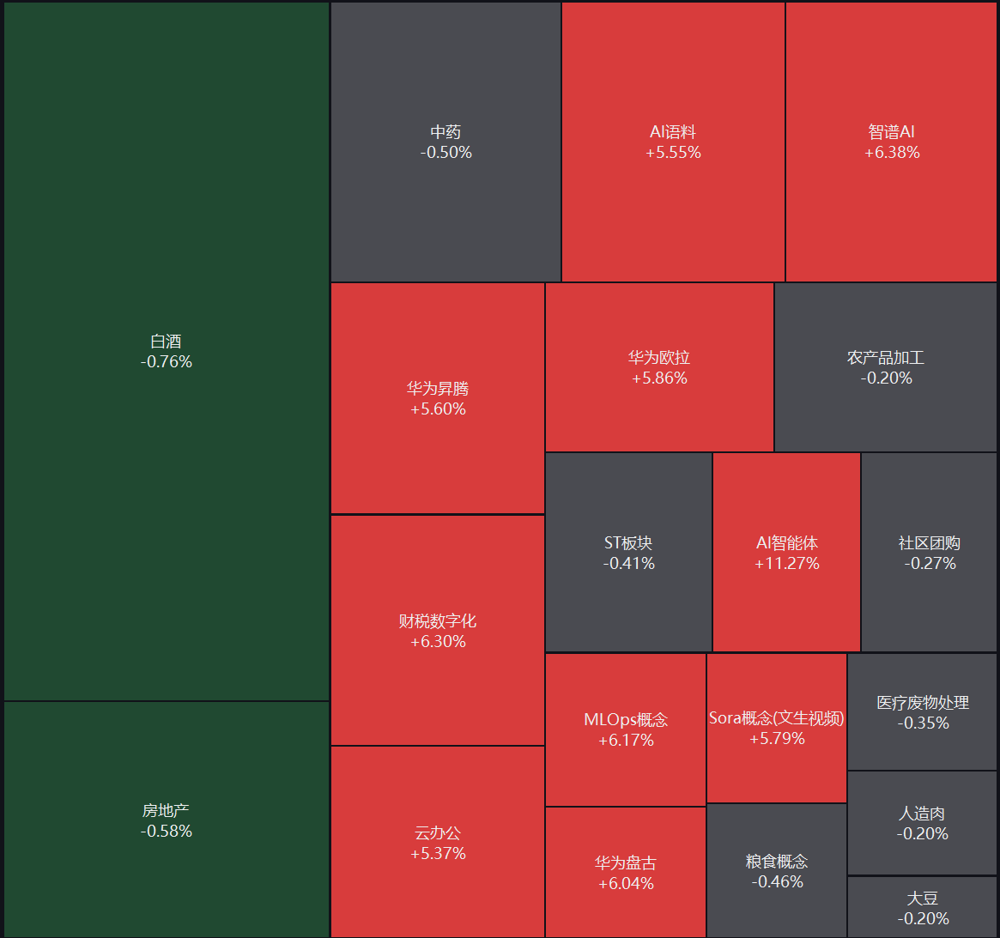

***总结***

大盘今日缩量上涨，年前交易日还剩最后一日，全A指数不会有太大变动了。
板块方面，AI智能体今天大涨，其他软件相关的板块都明显领涨市场，后续值得挖掘个股。地产在年报业绩预报的情况下出现下跌。下午机器人零部件又开始拉升，炒不完了这是，自选的金财互联（热处理+丝杠），中大力德（减速电机），夏厦精密（减速器），五洲新春（轴承）涨停，丰立智能（减速器+丝杠），卧龙电驱（电机）等大涨。铜缆板块依然强势跑赢全A指数，但是热度有所下降，以现在的来看，短期内将需要调整下。AI眼镜下午震荡拉升，板块目前已经调整了几天，看好接下去板块轮动到这里。

持股方面，今天光线传媒做T，因为该股目前持续几日大单净流出，股价比较萎靡，目前还是看好哪吒大卖，坚定持有。
早盘买入光迅科技，该股属于光模块板块，最近出现了较多调整，有后续上涨的空间。
尾盘买入博士眼镜，该股和AI眼镜龙头雷鸟有合作公司，今天AI眼镜板块有异动，这个会是一个不错的标的。
视觉中国今天盘中炸板，因为该股今天大单净流入较多，且AI语料目前处于已经回撤补涨阶段，所以我选择在买入，坚定看多。
其他股目前没有动作。

### 2025/1/27

***热门板块***
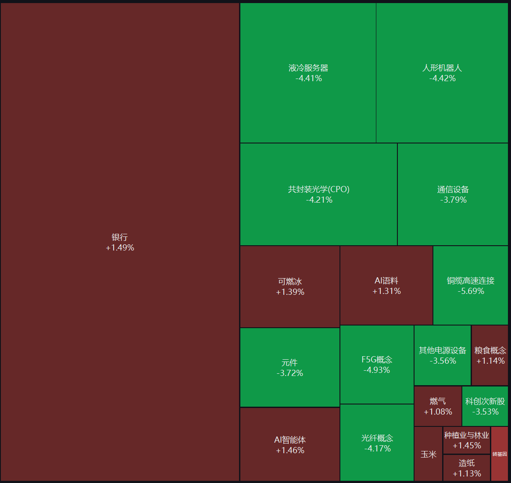

***总结***
全A今日高开，早盘冲高，随后逐渐下跌。
板块方面，AI智能体和语料上涨，算力方面和人形机器人都大幅下跌。周末发酵的deep seek R1模型，引起多个相关的概念股出现涨停，如每日互动，卓创资讯等。算力方向的液冷、铜缆和、CPO等都出现了退潮的现象，表面看有可能是deep seek对训练算力需求的减弱导致的，实际上还是因为近期算力已经炒作到高点位了。人形机器人也是同样的高位，没有更多的资金进入，只能向下走，这两个方面我都认为不会转变成下降趋势，而且短期调整，不论是算力还是人形机器人都是25年非常有潜力的方向。

持股方面，今天光迅科技单边下跌，走势不是太好，以趋势来看，可能会需要继续回撤，但是只要还没有跌跑止损位，就继续持有吧，尾盘我加仓了该股，准备做一个隔日T。
光线传媒盘中两次加仓，该股今天高开但是盘中震荡回撤，尾盘勉强收红，看来还是需要等电影上映的票房来决定走势了。
香农芯创也是高开低走，盘中低位我准备做T，但是由于单边下跌，最后变成了加仓，后续冲高将这部分的仓位减掉。
华鲁恒升早盘上涨越过了我的成本线，结果稍一犹豫，错过了卖出的时机，目前该股大趋势还是震荡行情，我需要寻找机会，清仓掉。
博士眼镜短期涨幅太多了，早盘清仓。
视觉中国早盘，低位清仓，有点操作不清晰，实际上位置不高，而且有上一个交易日有7亿大单净流入，今天早盘看到2亿大单净流出我就清仓，这个操作不太合理，该股在我卖出后不久涨停了，交易操作失败。

### 2025/2/5

***热门板块***
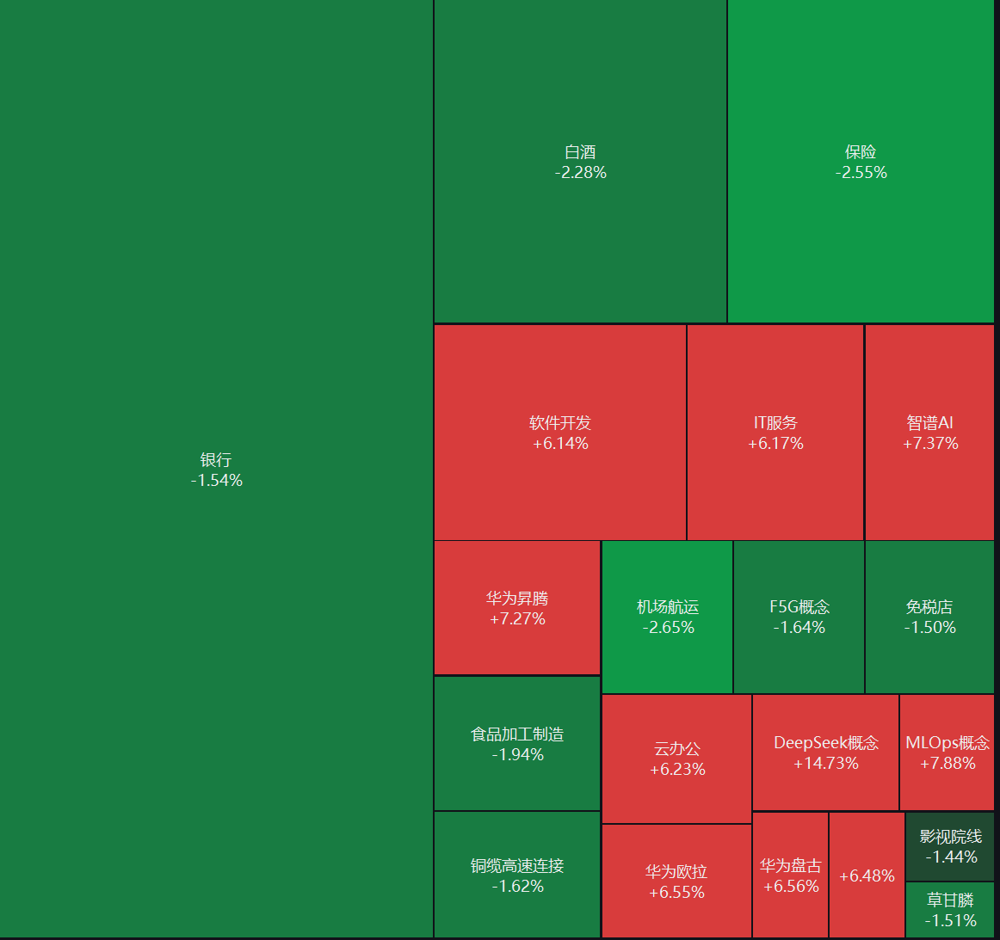

***总结***
全A今天高开震荡，尾盘收微红。
板块方面，DS概念继续强势，可以预见短期将会维持强势上涨行情，AI应用相关板块受DS影响都大涨。算力相关硬件在DS导致的预期减弱情况下下跌，光模块易中天都大跌，铜缆核心股也大幅下跌，数据中心、液冷服务器等AI算力板块到是出现了上涨，有点奇怪？
DS引发的AI变化将会利好AI应用端，可以预见2025年将是AI大面积铺开应用的一年，可以往软件、端侧应用挖掘。
持股方面，光迅低开，早盘深跌，我选择补仓做T，随后股价回弹，T出买入的仓位，目前收到DS的消息对算力的负面影响，可以预见短期可能很难上涨，不过盘中的回弹似乎可以看到目前价位的支撑，该股我准备持有，等反弹获利，再清仓。
香农芯创今天T出上一交易日的买入仓位，并做T。
中鼎股份买入部分仓位，目前趋势处在向上的状态，先建立底仓。
光线传媒今天早盘涨停，本来打算买入部分仓位，但是迟了点，没有操作。
华鲁恒升、半导体没有操作。考虑对半导体进行补仓，然后等回本获利，一次性清仓。

### 2025/2/6

***热门板块***
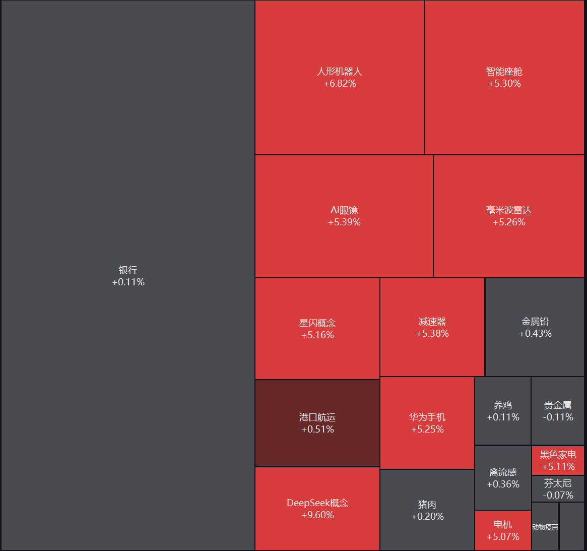

***总结***
全A指数今天开盘微跌，随后逐渐走红，收盘时大盘出现普涨，从主力和大单净额可以看到今天市场逐渐走向热烈，看好接下来的大盘走势。
板块方面，DS领涨，人形机器人也走势显著，AI相关产业都出现不同程度的上涨。铜缆和CPO都出现了一定的修复。
持股方面，光迅早盘走低，但是在大盘走势逐渐向上的情况下，出现了反弹，最终收微红，从短期走势来看，该股现在处于下跌趋势中，最近一段时间的大单净流出比较多，这应该是导致股价持续下行的主要原因，另一个原因就是DS导致的算力硬件预期减弱。但是从大趋势来看，该股还属于回调阶段，我准备先保留着，关注后续走势。
香农芯创开盘震荡向上，我在上午准备做T，结果下午受到半导体上涨的影响，该股持续上涨，于是我将大部分仓位清掉，该股大趋势还是下跌趋势，现在属于调整波，我准备等后面在接回来。
光线早盘竞价买入，开盘后，逐渐走高，我选择中途卖出做T，后面来看，卖的早了点，或许我都不该卖的，毕竟我现在看好这个股票走势，不能随便乱操作。
中鼎今天低开，并逐渐走高，我卖出了仓位，本意做T，失败了，后续看看趋势，再决定是不是要买回。
三联锻造买入，该股目前处在上涨趋势中，且经过前几天的抛压，今天明显没有多少抛压，我准备博涨停。
露笑科技买入，最近调整了几天了，今天可以看到没有明显的抛压，所以选择买入，看多后续行情。
华鲁恒升和半导体没有操作。

### 2025/2/7

***热门板块***
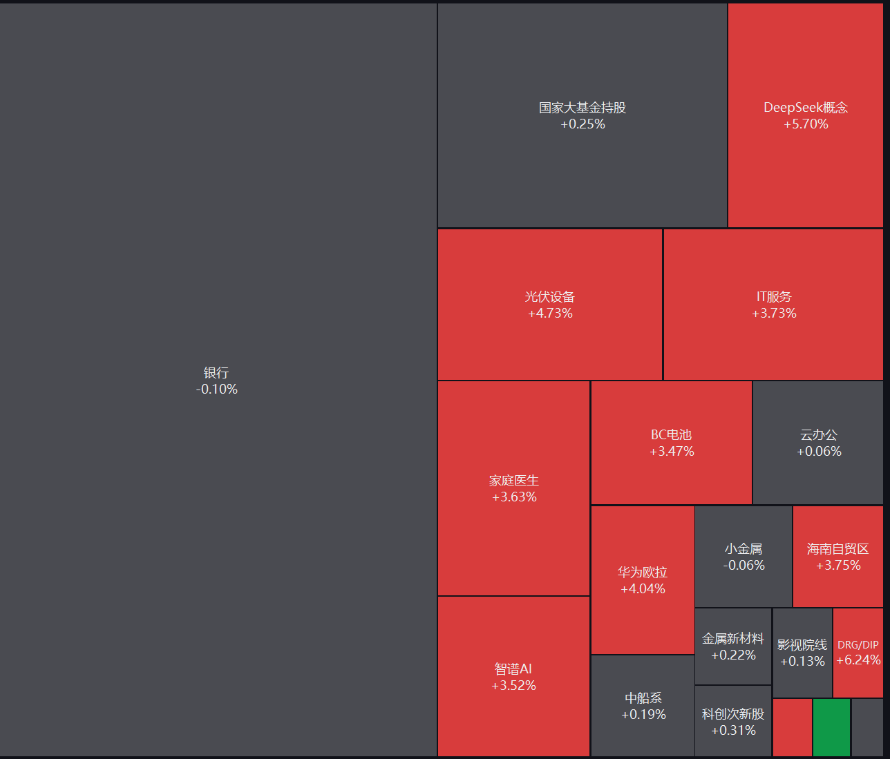

***总结***
全A指数今天平开，早盘震荡向上，下午盘开盘先缓慢向上达到高点后迅速下杀直到开盘的点位，导致大量已封板的股票炸板，尾盘重新拉起部分高度收红，最终部分炸板票回封。
板块方面，DS热度相对前几日逐渐回落，其他AI领域各有涨幅，新能源领域今天上涨，算力方向铜缆和光模块有一定修复，液冷服务器板块创新高，为什么液冷服务器还能新高，IDC也没有收到DS的影响？
持股方面，光迅早盘开盘微红，然后震荡向上，我将前几个交易日买入的仓位清掉，这个股票大趋势不对，不能放太多仓位，虽然我比较看好后续的发展，还是先关注着，等趋势确认再加仓。
露笑科技开盘微红，在大盘的良好走势下，涨势也不太行，向上动力不强，说明我昨天的判断不太对，因此早盘就清仓了。
三联锻造今天低开低走，现在股价位置较高，且今天空头行情明显，因此除了盘中做T的筹码，尾盘我将昨日的买入筹码全部清仓。
光线今天低开，早盘我选择买入部分仓位，盘中逐渐震荡向上，将这部分仓位卖出，对这个股票我持继续看多态度，目前处于多空分歧震荡位置，如果该股调整的震荡不是明显的回撤，我将保留底仓，否则可能需要先冲高买入，等调整浪结束再进入。

### 2025/2/10

***热门板块***
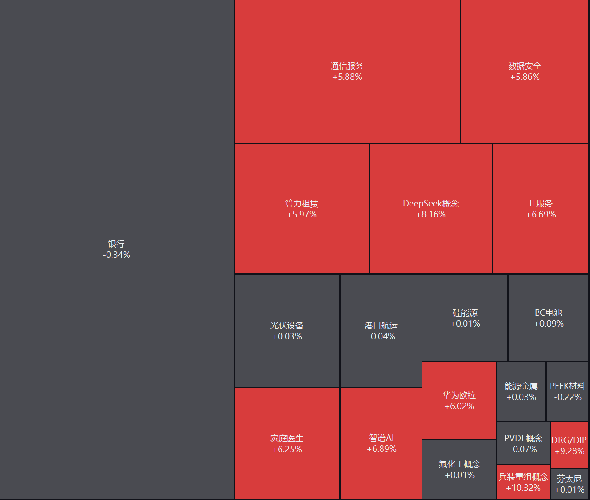

***总结***
全A指数今天高开，开盘后先震荡，后续逐渐走高。今天成交量相比上一个交易日减少11.7%，主力和大单都出现流出迹象。
板块方面，DRG/DIP概念最强势，DS和其他相关AI板块都有明显上涨。
持股方面，光迅盘中买入，准备做T，但是持续下行，做T失败，该股趋势不明，最好尽快清仓。
光线盘中做T，但是最终涨停，这个股票在上升趋势下做T是错误的选择，这几天虽然做T了，但是其实失去了更大的获利空间，本来应该则相对低位买入，然后持有，等到高位滞涨时清仓。**记住单边趋势下不要去做T。或许应该低位买入，然后等盘中升高后选择卖出一半，这样即保证了在震荡行情下做T，在单边趋势下，也做到了仓位增加。**
香农似乎有突破下降趋势的迹象，我将前面清掉的仓位买回，等待后续的趋势变化，再决定下面的操作。
中新赛克买入，该股目前处在脱离下降趋势线后的上涨（反弹）过程中，早盘平开逐渐走高，在观察了一段时间后，没有发现空头抛压，所以选择买入，看多后续行情。
三联锻造目前高位震荡，趋势不明确，没有操作。
半导体ETF离回本很近了，看看大盘趋势能往上的话，应该可以回本并获利，不然就等后续低位加仓。
华鲁恒升在成本线附近，趋势不明，盈利就选择清仓吧。

### 2025/2/11

***热门板块***
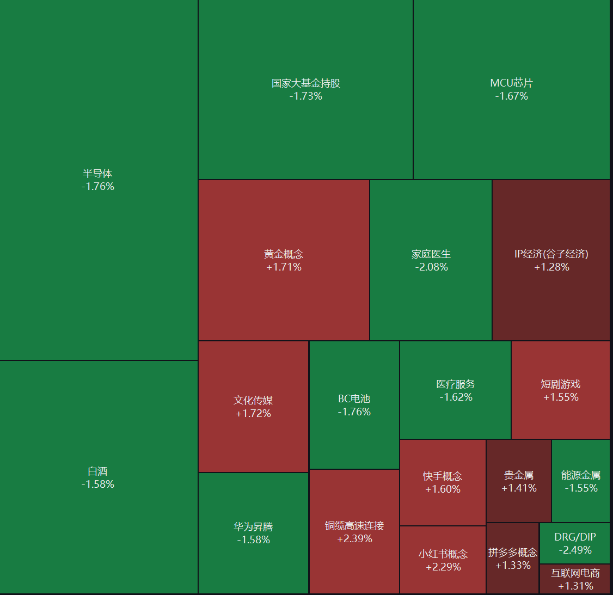

***总结***
全A指数基本平开于1049.47点，早盘迅速下杀到1038.07点，随后逐渐震荡上行，收盘于1046.02点。主力和大单继续流出，且呈现流出幅度增大。
板块方面，铜缆出现一定的修复，受益于哪吒的票房火爆，相关IP经济出现明显的上涨，带动板块，AI板块个股也有不少涨停。
持股方面，今天早盘光线高开出现下杀的趋势，叠加大盘向下，我直接开盘没多久清仓卖出了，后面这只股票下午盘涨停。==很明显我是做错了，实际上在早盘15分钟以内最好还是继续观察盘面的走势，不要急于去操作，除非是高位巨量的情况下，一定仔细确定好趋势再进行操作，每次冲动下的操作结果都是不好的。==
光迅最近处于变盘的位置，趋势不明，本来应该在日内冲高卖出的，但是犹豫了下，挂单没有成功，但我还是把昨天买入的仓位清掉了，后续选择相对高位，不亏损就清仓吧，后续等趋势好了，再买入。
香农今天开盘低开，低位震荡，现在属于下降通道的调整浪的上拐点，如果后续还是不能突破这个位置，那最好还是及时清仓止损。
中新赛克低开，早盘下杀，后续震荡上行，收盘平盘。我在早盘买入，后续上涨后卖出昨天买入的仓位，该股趋势还是向上，但是目前没有多头拉动，所以先持币观望吧。
蓝色光标目前看是反弹趋势，所以在盘中出现板块异动的时候，冲动追高了，我都恨死我的垃圾操作了，又一次追高，我还是没有从神剑股份和山子高科的类似操作中学到足够的教训，好吧，要是后面亏损都是我自找的。
三联锻造现在震荡，趋势不明，目前仓位不多，选择持股观望吧。
半导体ETF无操作，这个位置如果能回本，那就可以选择清仓，不然还是持有，等回调加一点仓位，后续一次性清仓。

### 2025/2/12

***热门板块***
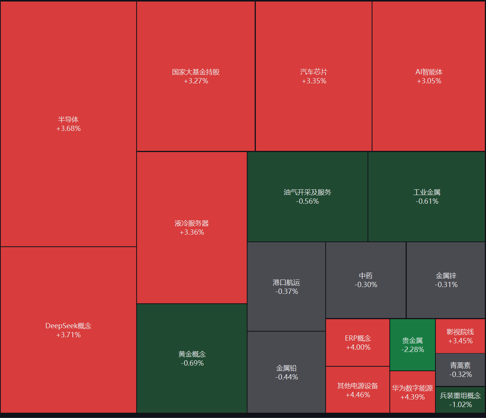

***总结***
全A指数低开于1043.90，盘中震荡走高，收于1056.72，涨幅1.02%。大单出现净流入，主力还是显示流出。
板块方面，半导体、芯片相关板块出现明显上涨，DS概念、AI Agent等和AI算力方向上涨，尾盘出现权重股拉升，我判断可能大盘会出现短期大牛市。
持股方面，光迅早盘高开，虽然略有下滑，我因为无法判断该股趋势，选择解套清仓，但是后续该股大幅上升，且出现明显的大单流入，因此我后面又在相对高位买入，尾盘我观察大盘形式良好，且该股收盘突破下降通道的上边界，所以选择继续加仓看多。
中新赛克目前来看还是处于下降通道的调整波，在没有突破下降通道的上边界之前，我并不能确定该股未来会继续向上，该股今天走势弱于大盘，属于短期高位滞涨的情况，后续能不能突破通道，才能确定未来走势，今天盘中低位买入，本来想着做T，但是后续股价逐渐走弱，所以变成了加仓，这是不应该的。
香农今天略有上涨，但是还没有突破下降通道的上边界，我还是选择清仓，继续观察走势。
蓝色光标低开震荡，虽然收红盘，但是这个位置还是不好，处在变盘的相对高位，还是为自己昨天的冲动买入买单吧，后续下跌，那就说明趋势向下，就要及时清仓。
半导体ETF出现明显的上涨，无操作，看看这两天能不能解套吧。

### 2025/2/13

***市场概况***
全A指数（1分种）:
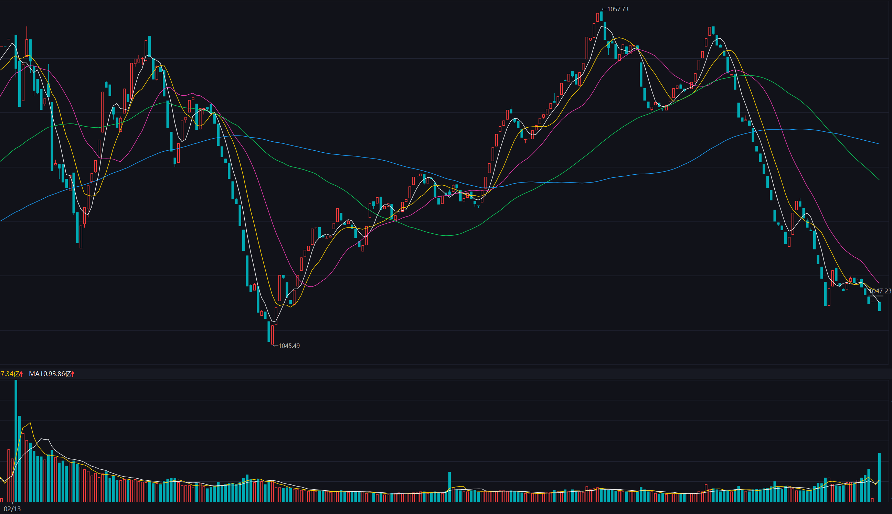
热门板块:
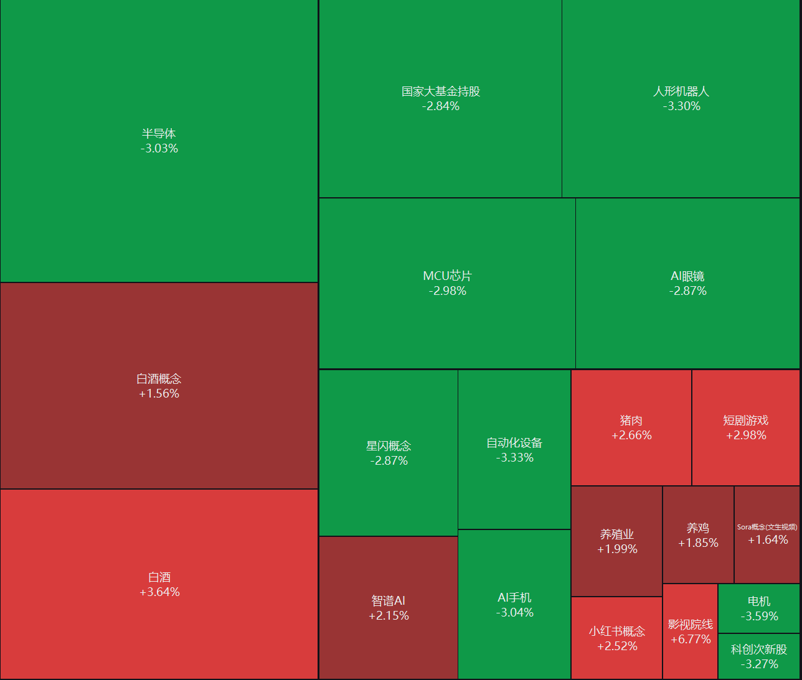

***个股交易情况***
三联锻造盘中低位清仓，该股目前处于上涨趋势高位调整波，出现了明显的下地，不能再继续持有。
中新赛克盘中低位清仓，该股目前处于下降通道调整波，本来就不应该去做的，今天出现下跌形式，果然了结清仓。后续继续观察，该股如果能强势突破下降通道上边界就可以买入。
光迅科技今天低位做T，今天该股又重新向下突破下降趋势上边界，目前看着形式不好，我还是纠结要不要止损，希望我的耐心能收获到好的结果。
蓝色光标盘中清仓，该股今天高开低走，出现了明显的上映下实体绿柱，说明现在多头尝试做多，但是上方抛压较大，目前可能需要调整几天，但是后续应该会有做多的机会，先出来继续观察。
润健股份买入，该股处于市场主行情中，是阿里云的合作商，阿里最近宣布了和苹果的AI合作，股价一路上涨，因此，虽然该股目前三连板，今天炸板，我还是选择买入，看多后续行情。
三江购物买入，买入逻辑是阿里的大模型概念，昨天涨停，今天苹果和阿里进行AI合作的消息应该也会刺激该股进一步上涨。

### 2025/2/14

***市场概况***
全A指数（1分钟）：
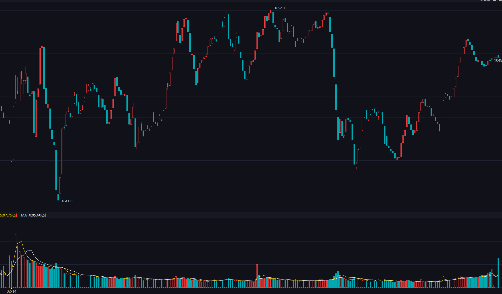
热门板块：
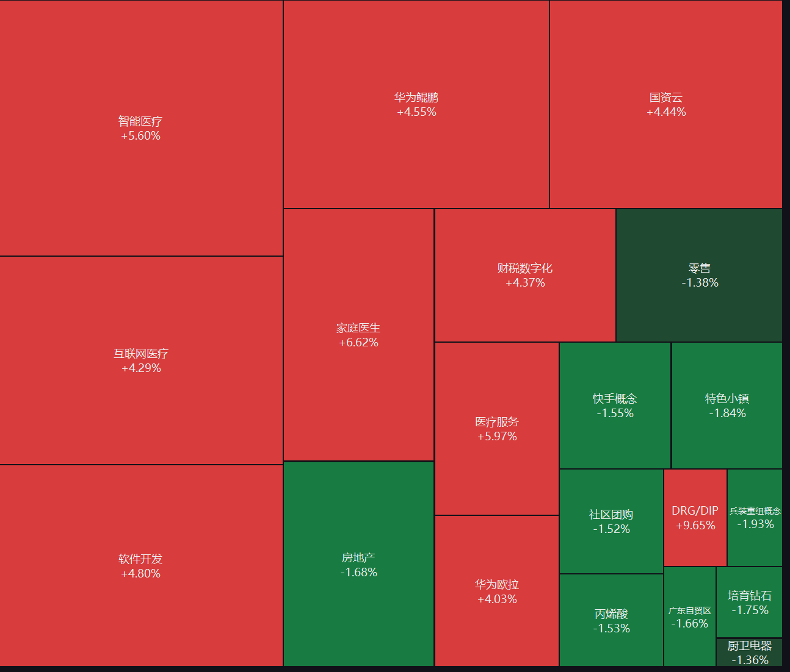

***个股交易情况***
光迅科技尾盘清仓，早盘平开，开盘后尝试冲高，但是随后股价逐渐走低，收盘下跌，明显上方有较大抛压，该股目前继续走下跌的趋势，因此需要果断止损。
润建今天做T，竞价低开，我在竞价位置买入部分仓位，开盘后，出现较大抛压，股价进一步下跌，等待出现分钟出现的下影线，然后回收上行时，继续买入部分仓位，随后股价逐渐震荡上涨，等到接近涨停板的位置，卖出今天水下买入的仓位，后续高位震荡，又继续做了一部分T。该股今天涨停板，虽然不是很坚决，我还是看多题材。
三江购物今天、etf今天无操作。

### 2025/2/17

***市场概况***
全A指数（1分钟）：
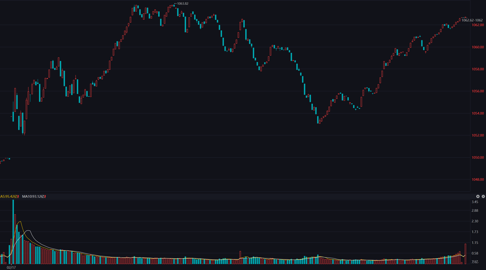
热门板块：
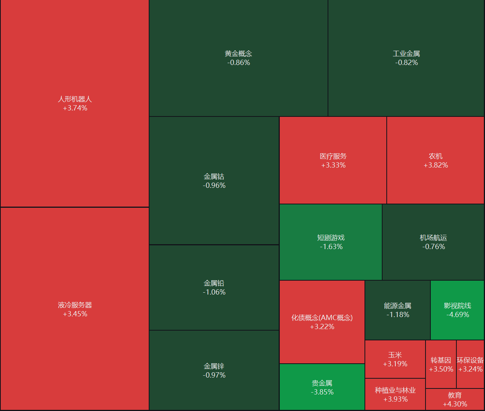

***个股交易情况***
三江购物清仓，早盘高开，冲高回落，因此选择卖出，后面再次冲高涨停板，再经过多次炸板后，回落收涨5%+，卖出的操作没有问题，就是似乎卖的早了点。
润建买入，做T，早盘低开，分两次买入，第一次买入的点位没问题，第二次买在下跌趋势下，应该放到低位反弹分时中买入才对。整个交易日内都是水下震荡，到尾盘也没有起色，为了减低风险，我选择在尾盘卖出第二次买入的仓位数，整个T做的不是很好，买入操作也有问题，虽然我依旧看多，但还是要看后续怎么走。
中新赛克建仓，早盘高开，开盘后逐渐走高，突破下降趋势，因此买入，但是后续该股震荡走低，似乎买入的点位有问题，而且收盘后又回到下降通道区间内，我在没有确认的情况下做出了交易的决定，这是需要避免的错误操作。
半导体ETF无操作。

### 2025/2/18

***市场概况***
全A指数（1分钟）：
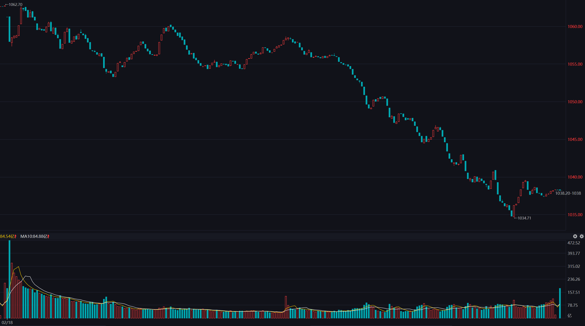
热门板块：
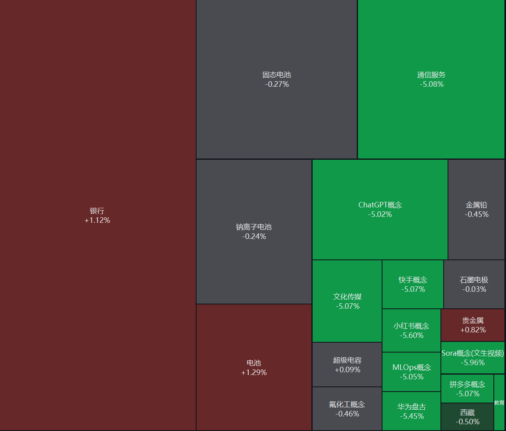

***个股交易情况***
润建股份低开，早盘冲涨，后续震荡走低，因此选择在日内做T，该股目前的走势不符合我的预期，叠加大盘走势不利，主力资金和大单连续多日净流出和今天的大量流出，很有可能指数会跌到1000点以下进行调整。计划明天大盘和润建走势不理想就立即清仓离场。
中新赛克低开低走，这个交易很大可能做错了，前一个交易日的突破信号我没有等到尾盘确认就急忙买入了，这是一个错误的交易，今天我居然又继续阴跌补仓，结果一路下跌，明天如果该股冲高就该果断卖出，现在的大盘行情下，不能过多持有该股。
半导体ETF无操作。

### 2025/2/19

***市场概况***
全A指数（1分钟）：
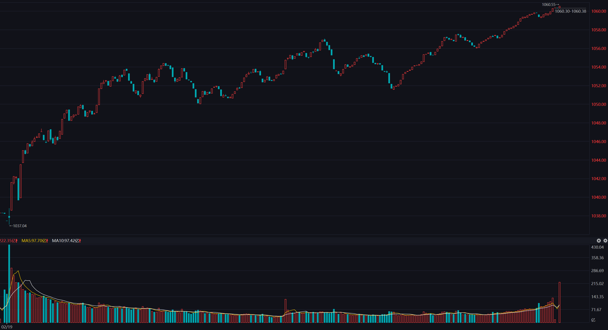
热门板块：
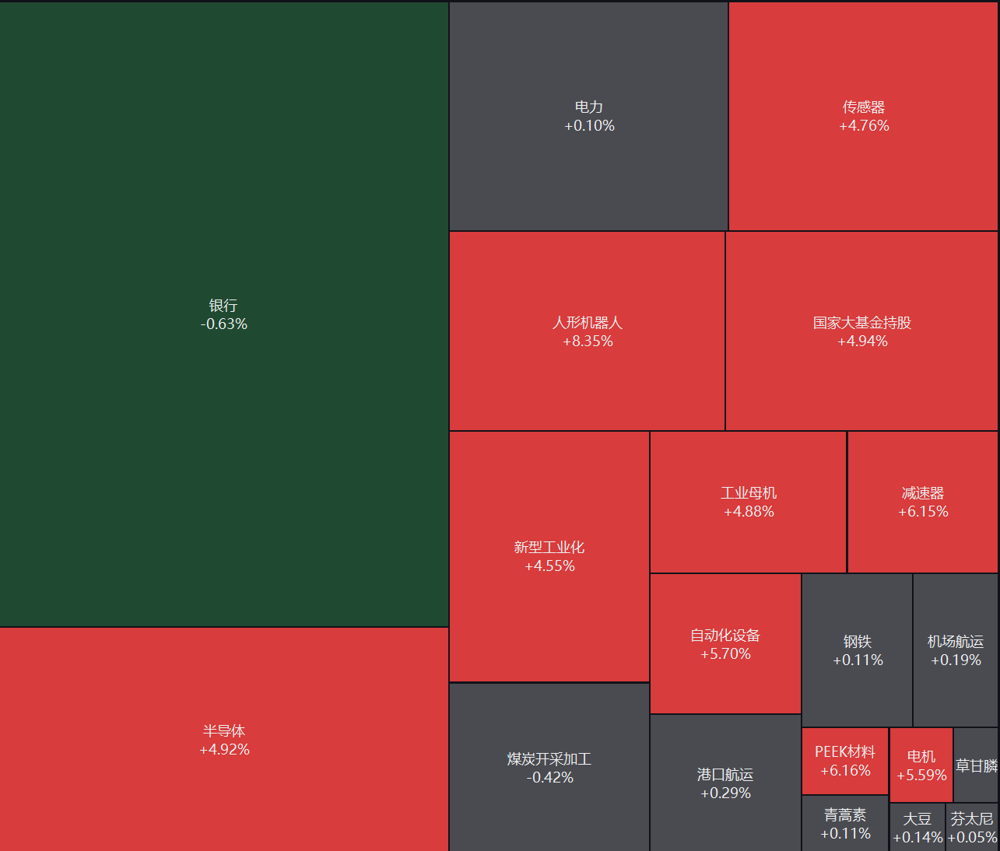

***个股交易情况***
润建股份高开，开盘后冲高回落，因为昨天大盘的巨大跌幅，让我对大盘产生了会出现短期大跌的担心，因此，在早盘开始减仓，但是后续大盘走势完全出乎我的意料，不断震荡上涨，最终基本收复昨天的下跌，而润建也在早盘短暂调整后，继续上涨并涨停，但后续又出现炸板的问题，我想着可以做T，选择继续卖出部分仓位，结果卖出后却没有合适的接回位置，后续该股又一次涨停，我在盯盘的时候发觉该股又要开板，因此我在板上清仓了剩余的股，并在炸板后相对低位重新买入板上卖出的股票，后续该股成功封板，也就这个T做的还行，早盘的卖出和第一次炸板后面做T都不成功，目前该股的仓位出现明显的下降。虽然不符合我的预期，但是我考虑到大盘最近一段时间净流出太多，还是暂时不选择买回，等明天看看能不能低位接回去吧。
中新赛克高开，在大盘上涨的大环境下，也是震荡上涨，但是力度相比昨天的下跌明显不足，于是我在盘中选择降低仓位，该股后续的趋势不明，考虑到大盘现在的走势不太确定，选择减仓是正确的决定。
百洋医药建仓，该股目前属于低位，在大盘可能走弱的情况下，选择该股有保险的意思，而且该股也算是AI医疗股，可能会是一个不错的补涨机会，后续看走势决定怎么处理。
半导体ETF无操作，今天也是大涨，感觉解套有戏。

### 2025/2/20

***市场概况***
全A指数（1分钟）：

热门板块：
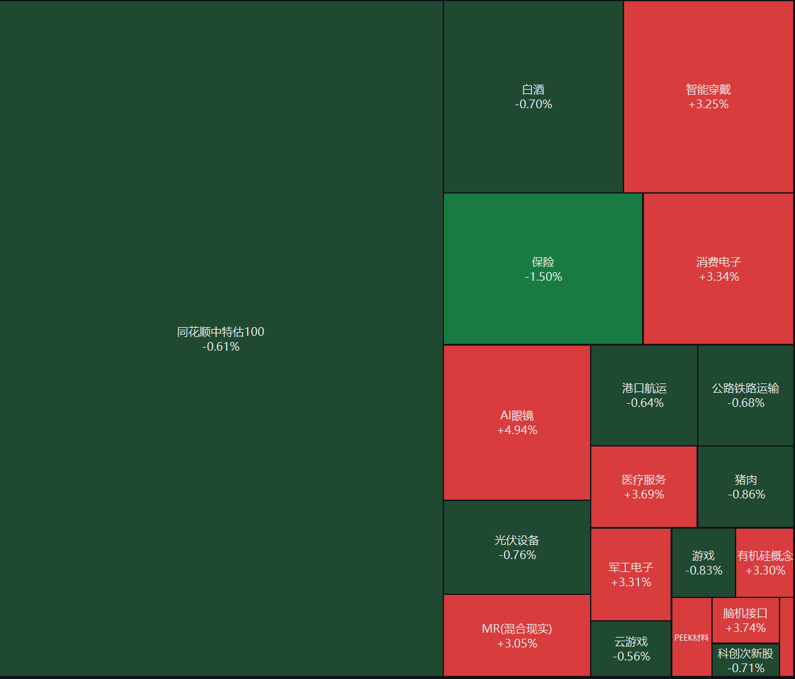

***个股交易情况***
润建高开，开盘后迅速涨停，无操作，通过这个股票的操作让我明白了一个道理，那就是短期看涨的股票，随时有可能上涨，不能随便做T，就算做，也应该先买入，后卖出的交易手法。
中新赛克低开低走，盘中我在低位买入后面相对高位卖出做T。该股目前处于震荡趋势，至于震荡后的方向选择，还需要进一步观察，如果发现趋势有向下的可能，那就要立即清仓止损。
百洋医药补仓，作为低位的保险，今天低吸，等待看是否有上涨行情。
广晟有色建仓，该股今天早盘高开，开盘后迅速冲高，所以我直接在高位买入了，博一个涨停，结果不符合预期，短暂冲高后，该股持续下行回撤。我发现我每次介入分时冲高的股票，基本都没有好的结果，明明自己都规定了以后不去追盘中高涨的股，但是今天还是没有忍住，还是因为人性的贪欲影响，看着大盘走势良好，手上没有筹码总觉得自己少赚了很多，这样的追高害了我多少次了，神剑股份，山子高科，三联锻造，包括中新赛克都是盘中直接买入，买入时，即没有做好盘前预案，也没有在尾盘确实趋势的情况下，做出了不理性交易。==所以现在我想给自己做一个关于盘中追高的交易策略，只有那些实现做好了盘前预案重点关注的股，在发现快速拉升刚开始时尽可能快的介入，如果不能尽早进入，那就应该等到尾盘确实信号再进入，如果出现快速接近涨停则可以选择打板买入，不能高位距离涨停还有一段距离时赌涨停冲动买入。==
润欣科技建仓，该股目前处于上涨通道中，且最近一段时间处于调整浪中，并走到了上涨通道的下边界，昨天上涨，今天早盘高开，随后先震荡向上，后震荡向下，我直接在盘中就进行了建仓，现在回想起来，我建仓的时间点是有问题的，当时我买入的判断是该股已经从调整浪重新转变为上涨趋势，但是对这个趋势的变化我并没有通过日K来判断，并不能保证今天收盘时，该股出现继续保持上涨的势态。事后来看，该股今天高开的主要原因还是因为她所关联的AI眼镜板块出现高开大涨，日k上高开上涨，盘中上涨红柱较短，且有上影线，说明上涨的动能不是太多。建仓的决定的对的，但是交易的时机时错误的，应该等到尾盘确实趋势后再买入，我选择当时买入有担心它盘中直接涨停的原因，那我觉得关于这种情形可以再优化下交易策略：==对于趋势买入操作，最好等到尾盘确实后买入，如果盘中个股有涨停的可能性，不要轻易在高位买入，而是要等到接近涨停板时通过打板的方式买入。==
全志科技买入，我买入该股同样时根据盘中快速拉升，在没有预案的情况下，冲动买入，其实对于这种快速拉升，最好的介入时间点是在拉伸刚启动时，而不是等他拉升到一定高度后，去赌博它会继续拉升封板，去博弈封板不如去打板。
总体来说，今天的交易操作问题很多，都是需要后续明确优化的，我现在决定对于上面的情况一定要按照我制定好的交易策略进行交易，对于快速拉升，要么尽早买入，要么打板，要么等尾盘确实是不是符合趋势再做交易选择。

### 2025/2/21

***市场概况***
全A指数（1分钟）：
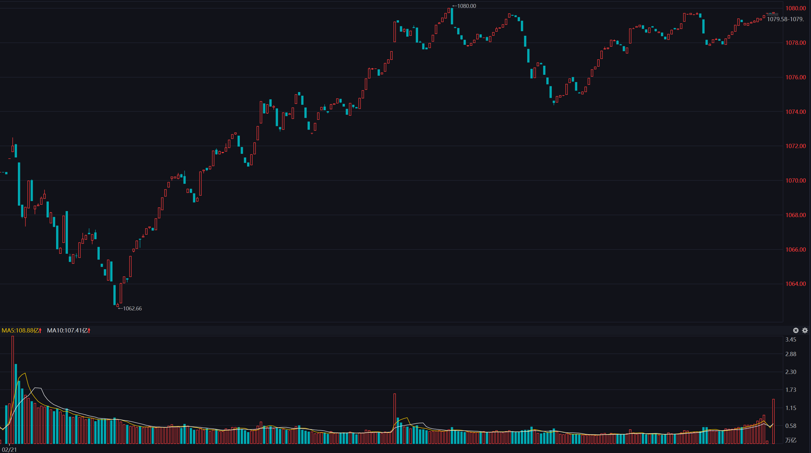
热门板块：
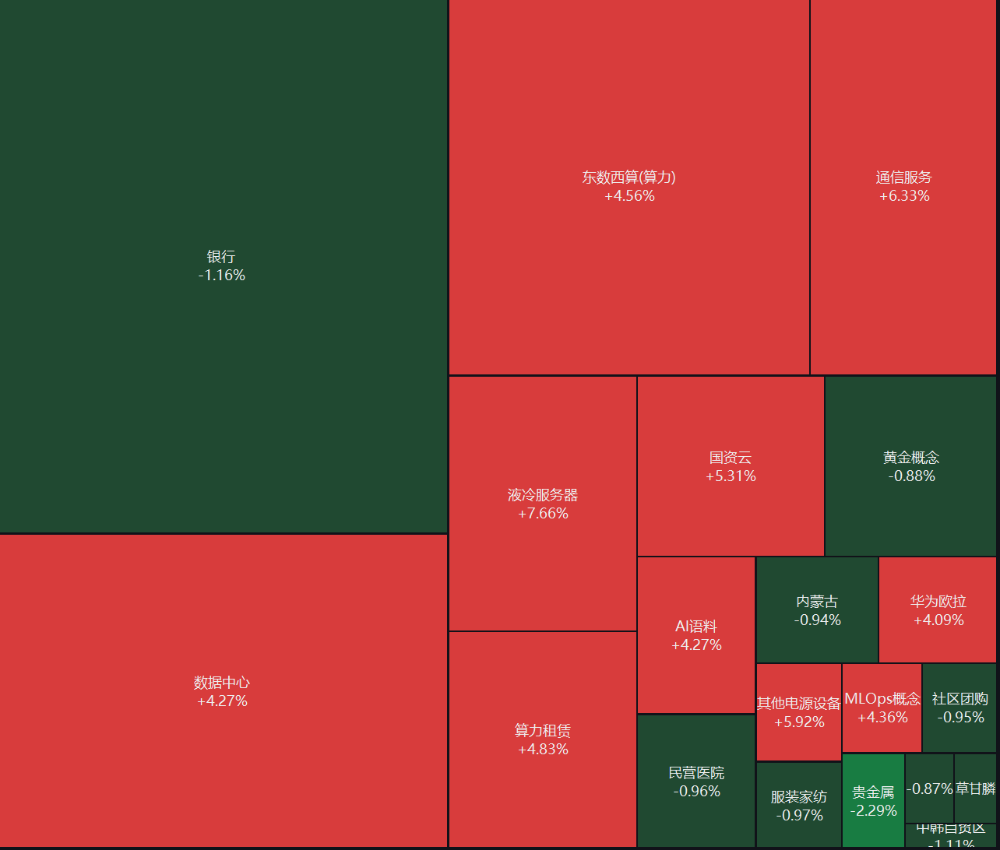

***个股交易情况***
润建股份无操作，该股今天一字板，受益于阿里云亮眼的的财务报表叠加阿里AI的贡献，估计下周1继续一字板。
友阿股份建仓，该股高开震荡，午后异动拉升接近涨停，我挂在涨价的向下第二个价位打板，但是最终没有涨停，打板失败，该股收盘回落收红十字。通过这个打板让我发现了一个问题，当你去打板的时候，你需要确认距离涨停板上面还有多大的挂单抛压，而现在普通的交易软件盘中中只显示五档买卖，所以要打板，必须要打那种非常快速的拉升股，市场对该股的热情非常高涨时进行，或者通过LV2盘口观察上方的抛压后确认。
全志科技清仓，该股早盘低开，短暂冲高后又回落，在今天半导体大涨的情况下，该股表现是出上涨无力，因此在盘中冲高时，选择清仓，同时全志科技现在的位置较高滞涨，也很难让我有持股动力。
赛腾股份建仓，该股从原来的下跌通道脱离出来，现在处于缓慢的上涨趋势中，且现在相对股价底部较近，题材属于半导体设备，题材有补涨的机会，最近大盘行情高涨，可能有高位下跌风险，这支股票相对较为保险。
百洋医药减仓，该股高开后短暂冲高后迅速回落，早盘我将昨天买入的部分T出，剩余部分继续持有，后续将持续保持做T。
中新赛克减仓，早盘高开，早盘走低，随后逐渐震荡上行，考虑到该股目前处于下降通道中，震荡行情，我
在午后做出了减仓的操作，准备等后续下跌时，再行买入，做隔日T。
广晟有色无操作，该股低开低走，昨天冲高买入的时间点实在是错误，先留着观察几天，如果不能确定后续是否能上涨，就止损吧。
润欣科技做T并减仓，早盘低开震荡，我先低位吸入，等后续震荡上行后减掉这部分的仓位，考虑到该股处于上涨通道的调整浪中，并继续减少仓位，目前看来交易合理。
半导体ETF清仓，开盘后持续上行，我在回本后，立即清仓，等了好几年了，总算结束了，以后这种看不到希望的就要及时止损，拖了这么久的时间成本都是巨大的。

### 2025/2/24

***市场概况***
全A指数（1分钟）：
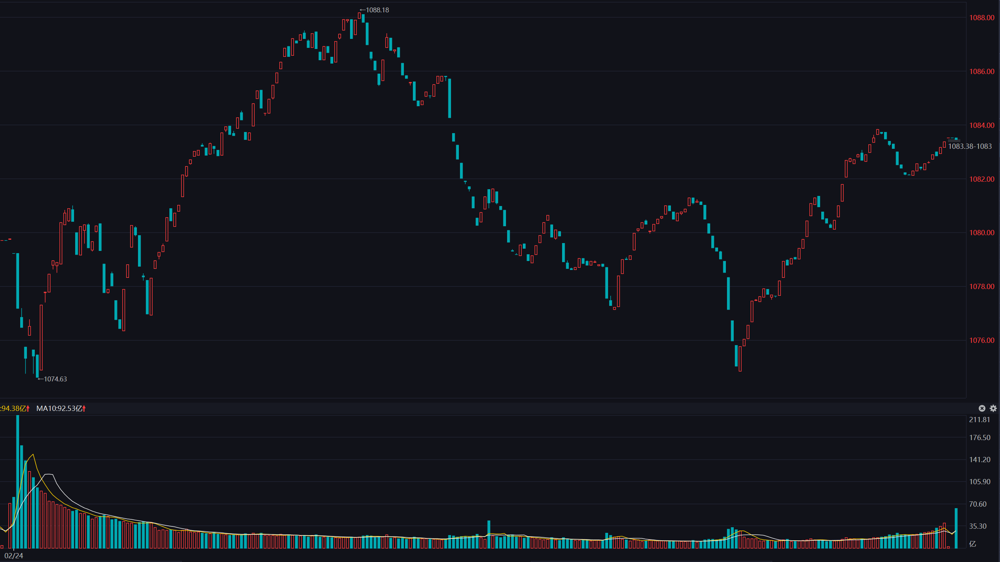
热门板块：
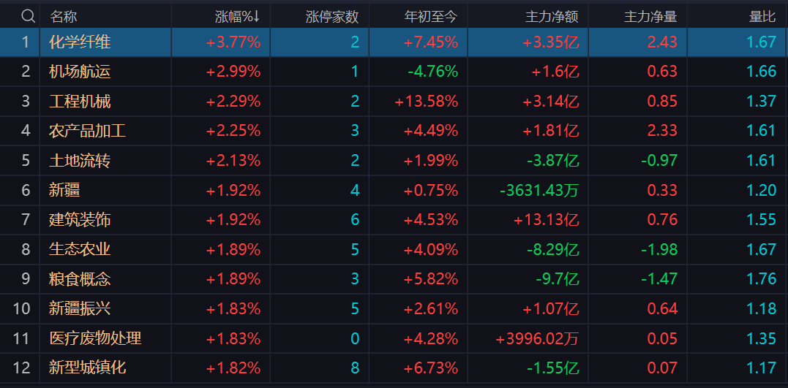

大盘今天放量滞涨，主力和大单流出较多，需要注意风险。

***个股交易情况***
润建股份做T，竞价不及预期，开盘后，先清出观望，等后续确认赚钱效应还在，在相对低位买回，继续看多。
润欣科技加仓，该股目前处于短期震荡行情中，因此在盘中低位加仓做T，但是日内走势没有回弹，因此变成了加仓，目前大趋势是上涨态势，叠加字节AI玩具概念，属于炒作的热门分支之一，保持持有，继续看多，后续逢低加仓。
东华软件建仓，该股目前属于数据中心腾讯概念，叠加了腾讯混元大模型概念，在昨天腾讯元宝AI软件上线的热度下，做一个短线，但是买入后，走势不及预期，明天如果还是不能强势上涨，考虑尾盘卖出。
广和科技建仓，买入逻辑完全是因为该股处于上涨通道下边界之上，出现了上涨拉升动作，加之属于现在算力炒作的分支PCB概念，最近没有出现明细的上涨，因此果断介入，该股日内走势后续不及预期，日内先拉升后逐渐震荡走弱，尾盘收红，不过这个走势很大原因是收到了同属PCB概念的其他股的拖累，目前先拿着，继续看多。
博创科技建仓，该股目前处于高位回调状态，属于算力中的铜缆，最近持续调整，但是只要算力还是炒作的方向，那么该股后续还是避不开的炒作方向，今天走势长期深水，因此在分时低位买入，等候后续的炒作机会。
万丰奥威建仓，该股属于低空概念，今天低空发酵，早盘高开高走，盘中封板，中途炸板回封，我在炸板的位置买入，看看明天的走势，如果低开触碰5日线加仓。
赛腾股份清仓，该股盘中冲高，我清仓，准备5日线位置接回，后续没有走到，先看看吧，短期不在主行情上，作为保险作用的，只买低位。
友阿股份无操作，上个交易日打板失败，该股今天高开低走，持续低迷，走势不乐观，考虑该股目前位置空方抛压不大，先继续持有吧。
百洋医药无操作，该股买入时考虑的是防守，还考虑到有AI医药概念，但是经过我后续查证，该股并没有这个概念，后续考虑冲高卖出。
广晟有色无操作，没什么好说的，看看能不能有没有冲高解套的机会，通过广晟和友阿的操作后果让我明白了不要去做不在主行情之内的股票的冲高或打板，通常会死的很惨。

### 2025/2/25

***市场概况***
全A指数（1分钟）：
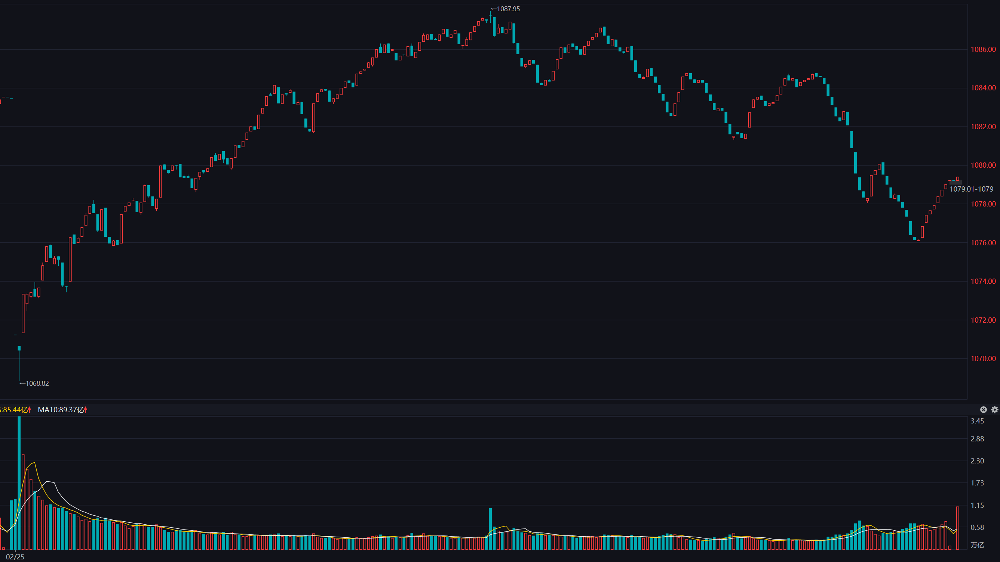
热门板块：
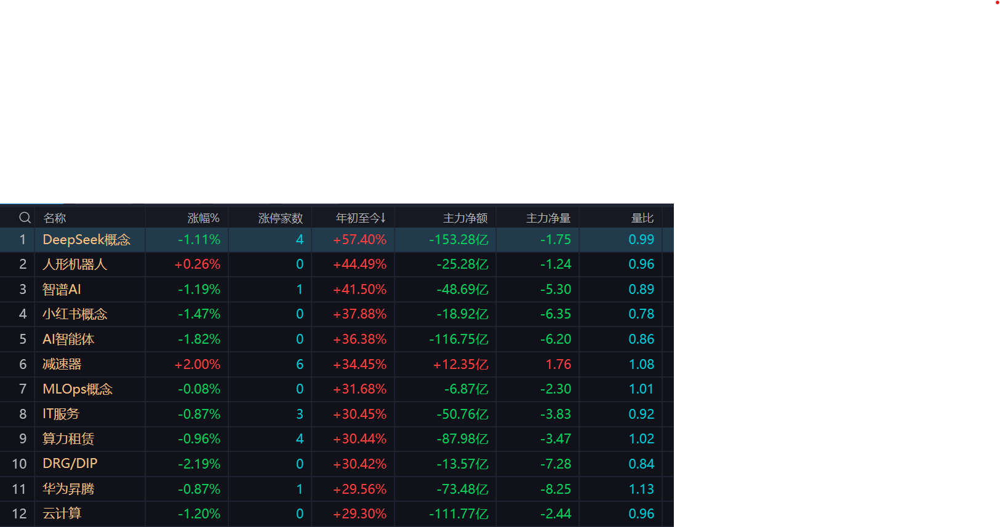

受到美国中概大跌的影响，大盘深水低开，早盘震荡走强，下午又震荡走弱，板块方面主线DS的算力方向出现大分歧，高位股普遍大跌，资金又高切低的现象，明天或后天看看DS能不能调整好，继续二波行情。另一条机器人方向形式稍好点，后续继续观望吧。

***个股交易情况***
润建股份加仓，该股竞价接近跌停，是大单托起来的，考虑到DS行情还有较大的上涨可能，所以选择，盘中低位继续加仓，可惜该股今天持续深水，目前还需要等DS的修复，看看该股的走势是否会转强。
润欣股份清仓，该股今天低开，震荡，随后收到AI眼镜的发酵，收到资金的拉动，盘中高位后持续走弱，虽然我比较看好后续的走势，但是从目前上面的抛压可以看到，明天有低开的可能性，所以我先清掉，等明天接回。
万丰奥威加仓，该股前一个交易日涨停，但是今天完全没有溢价，考虑到该股价位不高，且有呈现上涨趋势，所以选择水下低吸，后续看多。
赛腾股份买入2手，昨天卖的有点后悔，低位待涨，今天高开早盘冲高，我就直接买回了一点，本来是想多买一点的，但是操作错误了。
广和科技，友阿股份，广晟有色，东华软件，博创科技，百洋医药无操作。

### 2025/2/26

***市场概况***
全A指数（1分钟）：
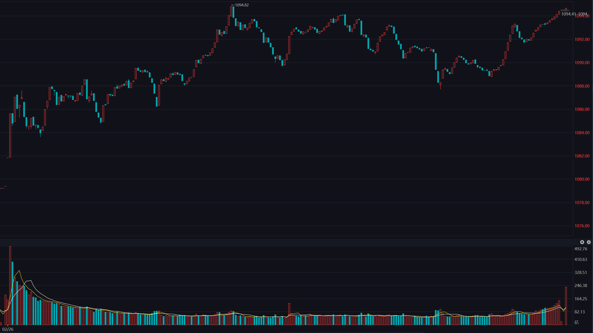
热门板块：
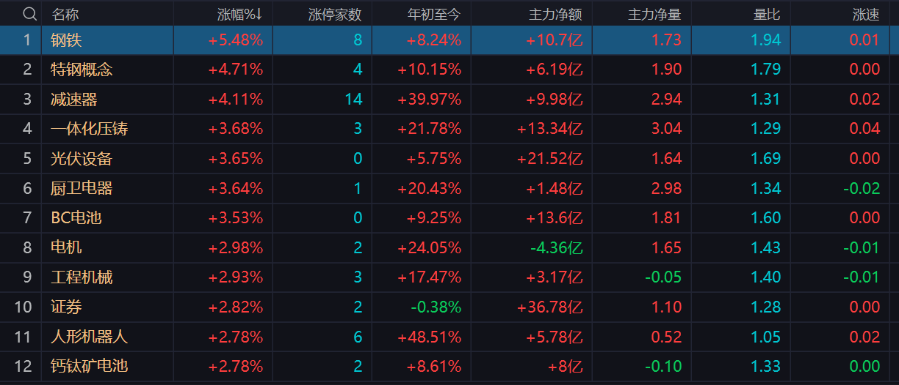

大盘高开，盘中震荡上涨，今天早盘机器人相关概念大涨，计算机算力相关相对沉寂，午盘机器人略有下滑，芯片概念出现上涨，收盘两市普涨，DS概念走势比较差，虽然杭钢封板，但是却没有板块带动效应。

***个股交易情况***
广和科技做T，该股早盘低开，我水下低吸补仓，午盘出现拉动情况，我选择将所有可出售的仓位清仓，这里做的不好，低位补仓，本来是因为看多，现在这样做T的方式并不能加大盈利，实际上是减弱了我的获利能力，以后应该分清楚买入时需要分补仓的部分和做T的补仓，低位补仓，重要的看好后续的行情，不应该时把做T作为目标。
东华软件加仓，该股今天还是低开水下震荡，目前的位置相对较高，DS行情未来走势不明，所以我选择水下低吸，看多后市。
广晟有色减仓，该股今天下跌，我不是很看好，所以先降低仓位吧，免得加重亏损。
博创科技清仓，该股低开，午盘铜缆拉升时被动拉升，在大盘出现下跌时我卖出，本来打算低位买回的，后续该股继续拉动了，所以变成了清仓，如果明天能下跌我就买回来，还是比较看好未来走势的。